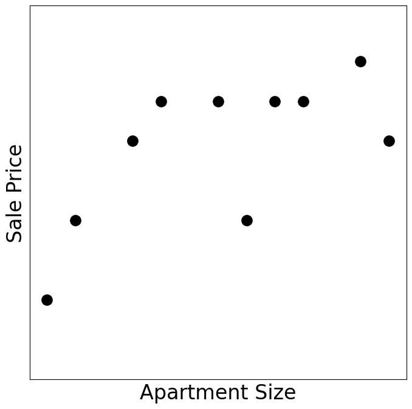
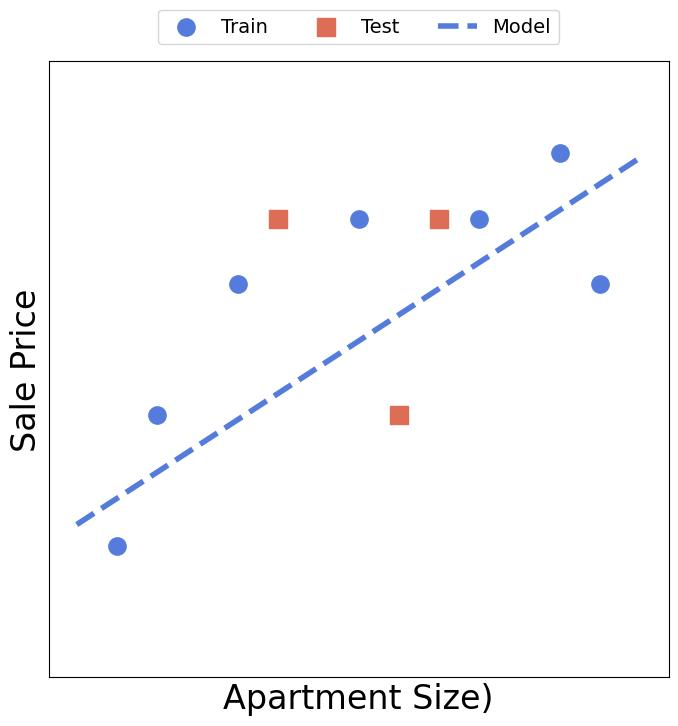
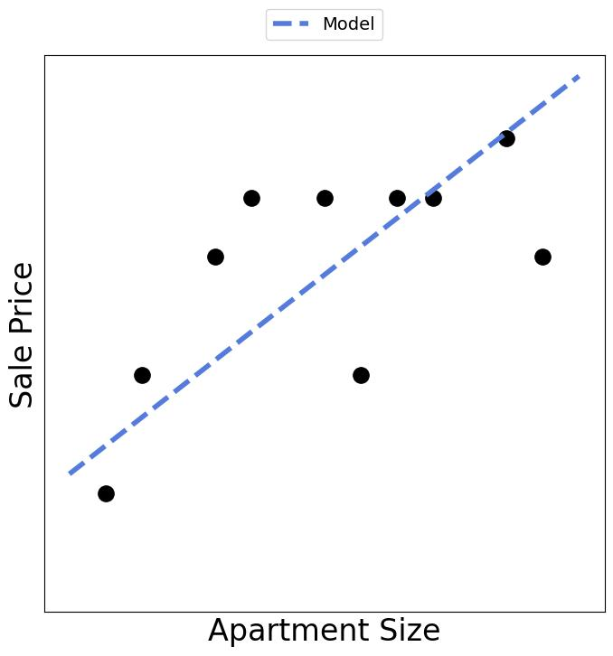

# [人工智能、机器学习、统计和数据挖掘之间的区别是什么？](https://www.baeldung.com/cs/ai-ml-statistics-data-mining)

[数据科学](https://www.baeldung.com/cs/category/ai/data-science) [机器学习](https://www.baeldung.com/cs/category/ai/ml)

[概率与统计](https://www.baeldung.com/cs/tag/probability-and-statistics)

1. 简介

    在本教程中，我们将讨论人工智能、机器学习、统计学和数据挖掘之间的区别。

    这些领域之间有很大的重叠，而且没有明确的方法来区分它们。多年来，研究人员和工程师对这个问题阐述了不同的、往往是相互冲突的意见，所以没有达成共识。

2. 人工智能

    让我们从人工智能（AI）开始。一般来说，人工智能的目标是建立能够自行解决我们摆在它们面前的问题的代理，就像它们拥有像人类一样的先天智力一样。使得这一领域如此丰富的是定义和构建代理的丰富方法。

    例如，手写识别软件是一种人工智能代理，因为它可以阅读手写文本并将其转换为数字格式，而无需人类的帮助。它从手写数字和字母的机器可读图像中学习这种能力。

    另一个例子是一个下棋的程序。它在下棋时，考虑到对手可能采取的行动，寻找可能的最佳行动序列。这样一个人工智能代理的智能并不来自于数据。相反，它来自于[代理如何搜索最佳动作](https://www.baeldung.com/cs/minimax-algorithm)。

    还有其他例子，如数独解算器和机场航班时刻表。智能代理的概念是它们的中心。更确切地说，我们说人工智能构建了理性的代理人。在这里，理性意味着在我们知道所有备选方案的情况下，始终选择最佳的可用方案：确定最适合笔迹的单词，确定能最快赢得棋局的步骤，确定等待时间最短的航班时刻表，等等。

3. 机器学习

    机器学习（ML）是人工智能的一个子领域。从一般的人工智能术语中退一步讲，我们会说，ML将学习算法应用于数据集，以获得预测新数据的自动化规则。

    例如，我们可能对预测一个公寓的销售价格感兴趣。我们有各种公寓的特征（如以平方英尺为单位的大小）和它们的最终销售价格的数据。从数据集中诱导出一个高质量的预测规则是ML的工作。这些规则可能采取不同的形式，如[树](https://www.baeldung.com/cs/decision-tree-vs-naive-bayes)、[线性回归](/core-concepts/math-logic/linear-vs-logistic-regression-zh.md)的数学方程或[神经网络](https://www.baeldung.com/cs/svm-vs-neural-network)。因此，我们不是用手来制定规则，而是用ML来自动提取它们。

    但是，鉴于我们对人工智能的了解，我们看到寻找ML规则属于构建人工智能代理。例如，我们可以将价格预测规则限制为以下形式的方程：

    $\theta_0 + \theta_1 \cdot size + \theta_2\cdot (number \text{ } of \text{ } rooms) + \theta_3 \cdot floor $

    我们的目标是发现最准确的一个。这与建立一个人工智能代理是一样的，在它能用公式预测的所有价格中，输出最可能是真的那个。所以，ML是人工智能的一部分，它使用专门的算法从数据中建立代理。

4. 统计学

    与它与人工智能的关系不同，ML与统计的关系是非常有争议的。许多研究人员，特别是统计学家，会争论说，ML只是一个重塑的统计学。这种说法不是没有道理的。但是，也有许多研究人员持反对意见。为了了解原因，让我们首先（尝试）定义统计学。

    1. 什么是统计学？

        大多数人都会把统计学描述为数学的一个分支，只用一个样本就能对一个群体做出推断。

        例如，我们可能想发现美国青少年的平均身高。测量所有美国青少年的身高是不现实的。相反，我们可以在全国范围内随机选择一些学校，每所学校测量10名青少年。这样，我们就可以得到一个身高样本，其平均值可以让我们了解整个青少年群体的平均身高。

        同样，我们可能有兴趣了解温度是如何影响一个工业过程的，或者一个公寓的房间数量是如何影响其销售价格的。

        统计学为回答这些问题提供了方法。在这样做的时候，它是高度正式的。它的所有工具，如假设检验和描述性统计，都有数学上的性能证明。例如，我们知道，我们围绕样本平均值构建的95％的置信区间，可以保证在95％的情况下捕捉到实际的群体平均值。然而，这样的证明依赖于在现实中可能不成立的假设。例如，常见的假设是样本元素的统计独立性和数据的正态性。

    2. 为什么机器学习是统计学？

        赞成这种观点的研究者认为，从数据中诱导出一个预测规则（任何形式），无非是对产生这些数据的过程进行推断。例如，ML给我们提供的预测公寓价格的方程式也是对整个公寓 "人口" 在销售时的一般规则的推断。同样，推断出统计学中数据产生过程的一般规则可以预测新的数据。

        为了支持这一论点，人们还说，一些核心的ML模型，如线性回归，最初是在统计学中开发和研究的。他们更进一步断言，所有的ML模型都是统计工具。唯一的区别是，前者的可解释性较差，而且对计算的要求更高。更有甚者，一些研究人员表示担心，ML是统计学做错了。原因是自动建模缺乏适当的严谨性，只有通过人类的参与才能做到。

    3. 为什么机器学习不是统计学？

        但是，许多ML研究人员会强烈反对这些说法。他们会认为，对预测的关注使ML与统计学不同。大多数时候，特别是在工业领域，性能指标是最重要的。因此，一个有数百个内层的深度神经网络是一个完全可以接受的ML产品，如果它的预测是准确的，即使它本身是不可解释的，不允许任何推理。另一方面，一个统计学家使用这样的黑箱模型会非常不舒服。

        此外，由于ML专注于预测性能，它在保留的测试数据上验证其模型，以检查其概括能力。然而，统计学不会将样本分成[训练集和测试集](https://www.baeldung.com/cs/train-test-datasets-ratio)。

        此外，ML似乎比统计学更关注训练其模型和处理大型数据集的工程和计算方面。原因是统计学家开发他们的工具，正是为了避免处理大量的数据而在小样本上工作。相比之下，ML工具起源于计算机科学和人工智能领域，所以科学家们从一开始就考虑了算法及其实施方面。结果，ML方法论取代了统计方法论，因为它解决了传统统计学无法解决的任务。

        一个有趣的说法是，ML科学家和统计学家的研究文化不同。大量的理论成果伴随着所有的统计方法。例如，如果没有定理和证明，就不可能发表一篇关于新统计测试的论文。仅仅是经验性的评价是不行的。相比之下，ML研究人员和从业人员会对一个在真实世界数据上有良好结果的方法表现出兴趣，即使其理论上可能存在差距。

    4. 例子

        最后，尽管我们可以将ML和统计学用于预测和推理，但它们的方法论是不同的。ML并不只是做错了的重新措辞的统计。它采用了一种不同的建模方法。

        例如，我们假设一个数据集包含了十套公寓的尺寸（以平方英尺为单位）和销售价格：

        

        为了拟合一个线性模型 $\theta_0 + \theta_1 \cdot size$ ，一个ML科学家会把这组数据分为训练（蓝色）和测试（红色）数据，并使前者的[损失](https://www.baeldung.com/cs/cost-vs-loss-vs-objective-function)最小：

        

        然后，S（他）会在三个测试数据上评估模型。如果误差可以忽略不计，并且与训练数据上的误差相差不大，科学家会认为这是一个很好的模型，可以根据公寓的大小来预测价格。

        相比之下，统计学家会将 $\theta_0 + \theta_1 \cdot size$ 拟合到整个数据集上（可能获得不同的系数）：

        

        但是，S（他）不会用它来预测。相反，S（他）会通过检查系数 $\theta_1$ 的显著性来检验尺寸影响销售价格的假说。

        这个例子可能是对这两个学科在实践中的一个过于简单的看法，但说明了这两种方法之间的区别。

5. 数据挖掘

    [数据挖掘](https://www.baeldung.com/cs/weka-data-mining)是从商业应用中的数据库管理发展而来的。它的目标是在大数据中发现有价值的模式，为商业利益相关者提供可操作的信息。让我们用一个例子来说明这一点。

    1. 例子

        假设一家在线新闻机构想知道其受众来自哪里。它需要这些信息来专注于报道其大多数活跃用户所居住的地区的故事。该网站只关心那些已经订阅了它的feed并经常阅读新闻的人，而不关心那些将来可能会这样做的人或被动订阅者。

        这与我们在统计学中的推论和机器学习中的预测恰恰相反。一个统计学家会定义一个关于生活在预定区域的用户比例的假设。然后，他将选择适当的统计测试并检查数据是否符合其假设。如果不符合，统计学家就不会继续下去，告诉我们数据不允许进行有效的推断。否则，他将运行测试，并告诉我们是否拒绝或未能拒绝该假设。

        但是，统计假设是关于人群的，而不是样本。即使我们的统计学家有什么可以告诉我们的，那也是关于像我们目前的活跃用户这样的人，也就是我们潜在的感兴趣的观众。然而，这并不是我们所需要的信息，因为我们想为当前的读者量身定做编辑政策。

        同样，一个ML模型可以预测，对于每个地区来说，它的一个随机的人有兴趣订阅网站的概率。同样，虽然很好，但这个模型并不是我们想要的。正如我们的例子所示，挖掘往往是为了获得对手头数据集的洞察力，而忽略了其中的一切。换句话说，数据挖掘者在给定的数据中寻找模式，而不是我们从数据集中取样的人群。事实上，在大多数情况下，数据包含整个感兴趣的人群。

    2. 但是，嘿，数据挖掘不就是应用统计和机器学习吗？

        与ML和统计学一样，有些人认为数据挖掘只是应用统计学或应用ML（特别是无监督的）。毕竟，这是它使用的工具的发源地。那么，如果它只是应用其他领域的方法，我们是否可以认为采矿是一门自己的学科？许多统计学家和ML研究人员会认为我们不应该这样做。但是，许多数据挖掘者反对这种观点，强调了我们上面讨论的差异。

        此外，数据挖掘将结果置于方法之上。启发式方法是可以接受的，只要它们为企业提供价值，即使它们在数学上可能没有充分的依据。此外，矿工们有时会专门为手头的数据设计一种分析方法，而不去考虑它是否适用于其他数据集。

        最后，重点是对数据的探索。因此，采矿是一种探索性的活动，前面设定了具体的目标。尽管ML和统计学做了探索性分析，但它们的重点是检查假设，而不是提取关键业务信息。

6. 结论

    在这篇文章中，我们谈到了人工智能、机器学习、统计和数据挖掘。对于这四个领域之间的界限，目前还没有达成共识。特别是，有些人认为后三者是同一学科的变化。然而，虽然界限模糊，但我们可以发现它们的区别。
