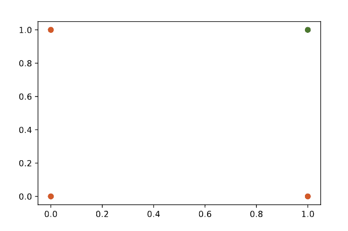
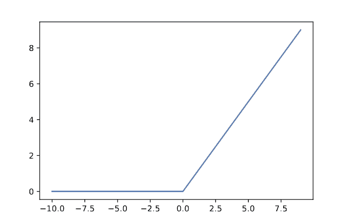

# [了解激活函数](https://www.baeldung.com/cs/activation-functions-neural-nets)

1. 引言

    激活函数，又称非线性函数，是神经网络结构和设计的重要组成部分，但什么是激活函数呢？在介绍一些流行的变体之前，我们将探讨激活函数在神经网络中的必要性。我们将解释最常用激活函数的用途和历史。最后，我们将提供一些小贴士，帮助您决定哪种激活函数最适合您的应用。

2. 什么是激活函数？

    在讨论激活函数之前，我们首先回顾一下标准前馈神经网络的结构。

    我们从单层 $F_W(x) = Wx + b$ 开始，这一层是输入 x 的标准线性变换，给定权重 W 和偏置 b。

    这就是一个标准的线性回归模型。我们可以堆叠多个层来创建[神经网络](https://www.baeldung.com/cs/convolutional-vs-regular-nn#neural-networks)，并在这些层之间放置激活函数。

    一个简单的神经网络包含两个这样的转换层。一层将输入转化为隐藏层表示，一层将隐藏层转化为输出。非线性激活跟随第一种变换。这种表述方式非常强大，可以任意精确地[逼近任何函数](http://neuralnetworksanddeeplearning.com/chap4.html)。

    这个简单的网络为何如此强大？什么是非线性激活函数，为什么它如此重要？让我们通过一个例子来探讨这个问题。

    1. 分类：一个例子

        思考一个旨在预测单一布尔值的分类问题。例如，应用这个函数的结果是“真”还是“假”？为了更加具体，我们可以考虑 AND 函数，这是一个线性可分函数。下图是 AND 函数对每个输入结果的散点图。我们可以看到如何通过画一条直线来区分真（绿色）和假（红色）输出：

        

        如果只考虑单层网络，我们就有了逻辑回归算法的基础模型。我们的模型可以为每个输入数据点预测一个数字，并设定一个阈值。如果预测结果高于阈值，则预测“真”；反之，则预测“假”。假设我们将“if”写成一个函数，它将是一个阶跃函数。一种不连续的激活函数。既然我们要讨论神经网络的激活函数，而且我们要使用[反向传播](https://www.baeldung.com/cs/neural-networks-backprop-vs-feedforward)算法来训练我们的网络，那么我们就需要引入我们刚刚讨论过的二进制阶跃函数的连续版本。我们这样做是因为反向传播需要可微分函数。

        Sigmoid 函数就是我们的连续阶跃函数。它将所有值压扁到 [0,1] 范围内，区间非常陡峭，因此大多数值要么接近 0，要么接近 1。

        这就是激活函数。激活函数是输入数据的非线性变换。正如我们刚才所看到的，这在输出层很有用，但在更深的网络主体中也很有用。

3. 为什么要使用激活函数？

    在上一节中，我们讨论了使用激活函数来产生几乎二进制的分类信号。然而，非线性也是深度神经网络的重要组成部分。本节将进一步介绍相关背景，强调大多数问题都是非线性的，以及没有非线性激活函数的神经网络本质上是线性的。

    1. 大多数问题都是非线性的

        最基本的原因是，许多预测问题并没有线性输出。许多曲线是由某种形式的多项式或更复杂的函数定义的。即使是听起来简单的任务，也可能需要非线性的决策边界。我们考虑一下对[逻辑XOR函数](https://www.baeldung.com/cs/ml-linear-activation-functions)的输出进行分类所需的边界。这不是一条直线就能完成的！

        可以证明，神经网络是通用的函数近似器；与大多数此类性质的定理一样，最好不要对此进行过多解读。此外，如果没有非线性激活，神经网络就是数据线性变换的组合，因此也是线性的。通过在神经网络层中交错使用激活函数，我们可以产生高度非线性和复杂的决策边界。

    2. 深入研究

        在构建更深层次的网络时，激活函数也是不可或缺的。深度神经网络的学习动力学非常复杂，训练的许多方面都需要调整。

        神经网络的训练依赖于流经网络的梯度信号。传统 Sigmoid 激活的一个问题是，它在接近极值时会达到饱和，产生的梯度非常小。在较大的网络中，这会导致信号传播缓慢。为了缓解这一问题和其他问题，文献中提出了许多类型的激活函数。

4. 常见激活函数

    随着神经网络领域的发展，神经网络中使用了多种不同的激活函数。有些函数是为了帮助解决特定问题而开发的，现在比以前流行的前辈更为常见。

    [Sigmoid 和 TanH 函数](https://www.baeldung.com/cs/sigmoid-vs-tanh-functions)的 S 形曲线是早期最受欢迎的两种函数。

    Sigmoid 和 TanH 激活也被用于递归架构中，用于定义 LSTM 和 GRU 单元的工作。虽然 Sigmoid 和 TanH 很受欢迎，但它们在最大值和最小值附近会趋于饱和。这使得激活函数只能在很小的数值范围内对输入敏感。在深度神经网络中，这会导致梯度消失问题。我们接下来讨论的激活函数可以缓解这一问题。

    1. 整流线性单元

        整流线性单元（Rectified Linear Unit）是目前流行的标准激活函数。尽管它看起来是线性的，但 ReLU 在神经网络中的使用率很高，它可以帮助避免梯度消失问题，该问题会在传递给 TanH 或 Sigmoid 激活函数的数值非常大或非常小时出现。ReLU 的一个问题是可能出现死神经元。为了缓解这一问题，Leaky-ReLU 也很受欢迎，因为它可以让小量非零信号流通过激活。

        我们将 ReLU 激活函数定义为：$g(z) = max(0,z)$。

        我们可以在下图中看到它：

        

    2. 其他激活函数

        还有许多其他激活函数可供选择，通常都有更具体的使用情况。您也可以定义自己的激活函数。

        某些情况下可能需要特定的输出形状，例如在我们的分类示例中，使用 sigmoid 可以产生（几乎）二进制输出。其他情况下，如果输出信号的性质是周期性的，则可能需要使用周期性激活函数。这种方法是一种偏置或为模型添加先验的方法。

5. 结论

    在本文中，我们看到了激活函数是神经网络架构的重要组成部分。神经网络架构的发展促使人们开发出更适合动态学习的新激活函数。

    即使是肤浅的单隐层神经网络，只要搭配一个非线性函数，就能发挥出巨大的威力。虽然非线性的选择看似令人生畏，但最好还是从当前的 ReLU 标准开始，如果达不到预期效果，再进行试验。
