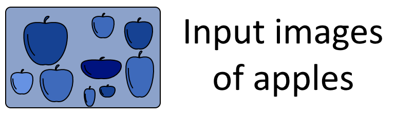

# 卷积神经网络简介

1. 概述

    在本教程中，我们将学习卷积神经网络及其架构背后的理论。

    首先，我们将讨论卷积神经网络 (CNN) 通常执行的任务和特征提取问题。然后，我们将讨论为什么需要卷积神经网络，为什么传统的前馈神经网络不能满足要求。

    然后，我们将讨论矩阵运算中的卷积操作。这将使我们很好地理解卷积神经网络的运行机制。

    最后，我们将讨论卷积神经网络除卷积层之外的其他特征，重点是池化和剔除。

    本教程结束时，我们将知道什么是卷积神经网络以及它能解决什么问题。

2. 何时使用 CNN

    1. 为什么图像识别如此困难？

        CNN 用于解决一类特殊问题，即提取和识别数据集中的抽象特征。让我们通过一个简单的例子来看看这在实践中意味着什么：

        

        苹果具有不同形状、大小和颜色。尽管它们之间存在细微差别，但人类要识别它们是苹果并不困难。不过，对于计算机来说，这些苹果像素化后彼此大相径庭：

        

        无论这些图像在人类看来多么相似，在计算机看来却几乎没有任何共同点。这是因为，在人类看来清晰的物体，在计算机看来只是一组数字。人类的感知系统实际上是利用[上下文线索](https://link.springer.com/article/10.1007/BF00868064)来识别物体的，但不幸的是，计算机却无法利用这些线索。

        这意味着，计算机需要完全依赖数据来执行任务，例如识别图像中的物体。正如我们在上面的示例图像中看到的那样，这些数据可能千差万别。那么，我们如何才能建立一个能够处理差异如此之大的数据的系统呢？

    2. 解决方案是抽象

        由于过多的像素会产生过多的值，因此识别苹果的任务变得十分困难。然而，每个像素单独携带的信息却很少。这意味着图像的熵值很高-[信息论中的熵](/cs-entropy-definition-zh.md)，除非我们以某种方式大幅降低熵值，否则就无法处理图像。

        然而，如果我们有办法学习输入图像的抽象特征，这反过来又会使分类变得更加容易。让我们设想一下，我们可以把苹果描述成一个有茎，有足够平的底部，当然还有圆形的物体：

        

        如果我们能将这些特征编码到分类算法中，这反过来又会使未见图像的分类变得更容易。在这种情况下，我们可以创建一个模型，对我们正在寻找的特征进行编码，然后将具备所有特征的图像归类为 "苹果"：

        

        卷积神经网络就是以这种方式工作的；只不过，它们可以自动学习这些特征。事实上，它们是一种通过算法学习数据集抽象表征的方法。这反过来又促进了分类任务的完成，并有助于解决所谓的 "维度诅咒"，我们很快就会看到这一点。

3. 神经网络及其诅咒

    1. CNN 解决的问题

        按照我们介绍机器学习相关主题文章的传统，在开始学习卷积神经网络（以下简称 CNN）时，我们也将对这种[机器学习](https://www.baeldung.com/cs/machine-learning-how-to-start)模型中蕴含的[先验或隐含知识](https://www.baeldung.com/cs/ml-labeled-vs-unlabeled-data#1-conceptual-architecture-of-machine-learning-systems)进行少量分析。最好的解释就是问自己一个问题：

        - "为什么我们不简单地使用前馈神经网络进行图像分类？

        事实上，我们知道[前馈神经网络](https://www.baeldung.com/cs/neural-net-advantages-disadvantages#neural-networks)可以将任何形式的[连续函数](https://www.baeldung.com/cs/ml-nonlinear-activation-functions#magicparlabel-11789)$f: X \in R^n \to Y \in R^m$逼近。然而，我们并不能保证神经网络可以[学习该函数](https://www.baeldung.com/cs/machine-learning-intro)。一般来说，如果我们有疑问，可以假设神经网络会对训练数据的噪声进行[过拟合](https://www.baeldung.com/spark-mlib-machine-learning#3-model-performance)，而永远学不会任何给定的[目标函数](https://www.baeldung.com/cs/genetic-algorithms-vs-neural-networks#motivation)：

        

    2. 卷积和正则化

        为训练神经网络而减少数据集[噪音](https://www.baeldung.com/cs/cs-entropy-definition#magicparlabel-8564)的尝试被称为[正则化](https://en.wikipedia.org/wiki/Regularization_(mathematics))。[卷积](https://www.baeldung.com/kotlin-supervised-learning#building-ann)是正则化的一种特殊类型，它利用了[特征](https://www.baeldung.com/cs/feature-vs-label)或观测值的线性依赖性。这反过来又能让我们减少噪声，恢复与特征线性独立性先验假设的一致性，我们很快就会看到这一点。

        从广义上讲，[正则化](https://www.baeldung.com/deeplearning4j#2-setting-network-parameters)包括将数据集的[特征映射](https://www.baeldung.com/kotlin-data-objects)到具有[较低熵](https://www.baeldung.com/cs/cs-entropy-definition)的新特征上。从形式上来说，这意味着我们将特征$X \to X\prime$，这样，如果 H(X) 是 X 的熵，那么 $H(X) \leq H(X\prime)$。这样我们就可以学习一个新的目标函数 $g：f(X) \to g(X\prime)$，它不容易过度拟合：

        

        卷积本质上就是通过用更复杂的特征替换观测数据中的高熵特征来完成这一任务的。之所以能做到这一点，是因为使用神经网络的一个重要前提条件--特征的线性独立性--在某些类别的数据中被系统性地违反了。

    3. 特征的线性（不）独立性

        现在我们来详细了解一下特征线性独立的含义。我们可以举例说明，将上述两个变量 X 和 Y 的分布建模扩展到三维。

        在这个例子中，我们假设这两个变量之间存在线性关系，因此一个变量可以用 y = f(x) 形式的函数来近似另一个变量。具体来说，我们假设这个函数的形式为 Y = 2 X + 1，参数可任意选择。因此，我们可以说，根据构造，这两个变量是线性相关的。

        现在让我们看看，如果将两个线性相关变量作为目标函数 $Z = g(X; Y)$ 的输入，会发生什么情况。下面的动画展示了从 $Z = g(X; Y) = (\beta_x X+\beta_y Y + \beta_{\epsilon})^2$ 形式的目标函数中采样的训练数据：

        

    4. 将依赖特征转化为独立特征

        对于图像中显示的特定分布，我们分配了 $\beta = \{\beta_x = 1; \beta_y = 1; \beta_{\epsilon}=0\}$ 的值，但这只是为了说明问题。

        关于我们将用于回归的模型结构，我们可以先预测它的一些特征。我们知道目标函数具有二次方形式，因为 $Z = g(X; Y) = (X+Y)^2 = X^2 + 2XY + Y^2$。由于 Y 是线性相关的，因此 $g(X; f(X)) = g(X; 2X + 1)$。

        现在我们可以想象对这个函数进行[多项式回归](https://matloff.wordpress.com/2018/06/20/neural-networks-are-essentially-polynomial-regression/)，以学习其参数。如果我们不用等价的 f(X) 来代替 Y，那么我们就必须为我们的模型学习五个参数： $\beta = \{\beta_x; \beta_{x^2}; \beta_y; \beta_{y^2}; \beta_{\epsilon}\}$ 。由于 X 和 Y 这两个特征不是线性独立的，因此它们的线性组合也[不是线性独立](https://www.baeldung.com/cs/neural-networks-bias#3-theres-only-one-bias-per-layer)的。

        这就意味着，我们可以学习与这两个输入变量的线性组合相对应的一组参数，而不是学习 X 和 Y 这两个输入变量的参数。因此，我们可以学习包含参数的更简单的模型 $\beta\prime = \{\beta{\prime}_{(x;y)}; \beta{\prime}_{(x^2;y^2)};\beta{\prime}_{\epsilon}\}$。这在代数上对应于学习函数在投影向量空间 $V_{(X; Y; Z)} \to V_{(X+Y; Z)}$ 上的表示：

        

        我们可以看到，在这个特定的例子中，我们不需要两个输入特征，只需要一个。这是因为我们事先知道输入特征的线性依赖关系。反过来，这种先验知识又可以让我们通过代数变换来降低模型输入及其参数的维度，而不会损失任何代表性。

    5. 维度的诅咒

        这意味着，如果我们有充分的理由相信模型的输入特征不是线性独立的，我们就可以减少模型所需的参数数量。要做到这一点，我们可以利用我们的先验知识，即某些数据类别（而非所有数据类别）的特征同时具有高维性和相互线性依赖性。

        通常使用 CNN 处理的数据，其特征通常具有高度线性依赖性。最常见的例子是文本、音频、图像和视频信号：

        - 对于文本数据，[特征通常是单词](https://www.baeldung.com/cs/stemming-vs-lemmatization)，每个单词在很大程度上都依赖于前后的单词
        - 对于音频，频率在大部分时间内是连续变化的
        - 图像则是与颜色相对应的[像素集合](https://www.baeldung.com/java-opencv#loading)，其中每种颜色在大多数情况下都与其周围的像素相同
        - 视频是一连串的图像，如果其中包含真实世界的信息，由于[对象的永久性](https://en.wikipedia.org/wiki/Object_permanence)，这些图像只会发生部分变化

        所有这些类型的数据都适合用 CNN 处理，以[降低其维度](https://www.baeldung.com/cs/ml-understanding-dimensions-cnn)。我们假定具有线性独立特征的数据，例如[有关发动机特征的数据集](https://data.europa.eu/euodp/en/data/dataset/z8FTytRAZFl4ZvOLjMCdng)，并不适合使用 CNN。

    6. CNN 的优势

        通过在高维数据上使用 CNN，我们可以帮助解决神经网络中的[维度诅咒](https://www.baeldung.com/cs/ml-relu-dropout-layers#the-curse-of-dimensionality-in-cnns)问题。这个问题指的是神经网络在增加参数时，其参数大小的增加速度会明显快于输入大小的增加速度。

        我们在上面的例子中注意到，对于多项式回归这一特定问题，所需的参数数量有可能减少 40%。对于现实世界的问题，这种减少的幅度要大得多，因此使用卷积等[降维技术](https://www.baeldung.com/cs/machine-learning-intro#dimensionalityReduction)是必要的，而不是一种选择。

4. 神经网络中的卷积

    1. 卷积的数学定义

        我们现在明白了，如果我们的数据既是线性相关的，又具有高维度的特征，我们就需要使用降低其熵的方法。其中一种方法就是卷积，这也是 CNN 名称的由来。

        神经网络中的卷积公式需要识别输入数据。首先，我们要将进行卷积的数据（例如图像）分配给一个维度为 (x,y) 的矩阵 A_{x,y}。然后，我们定义一个内核矩阵 k，它的元素会影响卷积结果的类型，我们将在下一节看到。

        然后，卷积操作被定义为矩阵 A 中的一个元素及其所有局部相邻元素的值乘以内核矩阵 k 中的相应元素：

        $k*A = \sum^{x-1}_{i=0} \sum^{y-1}_{j=0} k_{(x-i)(y-j)}A_{(1+i)(1+j)}$

    2. 卷积对矩阵的作用

        现在我们来看看卷积对图像的实际作用。为此，我们将使用一幅样本图像，看看如果改变核 k，图像会发生什么变化：

        

        这幅图像由一个像素阵列组成，我们可以通过首先定义一个核矩阵来对其进行卷积。有各种核可以用于不同的目的。下面我们从用于模糊的核开始，来了解一些核：

        $k = \frac{1}{9} \begin{bmatrix} \ \ 1 &\ \ 1 &\ \ 1 \\ \ \ 1 &\ \ 1 &\ \ 1 \\ \ \ 1 &\ \ 1 &\ \ 1 \end{bmatrix}$

        

        另一个内核是边缘检测内核

        $k = \begin{bmatrix} \ \ -1 &\ \ -1 &\ \ -1 \\ \ \ -1 &\ \ 8 &\ \ -1 \\ \ \ -1 &\ \ -1 &\ \ -1 \end{bmatrix}$

        

        另一个是锐化特征的内核

        $k = \begin{bmatrix} \ \ 0 &\ \ -1 &\ \ 0 \\ \ \ -1 &\ \ 5 &\ \ -1 \\ \ \ 0 &\ \ -1 &\ \ 0 \end{bmatrix}$

        

        不同的卷积核可以从相同的数据中提取不同的特征，这反过来又有助于 CNN 的训练。虽然卷积是 CNN 最典型的操作，CNN 架构本身也由此得名，但这并不是 CNN 唯一的特点。

5. 卷积神经网络的其他特征

    1. 卷积神经网络的一般架构

        尽管 CNN 被称为 "卷积 "神经网络，但它也有一些与卷积无关的特殊特征。CNN 区别于前馈神经网络的主要特征包括

        - 池化层
        - 剔除层
        - 还有一些特殊的激活函数

        典型的 CNN 架构一般包括卷积层、池化层和剔除层的序列，必要时可重复多次。最后一层是[分类](https://www.baeldung.com/cs/machine-learning-intro#classification)层或[回归](https://www.baeldung.com/kotlin-supervised-learning#linear-regression)层，这取决于我们要执行的任务。

        让我们依次看看前两层的简短描述。关于最后一点的讨论，我们可以参考我们关于[ReLU作为CNN激活函数](https://www.baeldung.com/cs/ml-relu-dropout-layers#the-rectified-linear-unit)的教程。

    2. 池化层

        池化层是 CNN 的一个独特特征，它进行同义的数学运算--[池化](https://en.wikipedia.org/wiki/Convolutional_neural_network#Pooling)。池化包括从给定矩阵中提取维度更低的新矩阵，新矩阵只包含原始矩阵每个簇或邻域的一个元素。最常见的池化方法是所谓的最大池化（Max-Pooling），其工作原理如下。

        如前所述，我们需要一个矩阵 $A_{x,y}$，它代表图像或其他输入数据。然后，我们将矩阵划分为固定大小的邻域。在本例中，我们选择在分布于 (2,2) 池窗口中的四个元素之间进行池化：

        $A = \begin{bmatrix} \ \ 1 &\ \ 2 &\ \ 3 \\ \ \ 6 &\ \ 5 &\ \ 4 \\ \ \ 3 &\ \ 1 &\ \ 2 \end{bmatrix} \rightarrow \begin{matrix} \begin{bmatrix} \ \ 1 &\ \ 2 \\ \ \ 6 &\ \ 5 \\ \end{bmatrix} & \begin{bmatrix} \ \ 2 &\ \ 3 \\ \ \ 5 &\ \ 4 \\ \end{bmatrix} \\ \begin{bmatrix} \ \ 6 &\ \ 5 \\ \ \ 3 &\ \ 2 \\ \end{bmatrix}& \begin{bmatrix} \ \ 5 &\ \ 4 \\ \ \ 2 &\ \ 1 \\ \end{bmatrix} \end{matrix}$

        然后，我们在给定的邻域中找出最大的元素，并把它赋值给我们为此目的创建的新矩阵：

        $\begin{matrix} \begin{bmatrix} \ \ 1 &\ \ 2 \\ \ \ \textbf{6} &\ \ 5 \\ \end{bmatrix} & \begin{bmatrix} \ \ 2 &\ \ 3 \\ \ \ \textbf{5} &\ \ 4 \\ \end{bmatrix} \\ \begin{bmatrix} \ \ \textbf{6} &\ \ 5 \\ \ \ 3 &\ \ 2 \\ \end{bmatrix}& \begin{bmatrix} \ \ \textbf{5} &\ \ 4 \\ \ \ 2 &\ \ 1 \\ \end{bmatrix} \end{matrix} \rightarrow \begin{bmatrix} \ \ 6 &\ \ 5 \\ \ \ 6 &\ \ 5 \\ \end{bmatrix} = {MaxPool}(A)$

        结果是一个新的矩阵，它只包含原始矩阵中相邻矩阵的最大值。这将输入数据的维度降低到了更易于管理的水平，尽管我们会因此丢失信息内容。不过，如上所述，输入特征的线性依赖性证明这种折衷是合理的。

    3. 剔除层

        卷积神经网络还实现了所谓的 "遗忘层"（[Dropout layer](https://www.baeldung.com/cs/ml-relu-dropout-layers#the-dropout-layer)），即在机器学习模型中引入[遗忘能力](https://www.sciencedirect.com/science/article/pii/B9780934613644500529)。这是基于这样一种观点，即关于某种现象的过多先验知识实际上可能会阻碍而不是支持未来关于同一主题的知识的获取。

        遗忘层的工作原理是随机停用给定层中的一些神经元，从而迫使网络适应信息量较少的信号进行学习。虽然与直觉相反，但事实证明，当[高阶交互是虚假](https://arxiv.org/abs/2007.00823)的时，带有 "剔除层" 的卷积神经网络通常学习效果更好。这是因为部分信号的无效化有利于网络高层所代表的抽象特征的学习。

        对于给定的剔除参数 $d: 0 \leq d \leq 1$，我们通过以概率 $P(0|a_{i,j})=d$ 随机为矩阵 A 的每个元素 $a_{i,j}$ 赋值 0 来获得剔除函数的输出。如果 $D = {Dropout} (A, d)$，那么形式上：

        $\forall{i}\forall{j}\forall{a_{i,j} \in A}: [P(D_{i,j} \triangleq 0) = d; P(D_{i,j} \triangleq a_{i,j}) = (1-d)]$

        以上一节中的矩阵 A 和辍学概率 d = 0.4 为例，我们可以得到以下输出结果：

        $Dropout (A, d) \to Dropout(\begin{bmatrix} \ \ 1 &\ \ 2 &\ \ 3 \\ \ \ 6 &\ \ 5 &\ \ 4 \\ \ \ 3 &\ \ 1 &\ \ 2 \end{bmatrix}, d=0.4) = \begin{bmatrix} \ \ 0 &\ \ 0 &\ \ 3 \\ \ \ 6 &\ \ 5 &\ \ 0 \\ \ \ 3 &\ \ 0 &\ \ 2 \end{bmatrix}$

        这样，我们在这个部分无效矩阵上学习到的模式对过拟合就不那么敏感了。

6. 结论

    在本教程中，我们研究了卷积神经网络的主要特征。

    我们首先研究了 CNN 所要解决的输入特征的维度和线性独立性问题。然后，我们研究了卷积这一数学运算，因为这是 CNN 的最大特点。在此背景下，我们还研究了在一些非常常见的卷积任务中，我们可以使用哪些典型的内核。

    最后，我们研究了 CNN 卷积层以外的其他特征。我们特别了解了什么是池化层和剔除层，以及它们的功能。

## 相关文章

- [ ] [Introduction to Convolutional Neural Networks](https://www.baeldung.com/cs/ai-convolutional-neural-networks)
