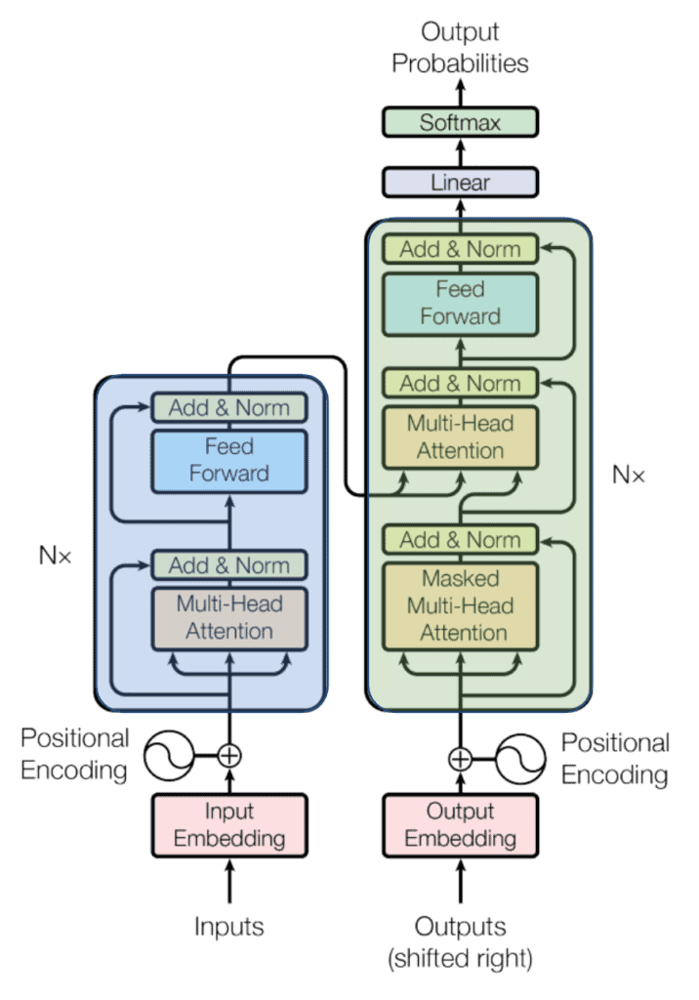
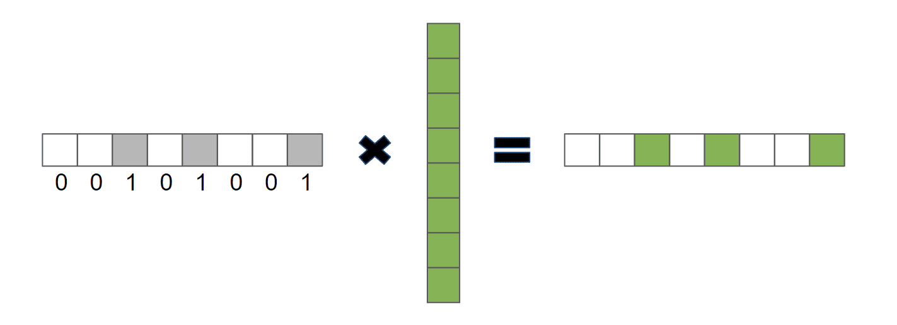
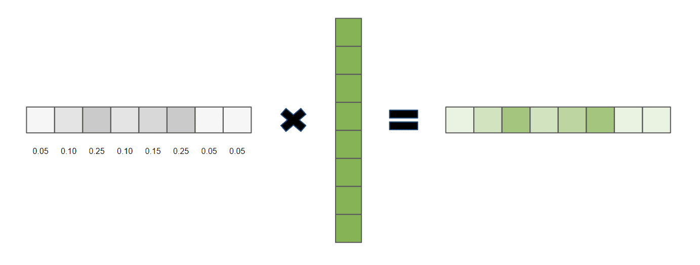
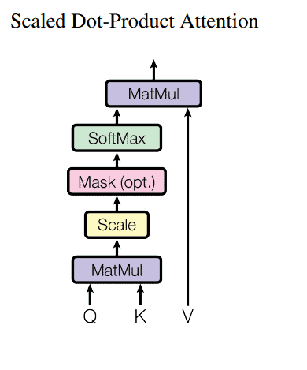
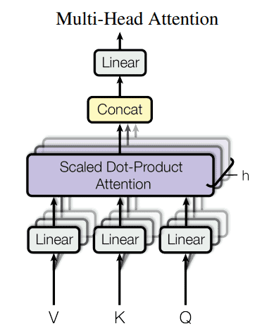

# [变换器模型中的注意机制](https://www.baeldung.com/cs/attention-mechanism-transformers)

1. 简介

    变压器模型是一种神经网络架构，它在机器学习领域带来了翻天覆地的变化。 在撰写本文时，变压器变体早已在几乎所有自然语言处理任务的性能排行榜上占据了主导地位。更重要的是，最近类似变压器的架构也已成为计算机视觉领域的最新技术。

    早在 2016 年介绍变换器的论文中，就包含了与该架构配套的其他几种重要技术的信息，如位置编码和遮蔽。

    不过，在本教程中，我们将重点介绍该架构之所以如此成功的主要原因--它的自我注意机制。

2. 什么是注意力？

    一般来说，注意力指的是专注于一件事情而忽略其他当时看起来无关紧要的事情的能力。在机器学习中，这一概念的应用就是教会模型专注于输入数据的某些部分，而忽略其他部分，从而更好地完成手头的任务。

    例如，在机器翻译等任务中，输入数据是一些文本的序列。当我们人类阅读一段文本时，似乎很自然地会关注某些部分多于其他部分。通常，句子中的谁、何时、何地会吸引我们的注意力。

    由于这是我们与生俱来的技能，我们并不承认它的重要性。但是，如果没有它，我们就无法理解上下文。

    例如，如果我们看到 "银行"（bank）这个词，我们可能会想到金融机构或储存献血的地方，甚至是便携式电池。但是，如果我们读到 "我要去银行申请贷款" 这个句子，我们就会马上联想到提到的是哪家银行。这是因为我们隐约注意到了一些线索。从 "去" 的部分，我们了解到银行在这里是一个地方，而从 "申请贷款" 的部分，我们了解到你可以在那里获得贷款。

    整个句子提供的信息加在一起，让我们在头脑中形成了银行是什么的印象。假设一台机器可以像我们一样做同样的事情。在这种情况下，大多数重要的自然语言处理问题，如一词多义、句子有多种语法结构、代词所指不确定等，都将迎刃而解。

3. 变换器入门

    虽然转换器远非完美，但它是我们目前解决语境化问题的最佳方案。 它们所使用的注意类型被称为自我注意。这种机制将单个序列的不同位置联系起来，从而计算出同一序列的表征。它在机器阅读、抽象概括，甚至图像描述生成中都发挥了重要作用。

    由于 Transformer 最初用于机器翻译，因此它基于编码器-解码器架构，这意味着它有两个主要组件。第一个组件是编码器，它将序列作为输入，并将其转换为具有固定形状的状态。第二个部分是解码器。它将固定形状的编码状态映射为输出序列。下面是一个示意图：

    

    图中有很多内容，但就我们的目的而言，只需注意这里的编码器模块是蓝色的，而解码器是绿色的。我们还可以看到，编码器和解码器模块都使用了一个名为 "多头注意" 的层。让我们暂时忘掉多头部分，只关注一个 "头" 内的内容。

    它的主要组成部分被称为缩放点积注意，它非常优雅，只需几个线性代数运算就能实现如此多的功能。 它由三个矩阵 Q、K 和 V 组成，分别称为查询矩阵、键矩阵和值矩阵，每个矩阵的维数为 $d_k$。

    使用查询、键和值的概念直接受到数据库工作方式的启发。每个数据库存储的数据值都由键索引，用户可以通过查询来检索数据。

    自我关注操作非常相似，只是没有用户或控制器发出查询，而是从数据中学习。通过使用反向传播，神经网络会更新其 Q、K 和 V 矩阵，以模拟用户与数据库之间的交互。 为了证明这是可能的，让我们把检索过程重新想象成一个向量点积：

    \[\vec{\alpha} \cdot \vec{v}\]

    其中 $\alpha$ 是一个只包含 1 和 0 的单击向量，v 是一个包含我们要检索的值的向量。

    在这种情况下，向量 alpha 是事实上的查询，因为输出将只包括 $\alpha$ 为 1 的 v 值：

    

    现在，让我们取消对查询向量的限制，允许 0 和 1 之间的浮点数值：

    

    缩放点积注意使用向量乘法，方法完全相同。 要获得最终的权重值，首先要计算查询与所有关键字的点乘，然后除以 $d_k$。然后应用软最大函数。

    但在实际操作中，这些向量乘法是同时进行的，因为如前所述，查询键和查询值是打包在矩阵中的。因此，最终的计算结果是

    \[\operatorname{Attention}(Q, K, V)=\operatorname{softmax}\left(\frac{Q K^{T}}{\sqrt{d_{k}}}\right) V\]

    该公式也可以看作下图：

    

    但还有更多。

    为什么我们要把模型局限于学习一种关系呢？我们可以做的是拥有多组不同的键、查询和值矩阵。这样，每个注意力模块都可以专注于计算输入之间不同类型的关系，并创建特定的上下文嵌入。 如上图所示，这些嵌入可以串联起来，然后通过普通的线性神经网络层，共同构成所谓的多头注意力模块的最终输出。

    事实证明，这种方法不仅能提高模型的性能，还能提高训练的稳定性：

    

4. 结论

    在本文中，我们研究了著名的转换器架构中最重要的部分--注意力模块。我们瞥见了它如何利用检索系统的概念来有效学习远距离关系，并在处理自然文本或任何其他数据序列时做一些非常接近于我们人类所做的事情。
