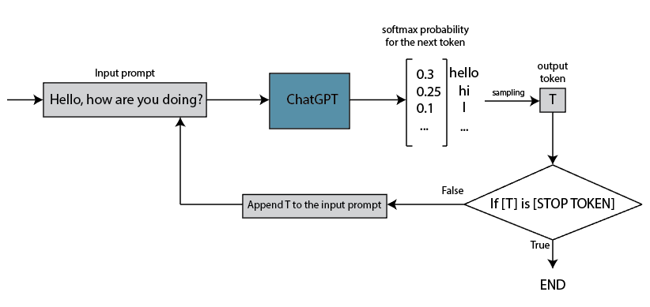

# [为什么ChatGPT不能一次性给出答案？](https://www.baeldung.com/cs/chatgpt-answer-sequential-words)

1. 简介

    在本教程中，我们将解释 ChatGPT 逐字生成答案的原因。我们将简要介绍 ChatGPT，并解释为什么 ChatGPT 不会一次性给出全部答案。

2. 简单来说，什么是 ChatGPT？

    ChatGPT 是一种类似聊天的程序或应用程序，它能根据接收到的输入理解并生成类似人类的文本。它源于 GPT（生成式预训练[转换器](https://www.baeldung.com/cs/transformer-text-embeddings#what-are-transformers)）架构，这是一种带有[注意力机制](https://www.baeldung.com/cs/attention-mechanism-transformers)的神经网络。它是一个聊天机器人，能够与用户互动，回答各种问题并提供各领域的信息。

    ChatGPT 能理解 95 种以上的自然语言。除此之外，它还对编程代码有基本的了解，能够理解和生成某些任务的代码。目前的免费版 ChatGPT 只能处理文本，而付费版 GPT-4 则可以接受文本和图像提示。这意味着 GPT-4 也具备理解和解释图像信息的能力。

3. 为什么 ChatGPT 不能一次性给出答案？

    要理解这个问题，我们需要熟悉 ChatGPT 的工作原理。关于这一点，我们有一篇[单独的文章](./chatgpt-model_zh.md)，在这里，我们只介绍对回答我们的问题有用的部分。

    首先，由于 ChatGPT 的后台是一个神经网络，因此它可以处理数值向量和矩阵。这意味着，输入的文本提示会首先转换成标记，然后转换成数字矩阵，然后进行神经网络计算，最后将神经网络的输出转换回文本。我们问题的答案就在于 GPT 架构本身的性质及其生成输出的方式。

    1. ChatGPT 如何生成答案？

        GPT 神经网络的最后一层有一个软最大函数。软最大函数为下一个标记生成一个概率分布，并根据该分布选择下一个标记。

        这意味着在所有计算之后，ChatGPT 会输出一个标记。这个标记的采样是根据软最大函数生成的概率分布进行的。

        单个标记代表一个单词、子单词、标点符号或字符。而 ChatGPT 的响应在大多数情况下是由多个这样的标记组成的。这意味着，除了概率性质，ChatGPT 还是一个自回归系统。它会根据输入提示和所有生成的标记逐字生成答案：

        

        基本上，在第一次迭代后，输出令牌又会被纳入输入提示，如此循环往复，直到输出令牌等于结束令牌。

    2. ChatGPT 需要多少处理能力？

        除了自回归特性外，ChatGPT 还是一个大型语言模型（LLM），拥有约 1750 亿个参数。它的运行需要大量的处理能力。

        根据 Tom Goldstein 教授的说法，我们需要至少 5 个 A100 GPU（每个有 80GB VRAM）来加载 ChatGPT 模型和文本。我们知道，使用 A100 GPU 生成一个 30 亿 LLM 的令牌大约需要 6 毫秒。如果我们将其放大到 ChatGPT 的大小，那么在 A100 GPU 上生成一个令牌需要大约 350 毫秒。

        Azure 云上的 ChatGPT 可能会选择 8 GPU 服务器。现在，如果我们假设使用这台服务器的速度是单 GPU 的 8 倍，那么每个令牌的运行时间大约为 44 毫秒。一秒钟大约能处理 23 个标记或 17 个单词。

        除此以外，我们还没有考虑许多因素，例如请求总数（每天可能有几百万个）、在高流量和低流量时如何分配和优化资源、资源的利用率、可用性和稳定性等等。

        ChatGPT 很可能是在数量有限的服务器上运行的。当需求量大时，服务器会超载，因此会增加额外的延迟。

4. 结论

    在这篇文章中，我们解释了 ChatGPT 为什么不能一次性回复。一句话，ChatGPT 是一个令牌一个令牌地生成答案的，这个过程需要大量的计算能力和一定的时间来完成。
