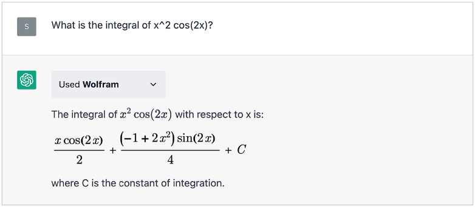
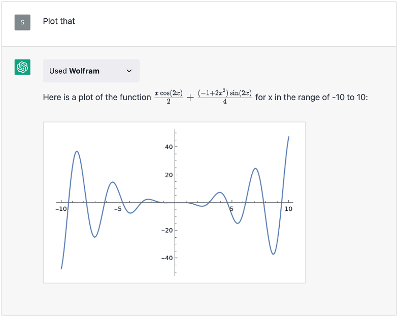
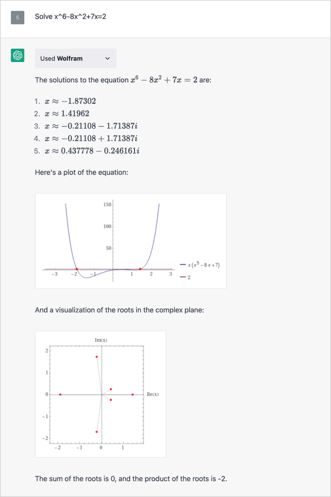

# 为什么 ChatGPT 不擅长数学？

1. 简介

    在本教程中，我们将讨论 ChatGPT 为什么数学不好。虽然 ChatGPT 擅长处理各种复杂的问题，但有趣的是，它在处理基本逻辑问题时却很吃力。

    我们将探讨这个问题背后的原因，以及增强版 ChatGPT 如何克服这些困难。

2. 什么是 ChatGPT？

    ChatGPT 是 OpenAI 开发的大型语言模型（LLM）。它基于 GPT（生成预训练转换器）架构。它能在对话环境中生成类似人类的文本回复，并能理解各种话题和写作风格。

    ChatGPT 利用深度学习技术，从训练过的文本中学习模式和结构。这些知识能根据用户输入生成连贯且与上下文相关的回复。ChatGPT 可以参与对话、回答问题、提供解释、生成创意文本，并协助完成各种语言相关任务。

    虽然 ChatGPT 的功能令人印象深刻，但需要注意的是，它有时可能会产生不正确或无意义的回复。它依赖于从训练数据中学到的模式和联想，可能并不总是拥有准确或最新的信息。此外，ChatGPT 主要侧重于语言理解和生成，而不是解决数学和逻辑问题。

3. 为什么 ChatGPT 的数学能力很差？

    ChatGPT 不擅长解决数学和逻辑任务有几个原因。在此，我们将讨论一些最重要的原因。

    1. 训练数据

        首先，ChatGPT 在数学方面遇到困难的主要原因是它的训练数据。虽然它已经接触了大量的网络文本，但训练数据并不是专门针对数学概念和问题解决的。因此，ChatGPT 可能缺乏处理复杂数学问题所需的必要数学知识和推理能力。

    2. ChatGPT 架构

        另一个关键因素是 GPT 模型本身的架构。GPT 主要是为语言理解和生成而设计的。

        它的重点是处理和生成连贯的类人文本，因此非常适合语言翻译或文本生成等任务。然而，数学涉及精确计算、逻辑和形式推理，这与语言任务不同。GPT 模型的架构可能无法针对这些特定的数学运算进行优化。

        此外，数学问题通常需要对概念有更深入的理解，并需要一步步的推理过程才能得出准确的解决方案。虽然 ChatGPT 可能擅长生成似是而非的回答，但由于缺乏正式的理解和执行数学计算的机制，它可能难以生成准确的数学结果。

    3. ChatGPT 的概率性质

        ChatGPT 是一种基于概率的生成模型。它根据软最大函数概率分布生成文本回复。此外，在模型的一次迭代中，它只输出一个标记，而该标记的采样是根据软最大函数生成的概率分布进行的：

        

        由于其概率性质，ChatGPT 在其响应中引入了不确定性因素。对于精度和正确性至关重要的数学问题来说，仅仅依靠概率语言模型可能并不理想。

4. ChatGPT 擅长数学吗？

    简短的回答是 "是的"，它可以，将来也会。虽然 ChatGPT 的基础版本在处理复杂的数学问题上可能有局限性，但我们可以对模型进行微调和定制，以提高其数学能力。

    1. GPT-4 的数学能力有多强？

        例如，2023 年 3 月 14 日发布的 GPT-4 版本在解决数学问题方面就有了明显的改进。该版本的 ChatGPT 并非免费服务，我们需要支付月费才能使用。此外，GPT-4 比 ChatGPT 多了约 1000 个参数，而且可以接受图片和文本作为输入。

        OpenAI 的研究人员在各种专业和学术基准上对 GPT-4 进行了测试，在许多基准上都取得了人类水平的性能。[GPT-4的技术报告](https://arxiv.org/pdf/2303.08774.pdf)描述了整个测试过程，我们在本节中将只提及具体的数学和逻辑任务结果。

        例如，在 SAT 数学考试中，GPT-4 解决了 800 个任务中的 700 个，得分排名前 11%。SAT 数学考试评估的是我们运用数学概念和技能解决大学和职业环境中常见问题的能力。

        此外，有趣的是，GPT-4 在 AMC 10（美国数学竞赛）的 150 个任务中只解决了 30 个，而在 AMC 12 的 150 个任务中解决了 60 个。这意味着，它在 AMC 12 中的表现在中位数左右，而在 AMC 10 中的表现在倒数 20%。AMC 10 面向 10 年级及以下的学生，涵盖 10 年级之前的高中课程。AMC 12涵盖整个高中课程，包括三角函数、高等代数和高等几何，但不包括微积分。

        最后值得一提的是，研究人员用 Leetcode 问题对 GPT-4 进行了测试，它解决了 31/41 个简单问题、21/80 个中等问题和 3/45 个难题。

    2. ChatGPT Wolfram 插件

        插件是为 ChatGPT 设计的工具，可帮助访问最新信息、运行计算或使用第三方服务。基本上，这些都是帮助 ChatGPT 解决某些特定问题的扩展工具。在我们的语境中，我们对[Wolfram插件](https://writings.stephenwolfram.com/2023/03/chatgpt-gets-its-wolfram-superpowers/)感兴趣。它允许 ChatGPT 通过 Wolfram Alpha 和 Wolfram 语言访问计算、数学、知识库和实时数据。

        Wolfram Alpha 是一个计算知识引擎，特别流行于数学界，用于解决各种数学问题。除数学外，它还涵盖物理、化学、工程、金融、地理、语言学等众多领域。

        ChatGPT 和 Wolfram Alpha 的结合将 ChatGPT 的概率语言生成与 Wolfram Alpha 的计算知识和自然语言理解结合在一起。这种组合就像一位专家，他能理解数学问题，使用 Wolfram Alpha 来解决这些问题，并通过一些扩展解释来呈现解决方案。

        例如，它可以轻松解决积分问题：

        

        甚至还能绘制出结果：

        

        此外，它还能解一些复杂方程等：

        

5. 总结

    在本文中，我们探讨了 ChatGPT 在处理数学相关任务时的局限性。值得注意的是，免费版的 ChatGPT 在处理数学和逻辑问题时存在困难。

    不过，付费版本 GPT-4 加上 Wolfram 插件的集成，可以解决大量数学问题。
