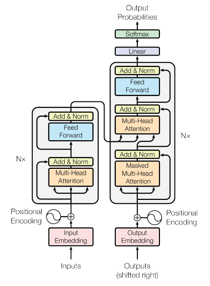
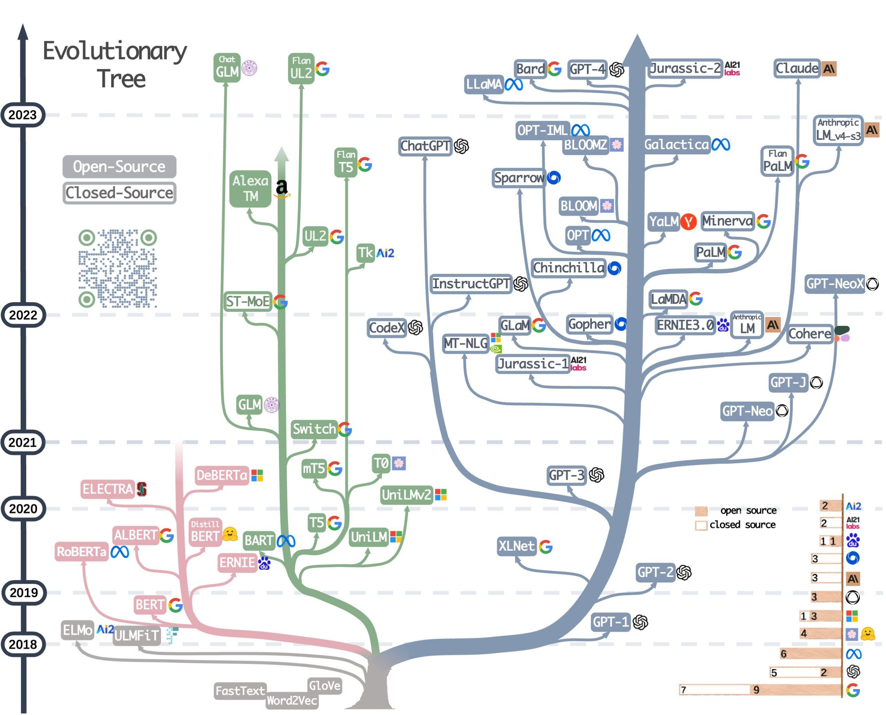
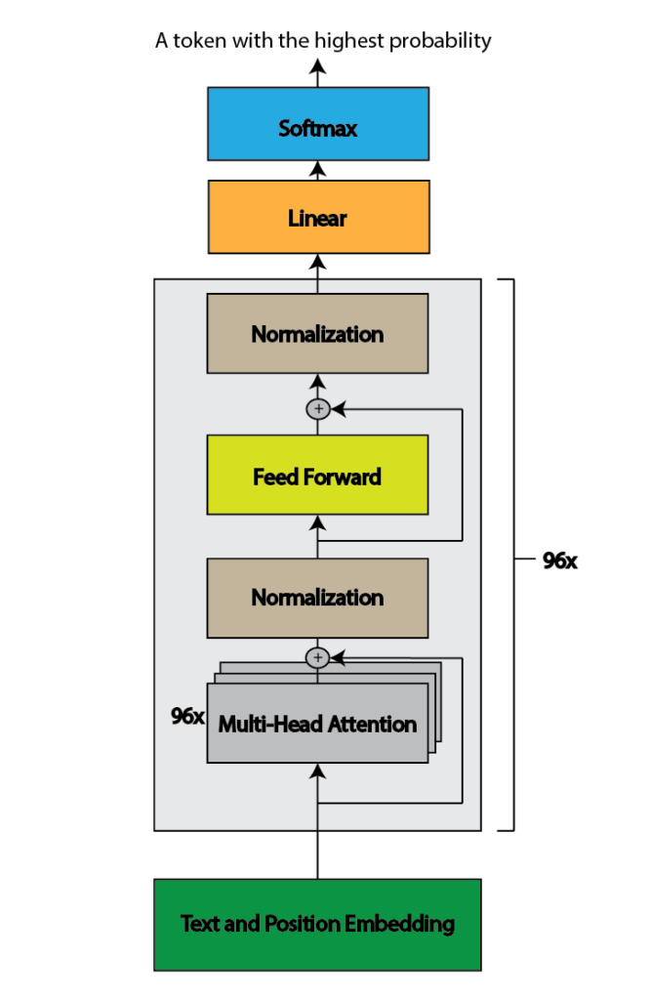
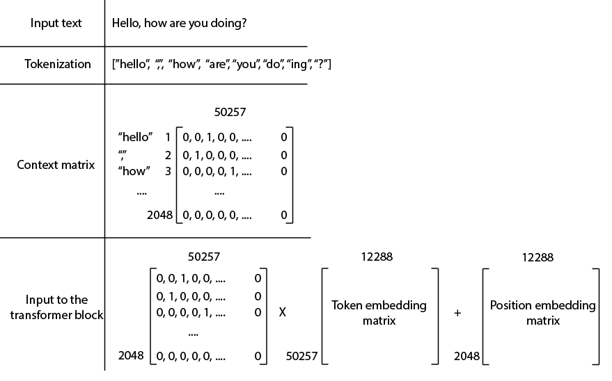
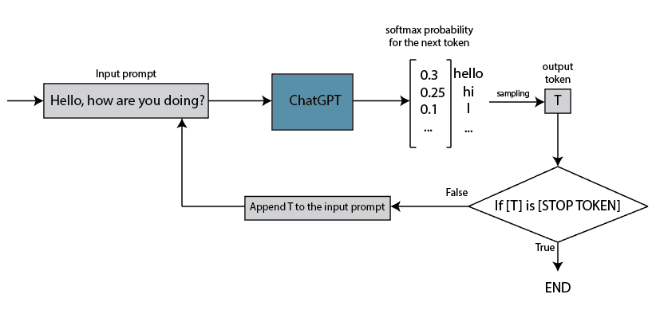
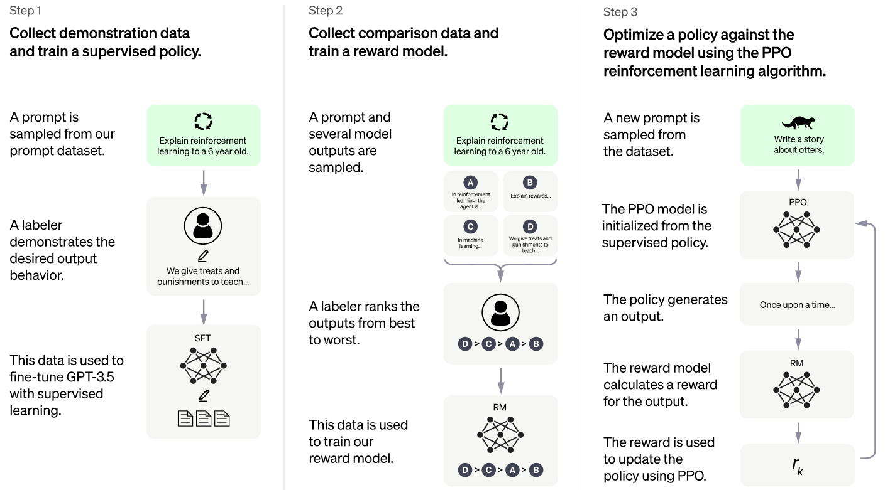

# [ChatGPT 如何工作？](https://www.baeldung.com/cs/chatgpt-model)

1. 简介

    在本教程中，我们将深入解释什么是 ChatGPT。具体来说，我们将深入探讨 ChatGPT 如何利用神经网络和transformer架构工作。此外，我们还将解释该模型的训练方法，其中包括从人类反馈中进行强化学习。

2. 神经网络和 NLP

    神经网络通过使机器能够处理和理解语言，在自然语言处理（NLP）的进步中发挥了重要作用。多年来，神经网络的发展和应用为这一领域带来了革命性的变化，在机器翻译、情感分析、文本摘要、聊天机器人等方面取得了突出的进步。

    一般来说，根据层和神经元的类型，我们可以将神经网络分为三大类：

    - 全连接神经网络（常规神经网络）
    - 卷积神经网络
    - [递归神经网络](https://www.baeldung.com/cs/nlp-encoder-decoder-models#2-basic-rnn-units)

    递归神经网络是 NLP 领域最早的成功应用之一。它们证明了自己捕捉词序列中上下文依赖关系的能力。具体来说，RNN（包括长短时记忆（LSTM）和门控递归单元（GRU）等变体）在语音识别和手写识别等具有序列信息的任务中表现出极高的效率。

    尽管如此，NLP 领域真正的转折点和进步是注意力机制和转换器模型的出现。

3. 注意机制(Attention Mechanism)和转换器(Transformers)

    在注意力机制出现之前，我们广泛使用 [RNN](https://www.baeldung.com/cs/recurrent-neural-networks) 对 NLP 任务中的顺序依赖关系进行建模。然而，RNNs 因其顺序性而面临梯度消失和并行化受限等挑战。由于这些限制，提取文本中遥远元素之间有意义的关系非常具有挑战性。

    2017 年，谷歌大脑的研究人员发表了著名的《注意力就是你所需要的一切》论文。注意力机制作为一种解决方案被引入，以解决 RNN 的局限性。也就是说，它能让神经网络在处理数据时关注输入序列的特定部分。该机制允许模型为序列中的不同位置分配不同的权重，从而更有效地捕捉每个位置的相关性和重要性。

    使用注意机制（更确切地说，是自我注意）的模型被称为 "转换器"。它们没有任何递归或卷积成分。尽管如此，它们在各种 NLP 任务（包括机器翻译、分类、生成等）中表现出了最先进的性能。2017 年提出的变换器模型架构如下：

    

    1. 变换器类型

        最初的 "Attention is All You Need" 论文介绍了一种由编码器和解码器两部分组成的变换器模型。然而，随着时间的推移，后续的发展导致了新的变压器模型的诞生，这些模型在设计上要么只包含一个编码器组件，要么只包含一个解码器组件。这种演变产生了专门用于特定任务的变压器模型。

        因此，我们可以将变压器型号分为以下几类：

        - 纯编码器转换器--适用于需要理解输入内容的任务，如句子分类和命名实体识别。一些流行的模型包括 BERT、RoBERTa 和 DistilBERT。
        - 纯解码器转换器--适用于生成任务，如文本生成。一些常用的模型有 GPT、LLaMA 和 Falcon
        - 编码器-解码器转换器--适用于需要输入的生成任务，如翻译或摘要。流行的编码器-解码器模型有 BART、T5 和 UL2。

        上述所有模型也被称为大型语言模型，因为它们使用的是人类语言，通常有几亿到几百兆个参数。LLM 是当今非常热门的话题，许多大型科技公司都在积极开发 LLM。我们可以从下图中观察最流行的 LLM 及其进展情况：

        

        请注意，粉色分支是纯编码器模型，绿色分支是编码器-解码器模型，灰色分支是纯解码器模型。最后值得一提的是，除了语言转换器，视觉转换器也可以处理图像。此外，混合转换器模型可同时处理图像和文本，结合了两种模式的优势。

4. ChatGPT 如何工作？

    首先，需要注意的是，ChatGPT 并非开源模型，这意味着其开发和创建的具体细节并不公开。不过，尽管存在这种限制，我们还是了解了先前的模型及其开发过程中使用的一般方法。

    ChatGPT 源自早期的 GPT 模型，即 GPT-1、GPT-2、GPT-3、InstructGPT，以及 ChatGPT 本身。这些模型代表了语言模型发展的一个过程，每一次迭代都会带来进步和改进。

    1. ChatGPT 的架构是什么？

        ChatGPT 采用了与最初的 GPT 模型类似的架构，即基于transformer架构。它使用一个带有自注意机制的transformer解码器块。与 GPT-3 一样，它有 96 个注意力块，每个块包含 96 个注意力头，共有 1750 亿个参数：

        

    2. ChatGPT 使用嵌入吗？

        ChatGPT 在其模型中使用单词嵌入来表示单词。单词嵌入是一种密集的向量表示法，可以捕捉单词的语义。它们能让模型有效地编码和处理文本信息。该模型在训练过程中学习词嵌入。

        此外，文本处理还包括几个步骤，将输入文本转换成模型可以理解并生成响应的格式。这些步骤包括

        - 标记化 Tokenization
        - 标记的上下文向量 Context vector of tokens
        - 嵌入矩阵 Embedding matrix
        - 位置嵌入 Position embedding

        首先，将输入文本分割成标记。标记可以代表单词、子单词、标点符号或字符。ChatGPT 共识别出 50257 个不同的标记。这些标记是用[字节对编码](https://huggingface.co/learn/nlp-course/chapter6/5?fw=pt)定义的。

        然后，这些标记被转换成上下文矩阵。从本质上讲，这个稀疏矩阵包含 0 和 1，其中每一行代表一个单击编码的标记。鉴于 ChatGPT 一次最多可接受 2048 个标记，并可识别 50257 个不同的标记，因此该矩阵的维度为 2048x50257。

        最后，上下文矩阵乘以标记嵌入矩阵，再加上位置嵌入。模型会在训练过程中学习嵌入矩阵和位置嵌入矩阵，嵌入向量的维度为 12288：

        

    3. ChatGPT 的注意力机制是什么？

        ChatGPT 中的注意力机制是一个基本组件，它使模型能够捕捉输入文本不同部分之间的依赖关系，并生成与上下文相关的响应。注意力机制能让模型在生成输出时关注输入序列中的特定单词或标记。

        有关注意力机制的更多信息，请参阅我们的[文章](https://www.baeldung.com/cs/attention-mechanism-transformers)。唯一不同的是，在 GPT-3 论文中，作者提到他们在变换器层中交替使用密集和局部带状稀疏注意力模式，这与稀疏变换器类似。然而，这种交替究竟是如何实现的并不清楚。

        我们只知道，局部带状稀疏注意力只关注附近有限的几个位置，同时仍然捕捉一定邻域内的相关依赖关系，从而降低了计算复杂度。

    4. ChatGPT 的输出是什么？

        在多头(multi-head)注意力组件之后，ChatGPT 的注意力块包括归一化(normalization)、前馈层和另一个归一化步骤。ChatGPT 包含 96 个注意力区块。在这些区块之后，还有一个线性层和一个softmax函数。softmax函数产生下一个标记的概率分布，并根据该分布选择下一个标记。

        这意味着在所有计算之后，ChatGPT 会输出一个标记。这个标记的采样是根据软最大函数生成的概率分布进行的。值得注意的是，ChatGPT API 包含一个温度参数，用于控制 softmax 函数的随机程度。我们在文章中讨论过 softmax 和温度参数，请点击[此处](https://www.baeldung.com/cs/softmax-temperature)。

        第一次迭代后，输出令牌会被添加回输入提示，这个过程会一直重复，直到输出令牌与结束令牌相对应为止：

        

5. ChatGPT 是如何训练的？

    可以说，ChatGPT 的训练过程是它能够进行类似人类对话的最关键环节。这也是最神秘的一步，有关其具体细节的信息披露十分有限。不过，我们确实对训练过程的某些细节有了一些了解。

    粗略地说，我们可以把训练过程分为两个阶段：

    - 预训练
    - 微调

    1. ChatGPT 预训练

        预培训在开发 ChatGPT 的过程中发挥了至关重要的作用，因为它有助于学习语言的基本规则，理解常用词用法和短语。这些知识是进一步定制的基础。

        在这一阶段，该模型在一个约 570GB 的庞大数据集上进行了训练，该数据集由书籍、文章、维基百科和其他互联网文本资源组成。训练目标是根据前面词语的上下文预测给定文本中的下一个标记。通过将预测结果与句子中实际的下一个标记进行比较，该模型在训练过程中调整了权重，以提高未来预测的准确性。

        经过预训练后，该模型显示出生成有意义句子的能力。不过，还需要进一步调整，以提高其性能，使其更像聊天机器人一样会话。

    2. ChatGPT 微调

        微调过程分为三个步骤。第一步是有监督的微调，即使用人类人工智能培训师之间的对话构建的训练数据对模型进行训练，人类人工智能培训师同时扮演用户和人工智能助手的角色。该数据集由问答对组成，用于进一步训练预先训练好的 ChatGPT 模型。

        第二步，当前模型会针对不同的用户提示生成多个预测。人工注释员将这些预测从最无帮助到最有帮助进行排序。然后利用这些排名数据来训练奖励模型，该模型可预测特定提示下的回复的有用程度。

        在最后一步中，近端策略优化（Proximal Policy Optimization, PPO）算法被用作强化学习代理，以最大化从奖励模型中获得的奖励。从本质上讲，第一步中的模型被用来生成对用户提示的回应。每次回复后，奖励模型都会对回复进行评估，并给出一个奖励分数。然后对 PPO 模型进行训练，通过学习过程最大化这些奖励：

        

6. 结论

    在本文中，我们详细介绍了 ChatGPT 的工作原理。这是一个令人印象深刻的语言模型，它利用了变压器的力量和其他一些技术。它结合了预训练和微调的优势，从而实现了与人类进行类似对话的卓越能力。

    像 ChatGPT 这样的语言模型前景广阔，具有巨大的发展和进步潜力。通过负责任的部署和持续的道德考量，语言模型将在各行各业的转型中发挥重要作用，并彻底改变我们与人工智能系统的交互方式。
