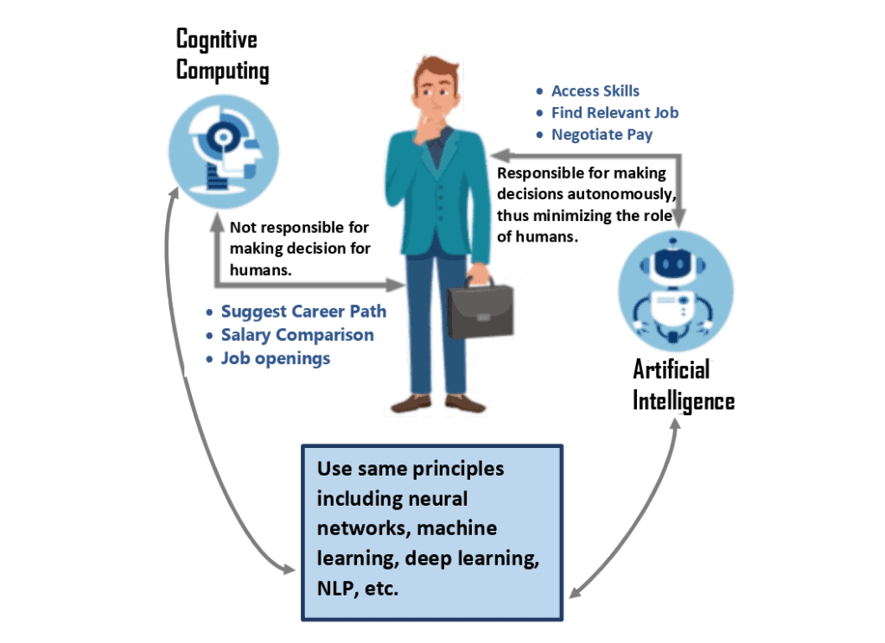
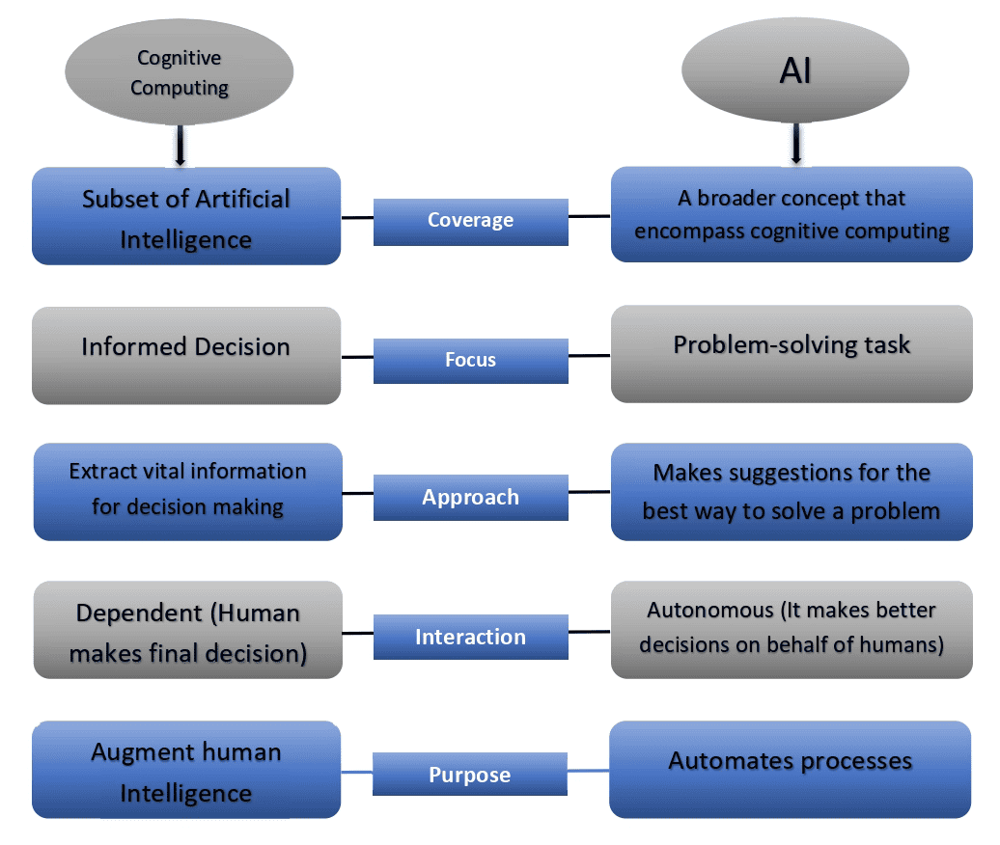

# [认知计算与人工智能](https://www.baeldung.com/cs/cognitive-computing-vs-ai)

1. 概述

    在本教程中，我们将讨论两个重要概念： 人工智能和认知计算。此外，本文还将强调这两个概念之间的区别。

2. 人工智能和认知计算

    所有能让机器像人类一样理解和行为的技术进步统称为人工智能（AI）。它涵盖了广泛的主题，包括机器学习 (ML) 和深度学习，以及神经网络、图像识别和自然语言处理 ([NLP](http://towardsdatascience.com/a-gentle-introduction-to-natural-language-processing-e716ed3c0863))。

    人们常常将认知计算误认为是人工智能，因为它使用的是相同的技术。然而，这些系统的输出以及它们与人的交互方式却截然不同。

    在比较这两个概念之前，让我们先来了解一下这两个概念。

    1. 人工智能（AI）

        当机器模仿人们经常与其他人类大脑联系在一起的 "认知" 过程时，比如 "学习" 和 "解决问题"，就会用到 "人工智能" 这个词。

        人工智能是机器，特别是计算机系统对人类认知过程的模仿。这些过程包括获取知识和利用知识的规则（学习），利用规则得出近似或确定的结论（推理），以及自我修正。

        人工智能是一个包罗万象的短语，指的是任何技术、算法、方法和理论框架系统，使计算机系统能够完成通常需要人类智力才能完成的操作。人工智能提高了智能。因此，它超越了人类的理解力、精确度、敏捷度和力量。

        由于人工智能的出现，人类的必要性降低了。一个典型的例子就是聊天机器人。聊天机器人利用人工智能回答客户的基本询问，并自主处理快速任务。这就减轻了呼叫中心工作人员的压力，使他们能够腾出手来，从事更有价值、更富有成效的工作。因此，客户的体验将得到改善，因为他们将比人工更快、更有效地收到回复。

    2. 认知计算

        从根本上说，认知计算系统是协助人类做出智能决策的工具。它们为决策者提供所需的信息，帮助他们做出更好的数据驱动型决策。

        认知计算系统管理着大量数据。它会进行大量重复性分析，并在新数据进入系统时修改其结论。认知计算系统采用自学算法。这些算法依赖数据挖掘、图像/语音识别和自然语言处理等人工智能技术来解决复杂问题。

        提供金融服务的公司利用认知计算的分析能力来确定最合适的产品，以满足客户的需求。此外，医疗领域的认知计算也在帮助医生改进诊断和个性化治疗方案。

        这些系统可以像人类一样思考、学习并与人互动。它们拥有与人类相同的符号和概念处理能力：

        

        让我们用一张图来回顾一下这两个概念的解释。设想一个人正在考虑转行的情况。

        如上图所示，人工智能助手将自动评估求职者的技能，确定与这些技能相匹配的职位，并协商薪酬和福利。最后，系统会告知求职者在此过程中达成的决定。

        认知助手在为求职者提供进修需求、工资比较信息和空缺机会等重要信息的同时，还会就其他职业选择提出建议。求职者仍需做出最终决定。

        因此，我们可以说，认知计算使我们能够利用技术做出更智能的判断。另一方面，人工智能的基础是计算机可以为我们做出更好的判断。

3. 认知计算与人工智能

    让我们来讨论认知计算与人工智能之间的相似之处和明显区别。我们将根据一些关键术语进行比较：技术、交互、方法、重点、目的和应用：

    |    |人工智能|认知计算|
    |-|-|-|
    |技术|人工智能涵盖机器学习（ML）、深度学习、神经网络和自然语言处理（NLP）等多种技术。|同样，认知计算也利用了这些技术。|
    |目的|人工智能的目标是实现流程自动化|认知计算的主要目标是增强人类智能。|
    |方法|人工智能利用大量数据。人工智能对数据进行分析，并提出解决问题的最有效建议。|然而，认知计算技术会分析数据并提取有用信息，从而帮助人类做出决策。|
    |重点|人工智能技术主要侧重于解决问题的活动。|认知计算是一种补充，可以帮助人们做出更明智的决策。|
    |互动|人工智能可以独立地为人类做出更好的决策。|认知技术可提供有价值的信息，但仍需要人类进行决策。|
    |应用|在医疗保健、制造和客户服务等服务型行业，人工智能至关重要。|在需要大量分析的领域，如金融、营销、政府和医疗保健数据，认知计算至关重要。|

4. 总结

    让我们用一张图来总结一下人工智能与认知计算的主要区别：

    

5. 总结

    在本文中，我们讨论了人工智能和认知计算。最重要的是，我们强调了人工智能与认知计算的主要区别。
