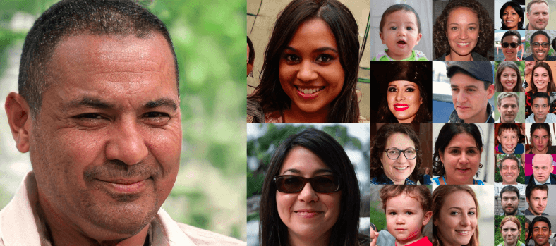
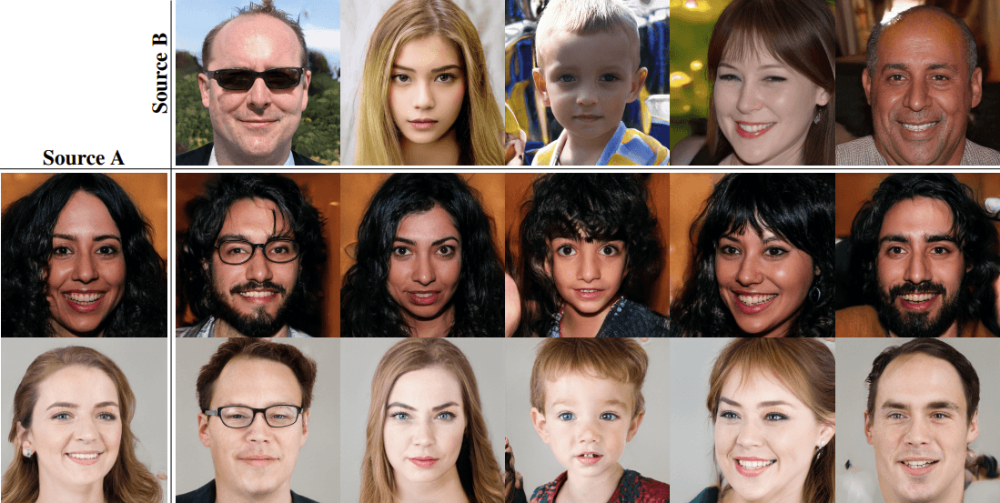
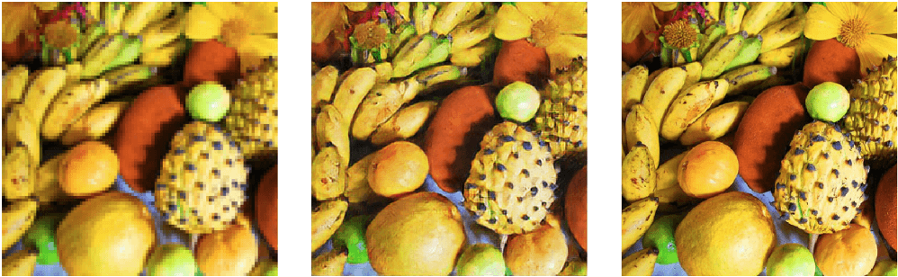
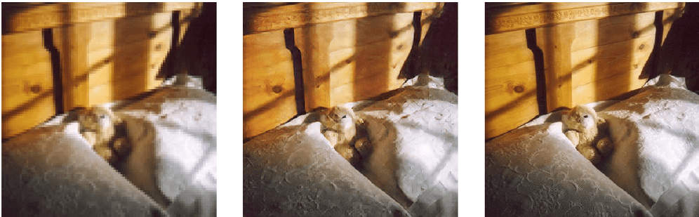
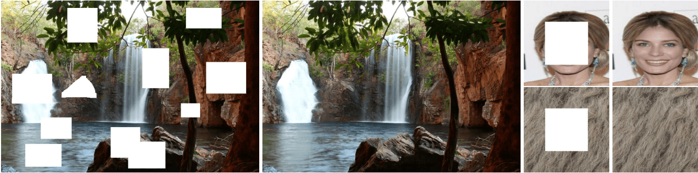
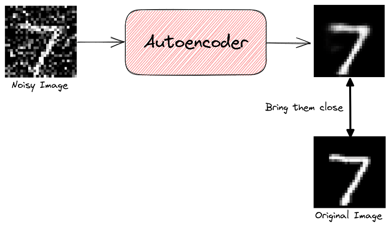
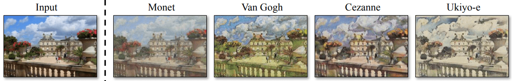
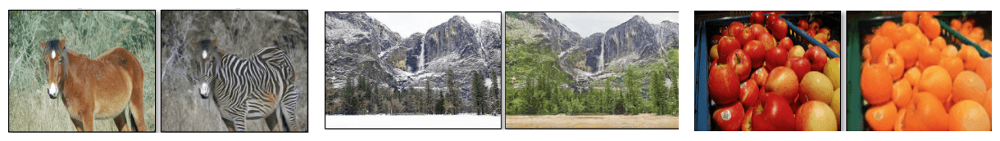
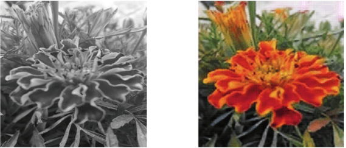

# 生成模型的应用

[计算机视觉](https://www.baeldung.com/cs/category/ai/computer-vision) [深度学习](https://www.baeldung.com/cs/category/ai/deep-learning)

[生成对抗网络](https://www.baeldung.com/cs/tag/gan)

1. 概述

    在本教程中，我们将讨论生成模型的应用。首先，我们将非常简要地介绍生成模型的领域，然后我们将介绍 5 个应用以及一些可视化示例。

2. 生成模型

    生成模型的主要目标是学习输入数据的底层分布 $\mathbf{p(X)}$ 。然后，这些模型可以预测给定样本的可能性，并根据学习到的底层分布生成现实样本。最著名的生成模型是 GAN，它通过两个在[零和游戏](https://en.wikipedia.org/wiki/Zero-sum_game)中竞争的网络来学习数据分布。关于GANs背后的理论，我们可以在之前的教程中找到更多详细信息。

3. 数据扩充

    生成模型的一个非常重要的应用是[数据扩充](https://www.baeldung.com/cs/ml-gan-data-augmentation)。在注释大量训练数据比较困难或成本较高的情况下，我们可以使用 GAN 生成合成数据，增加数据集的规模。

    例如，[StyleGAN](https://en.wikipedia.org/wiki/StyleGAN) 是由 [Nvidia](https://www.nvidia.com/) 提出的一种生成模型，能够生成非常逼真的人脸图像，而这些图像并不存在。在下面的图片中，我们可以看到一些由 StyleGAN 生成的不同分辨率的合成人脸。我敢肯定，你看不出这些合成人脸图像与真实人脸图像有任何区别。这些人实际上并不存在，这一点令人印象深刻：

    

    StyleGAN 还可以控制生成人脸的风格。网络的某些部分控制着发型和头部姿势等高级风格，而其他部分则控制着面部表情和更多细节。因此，该模型可以让我们利用他人的风格来修改一个人的风格。在下面的图片中，来源 A 的风格与来源 B 的身份相结合，生成了合成面部图像，效果非常逼真：

    

4. 超分辨率

    生成模型的另一个应用领域是超分辨率，我们的目标是提高输入图像的分辨率。具体来说，我们将一幅低分辨率的图像（如 90 × 90）作为输入，并希望提高其分辨率（提高到 360 × 360，甚至更高），同时尽可能保持其高质量。超分辨率是一项非常具有挑战性的任务，其应用范围非常广泛，如航空或医学图像分析、视频增强、监控等。

    [SRGAN](https://arxiv.org/abs/1609.04802) 是一种生成模型，可以成功地从低分辨率图像中恢复出逼真的高分辨率图像。该模型由一个深度网络和一个对抗网络组成，就像大多数 GAN 架构一样。

    在下面的图片中，我们可以看到 SRGAN 的一些令人兴奋的结果。左边是原始的低分辨率图像。中间是 SRGAN 生成的高分辨率图像，右边是原始的高分辨率图像：

    

    

    我们可以看到，生成的图像与原始高分辨率图像非常相似。该模型设法在不降低最终质量的情况下提高了输入图像的分辨率。

5. 涂色

    在图像绘制中，我们的任务是重建图像中的缺失区域。特别是，我们要以一种新图像仍然逼真且上下文一致的方式来填充输入图像中缺失的像素。这项任务的应用非常广泛，如图像渲染、编辑或去除不需要的物体。

    [Deepfill](https://arxiv.org/abs/1801.07892) 是用于图像内绘任务的开源框架，它采用基于生成模型的方法。它的新颖之处在于 "上下文关注层"，该层允许生成器利用远处空间位置提供的信息来重建局部缺失的像素。

    下面，我们可以看到 Deepfill 在 3 种不同类型图像中的效果：自然场景、人脸和纹理：

    

    该模型能够非常自然地填充缺失的像素，并保持图像上下文的一致性。

6. 去噪

    如今，得益于现代数码相机，我们能够拍摄出高质量的照片。然而，在某些情况下，图像仍会出现噪点较多、质量较低的情况。在不丢失图像特征的情况下去除图像中的噪点是一项非常重要的任务，多年来研究人员一直在研究去噪方法。

    [自动编码器](https://en.wikipedia.org/wiki/Autoencoder)是一种非常流行的图像去噪生成模型，经训练后可在去除噪声后重建输入图像。在训练过程中，网络会得到原始图像及其噪声版本。然后，网络尝试重建其输出，使其尽可能接近原始图像。这样，模型就学会了对图像进行去噪处理：

    

7. 翻译

    最后但并非最不重要的一点是，生成模型也可用于图像翻译，我们的目标是学习两个图像域之间的映射。然后，模型就能生成输入图像的合成版本，并进行特定的修改，比如将冬季的风景翻译成夏季的风景。

    [CycleGAN](https://junyanz.github.io/CycleGAN/) 是一种非常著名的基于 GAN 的图像翻译模型。该模型使用源领域和目标领域的图像数据集以无监督方式进行训练。这种方法的应用范围超乎你的想象！

    1. 集合风格转移

        在这里，模型将随机风景作为输入，并将其转换为莫奈、梵高、塞尚和浮世绘等著名画家的画作：

        

    2. 对象变形

        StyleGAN 的另一个令人兴奋的应用是对象转换，即模型将一个对象类转换为另一个对象类，如将马转换为斑马，将冬季风景转换为夏季风景，将苹果转换为橘子：

        

    3. 图像着色

        我们可以使用 CycleGAN 对图像进行自动着色，这在修复老化或退化图像等领域非常有用。下面，CycleGAN 将一朵花的灰度图像转换成彩色的 RGB 形式：

        

8. 总结

    在本教程中，我们介绍了生成模型的一些令人兴奋的应用。
