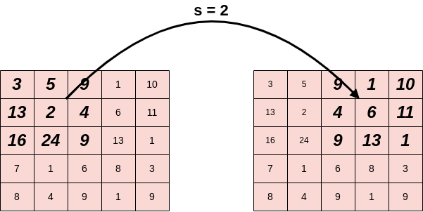

# 计算卷积层的输出大小

[计算机视觉](https://www.baeldung.com/cs/category/ai/computer-vision) [深度学习](https://www.baeldung.com/cs/category/ai/deep-learning)

[卷积神经网络](https://www.baeldung.com/cs/tag/cnn) [神经网络](https://www.baeldung.com/cs/tag/neural-networks)

1. 概述

    在本教程中，我们将介绍如何计算卷积层的输出大小。首先，我们将简要介绍卷积算子和卷积层。然后，我们将介绍计算输出大小的一般公式，并提供一个详细的示例。

2. 卷积操作

    一般来说，[卷积](https://en.wikipedia.org/wiki/Convolution)是对两个函数进行的数学运算，将两个信息源结合起来生成一个输出函数。它被广泛应用于信号处理、计算机视觉、物理和微分方程等领域。卷积有很多类型，如连续卷积、循环卷积和离散卷积，我们将重点讨论离散卷积，因为在卷积层中，我们处理的是离散数据。

    在计算机视觉中，卷积是在图像 $\mathbf{I}$ 和定义为小矩阵的滤波器 $\mathbf{K}$ 之间进行的。首先，滤波器连续通过二维输入图像的每个像素。在每一步中，我们都会在滤波器的像素和图像的相应像素之间进行元素乘法运算。然后，我们将结果汇总为一个输出像素。对每个像素重复这一步骤后，我们就得到了一个二维特征输出矩阵。

    现在，让我们用一个简单的例子来再次描述上述过程。我们有一张 5 乘以 5 的图像 I 和一个 3 乘以 3 的滤波器 K，我们要对它们进行卷积。下面，我们可以用粗体字看到卷积的每一步都使用了输入图像中的哪些像素：

    

    如前所述，在每一步中，我们都会将所选像素（粗体）的值与滤波器的相应值相乘，然后将结果相加得到一个输出。在下面的示例中，我们计算中心像素的卷积（步骤=5）：

    

    首先，我们计算滤波器中每个像素与图像中相应像素的乘积。然后，将所有乘积相加：

    2*1+4*3+6*2+24*2+5*9+13*3+1*7+6*1+8*6 = 129

    因此，输出激活图的中心像素等于 129。输入图像的每一个像素都要遵循这一步骤。

3. 卷积层

    卷积层是每个[卷积神经网络](https://www.baeldung.com/cs/ai-convolutional-neural-networks)的核心组成部分。在每一层中，我们都有一组可学习的滤波器。在前向传播过程中，我们将输入与每个滤波器进行卷积，产生该滤波器的输出激活图。因此，当输入图像中出现特定特征时，网络就会学习激活滤波器。下面，我们可以看到一个使用[Prewitt运算符](https://en.wikipedia.org/wiki/Prewitt_operator)的示例，这是一种用于边缘检测的清晰滤波器：

    

4. 超参数

    为了制定计算卷积层输出大小的方法，我们首先要讨论两个关键的超参数。

    1. 步长

        在卷积过程中，滤波器从左到右、从上到下滑动，直到穿过整个输入图像。我们将步长 \mathbf{S} 定义为滤波器的步长。因此，当我们想对输入图像进行下采样，并最终得到较小的输出结果时，我们将 S 设置为 > 0。

        下面是 S = 2 时的例子：

        

    2. 填充

        在卷积层中，我们会发现位于角落和边缘的像素比位于中间的像素要少得多。例如，在下面的例子中，我们有一个 5 乘以 5 的输入图像和一个 3 乘以 3 的滤波器：

        

        下面我们可以看到在使用 S=1 的卷积时，输入图像中每个像素被使用的次数：

        

        我们可以看到，像素（0，0）只被使用了一次，而中心像素（3，3）则被使用了九次。一般来说，位于中间的像素比位于边缘和角落的像素被使用的次数要多。因此，图像边缘的信息保存得不如中间的信息好。

        解决这一问题的简单而有效的方法就是填充，即在输入图像中添加一行或一列 0。如果我们在大小为 $W \times H$ 的输入图像中应用填充 P，输出图像的大小为 $(W+2P) \times (H+2P)$。

        下面我们可以看到填充 P=2 前后的图像示例。我们可以看到，尺寸从 5 x 5 次方增加到了 9 x 9 次方：

        

        通过在卷积层中使用填充，我们增加了边角像素对学习过程的贡献。

5. 公式

    现在，让我们进入本教程的主要目标，即介绍计算卷积层输出大小的公式。我们有如下输入

    - 尺寸为 $W_{in} \times H_{in}$ 的图像。
    - 一个尺寸为 $K \times K$ 的滤波器。
    - 步长 S 和填充 P。

    输出激活图的维数如下

    - $\mathbf{W_{out} = \frac{W_{in} - K + 2P}{S} + 1}$
    - $\mathbf{H_{out} = \frac{H_{in} - K + 2P}{S} + 1}$

    如果输出维数不是整数，说明我们没有正确设置跨距 S。

    我们有两种特殊情况：

    - 当完全没有填充时，输出维度是 $\left(\frac{W_{in} - K}{S} + 1, \frac{H_{in} - K}{S} + 1\right)$。
    - 如果我们想在卷积层之后保持输入的大小不变，我们可以使用相同的填充，即 $W_{out} = W_{in}$，$H_{out} = H_{in}$。如果 s=1，我们设置 $p = \frac{K-1}{2}$。

6. 示例

    最后，我们举一个计算卷积层输出大小的例子。假设我们有一幅大小为 $125 \times 49$ 的输入图像，一个大小为 $5 \times 5$ 的滤波器，$padding P=2$ 和 $stride S=2$。那么输出尺寸如下

    - W_{out} = \frac{125 - 5 + 2*2}{2} = \frac{124}{2} = 62
    - H_{out} = \frac{49 - 5 + 2*2}{2} = \frac{48}{2} = 24

    因此，输出激活图的维数为 (62, 24)。

7. 结论

    在本教程中，我们讨论了如何计算卷积层的输出大小。
