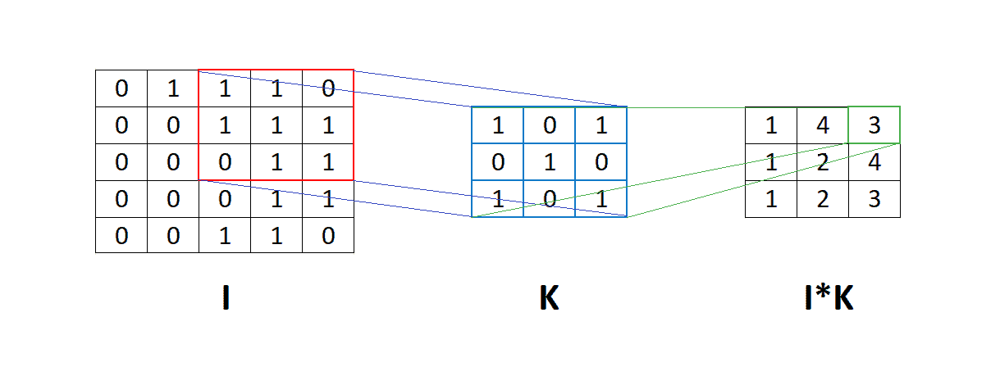
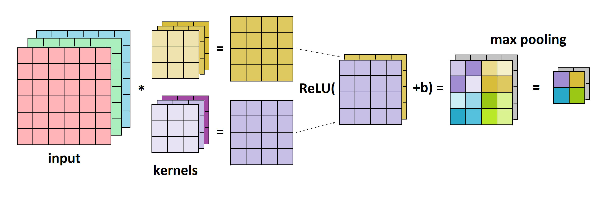
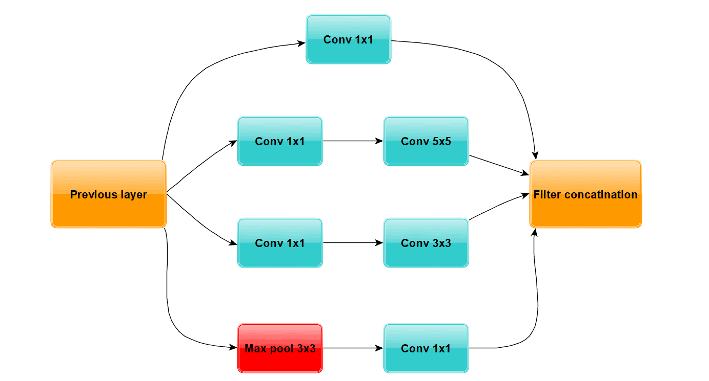
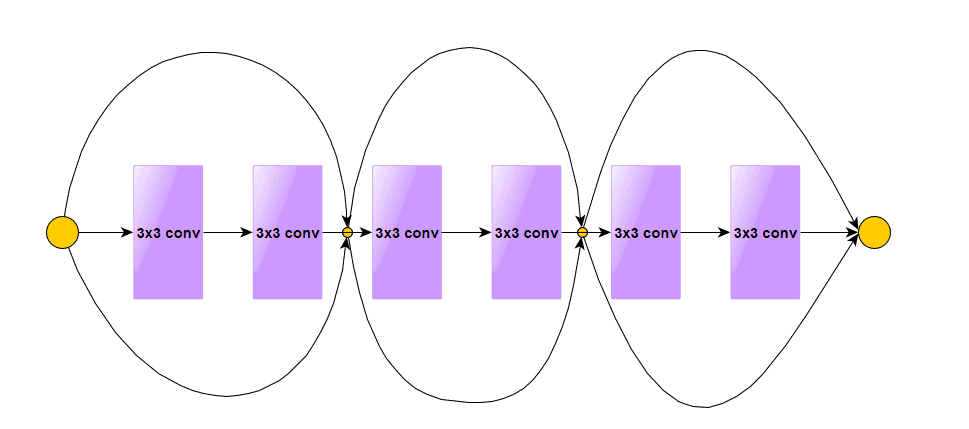
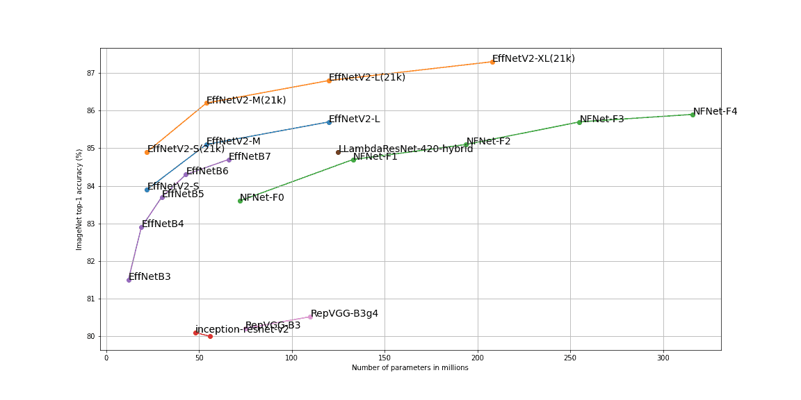

# [如何设计深度卷积神经网络？](https://www.baeldung.com/cs/deep-cnn-design)

1. 简介

    本文将介绍一种常用于计算机视觉任务的神经网络，即卷积神经网络（CNN）。此外，我们还将提供构建这类网络问题的详细解决方案。

    围绕这一主题的研究很多，许多基于特定领域的 CNN 架构也在不断发展。因此，对于如何设计这种网络的问题，并没有一个通用的答案。不过，我们还是可以应用一些有用的技巧来升级我们的 CNN 模型并改进模型的预测结果。

2. 神经网络

    神经网络是受生物神经网络启发而创建的算法类型。最初的想法是创建一个能像人脑一样工作的人工系统。神经网络的基础是神经元，这些神经元根据网络类型相互连接。

    通常，神经网络由若干层组成，每层由多个神经元组成。至少有一个隐藏层（既非输入层也非输出层）的神经网络被称为深度神经网络。深度学习是机器学习的一个类别，其主要重点是深度神经网络。

    神经网络有很多种类型，但大致可分为三大类：

    - 前馈神经网络
    - 卷积神经网络
    - 递归神经网络

    它们之间的主要区别在于组成它们的神经元类型以及信息如何在网络中流动。在本文中，我们将只介绍卷积类神经网络。

3. 卷积神经网络

    卷积神经网络是人工神经网络的一种，是一种机器学习技术。它们已经存在了一段时间，但最近因为在图像识别方面的成功而得到了更多的关注。卷积神经网络是一种强大的工具，我们可以用它来处理任何可以应用卷积运算的数据。

    卷积神经网络的成功主要归功于它可以处理大量数据，如图像、视频和文本。首先，我们可以用它们对图像进行分类、定位对象，并从图像中提取边缘或角落等特征。它们通常由一个或多个隐藏层组成，每个隐藏层都包含一组称为神经元的可学习滤波器。

    1. 卷积

        如前所述，这些网络使用卷积，其定义如下

        (1) $$\begin{align*} g(x, y) = w * f(x, y) = \sum_{s = s_{min}}^{s_{max}} \sum_{t = t_{min}}^{t_{max}} w(s, t)f(x+s, y+t) \end{align*}$$

        其中，f(x, y) 是输入图像，w 是滤波器或内核。更直观地说，我们可以通过下面的插图来想象这一过程：

        

        在上图中，我们可以看到矩阵 I 与滤波器 K 的卷积过程。这意味着滤波器 K 会穿过整个矩阵 I，并在矩阵 I 和滤波器 K 的相应元素之间进行逐元素乘法。

    2. 卷积神经网络的优势

        因此，与全连接神经网络相比，卷积神经网络的最大优势在于参数数量更少。举例来说，如果输入 I 的维度为 $32 \times 32$，而我们应用了 10 个维度为 $3 \times 3$ 的过滤器，那么输出将是一个格式为 $30 \times 30 \times 10$ 的张量。每个滤波器有 $3 \cdot 3 = 9$ 个参数，加上一个偏置元素，总共是 10 个滤波器参数。

        (2) $$\begin{align*} 10 \cdot 10 = 100 \end{align*}$$

        另一方面，对于全连接的神经网络，我们需要将输入矩阵扁平化为 $32 \cdot 32 = 1024$ 维的向量。为了使输出具有与上述相同的维度，我们需要参数或权重。

        (3) $$\begin{align*} 1024 \cdot 30 \cdot 30 \cdot 10 = 9216000 \end{align*}$$

        网络中的权重使其能够学习图像不同部分的特征。我们通过反向传播来更新这些权重，反向传播会将输出中的误差传播回各层，从而改变权重以达到训练目的。

    3. 简单的 CNN 架构

        最后，值得一提的是，在大多数情况下，卷积层之后会使用 ReLU 激活函数。在此之后，通常是池化层，它与卷积层一样应用过滤器，但只计算最大项或平均项，而不是卷积。在下图中，我们可以看到卷积层、ReLU 和最大池化的示例：

        

4. 卷积神经网络的设计

    正如我们之前提到的，创建 CNN 并没有一个通用的规则。这在很大程度上取决于我们要解决的具体问题。此外，其他一些因素，如更高的精度、训练速度、计算资源等，也可能在这个问题上发挥重要作用。

    1. 简单任务

        例如，对于相对简单的问题，如使用流行的 MNIST 数据集进行手写数字分类，我们并不需要复杂的 CNN 架构。经验法则是，从一个简单的 CNN 开始，该 CNN 有一个包含约 10 个维度为 3 的核的隐藏层和一个最大池化层。根据我们的结果，控制准确性和训练速度之间的权衡，我们可以慢慢增加核的数量并添加新的层。

        除此之外，我们还需要注意 CNN 的准确性和速度可能取决于其他因素，如批量大小、学习率、优化器等。此外，我们还可以尝试 ReLU 激活函数的其他变体。例如，Leaky ReLU 或 ELU 函数可能会为我们的神经网络提供额外的多样化。

    2. 更复杂的任务

        如果问题比较复杂，经验法则是使用预训练网络。这要归功于一种叫做迁移学习的流行技术。这是一种有用且重要的方法，我们可以重复使用已经训练过的网络，尽管它们是使用不同的数据训练出来的。

        简而言之，这个过程就是我们使用一个已经预先训练好的模型，添加一层或在必要时更改最后一层，然后使用我们的数据集对该模型进行微调。之所以能实现迁移学习，是因为旧的神经网络在原始数据集上学习了一些模式，稍加调整后，就能在我们的问题中利用这些模式。当然，原始数据集与我们的数据集越相似，我们就能期望得到越好的结果。

        预训练模型通常与一些流行的 CNN 架构结合在一起。在大多数情况下，它们在过去的某个阶段取得了最先进的结果，或者是某些重要竞赛的获奖解决方案。接下来我们将详细讨论它们。

5. 流行的 CNN 架构

    ImageNet 是计算机视觉领域最流行、最常用的数据集之一。它由 2000 多万张图像组成，包含近 2.2 万个人类标记的类别。一些最流行的深度学习软件包，包括 PyTorch、TensorFlow 等，都包含在该数据集上训练的预训练模型。在此，我们只介绍其中的一部分。

    1. VGG16

        VGG16 是一种卷积神经网络，曾在 2014 年的 ImageNet 竞赛中使用。数字 16 表示它有 16 层权重，其中 13 层是卷积层，3 层是密集层或全连接层。此外，它还有 4 个最大池化层。VGG16 网络的例子包括

        - [PyTorch VGG16](https://pytorch.org/vision/stable/models.html#torchvision.models.vgg16)
        - [TensorFlow VGG16](https://www.tensorflow.org/api_docs/python/tf/keras/applications/vgg16/VGG16)

    2. InceptionNet

        InceptionNet 也被称为 GoogleNet，是 2014 年 ImageNet 竞赛的冠军。该网络引入了由多个卷积层和一个最大池化层组成的初始模块。其理念是创建良好的局部拓扑结构，并提取多样化的特征。此外，该网络还使用了 1x1 卷积，以减少层中通道的大小。让我们来看看初始模块的可视化表示：

        

        整个 InceptionNet 有九个这样的模块和一些其他层。下面是一些例子：

        - [PyTorch Inception v3](https://pytorch.org/vision/stable/models.html#torchvision.models.inception_v3)
        - [TensorFlow Inception v3](https://www.tensorflow.org/api_docs/python/tf/keras/applications/inception_v3/InceptionV3)

    3. ResNets

        ResNet 是 2015 年 ImageNet 竞赛的冠军。该模型的作者在网络中引入了残差块，这是他们成功的关键。传统的神经网络每一层都会馈入下一层，与此相反，ResNet 中的一些层与前面的层有捷径连接。这样，高层就能直接从深层获得一些信息，从而有助于解决梯度消失的问题。

        让我们看看残差块是什么样的：

        

        与之前的模型类似，我们也可以在 PyTorch 和 TensorFlow 中找到这种类型的网络：

        - [PyTorch ResNet 101](https://pytorch.org/vision/stable/models.html#torchvision.models.resnet101)
        - [TensorFlow ResNet 101](https://www.tensorflow.org/api_docs/python/tf/keras/applications/resnet/ResNet101)

    4. NFNets

        DeepMind 于 2021 年初发布了这一系列图像分类器，它们在 ImageNet 数据集上达到了最先进的准确率。NFNets（Normalizer-Free Networks，无归一化网络）通过权重标准化和自适应梯度剪切引入修正的残差块，而不是批量归一化。下面是一个实现实例：

        - [PyTorch NFNet 实现](https://github.com/vballoli/nfnets-pytorch)

    5. 高效网络

        最后，EfficientNets 是一个卷积神经网络系列，从最小的 b0（530 万个参数）到最大的 b7（6600 万个参数）。虽然其在 ImageNet 上的准确率略低于 NFNet，但在 2021 年 6 月底，谷歌发布了新版本 EfficientNetV2，其性能超过了之前所有的 CNN 架构。

        因此，通过系统地调整 CNN 的深度、宽度和分辨率，该网络系列取得了最先进的成果。此外，V2 还采用了渐进式学习，即通过训练逐步增加图像的大小。此外，他们还加入了一种新型层，称为 “融合-MB Conv 层”。我们可以看几个例子：

        - [PyTorch EfficientNetV2](https://github.com/lukemelas/EfficientNet-PyTorch)
        - [TensorFlow EfficientNetV2](https://github.com/google/automl/tree/master/efficientnetv2)

        最后，在下图中，我们可以看到上述网络在 ImageNet 上的最高准确率：

        

6. 结论

    在本文中，我们学习了如何创建深度卷积神经网络。首先，我们介绍了神经网络和卷积神经网络的术语，以及它们的一些基本概念。然后，我们介绍了针对简单和复杂问题构建卷积神经网络的方法。最后，我们展示了一些最常用的卷积神经网络架构及其最新成果。
