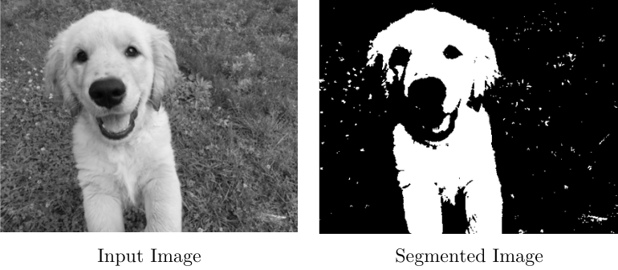
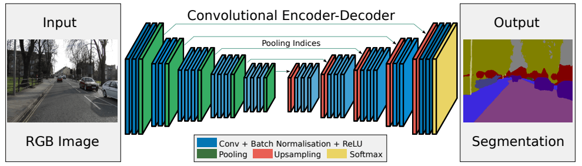
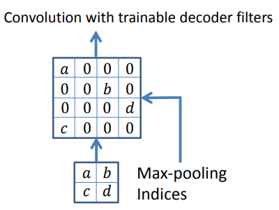
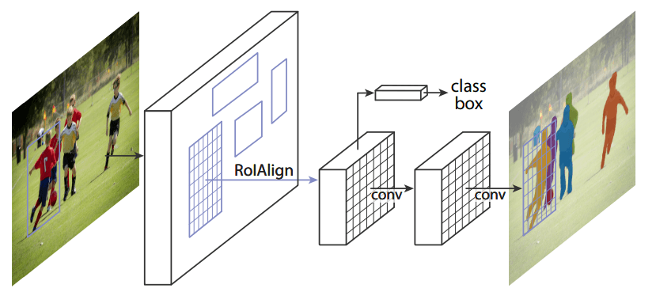

# 实例分割与语义分割

[计算机视觉](https://www.baeldung.com/cs/category/ai/computer-vision) [深度学习](https://www.baeldung.com/cs/category/ai/deep-learning)

[神经网络](https://www.baeldung.com/cs/tag/neural-networks)

1. 导言

    在计算机视觉领域，我们的目标是从图像中提取有用的信息。为此，我们可以通过[图像分割](https://www.baeldung.com/cs/object-recognition-tasks-differences)来隔离或检测帧内的物体。

    在本教程中，我们将解释为什么以及如何做到这一点。然后，我们将讨论这种技术的两种主要类型，即实例分割法和语义分割法。

2. 图像分割

    在图像分割任务中，我们要识别每个像素的类别。

    属于同一类别的一组像素构成一个分段。通常，我们的目的是通过隔离图像中的对象来创建分割。通过这种方法，我们可以将图像的表现形式改变为一种新的表现形式。可以认为，分割图像中的像素包含类标签，而不是实际的像素值。

    有几种方法可以做到这一点，其中最简单的就是阈值化。如果我们有一张[灰度](https://www.baeldung.com/cs/convert-rgb-to-grayscale)图像，想要将前景和背景分割开来，我们可以定义一个阈值，比如 149。所有低于此值的像素都将被视为前景像素。相反，背景将由数值高于 149 的所有像素组成。例如

    

    生物学是图像分割最古老的应用之一。如果我们有一个人体组织样本，我们可能需要从健康细胞中分离出癌细胞。在这种情况下需要进行分割，因为癌细胞的结构与正常细胞不同，所以图像会反映出这一点。

    因此，在使用分割工具隔离细胞后，我们可以继续进行形态分析。

    分割主要有两种类型：实例分割(instance segmentation)和语义分割(semantic segmentation)。

3. 语义分割

    在语义分割中，属于同一类别的所有对象共享标签。因此，如果我们处理的是自动驾驶汽车应用，所有行人都将获得相同的标签。汽车也是如此。例如

    

    1. 分割网络

        在语义分割和实例分割方面，深度学习方法都取得了最佳性能。

        SegNet 就是这样一种用于语义分割的工具，它是一个编码器-解码器网络：

        

        在[编码器](https://www.baeldung.com/cs/autoencoders-explained)阶段，它通过 13 层卷积后的最大池化层对输入图像进行下采样。在每个池化步骤后，它都会保存每个滤波器的索引以及每个子网格中的最大值。这些指数表示像素原来所在的位置。

        然后，解码器阶段开始。在编码过程中应用最大池化滤波器后，我们得到的低分辨率[特征](https://www.baeldung.com/cs/ml-feature-importance)图需要进行升采样。为了进行上采样，SegNet 会使用编码时保存的索引。它会恢复定义最大池化的像素，并用零填充其余像素：

        

        最后，这个由零和最大池值组成的稀疏地图将被卷积，为我们提供密集的特征地图。

4. 实例分割

    在实例分割中，每个检测到的对象都会收到唯一的标签。当物体的数量或其独立性相关时，我们通常会执行这种类型的分割。例如，我们可能想要统计音乐会上的人数。为此，我们需要隔离和区分每个参观者。

    回到我们使用自动驾驶汽车的例子，每个行人和汽车都将获得独特的标签（我们使用不同的颜色来表示）：

    

    Mask R-CNN 是最著名的实例分割方法之一。

    1. Mask R-CNN

        Mask R-CNN 分阶段工作。第一阶段是区域建议网络（RPN），它定义了候选的边界。

        下一步是预测类别、边界框偏移和每个兴趣区域的掩码。这种方法的主要创新点在于平行边界框分类和回归：

        

5. 结论

    在本文中，我们谈到了分割。由于其大量的应用，这是计算机视觉领域的一个相关挑战。

    我们应该首先确定我们的应用需要实例分割还是语义分割。这将决定接下来的步骤，更重要的是决定使用的方法。

    如果我们需要知道场景中物体的数量，我们就应该选择实例分割。但是，如果我们只需要对同类对象进行分组，我们就会使用语义分割算法。
