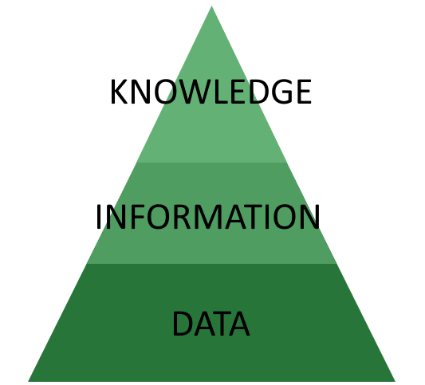
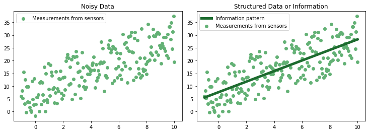
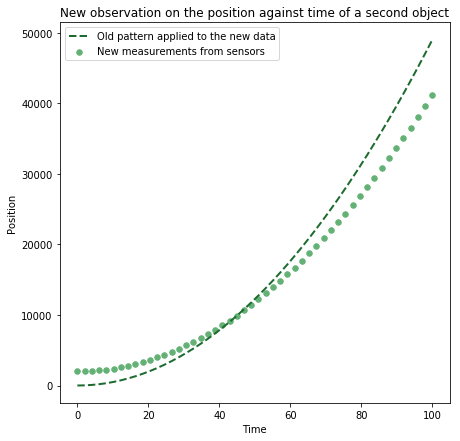
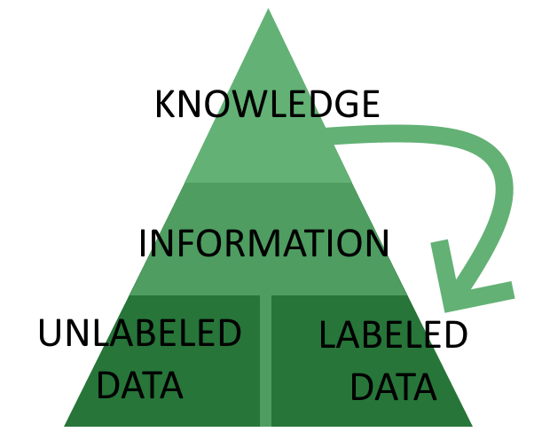
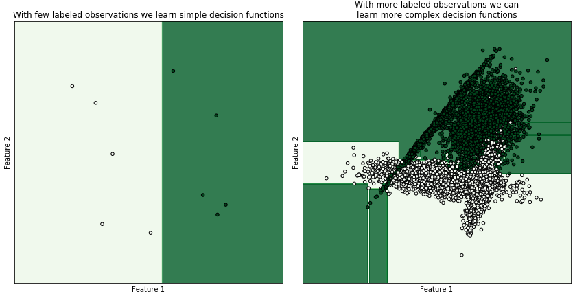

# [标签数据与非标签数据有何不同？](https://www.baeldung.com/cs/ml-labeled-vs-unlabeled-data)

[计算机视觉]

1. 概述

    在本教程中，我们将从一般原理的角度研究未标记数据和已标记数据之间的异同。

    教程结束时，我们将熟悉区分这两类数据的理论基础。我们还将了解，在解决任务时，何时应该使用其中一种数据，而不是另一种数据。

    我们在这里讨论的方法有点不常见。不过，它能让我们更深入地理解先验知识与数据收集工作之间的关系，以及二者相互影响的方式。

2. 关于数据、信息和知识

    我们将首先讨论一个关于如何构建通用人工智能系统的基本想法，并看看我们是否能从这个想法中推导出为该系统的某些数据贴标签的必要性。如果我们能做到这一点，那么我们就可以说，标注数据和未标注数据之间的区别并不是源于我们执行的具体任务。而是源于该系统架构的[贝叶斯先验]。

    1. 机器学习系统的概念架构

        人工智能系统开发的传统架构涉及数据、信息和知识之间的区别，以及随后将它们排列成层次结构：

        

        这种结构通常被称为 "[知识金字塔](https://www.igi-global.com/article/a-revised-knowledge-pyramid/99641)"或 "DIK金字塔"，其中的首字母缩写代表其组成部分的第一个字母。虽然这种理论方法在很[大程度上受到了批评](https://dl.acm.org/doi/abs/10.1145/3158421.3158427)，但它仍被普遍用作开发人工智能系统的共同概念参考。

        在这一模型中，我们设想人工智能系统通过将数据聚合为信息来理解世界，然后处理信息以提取知识，再利用这些知识指导后续的数据收集工作。

        现在，让我们将这一模型进一步分解为其基本组成部分。

    2. 数据和测量

        金字塔的最底层包含数据，它是连接机器学习系统与现实的基础。我们可以将数据理解为由传感器进行的测量或观察的集合，这些数据具有原始或难以表述的形式。

        数据的例子有：

        - 包含数字的矩阵
        - 文本字符串
        - 分类值列表
        - 音频频率采样
        在这种情况下，"数据"与数据结构中包含的值相对应。稍后我们将了解如何进一步区分本文所讨论的两类数据。

    3. 信息和数据聚合

        可以通过多种方式聚合数据，以便从中提取模式。模式与数据分布方式中的规律性相对应，可以通过对其施加数学或统计模型来进行检索：

        

        与数据中的规律性相对应的模式或方案通常被称为 "信息"。

        与原始数据相比，信息更能概括外部现实的复杂性，这也是我们将其置于金字塔更高层次的原因。看待同一观点的另一种方式是，信息，即数据的方案或模式，可以让人们对未来的测量结果进行预测，而数据本身则不能。

    4. 关于知识和信息

        一旦从一组数据中提取出模式，就可以利用这些模式来预测未来世界的状态，而这些状态是由系统的行为产生的。比方说，我们知道自由落体中的物体随着时间的推移其位置会发生变化，而在其位置与位置之间存在某种模式：

        
        确定自由落体的合适模式后，我们可以做两件事：

        - 预测自由落体的未来位置
        - 推动物体，使其以任意确定的速度下落

        然后，我们可以将提取这一特定模式时获得的知识推广到未来未见的情况中。在了解了自由落体物体的位置随时间变化的特定方式后，我们就可以将这一知识加以推广，并假设如果一个物体的位置随时间变化的方式与该模式充分对应，那么该物体也是自由落体的：

        
        最后，我们可以把所有属于同一类别的数据归为一类，因为它们代表了类似的现实世界现象。如果我们这样做了，就等于给数据贴上了标签，这样我们就能以可预测和已知的方式来处理数据。

    5. 知识与标签之间的关系

        在我们上文讨论的意义上，知识对应于对世界运行方式的先验假设。这种假设反过来又决定了我们对已经进行或尚未进行的测量所抱有的期望。

        当我们或机器学习系统进行数据收集时，我们可以利用这些知识来提前预测我们将检索到的数据的某些特征。这些特征来源于我们对世界或世界运行方式的一般知识。在这种情况下，我们可以说，我们从我们的知识中汲取了某些特征，并假定数据具有这些特征。

        我们也可以用贝叶斯术语来表达这一观点。具体做法是，关于传感器和测量数据特征的知识相当于完全相信，收集到的数据至少与其他类似情况下收集到的数据具有某些共同特征。这种知识将传感器接收到的未标记数据（原始数据）转化为由相关先验知识塑造的数据：

        
    6. 关于猫和狗的先验知识将无标签数据转化为有标签数据

        假设我们有两类图片，需要用卷积神经网络进行分类。还假设这两类图片分别是 "猫"和 "狗"。我们向[卷积神经网络](https://www.baeldung.com/cs/ml-relu-dropout-layers)展示的图片包含一个隐含的假设，相当于先验知识，即这些图片要么属于 "猫"类，要么属于 "狗"类。

        换句话说，从机器学习系统的角度来看，这一假设可以表述为 "在这个世界上，我所拥有的传感器提供的数据属于两个类别中的一个。因此，对于任何给定的图像，机器学习系统的先验知识或信念是：$P(cat \vee dog) = 1$。

        世界不一定是这样运转的，但机器学习系统中隐含的世界表征一定是这样建立的。从某种意义上说，也就是我们在本文中提出的观点，所有数据都是无标签数据。只有我们将先验知识赋予这些数据，它们才会变成有标签的数据。

3. 有标签数据和无标签数据

    至此，我们已经从世界知识和贝叶斯先验的角度讨论了区分有标签数据和无标签数据的理论基础。现在，我们可以看看这两类数据具有哪些技术特征。我们还将了解使用这两种数据可以完成哪些机器学习任务。

    1. 无标注数据

        在上述意义上，无标签数据是唯一存在的纯数据。如果我们打开一个传感器，或者睁开眼睛，对环境或世界的运行方式一无所知，那么我们就收集到了无标记数据。

        数字 n = 5 或向量 $x = \{2,9,3\}$ 或矩阵 $M = \begin{bmatrix} 3 & 1 & 5\\ 4 & 3 & 2 \end{bmatrix}$ 都是未标记数据的例子。之所以说它们是无标记数据，是因为我们不知道是哪个传感器收集了这些数据，也不知道这些数据是在什么样的世界中获取的。同样，我们也不需要了解这个世界的运行方式。

        从这个意义上说，我们几乎没有与无标签数据相关的先验知识。

    2. 有标签数据

        有标签数据是对世界运行方式有先验理解的数据。人类或自动标记器必须利用他们的先验知识为数据添加额外信息。然而，在我们进行的测量中并不存在这些知识。

        标签数据的典型例子有：

        - 一张猫或狗的图片，带有相关标签 "猫"或 "狗"
        - 产品评论的文字描述，以及用户对该产品的相关评分
        - 一栋待售房屋的特征及其售价

        我们在标记时必须使用的贝叶斯先验有时并不明显。我们可以问：一张猫的图片和 "猫"这个词怎么可能只被认为是相关的呢？

        这个问题的答案属于认识论范畴，不在本文讨论范围之内。不过，简而言之，我们可以指出这样一个观点，即一个系统所掌握的知识并不一定是绝对的或普遍的，但它只有在与该系统相关时才有意义。人类标记者需要根据自己的先验知识给图像贴上 "猫"的标签，这样才能贴上原本不存在的标签。

        在这种情况下，标注数据是我们叠加了额外贝叶斯先验的数据，而这种先验并不是测量的直接结果。这个先验源于人类或机器学习系统所掌握的知识。这些知识决定了数据应该是什么，无论它是或不是。

        我们根据这一先验得出的所有结论都与先验的有效性一样有效。这就是为什么在准备数据集时，准确标记是至关重要的一步。

4. 何时使用

    标记数据和非标记数据之间的区别很重要。这是因为有标签数据和无标签数据可以做不同的事情，而无标签数据则不可能。特别是，我们可以使用一些机器学习算法来处理有标签的数据，而使用另一些算法来处理无标签的数据。

    根据某些标准，我们最终会为我们的工作选择一种类型的数据，而不是另一种类型的数据。这些标准是

    - 任务类型
    - 任务的目标
    - 数据的可用性
    - 执行标记所需的一般知识和专业知识的水平
    - 决策功能的复杂性

    让我们更详细地了解它们。

    1. 任务类型

        有标签的数据允许进行回归和分类任务，这属于[监督学习](https://www.baeldung.com/kotlin-supervised-learning)任务的范畴。

        回归分析的典型任务包括通过多元或多变量回归预测未知值、确定映射两个变量之间关系的函数，以及对科学假设进行实证测试。

        分类涉及对观察结果进行类别归属。机器学习系统根据分配给标注训练数据的类别列表来进行分类。

        分类是通过计算机视觉和语音到文本系统进行实体识别的常见任务。在这些系统中，我们必须识别与特定输入相关的标签。这样，我们就能学会识别物体或单词，并给它们贴上适当的标签。

        无标签数据允许进行聚类和降维任务，这属于无监督学习的范畴。

        聚类是指识别具有共同特征的观察结果子集，例如在其所属的[向量空间中相互靠近](https://www.baeldung.com/cs/euclidean-distance-vs-cosine-similarity)。典型的聚类算法包括 [K-means](https://www.baeldung.com/java-k-means-clustering-algorithm)、K-NearestNeighbors 和 [DBSCAN](https://www.baeldung.com/cs/clustering-unknown-number#dbscan)。

        降维任务致力于[降低数据集的复杂度](https://www.baeldung.com/cs/ml-understanding-dimensions-cnn)，以限制后续处理所需的资源。这些技术包括主成分分析（[Principal Component Analysis](https://www.baeldung.com/cs/principal-component-analysis)），专门用于从数据集中提取一个简单的模型，以及该模型与原始数据集之间的误差。其他技术包括自动编码、特征选择和 t-SNE。

        无监督学习的另一个常见任务是[特征缩放](https://www.baeldung.com/cs/feature-scaling)，其目的是将数据集标准化或规范化，以方便神经网络的后续训练。这通常是将数据输入神经网络之前的一个步骤，目的是促进[梯度下降](https://www.baeldung.com/java-gradient-descent)学习。

    2. 任务目标

        我们区分所需数据类型的另一个标准是工作目标。

        无监督学习及其使用的相应无标记数据，可以纯粹根据数据集的定量特征来提取见解。由于无监督学习几乎不需要先验知识，因此与之相关的可能目标通常并不复杂。

        例如，它们可能涉及降低数据集的维度。通常，我们进行降维的目的是限制训练神经网络所需的计算资源。

        它们还可能涉及开发一种神经网络，将数据集编码为更高的抽象表示。我们称这类神经网络为 "自动编码器"。自动编码器本身没有附加功能，但我们可以将其与附加层串联起来，用于监督学习。

        监督学习通常有更多的目标。这是因为它假定对所研究的现象有更深入的了解。

        这些目标可能包括：

        - 识别图像中的物体
        - 预测股票价值
        - 根据 X 光扫描结果进行医学诊断

        所有这些目标都意味着数据集、模型和外部世界之间的关系，而这种关系并不局限于数学抽象。这种关系并不局限于数学抽象，而是基于这样一种认识，即世界的某些特征会影响其他某些特征。这种影响是以稳定和可预测的方式发生的，因此我们可以利用它在世界上运行。

    3. 数据的可用性

        最后一个重要标准涉及数据标签的可用性。由人工标记者对数据进行标记是一个非常昂贵的过程。事实上，它往往会盖过与机器学习系统开发相关的所有其他费用。

        这也非常耗时。一些[非常著名的图像标记器](https://www.cs.cmu.edu/news/google-inc-acquires-carnegie-mellon-spin-recaptcha-inc)运行成本非常低，但仍需要时间来收集足够大的特征和标签数据集。

        这意味着，一种数据的可用性往往是我们选择某项任务的原因。虽然并非不可能，但在实际操作中，我们往往不会抽象地选择一项任务，然后就开始收集数据。更常见的情况是，我们根据现有的数据集来选择任务。当然，这条规则也经常有例外。

    4. 人类标记者的一般知识与专业知识

        标签数据的可用性也会因标签中编码的知识是专业知识还是一般知识而发生重大变化。

        一般知识是我们可以实际期望任何人类标签拥有的知识。例如，它包括识别猫和狗图像的能力，如上面的例子。它还包括将音频或视频中的语音转录为文本格式的能力。

        为只需要一般知识的数据集贴标签通常成本很低，我们可以通过将任务外包给大众来完成。一个典型的例子就是手写数字的标记，大多数人都能做到。

        专业知识是只有经验丰富的专业人员才能掌握的知识。

        例如，它包括在 X 光扫描中识别骨折或牙科疾病。只有医学专家才能完成这项任务，并要求与其专业知识水平相符的薪酬。因此，对需要专业知识的数据进行标注的成本与该领域专家的平均工资成正比。

    5. 决策函数的复杂性与标注数据集的大小

        随着问题复杂度的增加，与标注相关的成本也会相应增加。机器学习需要学习的决策函数越复杂，系统需要的标注数据就越多。随着决策函数复杂度的增加，标注数据集也需要增大，以便更好地对决策空间进行采样：

        
        如果数据集中的聚类是强分离的，则可以用聚类来代替分类，但在这种情况下，执行分类任务所需的标注示例很少，因此本段讨论的条件无效。

5. 结论

    在本文中，我们研究了贝叶斯和信息论对有标签数据和无标签数据之间区别的解释。

    首先，我们建议将源自传感器或测量的所有数据视为一般非标记数据。如果这样做，我们就可以将有标签数据视为无标签数据，并在其中添加有关其结构或功能的先验知识。

    我们还看到了如何从机器学习系统架构的基本原理中推导出有标签数据和无标签数据之间的区别。有标签数据是根据对世界运行方式的假设而形成的数据。

    我们终于看到了选择二者的标准。这些标准主要包括任务的类型和目标，以及标记数据的可用性。
