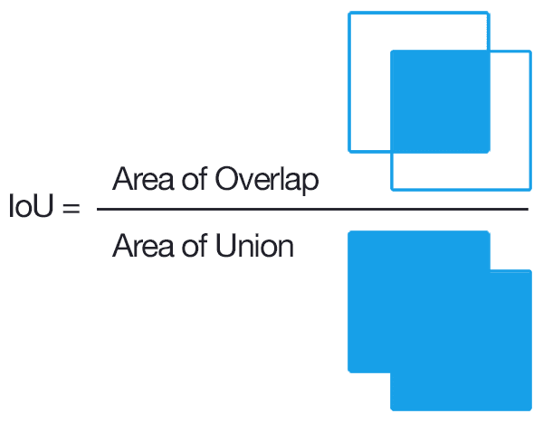

# 物体检测的平均精度

[计算机视觉](https://www.baeldung.com/cs/category/ai/computer-vision) [深度学习](https://www.baeldung.com/cs/category/ai/deep-learning)

[物体检测](https://www.baeldung.com/cs/tag/object-detection)

1. 概述

    在本教程中，我们将讨论用于评估物体检测模型的平均精度 (mAP) 指标。首先，我们将简要介绍物体检测任务。然后，我们将介绍重叠标准以及精确度和召回率指标。最后，我们将讨论如何计算最终的 mAP 指标。

2. 物体检测

    物体检测的目的是定位和识别图像中的物体。它是计算机视觉中最重要的任务之一，应用范围包括自动驾驶、安全、零售和医疗保健。一般来说，物体检测任务包括两个步骤：

    - 物体定位(Object localization)：我们要预测图像中一个或多个物体的位置，并在每个物体周围画一个边界框
    - 图像分类(Image classification)：我们要预测图像中每个物体的类别

    因此，物体检测系统将包含一个或多个物体的图像作为输入，并输出一个或多个边界框以及每个边界框的类别标签。物体检测任务也被称为物体识别。

    在下图中，我们可以看到一个物体检测系统的可能输出结果，如果输入是一幅描绘道路的图像。我们可以看到，该模型通过在六个物体周围画一个矩形，成功定位了它们，并将它们正确归入了各自的类别（红绿灯、卡车和汽车）：

    

    在过去几年中，许多深度学习模型被提出用于物体检测任务，并取得了令人振奋的性能，如 [R-CNN](https://en.wikipedia.org/wiki/Region_Based_Convolutional_Neural_Networks) 和 [YOLO](https://arxiv.org/abs/1506.02640)。为了评估它们的性能，我们需要定义一个合适的指标。

    作为指标的输入，我们有预测的边界框和预测的类别。如何将这些值与实际边界框和类进行一致的定量比较呢？评估物体检测器最常用的指标是平均精度（mAP）。

3. 重叠标准(Overlap Criterion)

    计算 mAP 的第一步是找出地面实况与预测边界框之间的重叠程度。最常见的重叠标准是 "交集大于联合"（Intersection over Union，简称 IoU），它以预测边界框 A 和地面实况边界框 B 为基础，计算出：

    \[\mathbf{IoU = \frac{A \land B}{A \lor B}}\]

    其中 $\mathbf{A \land B}$ 表示它们的交集，而 $\mathbf{A \lor B}$ 表示它们的联合。下图是 IoU 的定义示意图：

    

    我们观察到，IoU 的值介于 0 和 1 之间，0 表示完全没有重叠，1 表示预测边界框与地面实况边界框完全重叠。为了检查检测是否正确，我们需要定义一个阈值，该阈值能够考虑到预测中不会影响最终输出的小误差。通常，阈值等于 50%，当 $IoU(A, B) \geq 0.5$ 时，检测被认为是成功的。

    在下图中，我们可以看到在两个边界框中计算 IoU 的一些示例。只有在最后一种情况下检测才会成功：

    

4. 精确度和召回率

    现在我们有了判断检测是否成功的方法，我们可以将定位问题转换为二元分类问题，其中正类表示检测到物体。我们知道，在每个二元分类问题中，预测结果都可能是真阳性、假阳性、真阴性或假阴性，如下表所示：

    

    此外，我们还使用精确度和召回率来评估分类的性能：

    - 召回率衡量的是模型检测所有基本事实的能力：\[\mathbf{R = \frac{TP}{TP+FN} = \frac{\text{succesful detections}}{\text{all ground-truths}}}\]
    - 精度是指模型仅识别相关对象的成功率：\[\mathbf{P = \frac{TP}{TP+FP} = \frac{\text{succesful detections}}{\text{all detections}}}\]

    当然，我们希望模型具有高精确度和高召回率。为了兼顾这两个指标，我们使用精度-召回曲线（Precision-Recall Curve），它是不同概率阈值下精度（y 轴）和召回率（x 轴）的曲线图。

    我们计算平均精度（Average Precision，AP）的方法是对精度-召回曲线上的精度值取平均值，其中召回率范围为 $[0，0.1，...，1]$：

    \[\mathbf{AP = \frac{1}{11} \sum_i p(i)}\]

    其中 i 在 $i \in [0, 0.1, ..., 1]$ 范围内，$p(i)$ 表示召回率等于 i 时的精度值。

5. 平均精度（mAP）

    到目前为止，我们还没有讨论过检测的分类部分。我们不仅要计算每个对象的边界框，还要预测其类别。

    因此，我们要分别计算每个类别的 AP，最后得到 c 个 AP 值，其中 c 是类别数。我们的最终指标是 mAP，它等于所有类别 AP 值的平均值：

    \[\mathbf{mAP = \frac{1}{c} \sum_{i=1}^c AP_i}\]

    其中 $AP_i$ 是第 i 类的 AP 值。

6. 结论

    在本教程中，我们介绍了用于物体检测的 mAP 度量。首先，我们讨论了物体检测的任务，并定义了重叠标准以及精确度和召回度量。然后，我们讨论了如何计算 mAP 指标。
