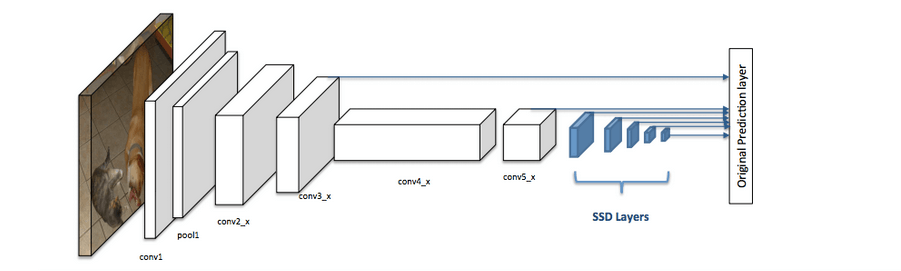
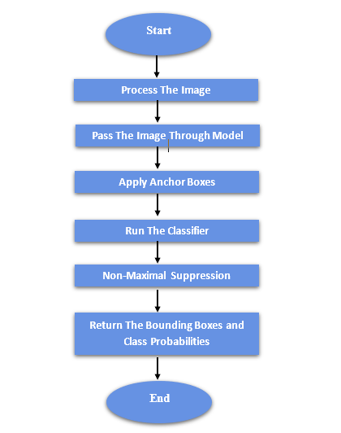

# 单发探测器（SSD）

[计算机视觉](https://www.baeldung.com/cs/category/ai/computer-vision) [深度学习](https://www.baeldung.com/cs/category/ai/deep-learning)

[神经网络](https://www.baeldung.com/cs/tag/neural-networks)

1. 简介

    简单地说，[物体检测](https://www.baeldung.com/cs/object-recognition-tasks-differences)是一种与计算机视觉和图像处理相关的计算机技术，主要用于检测数字图像和视频中某一类物体。每一类物体都有其独特的特征，例如，所有的圆都是圆形的。这些特殊属性可用于物体类别识别。例如，在寻找圆形时，会搜索与某一点（即中心）有一定距离的物体。同样，在搜索正方形时，需要搜索边角垂直、边长相同的项目。面部识别也采用了类似的方法，可以识别肤色、两眼间距以及眼睛、鼻子和嘴唇等特征。

    单次检测器（SSD）是执行这些任务时常用的一种高效方法。它们能够实时检测物体，因此在自动驾驶汽车、监控系统和机器人等应用中非常有用。

    在本教程中，我们将深入探讨 SSD 的理论细节，包括它的工作原理和优缺点。

2. 物体检测与分类

    计算机视觉中的图像分类是通过图像预测图像中的物体，而物体检测不仅能预测物体，还能通过边界框找到物体的位置。

    例如，当我们建立一个分类器对动物进行分类（猫、狗和鸭子）时，我们会获取一张输入图像并预测其中是否包含猫或狗，而对象检测模型还会告诉我们猫、狗或鸭子的位置。

    我们可以将物体检测方法分为

    - 两阶段方法： 这些方法首先生成一组区域建议，即图像中物体的可能位置，然后对每个区域内的物体进行分类。两阶段方法的例子包括 R-CNN 及其变体
    - 单阶段方法： 这些方法一次性直接预测整个图像中的物体位置和类别。单阶段方法的例子包括 [YOLO 和 SSD](https://www.baeldung.com/cs/object-detection-ssd-yolo)。

3. 单次检测器（SSD）

    随着深度学习的发展，物体检测得到了很大的改进，并广泛应用于自动驾驶汽车、监控系统和物体跟踪等许多实际应用中。这些算法通常利用预先训练好的深度神经网络（如卷积神经网络 ([CNN](https://www.baeldung.com/cs/ai-convolutional-neural-networks))），该网络已在注释图像的大型数据集上进行过训练，以学习物体检测所需的特征和表征。

    SSD 是一种流行且高效的物体检测方法。SSD 的主要特点之一是使用 CNN 来预测图像中物体的边界框和类标签。这与其他物体检测算法形成了鲜明对比，例如流行的 R-CNN 系列方法，它们使用多个网络和阶段来检测物体。使用单一网络可使 SSD 比其他方法更快、更高效。

    1. SSD架构

        一般来说，固态硬盘的架构通常由一个基础网络（如 [VGG](https://www.baeldung.com/cs/neural-network-backbone) 或 [ResNet](https://www.baeldung.com/cs/residual-networks)）组成，该网络在大型图像分类数据集（如 [ImageNet](https://papers.nips.cc/paper/2012/hash/c399862d3b9d6b76c8436e924a68c45b-Abstract.html)）上经过预训练。然后，在基础网络的基础上增加几个额外的层，称为 "额外层"。这些额外层负责检测不同尺度的物体，通常由卷积层和池化层组成：

        

    2. SSD的优缺点

        SSD的主要优点之一是速度快、效率高。由于固态硬盘使用单一网络，因此可以实时检测物体，适用于自动驾驶汽车和监控系统等应用。

        此外，由于 SSD 使用预先训练好的基础网络，因此可以利用大量标注数据来完成图像分类任务。这使得它们即使在相对较小的数据集上进行训练，也能达到很高的准确率。

        另一方面，SSD盘也有一些局限性。首先，它们的准确性不如其他方法，如 R-CNN 系列方法。这是因为使用单个网络意味着 SSD 无法利用多个网络提供的额外上下文和信息。

        SSD的另一个局限性在于，它对图像中物体的比例非常敏感。因为额外层的设计是为了检测不同比例的物体，所以 SSD 可能难以看到比训练数据集中的物体明显小或大的物体。

4. 单次检测器（SSD）流程

    如上所述，SSD 的整个架构。在本节中，我们可以对 SSD 的流程进行如下说明：

    

    流程图显示了执行固态硬盘任务所需的主要流程。因此，首先要对输入图像进行预处理，为模型处理做好准备。这可能涉及调整大小、规范化和数据增强等步骤。然后，预处理后的图像通过模型，获得代表图像高级抽象的特征图。

    图像通过模型后，锚点框或默认框将应用于特征图，为图像中的对象生成一组潜在的边界框。因此，分类器会在每个边界框上运行，以确定框内物体的类别。此外，为了消除重叠的边框并完善最终的边框集，还会应用 "非最大抑制"（Non-Maximal Suppression）技术。最后，一组边界框及其相应的类别概率将作为算法的输出返回。

5. 结论

    总之，单次检测器（SSD）是一种流行且高效的物体检测方法。它使用单个卷积神经网络（CNN）来预测图像中物体的边界框和类标签，因此比其他方法更快、更高效。
