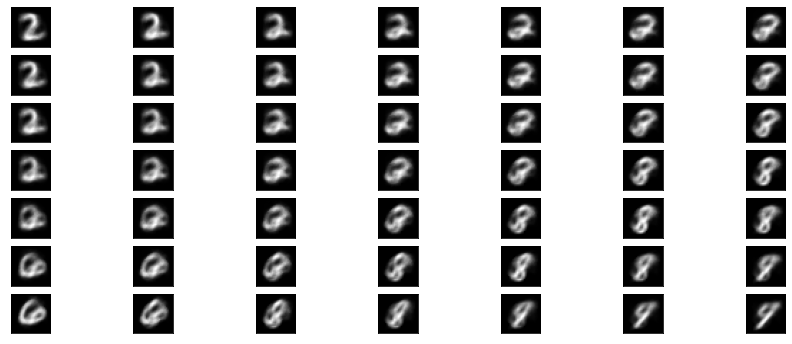
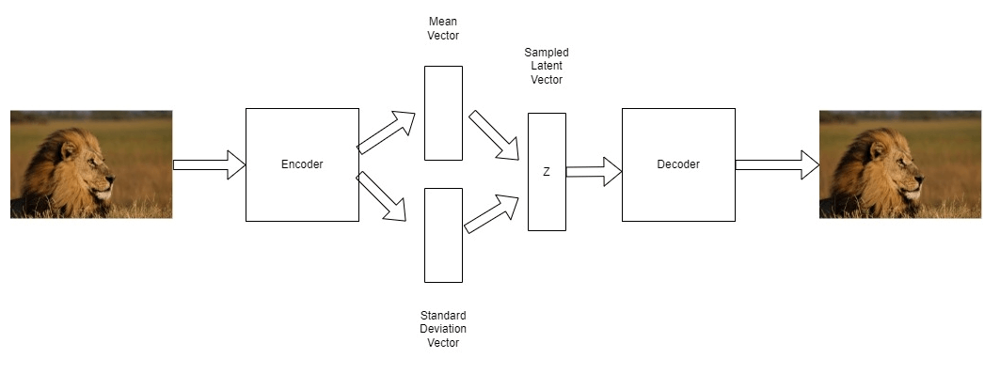
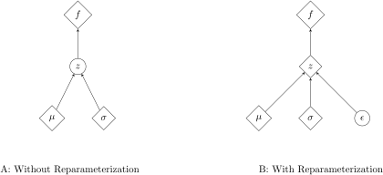

# 变分自动编码器中的重参数化技巧

[计算机视觉](https://www.baeldung.com/cs/category/ai/computer-vision) [深度学习](https://www.baeldung.com/cs/category/ai/deep-learning)

[神经网络](https://www.baeldung.com/cs/tag/neural-networks)

1. 简介

    自动编码器是一种强大的深度学习方法。它们主要用于预训练和生成建模，但也有其他用途。基本的自动编码器训练两个不同的模块，分别称为编码器和解码器。这些模块分别学习数据编码和数据解码。变异自动编码器提供了一种扩展，可以改进所学表示的属性，而重新参数化技巧对于实现这种改进至关重要。

    在本文中，我们将解释重参数化技巧、为什么需要它、如何实现它以及它的工作原理。首先，我们将简要介绍变分自动编码器（variational autoencoders, VAE）。然后，我们解释 VAE 为何需要重参数化技巧、该技巧是什么以及如何实施。在解释了该技巧的用途后，我们将正式证明其合理性。

2. 变异自编码器

    变异自编码器是基于神经网络模型的流行的基本无监督学习架构。变异自编码器通过创建更连续的嵌入空间，对普通自编码器进行了改进。

    1. 自编码器

        自动编码器由两个神经网络模块组成。其中一个模块，即编码器，接收输入数据并将其投射到新的嵌入空间中的另一个向量。第二个模块，即解码器，接收该向量并将其转换回原始输入。我们通过最小化原始输入和重建输出之间的差异来训练模型。这种基本格式被称为 vanilla 自动编码器。

        这种方法非常有效，许多图像都能被正确重建。在这种模式中，解码器充当了生成模型的角色。给定编码空间中的一个样本，我们应该能够生成一个可能存在的合理图像，即使我们以前从未见过导致这种编码的确切图像。

    2. 自动编码器：问题

        不幸的是，对于普通的自动编码器来说，情况并非如此，两种编码之间的线性样本并不能生成良好的样本。这是因为嵌入空间中存在不连续性，无法实现平滑过渡。

        我们在这里举例说明这种现象。对于 2 维嵌入，我们可以看到 2 和 9 之间的过渡。这样，X 轴就是 2 维向量嵌入的第一个元素与 9 维向量嵌入的第一个元素之间的线性插值。

        同样，Y 轴是 2 向量嵌入的第二个元素（也是最后一个元素，因为我们使用的是 2-D 嵌入）与 9 向量嵌入的第二个元素之间的线性插值：

        

        从图中可以明显看出，复制品在两个极端之间缺乏形态。VAE 将有助于缓解这一问题。

    3. 什么是 VAE？

        VAE 与普通自动编码器的区别在于它如何处理学习到的表示。它是由 Dietrich Kingma 和 Max Welling 在一篇[论文](https://arxiv.org/pdf/1312.6114.pdf)中提出的。

        VAE 学习高斯分布的参数： $\mu$ 和它的标准偏差 $\sigma$ 。然后利用这些参数从参数化分布中采样：

        

        在上图中，我们可以看到这一过程。编码器学会预测两个向量，即分布的均值和标准偏差。然后使用学习到的解码器对 z 进行解码。

    4. VAE 有什么问题？

        VAE 预测了分布的参数，然后用于生成编码嵌入。从我们的模型参数化的分布中采样的过程是不可微的。如果某样东西不可微，那就有问题了，至少对我们这种基于梯度的方法来说是这样。因此，我们需要某种方法，使我们的预测与随机采样元素分开。

3. 解决方案 重新参数化

    我们可以通过对嵌入函数应用重参数化技巧来解决这个问题。这意味着什么？就是重写我们的高斯采样参数化实现方法。现在，我们将随机取样视为一个噪声项。

    在高斯分布的情况下，我们将噪声视为标准正态分布。也就是说，高斯分布的均值为 0，方差为 1。这个噪声项现在独立于我们的模型，也不被我们的模型参数化。

    高斯分布的一个很好的特性是，要改变样本的均值和方差，我们只需将均值相加，再乘以方差即可。这样做的效果就是从我们的噪声分布中对样本进行缩放。这样做的好处是，现在对均值和方差的预测不再与随机抽样操作挂钩。这意味着我们现在可以再次对模型参数进行区分。

    1. 重新参数化的可视化

        如图所示，我们将模型形象化，并展示重新参数化后模型的变化。当 z 从参数化分布中随机取样时，我们会发现所有梯度都必须流经随机节点。相反，重新参数化则允许梯度路径通过非随机节点。我们将随机采样降级为噪声矢量，这就有效地将其与梯度流分离开来：

        

        利用这种直觉，我们可以有效地实现 VAE。

4. 实施诀窍

    之前，我们的模型 G 预测了高斯分布的参数，我们将其实例化，然后从中采样。现在，我们利用高斯分布的一个巧妙特性，从标准正态分布中采样。标准正态分布是均值为 $\mu = 0$、标准偏差为 $\sigma = 1$ 的高斯分布。

    这个高斯样本可以用我们预测的均值和方差进行缩放。现在，我们有了从固定的高斯分布中提取的样本，我们把 $\mu$ 加上，再乘以标准偏差 $\sigma$：

    (1)  \[\begin{equation*} z = \mu + \sigma \bigodot \epsilon \end{equation*}\]

    这种方法使用一个固定的噪声源，即我们从中采样的 $\epsilon$。一般来说，我们会将 $\epsilon$ 视为正态分布的样本。我们可以通过查看我们的新图表来了解这种方法的不同之处。

    现在，我们已经将随机元素从学习的参数化中分离出来，我们现在可以再次对模型进行区分。在下一节中，我们将深入探讨这些想法背后的数学原理，并证明我们的方法是正确的。

5. 证明方法的合理性

    现在我们可以深入探讨为什么这种方法有效，并能让我们通过模型所需的随机取样进行微分。

    我们对参数化高斯的导数感兴趣：

    (2)  \[\begin{equation*} \triangledown_{\theta}\mathbb{E}_{x \sim p_{\theta}(x)}[f(x)] \end{equation*}\]

    我们遇到的问题是，梯度是针对一个随机量，即由 $\theta$ 参数化的分布 p 取的。我们不能求一个随机量的梯度，所以我们需要重写它。下面，我们引入一些新的表示方法如下：

    (3)  \[\begin{equation*} \epsilon \sim q(\epsilon) \end{equation*}\]

    我们将 $\epsilon$ 表示为分布中的一个样本。这是噪声和随机性的来源。

    (4)  \[\begin{equation*} x = g_{\theta}(\epsilon) \end{equation*}\]

    我们把 x 写成噪声 $\epsilon$ 的 $\theta$ 参数化函数。这个函数的导数现在与噪声 $\epsilon$ 分开了，我们重写表达式，把期望移到导数之外：

    (5)  \[\begin{equation*} \begin{aligned} \triangledown_{\theta}\mathbb{E}_{x \sim p_{\theta}(x)}[f(x)] &= \triangledown_{\theta}\mathbb{E}_{\epsilon \sim q(\epsilon)}[f(g_{\theta}(\epsilon))]\\ &= \mathbb{E}_{\epsilon \sim q(\epsilon)}[\triangledown_{\theta}f(g_{\theta}(\epsilon))] \end{aligned} \end{equation*}\]

    这就是我们的函数 g，其中的 $\mu$ 和 $\sigma$ 是我们学习到的对输入 x 的预测。我们已经将随机性从我们学习到的函数中移除，现在我们可以通过它对 $\theta$ 进行微分。

6. 结论

    变异自编码器是一种强大的无监督学习架构。重参数化技巧(reparameterization trick )是一种强大的工程技巧。我们已经了解了它的工作原理，以及为什么它对变分自编码器有用。我们还从数学上证明了它的用途，并在直觉的基础上加深了对它的理解。

    更广泛地说，自编码器是机器学习中的一个重要课题。作为一种[生成模型](https://baeldung.com/cs/applications-of-generative-models)，自动编码器有无数重要用途，这也是其长期流行的原因。
