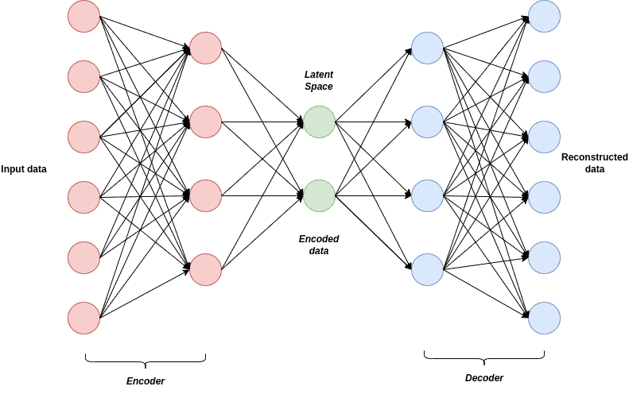
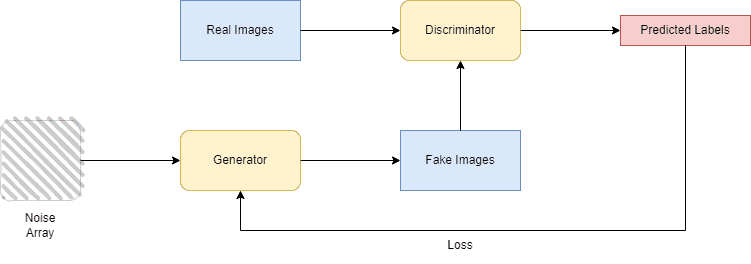

# [生成图像的 VAE 与 GAN](https://www.baeldung.com/cs/vae-vs-gan-image-generation)

计算机视觉

生成式对抗网络

神经网络

1. 简介

    在本教程中，我们将讨论两种流行的图像生成深度学习模型：变异自动编码器（VAE）和生成对抗网络（GAN）。首先，我们将简要介绍这两种方法，并主要讨论它们的区别。我们将讨论它们的优点和局限性，并提及它们在实际应用中的贡献。

2. 什么是变分自动编码器？

    变异自动编码器是一种强大的生成模型，由 [Diederik P. Kingma](http://dpkingma.com/) 和 [Max Welling](https://scholar.google.com/citations?user=8200InoAAAAJ&hl=en) 于 2013 年首次提出。一般来说，变异自编码器被广泛用作无监督模型，通过分析和检索输入数据的基本信息来生成高质量的图像。主要而言，VAE 是一种概率架构，由编码器和解码器网络两大方面组成。VAE 算法的架构及其两个主要部分如下：

    

    1. 编码器

        VAE 的第一个组件，即编码器，通常由神经网络架构（如前馈卷积网络）构建，负责学习和编码输入的表示并将其驱动到潜空间(latent space)中。此外，生成的潜空间通常是高斯分布的混合物。

    2. 解码器

        VAE 的第二个组成部分是解码器，也由卷积神经网络构成。编码器形成潜空间后，解码器的工作就是转换潜空间，以返回原始输入。因此，解码器的目标是通过最大化新创建图像相对于输入数据的可能性，生成一个尽可能代表输入的输出。

3. 什么是生成式对抗网络？

    生成对抗网络由 [Ian J. Goodfellow](https://arxiv.org/pdf/1406.2661.pdf) 于 2014 年首次提出。与 VAE 一样，生成式对抗网络也由两个主要部分组成，它们玩的是 “二人游戏”，试图学习输入数据的分布来生成新的合成数据。GAN 由生成器和判别器组成，两者相互竞争，同时进行训练。GAN 算法的结构如下。

    

    生成器的目的是从原始图像中生成带有随机噪声的合成图像，以欺骗鉴别器。

    鉴别器的目的是对生成器生成的图像进行分类，并判断它们是合成图像（假图像）、生成器生成的图像还是原始图像。

4. VAE 和 GAN 的区别

    虽然 VAE 和 GAN 设计和使用的主要原因都是图像生成，但它们的方法却大不相同。

    首先，VAE 和 GAN 的主要区别之一在于它们的训练方法，因为 VAE 的训练采用的是无监督方法，而 GAN 采用的是有监督技术。

    在训练阶段，VAEs 的目标是最大限度地提高生成输出相对于输入的概率，并通过将输入压缩到一个潜在空间来生成目标分布的输出。另一方面，GANs 则试图在生成器和判别器的双人游戏（前者试图欺骗后者）中找到平衡点。此外，VAE 的损失函数是 [KL-发散](https://en.wikipedia.org/wiki/Kullback–Leibler_divergence)，而 GAN 使用两个损失函数，分别是生成器和判别器的损失。

    此外，VAE 的训练通常比 GAN 简单，因为它们不需要在两个组件之间实现良好的同步。然而，一旦实现了这种平衡，GANs 就有可能识别出更复杂的输入信息，并生成比 VAEs 更高、更详细的可信数据。

    此外，由于其优越性，GANs 被用于超分辨率和图像到图像转换等要求更高的任务，而 VAEs 则被广泛用于图像去噪和生成。

5. VAE 和 GAN 的应用

    一般来说，生成模型在现实世界中的应用非常广泛。

    VAE 可用于图像生成、自然语言处理和异常检测。由于它们能够学习复杂的数据模式，因此可以轻松区分异常数据并识别潜在欺诈行为。事实证明，它们在医疗数据集中也很有用，可以检测出肿瘤和疾病等异常情况。

    另一方面，GANs 主要侧重于图像生成，可以生成与原始图像完全相同的高分辨率图像。它们还可用于音频和文本生成，创建前所未有的音频和文本。此外，GANs 还适用于图像编辑和数据增强。

6. 结论

    在本文中，我们介绍了 VAE 和 GAN，这是一种用于从真实数据创建合成数据的有监督和无监督框架。特别是，我们重点讨论了它们生成图像和数据的不同方法。
