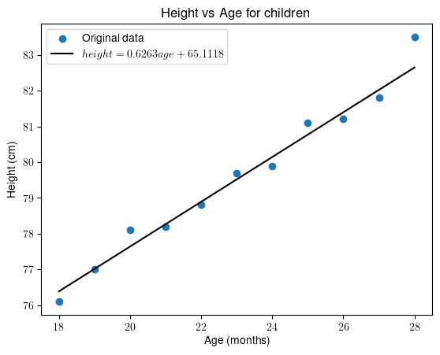
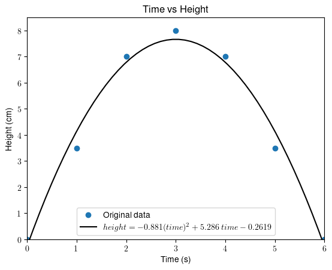

# 统计学相关与回归

[数据科学](https://www.baeldung.com/cs/category/ai/data-science)

[概率与统计](https://www.baeldung.com/cs/tag/probability-and-statistics)

1. 引言

    我们经常研究一个变量如何影响另一个变量。例如，我们可能想确定老年人患肺炎的几率是否高于年轻人，或者想知道房价是如何随卧室数量的变化而变化的。

    在本教程中，我们将讨论两个统计概念：相关和回归。虽然它们的共同目标都是研究变量之间的关系，但它们的方法和应用却各不相同。

2. 相关性

    [相关系数](https://www.baeldung.com/cs/correlation-coefficient)量化了两个变量之间的关联强度，并指明了它们之间关系的方向。

    例如，皮尔逊系数 r 的范围是-1 到+1。当 r 接近 1 时，变量之间存在正向的、强烈的线性关系：如果一个变量增加，另一个也会增加。

    另一方面，当 r 接近-1 时，变量之间的线性关系为负。这意味着，如果其中一个变量增加，另一个变量就会减少。最后，相关系数等于零表示变量之间没有线性关系。

    研究变量间的非线性依赖关系需要进行更复杂的分析，因此本文将不涉及。斯皮尔曼秩相关系数和 Kendall's tau 系数是能够反映非线性关系的系数。

3. 回归

    [回归](https://www.baeldung.com/cs/interpolation-vs-regression)估算因变量和自变量之间的函数关系。

    在线性回归的情况下，我们会得到一条与原始数据拟合的直线。回归方程描述了这条直线：

    \[y = ax + b\]

    在这个方程中，a 的值表示直线的斜率，b 表示直线在 y 轴上的截点。

    此外，回归还可以处理多个自变量 $x_1, x_2, \ldots, x_m$ 的情况：

    \[y = \alpha_0 + \alpha_1 x_1 + \alpha_2 x_2 + \ldots  + \alpha_m x_m\]

    在这个等式中，$\alpha_{0}$ 代表所有自变量都等于零时的 y-intercept （截距）。每个 $\alpha_{m}$ 代表相对于 $x_{m}$ 变化的 y 变化。

    我们还可以拟合非线性函数，例如

    \[y = a x^2 + b x + c\]

    为此，我们需要在拟合之前选择函数关系的形式。

4. 示例

    我们将通过两个例子来说明相关和回归的区别。

    1. 示例 1

        在第一个例子中，我们将孩子的年龄视为自变量，平均身高视为因变量：

        | Age (month) | Height (cm) |
        |-------------|-------------|
        | 18          | 76.1        |
        | 19          | 77.0        |
        | 20          | 78.1        |
        | 21          | 78.2        |
        | 22          | 78.8        |
        | 23          | 79.7        |
        | 24          | 79.9        |
        | 25          | 81.1        |
        | 26          | 81.2        |
        | 27          | 81.8        |
        | 28          | 83.5        |

        首先，我们来计算一下皮尔逊相关系数。对于这个数据，我们得到 r = 0.988。这表明，正如预期的那样，身高随着年龄的增长而增长。或者换句话说，这两个变量有很强的正线性关系。

        但是，如果我们要估算 32 个月大婴儿的预期身高，或者找到这种关系的数学形式，该怎么办呢？

        为此，我们需要回归。线性回归结果如下

        \[height = 0.6263 age + 65.1118\]

        直观：

        

        虽然我们无法将回归线与数据完美拟合，但显然拟合效果令人满意。

        通过设置年龄 = 32，我们得到身高 = 85.15。

    2. 例 2

        假设我们想模拟一个球投出后的轨迹。自变量是以秒为单位的时间，因变量是以厘米为单位的高度：

        | Time (s) | Height (cm) |
        |----------|-------------|
        | 0        | 0.0         |
        | 1        | 3.5         |
        | 2        | 7.0         |
        | 3        | 8.5         |
        | 4        | 7.0         |
        | 5        | 3.5         |
        | 6        | 0.0         |

        让我们先计算一下皮尔逊相关系数。然后，我们发现 r=0，这表明两个研究变量之间不存在线性关系。但是，如果我们绘制数据并拟合一个（二次）模型，我们就会看到明显的二次关系：

        

        由于存在[非线性](https://www.baeldung.com/cs/ml-linear-activation-functions)和非单调关系，传统的相关系数无法为数据提供任何启示。

        如果是严格的递增或递减关系（即单调关系），Spearman 或 Kendall's tau 系数可以轻松证明它们之间的相关性。

5. 总结

    让我们总结一下相关和回归的主要区别。

    | 相关性                | 回归                 |
    |--------------------|--------------------|
    | 一个数字               | 模型（公式）             |
    | 显示相关性的强度           | 描述因变量和自变量之间的关系     |
    | 无法预测新值             | 可对自变量的任何有效值进行因变量估计 |
    | 需要对非线性和非单调情况进行复杂分析 | 多项式回归通常可以处理非线性情况   |

6. 结论

    在本文中，我们讨论了相关和回归。它们提供了分析变量间关系的不同方法。

    相关系数是一个数字，表示两个变量之间的关系有多密切。相比之下，回归则是用一个实际的等式来描述这种关系，我们可以用它来估算因变量的值。

    我们应该记住，这些都是可以一起使用的工具。一旦我们开始处理一些数据，我们可以先计算相关系数。如果相关系数很高，我们就可以投入更多时间对数据进行线性模型拟合。

[Statistics: Correlation vs. Regression](https://www.baeldung.com/cs/correlation-coefficient-vs-regression-model)
