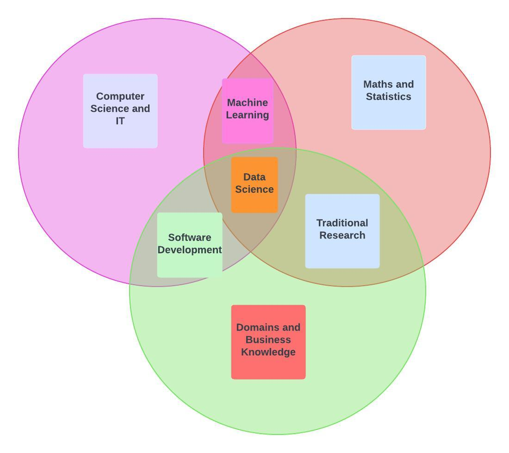
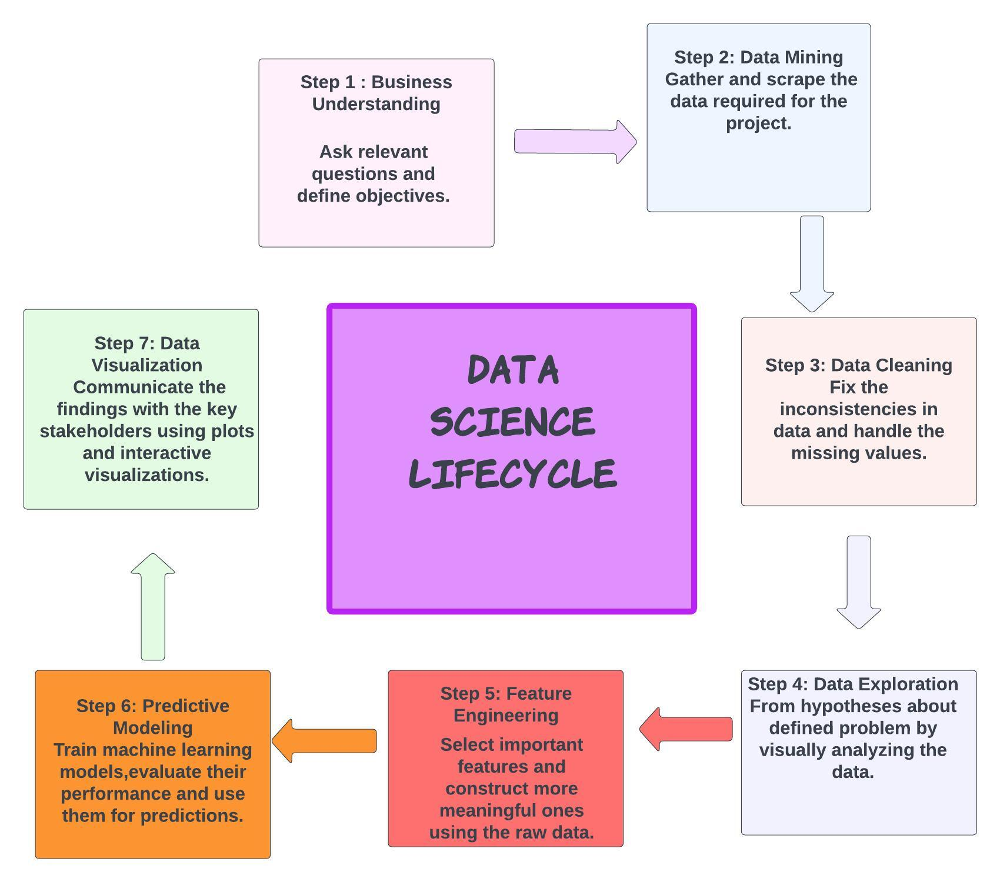
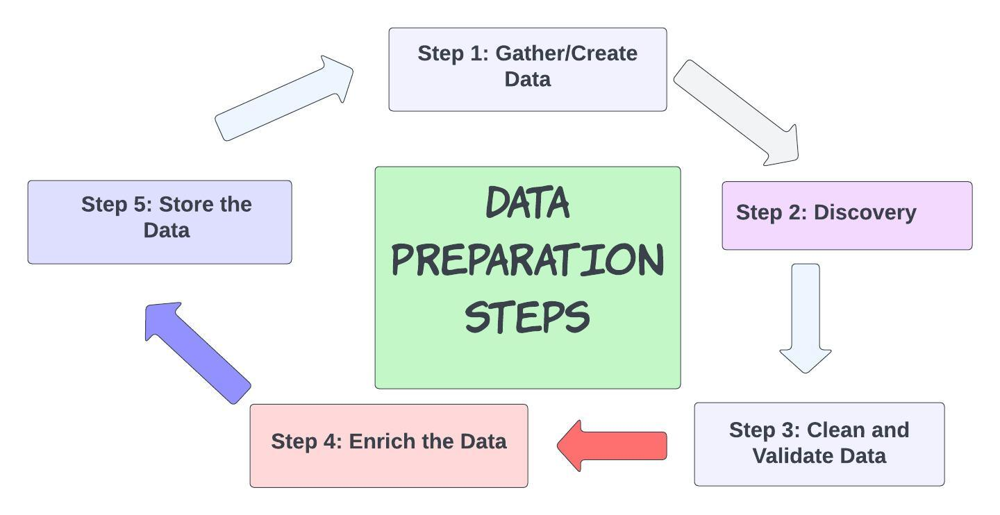
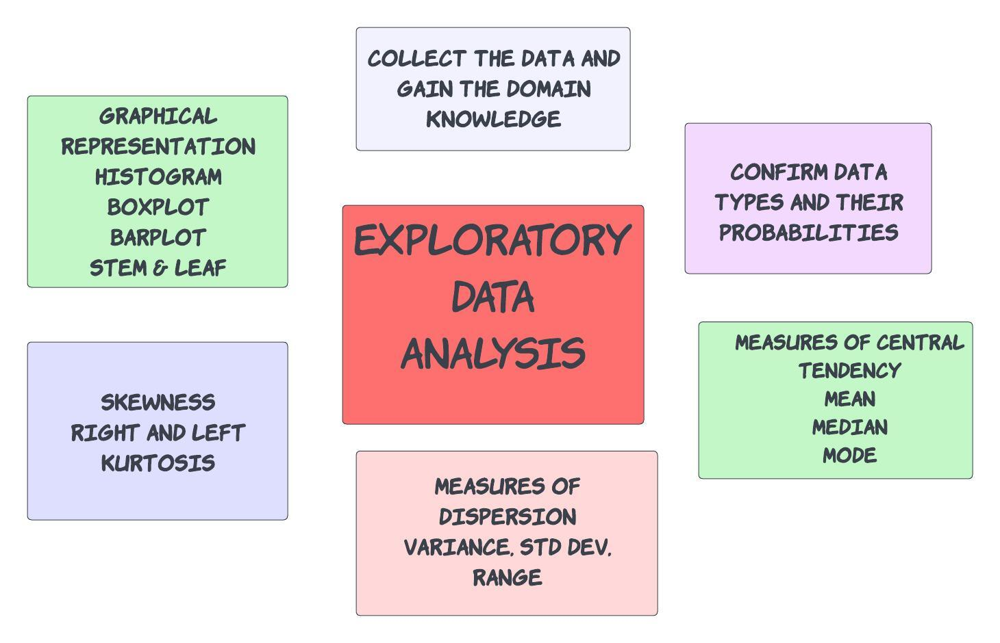
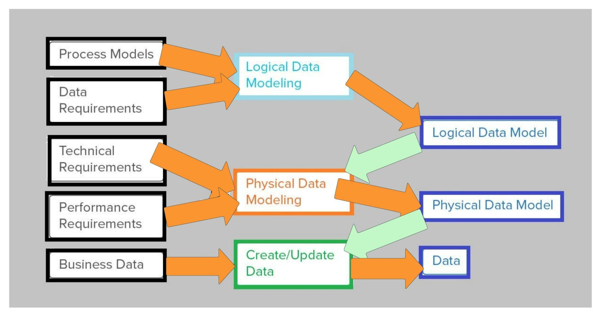
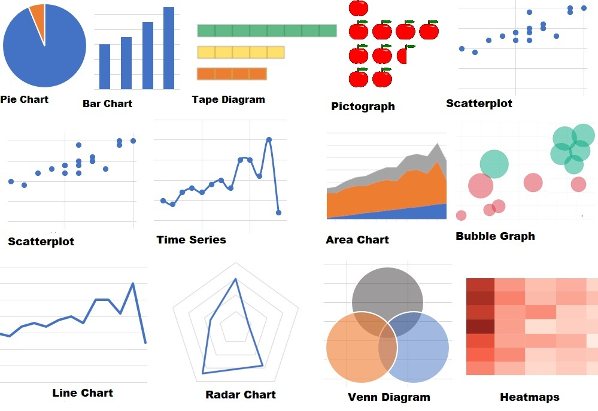
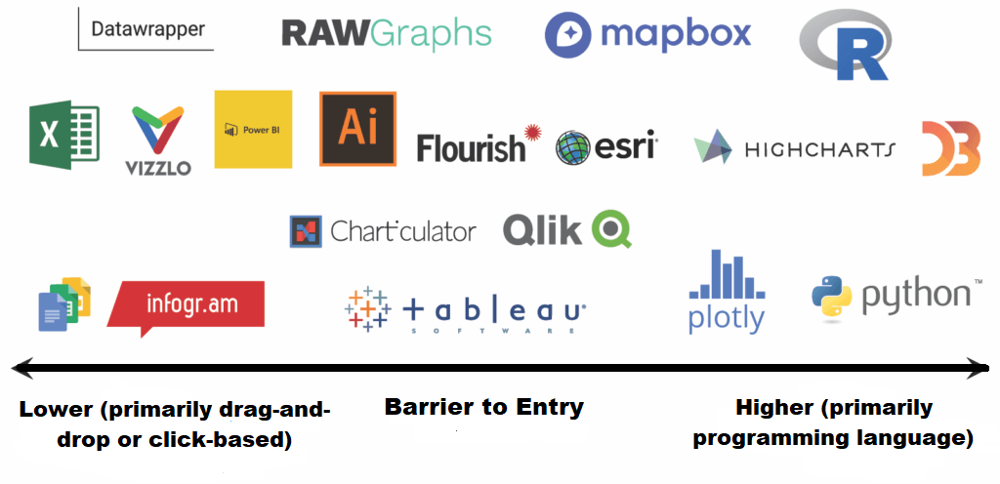

# 什么是数据科学？

[数据科学](https://www.baeldung.com/cs/category/ai/data-science)

1. 概述

    数据科学是一个跨学科领域，涉及从结构化和非结构化数据中提取见解和知识。它结合了数学、统计学、计算机科学和领域专业知识等元素，用于分析和解释复杂的数据集。

    在本教程中，我们将从数据科学的定义开始。然后，我们将发现数据科学的不同方面。

2. 数据科学

    [数据科学](https://towardsdatascience.com/introduction-to-statistics-e9d72d818745)是一个多学科领域，结合了统计分析、机器学习和计算机科学。它有助于从大型复杂数据集中提取有意义的见解和知识。这一计算机科学分支涉及应用各种技术、算法和工具来收集、组织、处理、分析和解释数据：

    

    数据科学的主要目标是发现数据中的模式、趋势和相关性，从而做出明智的决策和预测。

    数据科学家使用各种技术、工具和编程语言来收集、清理和预处理数据，然后再应用统计模型、机器学习算法和数据可视化技术来提取有意义的见解。

    数据科学包含各种活动，包括数据收集和存储、数据清理和预处理、探索性数据分析、特征工程、模型选择和训练、评估和验证以及结果交流。

    它通常用于金融、医疗保健、市场营销、电子商务、社交媒体等行业，以推动决策、改进业务流程并获得竞争优势。

    总之，数据科学旨在将原始数据转化为可操作的知识，从而推动数据驱动决策，解决复杂问题。

3. 数据科学的过程

    数据科学家利用他们在数学、统计学、编程和领域知识方面的专业知识，提出相关问题，设计实验，并创建能够处理和分析数据的模型。

    他们通常处理各种数据源，包括[结构化数据](https://www.baeldung.com/cs/text-mining)（如数据库和电子表格）和[非结构化数据](https://www.baeldung.com/cs/text-mining)（如文本、图像和视频）。数据科学还包括数据可视化技术，以清晰易懂的方式展示研究结果。生命周期如[下图](https://www.sudeep.co/data-science/2018/02/09/Understanding-the-Data-Science-Lifecycle.html)所示：

    

    数据科学生命周期

    第 1 步：业务理解

    提出相关问题并确定目标。

    步骤 2：数据挖掘

    收集和搜索项目所需的数据。

    第 3 步：数据清理

    修正数据中的不一致之处并处理缺失值。

    第 4 步：数据探索

    通过直观分析数据，对已定义的问题提出假设。

    第 5 步：特征工程

    选择重要特征，并利用原始数据构建更有意义的特征。

    第 6 步：预测建模

    训练机器学习模型，评估其性能并用于预测。

    第 7 步：数据可视化

    利用图表和交互式可视化与主要利益相关者交流研究结果。

    1. 业务理解

        业务理解是数据科学和分析项目的关键步骤。它涉及全面了解组织或企业面临的具体挑战或机遇，以及数据分析如何帮助解决这些问题。这需要数据科学家与利益相关者合作，以确定问题、设定明确的目标，并使分析与业务目标保持一致。

        有了对业务的了解，数据科学家就能设计和执行数据分析项目，从而有针对性地应对挑战，实现组织目标。这能确保分析重点突出、具有相关性，并与企业的战略目标保持一致。

    2. 数据采集

        数据获取是指从各种来源收集或获取原始数据，以便在数据驱动项目中进行分析和进一步使用的过程。它涉及从数据库、文件、传感器、网络 API、社交媒体平台或手动数据录入等不同类型的来源获取数据。

        数据采集是数据科学生命周期中至关重要的一步，因为它为后续的数据探索、分析和建模奠定了基础。在数据驱动的项目中，必须获取高质量的相关数据，才能获得准确的见解并做出明智的决策。

    3. 数据准备

        [数据准备](https://www.fieldengineer.com/blogs/data-preparation)也称为数据预处理或数据清理，是将原始数据转换和结构化为干净可用的格式以便进一步分析的过程。这涉及一系列任务，旨在提高数据质量、解决缺失值、处理异常值、实现格式标准化，以及为建模或分析做好数据准备：

        

        数据准备步骤

        - 步骤 1：收集/创建数据
        - 步骤 2：发现
        - 第 3 步：清理和验证数据
        - 第 4 步：丰富数据
        - 第 5 步：存储数据

        数据准备的目的是确保数据的准确性、一致性和适合分析的格式。正确的数据准备可提高后续建模、分析和决策过程的有效性和可靠性。它在数据科学和机器学习项目中起着至关重要的作用，因为数据的质量和准备工作会对分析结果和见解产生重大影响。

    4. 探索性数据分析

        解释性数据分析，又称探索性数据分析（exploratory data analysis, [EDA](https://www.geeksforgeeks.org/what-is-exploratory-data-analysis/)）。这一步骤是数据分析过程中至关重要的第一步。它涉及对数据进行检查和可视化，以获得洞察力、了解模式并确定变量之间的关系。EDA 的主要目的是发现数据的潜在结构，并为进一步研究提出假设。

        在解释性数据分析过程中，数据科学家使用统计和图形技术来总结和探索数据。

        

        EDA:

        - 收集数据并获得领域知识
        - 确认数据类型及其概率
        - 衡量中心/中心测量
        - 趋势
        - 平均值
        - 中值
        - 模式
        - 离散度量
        - 方差
        - 范围
        - 偏度左右峰度
        - 图示
        - 柱状图
        - 方框图
        - 条形图
        - STEM & LEAF

        解释性数据分析有助于数据科学家更好地了解数据特征，识别潜在问题或偏差，并为后续建模和分析步骤提出假设。它在指导数据驱动型项目的方向以及为更高级的分析技术奠定基础方面发挥着至关重要的作用。

    5. 数据建模

        [数据建模](https://www.alteryx.com/blog/what-is-data-modeling)是在特定领域内创建数据及其关系的概念表示的过程。它包括设计一种结构化和有组织的数据表示，以促进信息的理解、分析、高效存储和检索。数据建模是开发数据库、数据仓库或数据系统的蓝图：

        

        数据建模可确保数据库系统的数据完整性、一致性和准确性。它有助于以符合业务要求的方式组织和构建数据，并实现高效的数据存储、检索和操作。由此产生的数据模型是在各种应用程序和系统中进行数据库设计、开发和实施的基础。

    6. 数据可视化

        [数据可视化](https://www.polymersearch.com/blog/data-visualization)是使用图表、图形、地图或交互式可视化等可视化元素对数据和信息进行图形化表示。这一步骤包括将原始数据转化为易于理解、解释和交流的可视化表示：

        

        以下是数据可视化的几个关键方面：

        - 视觉呈现： 选择适当的可视化元素来有效地表示数据。这包括条形图、折线图、散点图、饼图、热图、树状图、网络图、地理空间图或交互式可视化。
        - 数据映射： 将数据属性映射为位置、长度、角度、大小、颜色或形状等可视化属性。这有助于传达数据中的信息和模式。例如，在条形图中将数值映射为条形的高度，或在饼图中将不同类别映射为不同颜色。
        - 探索和分析： 使用可视化方法探索和分析数据，识别模式、趋势或关系，并获得深刻见解。可视化可以揭示隐藏的模式、异常值或相关性，而这些在原始数据中可能并不明显。
        - 交流和讲故事： 利用可视化技术向更多受众有效传达研究结果、见解和叙述。精心设计的可视化可使复杂的数据更易于获取、参与和理解，从而使利益相关者更容易掌握和解释信息。
        - 交互式可视化： 创建交互式可视化可以让用户动态地探索数据，并与可视化元素互动。缩放、过滤、排序或工具提示等互动功能可为用户提供更有吸引力和个性化的数据互动体验。
        - 仪表盘和信息图表： 设计数据仪表盘或信息图表，将多种可视化和数据摘要结合起来，提供复杂信息的全面概览。仪表盘和信息图使用户能够全面了解数据，并高效地做出数据驱动的决策。
        - 设计原则： 应用色彩理论、排版、布局和视觉层次等设计原则，创建具有视觉吸引力且有效的可视化效果。设计选择会影响可视化的可读性、清晰度和影响力。

        数据可视化中常用的工具如下图所示。这些工具根据易用性和所需的编程语言技能进行了分类：

        

        数据可视化在数据分析、探索性数据分析（EDA）、讲述数据故事和决策过程中发挥着至关重要的作用。它有助于以更易于理解和更具影响力的方式传达洞察力、模式和趋势，从而实现以数据为导向的故事讲述，并加强以数据为导向的决策过程。

    7. 数据部署

        数据部署是指将数据驱动的模型、算法或洞察力实施和整合到运营系统或决策流程中的过程。它涉及将数据分析或机器学习模型的结果在组织或应用中投入实际使用。

        数据部署的一些关键方面包括模型实施、系统集成、自动化和可扩展性、监控和维护、安全和隐私、文档和支持。

        数据部署是数据科学生命周期中的一个关键阶段，因为它是数据分析与实际应用之间的桥梁。成功的数据部署可确保数据驱动型解决方案的优势得以实现，从而改进决策、提高运营效率并产生有价值的业务成果。

    8. 数据维护

        数据维护是指在数据的整个生命周期内，对其进行管理、更新并确保其质量和完整性的持续活动和流程。它涉及各种任务和实践，以长期保持数据的准确性、一致性和可用性。

        数据维护的主要方面包括数据质量监控、数据更新、数据归档、数据安全、数据备份和恢复、元数据管理、数据保留和删除。

        数据维护可确保数据的可靠性、一致性和长期可用性。通过积极管理和维护数据，组织可以依靠准确和最新的信息进行决策、报告、分析和其他数据驱动的活动。

4. 数据科学使用案例

    数据科学在各行各业都有广泛的使用案例。数据科学的多功能性使其能够适应几乎所有可用数据的领域，以应对特定的挑战和机遇。下面是一些常见的例子：

    - 欺诈检测： 数据科学可用于开发检测欺诈活动（如[信用卡欺诈](https://dx.doi.org/10.2139/ssrn.4412674)、保险欺诈或身份盗窃）的模型。通过分析交易数据中的模式和异常现象，数据科学家可以建立算法，标记可疑活动，帮助防止经济损失。
    - 推荐系统： 许多在线平台，如电子商务网站、流媒体服务和社交媒体平台，都使用由数据科学驱动的[推荐系统](https://labelyourdata.com/articles/movie-recommendation-with-machine-learning#:~:text=The%20primary%20goal%20of%20movie,user%20from%20the%20system's%20database.)。这些系统分析用户行为、偏好和历史数据，为用户提供个性化的推荐、产品或内容。
    - 医疗保健分析： 数据科学通过分析电子健康记录、医学影像数据、基因组数据和其他医疗保健相关数据源，在医疗保健领域发挥着至关重要的[作用](https://www.sciencedirect.com/science/article/pii/S2665917422002392)。它可用于疾病诊断、治疗预测、患者监测、药物研发和优化医疗保健运营。
    - 自然语言处理（NLP）： NLP 技术可用于各种应用，如[情感分析](https://www.researchgate.net/profile/Rezzy-Caraka/publication/355885525_Mining_netizen%27s_opinion_on_cryptocurrency_sentiment_analysis_of_Twitter_data/links/61828a5a3c987366c31f7e3a/Mining-netizens-opinion-on-cryptocurrency-sentiment-analysis-of-Twitter-data.pdf)、聊天机器人、语言翻译、文本摘要和信息提取。数据科学使机器能够理解和生成人类语言，从而改善了众多行业的交流和自动化。
    - 图像和视频分析： 包括计算机视觉和深度学习在内的数据科学技术被用于[图像和视频分析任务](https://www.hindawi.com/journals/scn/2022/1918379/)。应用范围从面部识别、物体检测、自动驾驶汽车到监控系统、质量控制和医学成像分析。
    - 预测性维护： 数据科学可通过分析传感器数据、设备日志和历史维护记录实现[预测性维护](https://www.researchgate.net/profile/Ozlem-Kilickaya/publication/344711796_Fault_Detection_of_Bearings_with_time_Series_Analysis_A_Pilot_Study_Ozlem_Gulsum_Kilickaya/links/5f8ae21792851c14bccc71c1/Fault-Detection-of-Bearings-with-time-Series-Analysis-A-Pilot-Study-Ozlem-Gulsum-Kilickaya.pdf)。通过应用机器学习算法，企业可以预测机器或组件何时可能发生故障或需要维护，从而实现主动维护并减少停机时间
    - 能源优化： 数据科学应用于[能源管理](https://www.sciencedirect.com/science/article/pii/S0360544222024616)，以优化能源消耗、降低成本并提高可持续性。这包括分析能源使用模式、天气数据和建筑物特征，以确定提高能效的机会
    - 需求预测： 零售商和供应链公司利用数据科学准确[预测](https://assets.researchsquare.com/files/rs-2439421/v1_covered.pdf?c=1672995319)产品需求。通过分析历史销售数据、市场趋势、天气模式和其他相关因素，企业可以在库存管理、生产规划和定价策略方面做出明智的决策。
    - 客户流失预测： 通过分析[客户行为](https://ieeexplore.ieee.org/stamp/stamp.jsp?arnumber=7359318)、使用模式和历史数据，数据科学可以帮助识别可能流失或停止使用产品或服务的客户。这样，企业就能采取积极措施，通过有针对性的营销活动或改善客户体验来留住客户。
    - 社交媒体分析： 数据科学技术有助于从[社交媒体数据](https://www.sciencedirect.com/science/article/pii/S0268401217308526?via%3Dihub)中提取有价值的见解，包括情感分析、主题建模、趋势检测和影响者识别。企业可利用这些洞察力了解客户意见、跟踪品牌声誉并定制营销策略。

    以上只是几个例子。然而，数据科学在金融、交通、制造、体育分析、环境监测等领域还有许多其他应用。

5. 结论

    数据科学应用于各个行业和领域，包括金融、医疗保健、市场营销、社会科学、网络安全等。在当今数据驱动的世界中，数据科学对于获得竞争优势至关重要。

    在本教程中，我们首先介绍了数据科学的定义。然后，我们发现了数据科学的不同方面。

[What Is Data Science?](https://www.baeldung.com/cs/data-science)
