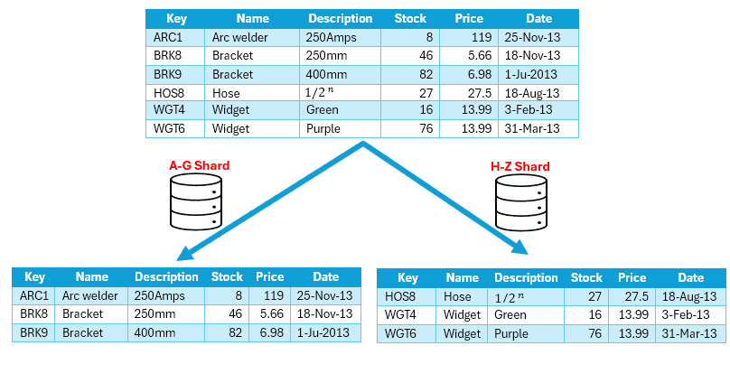
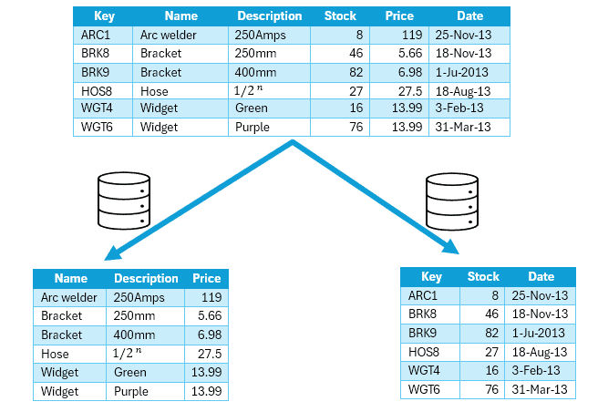

# [数据库中的横向和纵向分区](https://www.baeldung.com/cs/databases-horizontal-vertical-partitioning)

1. 简介

    数据库在现代应用中发挥着至关重要的作用，可以高效地存储和管理大量数据。同样，水平分区和垂直分区是管理数据库数据的两种常用技术。

    在本教程中，我们将深入探讨这两种方法的区别。

2. 分区的作用

    对于现代数据库来说，分区是不可或缺的，尤其是在面对大数据、云计算和实时应用时。随着数据量呈指数级增长，分区提供了一个重要的解决方案，它将数据分布在多个服务器或节点上，从而促进了横向可扩展性并缓解了性能瓶颈。

    此外，这种方法不仅能通过分散工作量优化查询性能，还能提高云环境中的资源利用率和成本效益。分区还能确保实时应用的高可用性和响应速度，降低单点故障风险，实现并行数据处理。

    从本质上讲，分区是现代数据库管理的基石策略，可帮助企业有效管理数据增长，实现可扩展性，并满足当今数据驱动型环境的苛刻要求。

3. 横向分区

    这种技术也称为[分片](https://www.baeldung.com/cs/database-sharding-vs-partitioning)，是指根据行将数据库表划分为多个分区，每个分区包含原始表中行的子集。

    假设我们有一个熙熙攘攘的[电子商务平台](https://en.wikipedia.org/wiki/E-commerce)，管理着如下大量产品：

    

    在这种方法中，产品库存数据会根据产品关键字被分割成多个分区。想象一下，按字母顺序将产品整齐地分成几个小组。此外，每个分片负责处理特定的产品，如从 A 到 G 或从 H 到 Z 的产品。

    这种智能分片技术将工作量分散到多台计算机上，减轻了压力，成倍提高了性能。

4. 垂直分区

    [垂直分区](https://www.baeldung.com/cs/scaling-horizontally-vertically)是指根据列将数据库表分割成多个分区。此外，每个分区都包含原始表中列的子集。

    让我们换个角度，考虑在产品库存场景中使用垂直分区。这种方法需要将数据库表划分为多个分区，这次不是按行划分，而是按列划分，具体如下：

    

    在这个示例中，物品的不同属性存储在不同的分区中。一个分区存储的是访问频率较高的数据，包括产品名称、描述和价格。另一个分区存储库存数据：库存数量和最后订购日期。

    这种技术可以减少每次查询所检索的数据量，从而优化查询性能。

5. 主要差异

    下表从数据分布、可扩展性、查询性能和各自的使用案例等方面对水平分区和垂直分区进行了清晰的比较：

    |主要区别 |水平分区 |垂直分区|
    |-|-|-|
    |数据分布 |根据行将数据分布到多个分区 |根据列划分数据，将相关列分组|
    |可扩展性 |通过将数据分布到多个服务器或节点来提高可扩展性 |通过减少每个分区的大小来提高可扩展性，从而提高查询效率|
    |查询性能 |可通过在多个节点上分配工作负载来提高查询性能 |可通过减少每次查询检索的数据量来提高查询性能|
    |用例 |适用于需要分布在多个服务器上的大型数据集的应用 |通过减少检索列的数量，有利于优化查询性能 |

6. 工具和框架

    各种工具和框架都支持数据库管理系统（[DBMS](https://www.baeldung.com/cs/microservices-db-design)）中的分区。Oracle 和 SQL Server 等专有解决方案提供了强大的分区功能，允许用户根据范围、列表或散列等标准对表进行分区。

    此外，[MySQL](https://www.baeldung.com/java-connect-mysql) 和 [PostgreSQL](https://www.baeldung.com/spring-boot-postgresql-docker) 等开源数据库通过表继承和声明式分区等功能提供分区功能。[MongoDB](https://www.baeldung.com/java-mongodb) 等 [NoSQL](https://www.baeldung.com/spring-boot-nosql-database) 数据库提供分片机制，可跨集群进行水平分区。此外，Amazon Aurora 和 Google Cloud Spanner 等基于云的平台将分区功能集成到其可扩展架构中。

    这些选项可满足不同需求，实现数据库的高效管理和可扩展性。

7. 结论

    总之，水平分区按行分布数据，而垂直分区按列划分数据。通过采用适当的策略，企业可以有效地管理和扩展数据库，以满足现代数据驱动型应用的需要。
