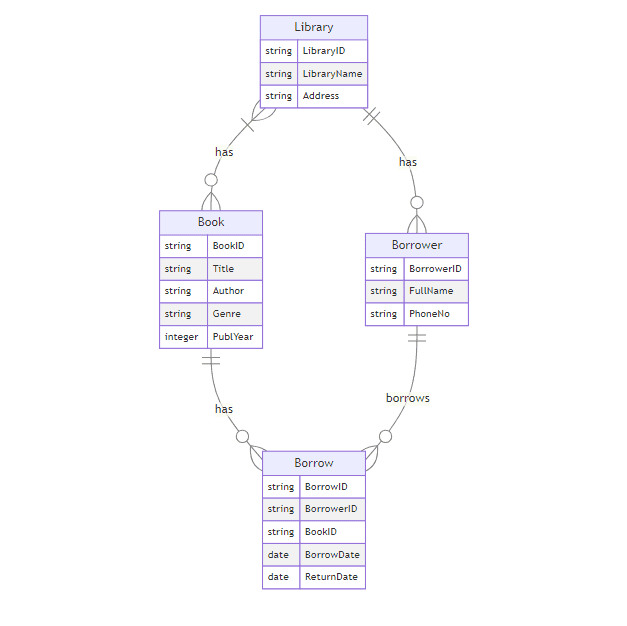
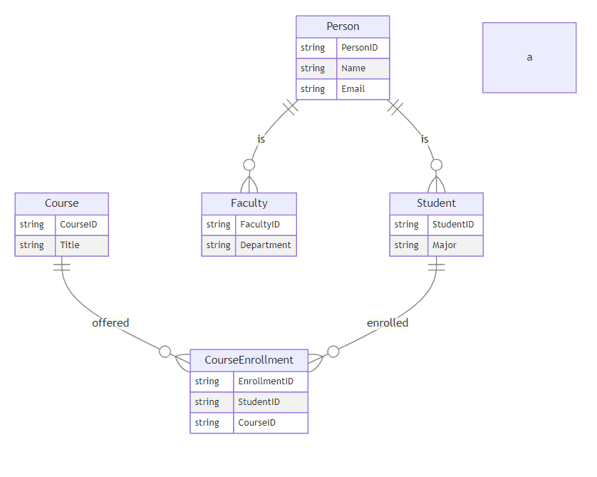

# [ER 与 EER 图表](https://www.baeldung.com/cs/enhanced-vs-entity-relationship)

1. 简介

    在本教程中，我们将探讨 ER 图和 EER 图。这些图是数据库设计和建模中逻辑结构和关系的可视化表示。ER 图和 EER 图是描述数据实体及其关系的常用技术。这两种图的作用类似。

    此外，在对[复杂的数据结构](https://www.baeldung.com/cs/advanced-data-structures)和层次结构进行有效建模时，EER 图提供了更多的特性和功能。

2. ER 图

    实体-关系（ER）图是[数据库](https://www.baeldung.com/cs/database-table-column-naming-conventions)设计中使用的图形表示法，用于对系统内实体的结构和关系进行建模。

    [ER 图](https://www.baeldung.com/cs/erd)由 Peter Chen 于 1979 年首次提出，通过说明实体、属性和它们之间的关系，ER 图仍然是设计数据库的蓝图。

    ER 图由三个主要部分组成：实体、属性和关系：

    

    1. 实体

        在数据库中，系统实体代表基本对象或概念。

        在上面的 ER 图示例中，实体包括 Library、Borrower、Book 和 Borrow。图中的每个矩形代表一个实体。

    2. 属性

        属性是描述实体的特征或属性。例如，图书馆实体具有 LibraryID、LibraryName 和 Address 属性。在图中，属性被描绘成与各自实体矩形相连的椭圆形。

    3. 关系

        关系表示实体之间的关联或连接，描述实体如何相互作用或相互关联。例如，"有"（has）关系将 "图书馆"（Library）与 "借阅者"（Borrower）连接起来，表明 "图书馆"（Library）实体可以关联一个或多个 "借阅者"（Borrower）实体。同样，has 和 borrows 等关系描述了 Library、Borrower、Book 和 Borrow 实体之间的交互。

        ER 图是捕捉数据库基本结构（如实体、实体属性和实体间关系）的有效工具。但是，它们不能表示某些高级概念和数据层次，而这在复杂系统建模中可能是至关重要的。

3. EER（增强实体-关系模型）图

    简单地说，EER（增强实体关系模型）图是在 ER 图的基础上发展起来的。ER 图有其局限性，因此开发了 EER 图，以提供更全面的数据建模方法。EER（增强实体-关系模型）图包含了一些关键功能，可以更直观、更准确地表达现实世界中的各种情况。

    让我们考虑一个大学数据库。我们有一个名为 "人"（Person）的基本实体，我们将属于这所大学的人的所有通用信息都与该实体相关联。个人是一个基础实体，具有所有个人的共同属性。

    此外，两个专门实体--学生和教师--继承了 Person 实体的属性。不过，这两个实体也有自己的一些独特属性。

    除了这两个实体，还有一个弱实体 CourseEnrollment，它取决于学生和课程之间的关系。实体 Course 代表大学提供的课程。
    CourseEnrollment 是一个弱实体，因为它的主键包括 Student 和 Course 的主键。只有当学生和课程之间存在关系时，它才能存在：

    

    上图通过"人"、"学生"和"教师"之间的关系描述了继承层次结构。此外，它还说明了弱实体 CourseEnrollment 及其对 Student 和 Course 的依赖关系。

    EER 图表的主要特征包括：特化/泛化(Specialization/Generalization)、属性继承(Attribute Inheritance)、关系属性(Relationship Attributes)、心量比(Cardinality Ratios)以及复合(Composite)和多值属性(Multi-valued Attributes)。

    1. 特化/泛化类别

        增强实体-关系模型（EER）图引入了特化和泛化的概念，从而可以表示继承层次。这意味着被称为 "泛化实体" 的父实体可以拥有被称为 "特化实体" 的子实体。

        此外，专门实体继承了父实体的属性和关系，从而更容易模拟现实世界中某些类型的实体具有共同特征的情况。

        例如，在大学系统中，"雇员"实体可能是父实体，而"教授"和"管理员"等专门实体则是其子实体。

    2. 类别(Categories)

        EER 图表还包含类别的概念，它提供了一种根据特定属性或属性集将实体划分为子类的方法。当一个实体可以划分为不同类型或组别时，这一功能就非常有用。

        例如，在产品数据库中，可以根据产品类型将产品实体分为电子产品、家具和服装。

    3. 属性继承

        EER 图表还具有属性继承功能，可使专门实体从其父实体（通用实体）继承属性。这减少了冗余，促进了整个数据库设计的数据一致性。

        例如，在大学系统中，教授实体可以从父实体 Employee 继承 EmployeeID、Name 和 Address 等属性。

    4. 关系属性

        EER 图表还可以用属性来表示关系，这些属性描述了实体间关联的特定属性。当实体间的关系需要捕捉更多信息时，这一点尤其有用。

        例如，在一个酒店预订系统中，客户和房间实体之间的预订关系可能具有 ReservationID、CheckInDate 和 CheckOutDate 等属性。

    5. 卡片性比率

        [Cardinality比率](https://cs.nyu.edu/~jcf/classes/CSCI-GA.2433-001_fa11/slides/session3/EnterpriseDataModelingUsingTheEntity-RelationshipModel.pdf)是 EER 图表的一个重要方面，因为它们规定了实体间关系中涉及的实例的最少和最多数量。这有助于定义管理数据库内关系的约束和规则。

        例如，在图书馆系统中，"图书"和 "借阅"实体之间的关系可能是一对多。这表明多个用户可以借阅一本书，但每次借阅只与一本书相关联。

    6. 复合属性和多值属性

        最后，EER 图表可以表示复合属性和多值属性。复合属性由多个组件组成。多值属性可以为一个属性保存多个值。

        例如，在客户实体中，地址可以由 StreetAddress、City、State 和 ZipCode 等组件组成。此外，PhoneNumber 也可以是多值属性，允许一个客户有多个电话号码。

4. EER 相对于 ER 图表的优势

    与传统的 ER 图相比，EER 图在复杂系统和层次结构建模方面有几个优势。

    |优势 |描述 |
    |----|----|
    |改进了继承的表示| EER 图有效地表示了继承层次，从而更容易对具有专门子类型的现实世界场景进行建模。|
    |更好地处理复杂关系| EER 图表可以使用关系属性和万有引力比等构造准确捕捉实体之间的复杂关系。|
    |增强数据完整性 |EER 图表通过属性继承和类别等功能促进数据一致性并减少冗余，从而提高数据完整性。|
    |更强的表现力 |EER 图表提供了一套扩展功能，可进行更具表现力和更详细的建模，从而更好地捕捉复杂系统的细微差别。|

5. 比较和用例

    ER 图非常适合简单的数据库系统。然而，EER 图在处理复杂场景方面表现出色。

    |比较和用例 |描述|
    |---|---|
    |面向对象系统 |EER 图非常适合面向对象系统建模，在这种系统中，继承和专业化是常见的概念。|
    |分层组织 |政府机构或大型企业等具有复杂分层的组织可以从 EER 图的分层建模功能中获益。|
    |生物和科学领域 |生物和科学研究等领域通常涉及错综复杂的关系和分类法，使用 EER 图表可以有效地表示这些关系和分类法。|
    |企业系统 |EER 图表增强的建模能力能更好地服务于大型企业系统，因为这些系统具有复杂的数据模型和众多实体。|

6. 结论

    本文讨论了强大的数据库设计和建模工具，即 ER 图和 EER 图。ER 图提供了一种表示实体和关系的简单方法。然而，EER 图提供了一套更全面的功能。这些功能可以对复杂系统和层次结构进行精确建模。

    数据库设计人员和开发人员可以利用 EER 图的优势。他们可以创建更具表现力和更准确的数据模型。从而提高数据完整性、一致性和整体系统质量。
