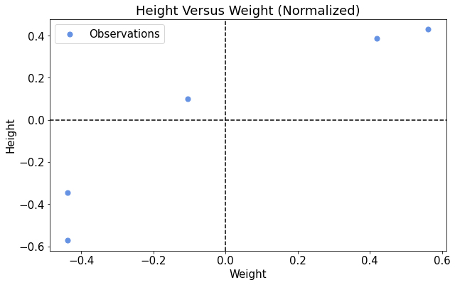
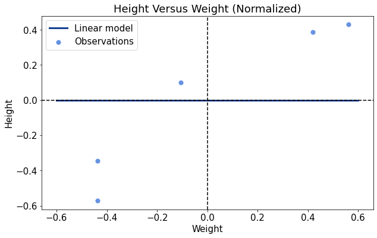
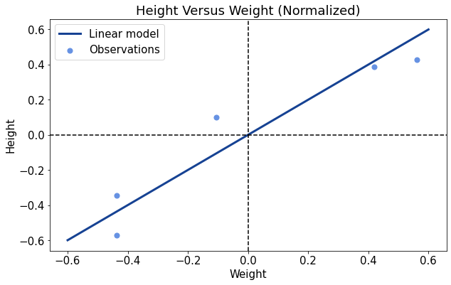
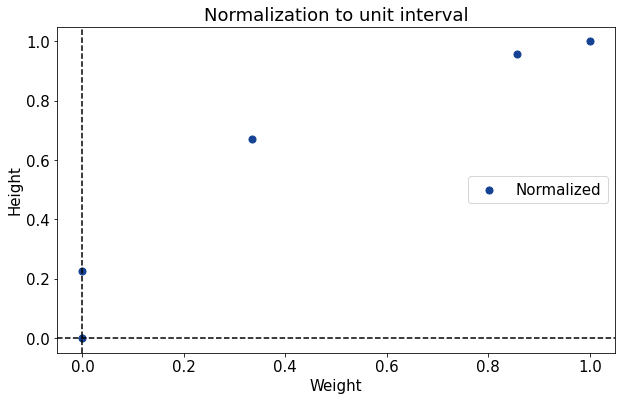
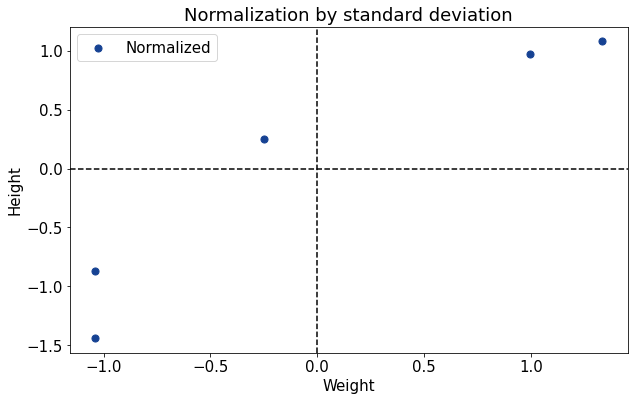

# 规范化表的特征

[数据科学](https://www.baeldung.com/cs/category/ai/data-science) [机器学习](https://www.baeldung.com/cs/category/ai/ml)

[培训](https://www.baeldung.com/cs/tag/training)

1. 概述

    在本教程中，我们将学习如何对表格或数据集的特征进行归一化处理。

    首先，我们将讨论归一化为何有用，以及何时应用归一化。然后，我们将了解对表格中的特征进行归一化处理的三种最常用方法。

    本教程结束时，我们将熟悉归一化的概念及其最常用的实现公式。

2. 一般归一化

    1. 什么是直观的归一化？

        归一化的概念之所以存在，是因为在一般情况下，我们希望新的数据集不会被归一化。不过，我们通常希望对计划训练机器学习模型的[数据集进行归一化处理](https://www.baeldung.com/cs/data-normalization-before-after-splitting-set)。我们很快就会知道这意味着什么，但现在，重要的是要直观地理解为什么会出现这种情况。

        让我们来看看一个由 5 人组成的班级中学生体重和身高的分布情况：

        | Student | Weight (Kg) | Height (cm) |
        |---------|-------------|-------------|
        | Dotty   | 89          | 182.1       |
        | Hamza   | 68          | 146.8       |
        | Devonte | 75          | 170.5       |
        | Alex    | 68          | 154.8       |
        | Reiss   | 86          | 180.6       |

        观察相应的散点图，我们可以认为体重和身高这两个特征之间[存在某种关系](https://www.baeldung.com/cs/correlation-coefficient#correlation-in-general)。更准确地说，我们可以怀疑这种关系是线性的，我们可能想找出一个符合这种关系的模型。

    2. 复杂拟合

        线性模型 y = ax+b 包含两个参数，即斜率 a 和截距 b。由于我们不知道究竟哪种线性模型适合该数据集，因此我们可以先为 a 和 b 随机赋值。

        如果我们这样做了，就会发现我们的模型不准确，原因有两个：它在图中的位置太低，而且太平。然后，我们可以将 a 和 b 的值都增加一点，看看直线是否更接近观测结果。

        现在看起来好多了。然后我们可以重复增加参数的过程，增加 a 和 b 的值。

        这种方法是可行的，不过可能要经过多次迭代才能[收敛](https://www.baeldung.com/cs/epoch-neural-networks#neural-network-training-convergence)。

    3. 如何简化

        然而，如果我们的数据集在一定程度上以原点为中心，对我们来说会更好。如果是这样的话，我们就不需要在模型中如此广泛地寻找正确的参数了。让我们来看看第 2.1 节。第二张表格及其相应的散点图：

        | Student | Weight | Height |
        |---------|--------|--------|
        | Dotty   | 0.562  | 0.429  |
        | Hamza   | -0.438 | -0.571 |
        | Devonte | -0.105 | 0.100  |
        | Alex    | -0.438 | -0.344 |
        | Reiss   | 0.419  | 0.386  |

        

        与前一个案例一样，我们希望找到一个符合数据的线性模型。在第二种情况下，似乎通过原点或非常接近原点的直线就可以了。与前一种情况一样，我们将线性模型的参数 a 和 b 初始化为 0：

        

        不过这一次，截距似乎已经处于正确位置，或者至少非常接近正确位置。这意味着我们需要增加直线的斜率，但不需要对截距做太大的调整：

        

        这次的训练过程明显更快，在达到收敛之前，在参数空间中的移动也更少。

        现在，我们在这些示例中使用的两个表格是相互关联的。事实上，我们称第二张表为前一张表的规范化版本。将这两个数据集联系起来的过程称为归一化。

    4. 为什么要进行归一化处理？

        我们上面研究的例子表明了机器学习中的两种典型情况。第一种情况是由[来自环境的原始测量数据](https://www.baeldung.com/cs/ml-labeled-vs-unlabeled-data#2-data-and-measurements)组成的表格，没有经过任何预处理。这种情况下，机器学习模型通常需要较长的训练过程。

        第二种情况是经过预处理的数据集，其中的特征已经过处理，以符合某些特定的范围或区间，或具有某些特定的形状。这通常会[加快模型的训练时间](https://www.baeldung.com/cs/normalizing-inputs-artificial-neural-network)。

        如果我们没有特别的原因要避免这样做，那么在训练机器学习模型之前对数据集进行归一化处理就是一个好习惯。在最好的情况下，这应该会大大缩短训练时间。在最坏的情况下，我们只是在机器学习管道的操作列表中增加了一些减法和除法。

3. 如何避免混淆

    1. 归一化并不正常

        现在，我们应该讨论一下在初次学习归一化概念时常见的一些错误。首先，我们有可能将正态化与[正态分布](https://www.baeldung.com/cs/uniform-to-normal-distribution#2-the-normal-distribution)相混淆。正态分布并不一定是正态化的结果，尽管它可能是正态分布，因此，这两个概念必须分开。

        我们可以把正态化看作是一个过程或程序，通过这个过程或程序，我们根据一套特定的规则为分布中的特征赋予新的值。我们可以将正态分布看作具有特定形状的分布，即典型的[高斯钟形分布](https://www.baeldung.com/cs/randomness#3-distribution-of-random-variables)。

    2. 正态化和标准化

        我们还需要记住，正态化这个词也并不明确。在某些情况下，这个词描述的是将一个概率分布映射到另一个概率分布的过程。在其他情况下，它描述的是将一个变量缩放至一个特定区间的过程。

        因此，当我们学习一篇关于统计学或机器学习的文章时，确保我们准确理解作者使用归一化一词的含义是非常重要的。

        另一个经常遇到的、有时与归一化重叠的词是[标准化](https://www.baeldung.com/cs/feature-scaling#standardization)。不过，后者指的是将分布映射到以原点为中心的高斯分布的过程，不应与前者混淆。

4. 标准化的方法

    1. 单位区间

        现在，我们可以了解对表格中的特征进行归一化的实际方法。这里我们将看到三种方法，它们构成了我们对新的原始数据集进行归一化处理的基本技术库。

        第一种是将分布映射到单位区间。由于单位区间是 $[0，1]$，我们希望分布中的最小值映射为 0，最大值映射为 1 或尽可能接近 1。

        如果 $f(\text{min}(x)) = 0$，这意味着 f 的解析式必须包含表达式 $x - \text{min}(x)$。如果 f 的代码域对应于 $[0，1]$，那么它的范围就是 1；因此，如果 x 的范围是 $\text{max}(x) - \text{min}(x)$，那么 f 的解析式必须包括除以 $(\text{max}(x) - \text{min}(x))$。

        因此，单位区间归一化的完整公式是：

        \[f(x) = \frac{x - \text{min}(x)}{\text{max}(x) - \text{min}(x)}\]

        下面的图表展示了如何将权重和高度的分布归一化到单位区间，我们在上面使用了权重和高度的分布作为例子：

        
        在应用这种归一化时，我们必须注意在除以原始分布的范围时，确保这个范围大于零。

    2. 带特征缩放的均值标准化

        然而，有时我们可能会对突出每个观测值与其分布均值之间关系的信息感兴趣。为此，我们可以首先通过减去平均值 $\mu$ 来将分布向左移动：

        $x - \mu$

        这样，所有低于 $\mu$ 的值都会变成负值，而所有高于 $\mu$ 的值都会变成正值。这种类型的归一化还经常伴随着[缩放](https://www.baeldung.com/cs/feature-scaling)。缩放相当于用原始分布的范围进行除法，这与我们在前一种情况中看到的类似：

        \[f(x) = \frac{x - \mu}{text{max}(x) - \text{min}(x)}\]

        这就是我们在上一节的表格中使用的特殊归一化方法。

    3. 标准差归一化

        最后，我们还可以利用标准差对分布进行归一化。如果我们的原始分布是正态分布，这个方法就特别有用，因为得到的分布的平均值 $\mu$ 为 0，标准差 $\sigma$ 为 1：

        \[f(x) = \frac{x - \mu}{\sigma}\]

        这就是我们使用的二元分布示例，通过均值和标准差进行了归一化处理：

        
    4. 使用哪一种？

        确定使用哪种类型的归一化取决于我们正在执行的任务，这在机器学习中很常见。当我们处理一个新数据集时，可以测试一些可供选择的归一化技术，看看哪种技术能提高模型的准确性。

        因此，为特定任务选择特定的归一化技术是启发式的，我们应该尝试几种技术，找出哪种效果最好。

5. 结论

    在本文中，我们研究了如何对表格或数据集的特征进行归一化处理。

    我们首先从直观的角度了解了什么是归一化以及归一化的功能。然后，我们研究了初次接触这一主题时可能会犯的常见错误。

    最后，我们学习了归一化的主要技术及其相关公式。

[Normalize Features of a Table](https://www.baeldung.com/cs/normalize-table-features)
