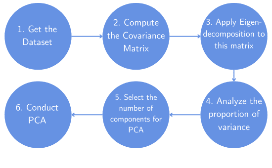
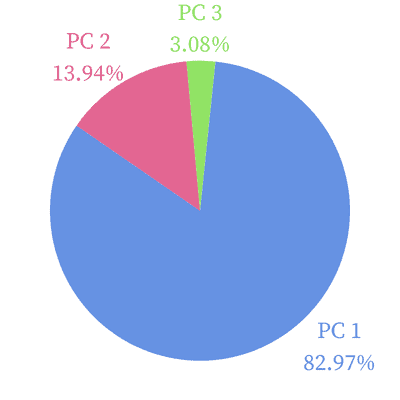
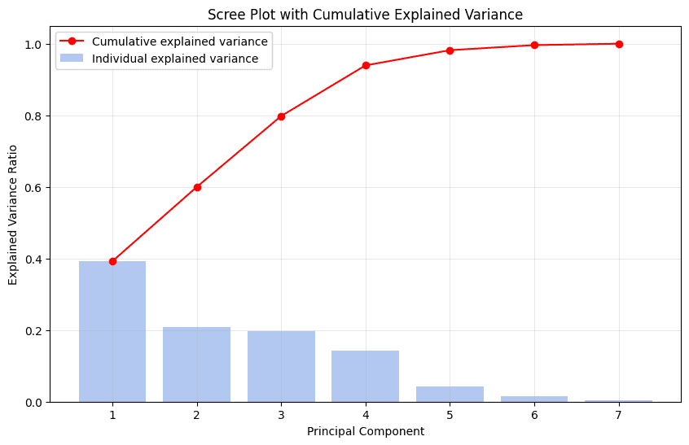

# [什么是方差比例？](https://www.baeldung.com/cs/cross-validation-k-fold-loo)

1. 简介

    在本教程中，我们将介绍如何使用方差比例来设置主成分分析（[PCA](https://www.baeldung.com/cs/principal-component-analysis)）中的主成分数及其主要理论方面。此外，我们还将介绍一个数值示例，以突出其重要性。

2. 主成分个数

    在主成分分析（PCA）中，我们面临的一个[主要挑战是确定主成分（PC）的数量](https://www.baeldung.com/cs/pca)。如果我们选择的主成分数量过多，就会失去降维的好处。更糟糕的是，我们会增加计算复杂度，并在可视化高维空间方面遇到困难。另一方面，如果 PC 数量较少，我们可能会遗漏数据的某个重要方面。因此，这会导致我们在后续分析中得出错误的结论。

    为了避免这个问题，我们可以计算数据方差的比例。这显示了数据的离散程度，或者说数据点在均值附近的分布情况。但为什么在 PCA 中这一点很重要呢？PCA 计算出的主成分按其解释的方差排序。此外，这些成分互不相关，因此彼此正交。这就确保了每个成分都能捕捉到其他成分无法捕捉到的数据方差。因此，如果我们掌握了每个成分的方差比例，就可以选择累计解释方差比例最大的前几个成分。

    以下是一般的工作流程：

    1. 获取数据集
    2. 计算协方差矩阵
    3. 对该矩阵进行特征分解
    4. 分析方差比例
    5. 选择 PCA 的成分数
    6. 进行 PCA

    

3. 方差比例和 PCA

    举例说明，我们以三个变量为例。在这种情况下，矩阵 X 的每一列对应一个变量，每一行对应一个数据点：

    \[X = \begin{bmatrix} -0.1347 & 1.5087 & -1.1303 \\ 2.6743 & 1.2540 & -0.0716 \\ 0.0737 & 0.6956 & 0.2773 \\ 0.8986 & 0.6414 & -1.5479 \end{bmatrix}\]

    该数据对应的协方差矩阵是

    \[\Sigma = \begin{bmatrix} \boldsymbol{2.4160} & 0.2892 & 0.81074 \\ 0.2892 & \boldsymbol{0.1807} & -0.0203 \\ 0.8107 & -0.0203 & \boldsymbol{0.7425} \end{bmatrix}\]

    我们可以在协方差矩阵的对角线上找到方差。它们的总和等于 3.3392，代表总体变异性，而对角线外的元素代表三个变量之间的协方差。

    接下来，我们用三个分量（n=3）对数据 X 进行 PCA 分析，得到的解释方差分别为 2.7706、0.4657 和 0.1028。值得注意的是，这些都是协方差矩阵的[特征值](https://www.baeldung.com/cs/svd-matrices)。

    但我们该如何解释这些结果呢？由于第一个特征值为 2.7706，因此第一个 PC 解释了数据集总体变异性的 2.7706/3.3392 = 82.97%。因此，这个主成分捕捉到了数据中的大量信息。第二个主成分解释了 0.4657/3.3392 = 13.94% 的变异，最后一个主成分解释了 0.1028/3.3392 = 3.08% 的变异：

    

    这意味着，如果我们放弃第三个主成分，我们仍然可以解释数据集总体变异性的 82.97% + 13.94% = 96.91%。因此，前两个成分足以解释我们的数据。

4. 如何判断？

    没有一个通用的累积比例阈值，超过这个阈值后，我们就可以停止增加 PC 的数量。不过，还是有一些指导原则和经验法则。

    首先，阈值取决于我们的分析目标和所涉及的限制因素。如果我们的目标是得出关键性结论，提供可靠而有意义的见解，那么我们应将目标设定为 95% 左右的比例。在一般应用中，好的数值范围在 80% 到 95% 之间。但是，这也是任意的，在报告和介绍任何分析时都应加以说明。在某些关键应用中，阈值甚至可以更高。

    然而，对于高度相关的变量，方差比例过低并不是问题。在这种情况下，变量之间存在大量冗余。因此，小比例的解释方差通常就足以代表数据集的变异性。此外，我们的模型可能会受到一些限制，这意味着我们不可能拥有我们想要的那么多 PC。这也可能导致我们接受较低的方差比例。

    我们可以使用的另一个工具是树枝图。在这张图中，我们可以看到每个主成分的累积解释方差和单个解释方差。下面是一个例子：

    

    这些是七个成分的累积解释方差，分别为 0.39、0.59、0.79、0.93、0.98、0.99、1。这意味着仅第一个 PC 就占了总变异性的 39%。我们不难看出，有了四个 PC，我们就能代表数据变异性的 93%。此时，红色曲线的斜率发生了突然变化，呈现出 "elbow" 的特征。此时，我们可以停止添加更多的 PCAs，因为它们对解释的总方差贡献不大。增加最后三个 PC 只会使解释方差增加 7%。

5. 结论

    在本文中，我们讨论并说明了 PCA 中的方差比例。该指标向我们展示了主成分对数据集变异性的解释程度。

    我们利用该比例来选择共同解释了大部分方差的成分。这一经验法则隐含地决定了 PCA 中 PC 的数量，并在保持对原始数据忠实性的同时[降低了数据集的维度](https://www.baeldung.com/cs/curse-of-dimensionality)。
