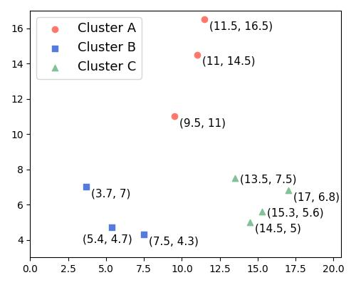
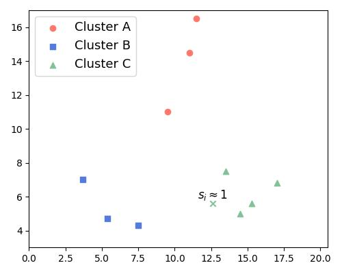
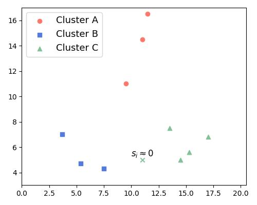
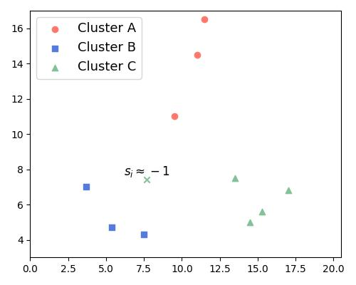
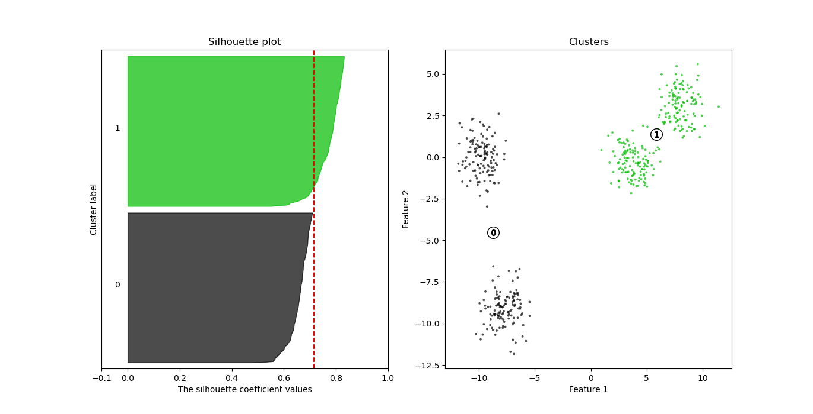
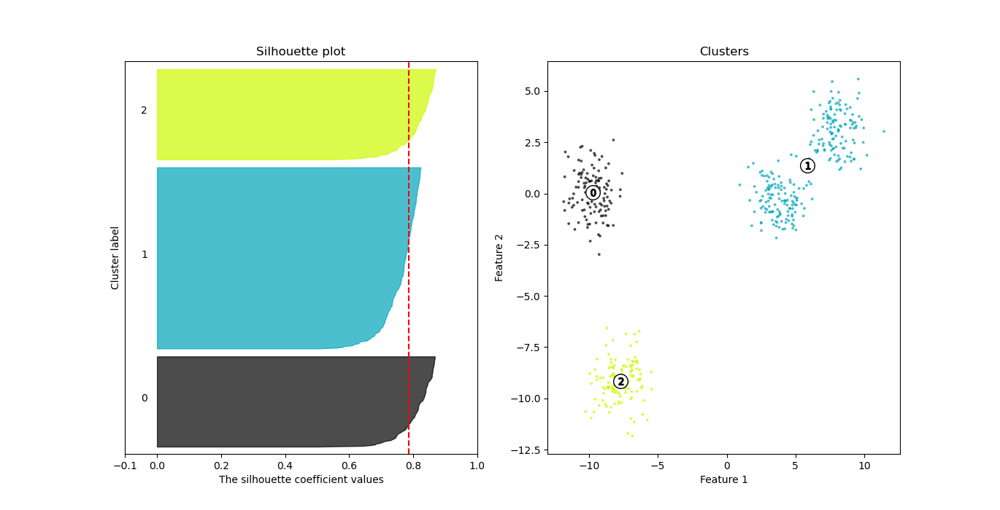
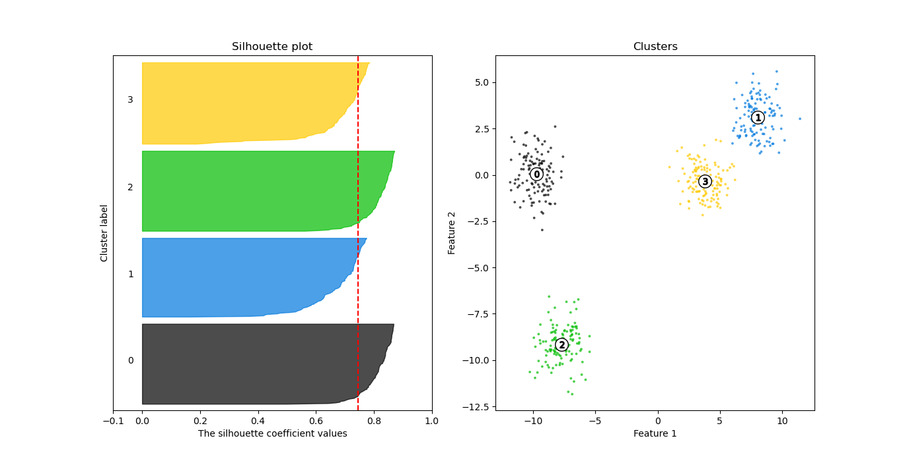
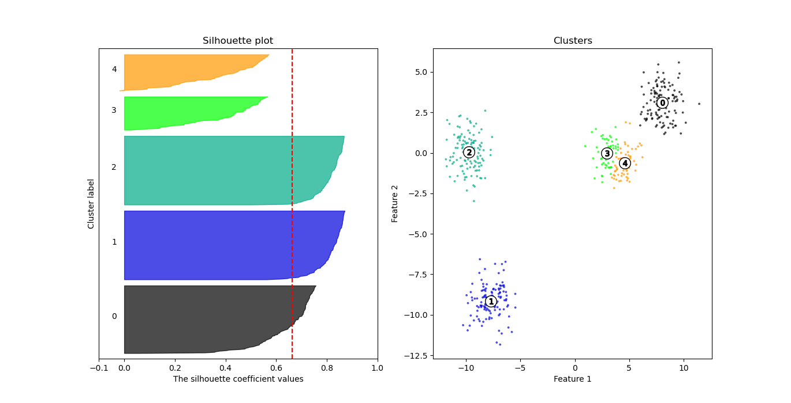
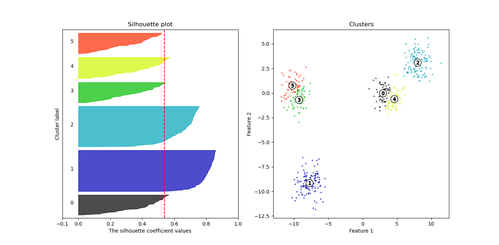

# 剪影情节

[数据科学](https://www.baeldung.com/cs/category/ai/data-science) [机器学习](https://www.baeldung.com/cs/category/ai/ml)

1. 简介

    在本教程中，我们将介绍如何在[聚类分析]中使用剪影图。

    聚类分析是无监督学习方法之一。首先，我们将解释剪影值的衡量标准以及如何计算和解释剪影值。然后，我们将展示如何使用平均剪影值来确定聚类的数量。

2. 聚类分析中的剪影图

    [剪影图是一种图形工具](https://www.sciencedirect.com/science/article/pii/0377042787901257)，用于描述我们的数据点与所分配的聚类的拟合程度。我们称之为 "拟合内聚力质量"。

    同时，剪影图还能显示分离质量：这一指标反映了不属于同一聚类的点被分配到不同聚类的程度。

    要对聚类进行分析，我们需要同时考虑这两个标准，而剪影图可以让我们做到这一点。

3. 剪影值

    剪影值是两个分数的组合：内聚力和分离度。

    1. 内聚力

        内聚力衡量的是同一聚类中各点的相似度。因此，我们可以称其为簇内度量。

        假设 C 是一个聚类，$x_i, x_j \in C$ 中的两个点。那么，我们可以把它们之间的距离解释为它们的相似性度量。由此，我们将 $x_i$ 点在其聚类 C 中的内聚力定义为 $x_i$ 与 C 中其他点 $x_j$ 之间的平均距离：

        \[a_i = \mathrm{mean}_{x_j \in C}(distance(x_i, x_j))\]

    2. 分离

        另一方面，分离度指的是聚类不重叠的程度。因此，这是一个簇间度量。

        直观地说，聚类之间的距离就是 "聚类分离度"。因此，我们将 $x_i \in C_1$ 的分离度定义为 $x_i$ 与其他聚类之间的最小平均距离：

        \[b_i = \min_{C_2 \neq C_1}(mean_{x_j \in C_2}(distance(x_i, x_j)))\]

    3. 将内聚与分离结合为剪影值

        那么，点 x 的轮廓值为：

        \[s_i = \frac{b_i - a_i}{\max(a_i, b_i)}\]

        它的范围是 [-1, 1]。剪影值越高，我们就越能确定其标签是正确的。因此，所有点的平均剪影值越高，说明聚类效果越好。

    4. 如何计算剪影值？

        让我们来看看下图中的聚类 A、B 和 C：

        

        让我们来计算 A 中点（9.5, 11）的剪影值。为此，我们需要计算它的内聚力和分离度得分。

        $(9.5, 11) \in A$ 的内聚力是它与 A 中其他点的平均距离：

        \[\sqrt{(9.5-11)^2 + (15.5-14.5)^2} = \sqrt{2.25 + 1} = \sqrt{3.25} \approx 1.8\]

        到（11. 5，16. 5）的距离是：

        \[\sqrt{(9.5-11.5)^2 + (15.5-16.5)^2} = \sqrt{4.0 + 1.0} = \sqrt{5.0} \approx 2.2\]

        所以 $(9.5, 11) \in A$ 的内聚力是

        \[cohesion_{(9.5, 11)} = \frac{1.8 + 2.2}{2} = 2\]

        我们可以用同样的方法计算点（9.5，11）到聚类 B 的平均距离：

        \[\begin{aligned} dist_{( (9.5, 15.5), (7.5, 4.3) )} &= \sqrt{(9.5-7.5)^2 + (15.5-4.3)^2} = \sqrt{4.0 + 125.0} = \sqrt{129.4} \approx 11.4 \\ dist_{( (9.5, 15.5), (3.7, 7) )} &= \sqrt{(9.5-3.7)^2 + (15.5-7)^2} = \sqrt{33.64 + 72.25} = \sqrt{105.89} \approx 10.3 \\ dist_{( (9.5, 15.5), (5.4, 4.7) )} &= \sqrt{(9.5-5.4)^2 + (15.5-4.7)^2} = \sqrt{16.8 + 116.6} = \sqrt{133.1} \approx 11.5 \\ mean\_distance &= \frac{11.4 + 10.3 + 11.5}{3} \approx 11 \end{aligned}\]

        按照同样的步骤，我们计算它与群集 C 的平均距离：

        \[separation_{(9.5, 11), C} = \frac{8.9 + 11.5 + 11.6 + 11.5}{4} \approx 10.9\]

        因此，（9.5，11）的分离度得分是 10.9，因为这是两个值中较低的一个。

        由此，我们可以得到（9.5，11）的剪影值：

        \[s_i = \frac{b_i - a_i}{\max(a_i, b_i)} = \frac{10.9 - 2}{max(10.9, 2)} = \frac{8.9}{10.9} \approx 0.8\]

        由于 0.8 接近理论上的最大剪影值，我们可以确信我们将（9.5，11）分配到了它实际所属的聚类中。

    5. 分析剪影值

        假设我们有两个聚类： 我们正在计算 A 中各点的剪影值。当 $b_i >> a_i$ 时，A 中任意一点的剪影值 $s_i$ 将更接近于 1。在这种情况下，$x_i$ 与 A 中其他点的距离远小于与 B 中点的距离。这表明 $x_i$ 属于群组 A：

        

        因此，随着聚类中各点剪影值的平均值越来越接近 1，整个聚类的凝聚力和分离度就会增加。

        反之亦然。当剪影值趋近于 0 时，$a_i$ 和 $b_i$ 都是相似的。那么，$x_i$ 与 A 和 B 上元素的距离也相似。因此，不清楚 $x_i$ 应属于 A 还是 B：

        

        最糟糕的情况是当剪影值 $s_i$ 为负数时，也就是当 $a_i$ 大于 $b_i$ 时。这时，相关点更靠近 B，而不是 A：

        

        因此，随着 \boldsymbol{s_i} 值的减小，分离的质量会变差，聚类的质量也会变差。

4. 轮廓图

    聚类的剪影图直观地显示了聚类中所有点按递减顺序排列的剪影值 $s_i$。剪影图以随机顺序显示所有聚类的剪影。此外，它还会在连续的聚类之间插入空白，并用不同的颜色来表示。

    例如，下面是我们在一个临时二维数据集上使用[K-Means聚类算法](https://www.baeldung.com/java-k-means-clustering-algorithm)得到的四个聚类的剪影图：

    
    这里，我们设置 k=2。左边是剪影图。x 轴显示剪影值，每个剪影的高度表示相应聚类中的点数。右边的子图用与聚类相同的颜色显示数据点。红线表示所有聚类的平均剪影值。在本例中，平均值为 0.71。

    从右边的子图中，我们可以得出结论，绿色点的内聚力要高于黑色点。这也是左边黑色聚类轮廓较差的原因。不过，这两个群组看起来分离得很好。

5. 选择聚类的数量

    通过绘制不同 $\boldsymbol{k}$ 值的剪影，我们可以看到哪一个 $\boldsymbol{k}$ 最适合数据。

    例如，下图显示了上述数据的 [K-Means](https://www.baeldung.com/cs/k-means-for-classification) 结果，k = 3。平均剪影值增加到 0.78：

    
    在这里，我们可以看到右边的聚类保持不变，而左边的聚类则分裂成两个较小的聚类。这两个簇的剪影值要好于蓝色簇的剪影值，但这三个簇看起来都很清晰。

    如果我们使用 k=4，会发生什么情况呢？平均剪影值略微下降到 0.74：

    
    在这里，我们看到绿色和黑色集群的轮廓比其他两个集群更好。这可能是因为它们的点比其他两个聚类的点分离得更好。

    最后，k=5 的平均剪影值下降到 0.66 和 0.53：

    
    而 k=6 时则降至 0.53：

    
    因此，k=2、3、4 似乎是不错的选择，而 k=5 和 k=6 则给出了质量较低的聚类。

    1. 解释剪影值的平均值

        剪影值衡量的是聚类凝聚力和聚类分离度之间的关系。因此，剪影值的平均值代表了所有聚类的整体凝聚力和分离度之间的平衡。

        因此，我们要寻找平均剪影值更高的聚类，最好接近 1。

        选择聚类数量的一种方法是选择总体平均值较高的聚类。[Kaufmann 和 Rousseeuw（1990 年）](https://onlinelibrary.wiley.com/doi/book/10.1002/9780470316801)将总体平均值命名为剪影系数（SC）。根据他们的分类，如果 $\boldsymbol{SC} >0.70$，则聚类的结构较强。如果 $\boldsymbol{SC}$ 在 0.51 和 0.70 之间，则结构合理。数值越低，说明结构越差。

        下面是我们在上述例子中得到的 k=2,3,4,5,6 的平均值：

        | k | Silhouette score |
        |---|------------------|
        | 2 | 0.7143           |
        | 3 | 0.7866           |
        | 4 | 0.7456           |
        | 5 | 0.6633           |
        | 6 | 0.5392           |

        考虑到 SC 标准，可接受的解决方案是具有 2、3 和 4 个聚类的解决方案。在这次模拟中，我们使用了四个 Blob 的数据，因此最佳解决方案应该是有 4 个聚类的解决方案。但是，我们可以看到有 3 个簇的解决方案看起来更好。

6. 结论

    在本教程中，我们讨论了剪影图和值。剪影图是我们用来评估聚类质量的图形工具。剪影值显示了聚类的内聚和分离程度。通过剪影值的平均值可以确定数据集中出现了多少个聚类。

[Silhouette Plots](https://www.baeldung.com/cs/silhouette-values-clustering)
