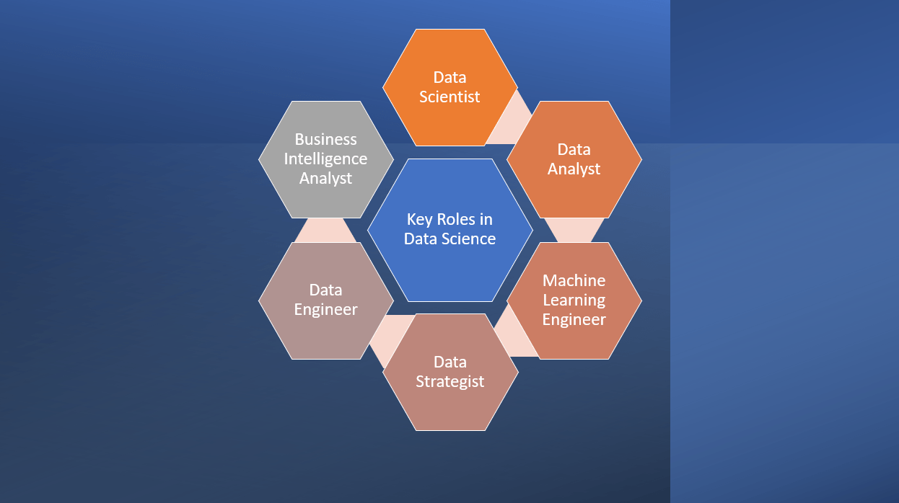

# 软件工程与数据科学

[数据科学](https://www.baeldung.com/cs/category/ai/data-science) [编程](https://www.baeldung.com/cs/category/core-concepts/programming)

[项目管理](https://www.baeldung.com/cs/tag/project-management)

1. 简介

    本文将比较软件工程和数据科学。我们将分析它们的定义、作用、相似之处和不同之处。我们的目标是帮助读者做出明智的职业选择。

    通过探索每个领域的独特之处，我们将发现它们提供的机遇和带来的挑战。

2. 软件工程

    [软件工程](https://www.baeldung.com/cs/v-model)是一门结合了计算机科学和工程学的学科。它涉及软件系统的设计、编码、测试和维护。

    它侧重于使用有效的方法和工具来创建良好和可扩展的软件。此外，软件工程师还与利益相关者合作，分析需求并开发功能性软件系统。

    此外，软件工程遵循[敏捷](https://www.baeldung.com/cs/agile-programming)或[瀑布式](https://www.baeldung.com/cs/waterfall)等循序渐进的流程。工程师使用编程语言、框架和工具编写代码，将不同部分整合在一起，并定期进行测试。

    此外，他们还与拥有不同技能的团队合作，确保开发工作考虑到用户。主要目的是创建可靠的软件，满足用户需求并遵循行业标准。

    例如，典型的软件工程项目是开发移动应用程序或为现有应用程序添加新功能。

    1. 软件工程中的主要角色和职责

        在软件工程中，我们可以在软件系统的开发和维护中扮演各种角色：

        

        每种角色都包含特定的专业知识和职责，共同确保软件解决方案的成功交付。

        让我们来看看软件工程中常见的一些重要角色及其相应的任务：

        | Roles                      | 角色      | 职责                               |
        |----------------------------|---------|----------------------------------|
        | Software Developer         | 软件开发人员  | 设计、编码和测试应用软件。                    |
        | Software Architect         | 软件架构师   | 设计软件系统的整体高层结构。                   |
        | Project Manager            | 项目经理    | 监督项目时间表和资源，确保实现项目目标。             |
        | Quality Assurance Engineer | 质量保证工程师 | 进行测试和质量控制，确保软件符合标准和用户要求。         |
        | System Analyst             | 系统分析师   | 分析客户需求；制定软件需求并将其转化为功能软件设计。       |
        | Database Administrator     | 数据库管理员  | 设计、实施和维护软件系统中使用的数据库。 器系统中使用的数据库。 |

        这些角色在软件开发过程的每个阶段都共同工作。

        值得一提的是，不同的公司和项目可能会有额外或专门的角色。

3. 数据科学

    数据科学是一个汇集不同领域的知识来理解复杂数据集的领域。它利用统计学和机器学习来发现数据中的有价值信息和模式。

    数据科学家利用他们在数据分析和编程方面的技能，以及他们在特定领域的知识，发现数据中的洞察力和趋势。他们使用先进的算法和计算工具来发现实用的见解，并根据数据做出决策。

    此外，数据科学对于解决金融、医疗保健和营销等各行各业的复杂问题至关重要。通过处理和分析大量数据，数据科学可帮助企业获得竞争优势，并为战略规划和优化做出明智决策。

    例如，当软件工程师和程序员设计和开发移动应用程序及其功能时，数据科学家会分析用户数据，以估计用户对应用程序的满意度，或确定他们希望拥有的新功能。

    1. 数据科学的关键角色和职责

        数据科学包括几个重要角色，负责从复杂的数据集中提取洞察力。这些角色需要综合运用统计分析、编程技能和领域专业知识：

        
        让我们来详细了解数据科学中的一些常见角色及其相关职责：

        | Roles                         | 角色      | 工作职责                       |
        |-------------------------------|---------|----------------------------|
        | Data Scientist                | 数据科学家   | 分析数据、应用统计模型和开发机器学习算法。      |
        | Data Analyst                  | 数据分析师   | 清理和预处理数据，进行探索性数据分析，并生成报告。  |
        | Machine Learning Engineer     | 机器学习工程师 | 建立和实施机器学习模型，优化算法并评估性能。     |
        | Data Strategist               | 数据策略师   | 定义数据驱动战略，确定业务机会，并推荐数据解决方案。 |
        | Data Engineer                 | 数据工程师   | 设计并维护数据基础设施，管理数据管道并确保数据质量。 |
        | Business Intelligence Analyst | 商业智能分析师 | 开发数据可视化、仪表板和报告，为业务决策提供支持。  |

        这些角色密切合作，从数据中提取信息，为决策提供支持。

        此外，值得一提的是，组织和项目可能会根据其具体要求和行业需求，设置不同的或额外的角色。

4. 软件工程与数据科学的相似之处

    事实上，软件工程和数据科学在方法和技能组合上有一些相似之处。

    1. 编程技能的重要性

        软件工程师和数据科学家都需要良好的编程技能。软件工程师使用各种编程语言，而数据科学家大多使用 Python、R 或 Java。

        一般来说，无论是构建软件应用程序，还是处理和分析大型数据集，编程技能都能让软件工程师和数据科学家利用代码的力量创建高效的解决方案并自动执行任务。

    2. 强调解决问题

        解决问题在软件工程和数据科学中都至关重要。这些领域的专业人员依靠批判性思维和分析技能来应对复杂的挑战。

        软件工程师利用解决问题的技能来设计高效算法、寻找编码问题的解决方案并优化软件性能。另一方面，数据科学家利用解决问题的能力来发现数据中的模式和见解。

    3. 算法和数据结构的使用

        算法和[数据结构](https://www.baeldung.com/cs/data-type-vs-data-structure)在软件工程和数据科学中发挥着至关重要的作用。

        软件工程师使用算法来解决各种问题。通过设计高效的算法，软件工程师可以优化软件应用程序的性能和功能。

        同样，数据科学家也非常依赖算法来分析海量数据并从中获得有意义的见解。算法使数据科学家能够进行预测、发现模式并深入了解复杂的数据集。

    4. 协作和团队精神

        协作在软件工程和数据科学领域都起着至关重要的作用。这些领域的专业人员需要通力合作，才能高效率、高效益地实现目标。

        在软件工程领域，通过协作，开发人员可以将不同的技能、知识和观点结合起来，创造出稳健可靠的软件产品。

        同样，数据科学家通常在多学科团队中工作，与领域专家、统计学家和分析师合作。

5. 软件工程与数据科学的区别

    软件工程和数据科学是不同的学科，具有不同的重点和方法。

    1. 目标和重点

        软件工程主要侧重于软件系统的开发、设计和维护。其目的是创建满足用户需求的可靠、实用的软件解决方案。

        相比之下，数据科学侧重于利用[统计分析]和机器学习技术从数据中提取有用的模式和知识。数据科学的目的是根据数据为利益相关者提供信息，从而做出决策。

    2. 数据与软件

        软件工程涉及软件应用程序的开发和管理，而数据科学则围绕大型复杂数据集开展工作。

        数据科学家使用统计模型和算法收集、清理和分析数据，以获得有意义的见解。

    3. 技能组合

        软件工程师通常具有很强的编程技能、软件设计专长和软件开发方法知识。

        另一方面，数据科学家需要精通数学、统计分析、编程、数据可视化和机器学习技术。

    4. 项目生命周期

        在软件工程中，项目生命周期通常遵循众所周知的开发方法，如敏捷法或瀑布法。它经历不同的阶段，如收集需求、设计、实施、测试和部署软件。

        在数据科学中，生命周期涉及各种任务，如收集数据、准备分析数据、探索数据以获得洞察力、开发模型以及评估其有效性。例如

        
        两个生命周期都包括编程，但步骤不同。

6. 在软件工程和数据科学之间做出选择

    在选择软件工程和数据科学作为职业道路时，我们应该考虑以下几个因素。

    1. 兴趣和激情

        评估我们对编程、软件开发、数学和数据分析的兴趣和热情非常重要。此外，我们还应考虑哪个领域更符合我们的个人和职业目标。

        选择能激发我们的兴趣和动力的领域至关重要，因为这将对我们的长期职业满意度起到重要作用。

    2. 技能和背景

        我们应该评估自己当前的技能和教育背景，以便做出明智的决定。如果我们有很强的编程背景并喜欢软件开发，那么软件工程可能是我们的天作之合。

        或者，如果我们在统计、数学和数据分析方面有坚实的基础，那么数据科学可能是我们的正确选择。

    3. 职业机会

        研究这两个领域的就业市场和发展潜力至关重要。因此，我们应该考虑理想行业或地区对软件工程师和数据科学家的需求。

        探索吸引我们的行业和领域是重要的一步。软件工程在科技、金融、医疗保健和电子商务等各行各业都至关重要。数据科学则应用于金融、医疗保健、市场营销和人工智能等行业。

        此外，必须强调的是，许多行业都依赖软件解决方案，而软件解决方案又会产生大量数据，最终需要对这些数据进行分析，才能做出明智的商业决策。

        因此，我们应考虑哪个领域更符合我们所期望的行业或领域。

7. 结论

    在本文中，我们概述了软件工程和数据科学的定义、作用、相似之处和不同之处。

    软件工程涉及软件系统的开发、设计和维护，而数据科学则侧重于利用统计分析和[机器学习](https://www.baeldung.com/cs/automl)从复杂的数据集中提取见解。

    在这两个领域之间做出选择时，重要的是要考虑个人的优势、兴趣和愿望。最终，我们应该根据自己的兴趣、技能和长期目标做出决定。软件工程和数据科学都为我们提供了令人兴奋的职业道路，为我们提供了大量的发展机会和影响力。

[Software Engineering vs. Data Science](https://www.baeldung.com/cs/software-engineering-vs-data-science)
