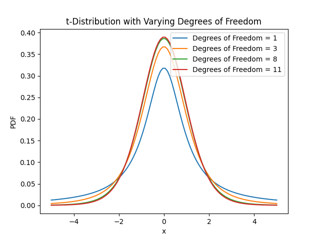

# 学生 t 分布简介

[数据科学](https://www.baeldung.com/cs/category/ai/data-science)

[概率与统计](https://www.baeldung.com/cs/tag/probability-and-statistics)

1. 引言

    [统计学](https://www.baeldung.com/cs/ml-statistics-significance)是一种强大的工具，能让我们理解数据并从中得出[有意义的结论](https://www.baeldung.com/cs/data-science)。

    在本教程中，我们将介绍 [Student's t 分布](https://en.wikipedia.org/wiki/Student%27s_t-distribution)，它是正态分布的一种概括，以 [William Gosset](https://en.wikipedia.org/wiki/William_Sealy_Gosset) 使用的笔名 "Student" 命名。

    Student's t 分布适用于样本量较小或群体方差(population variance)未知的情况。它能更准确地表示样本均值的变异性，即使在标准正态分布失效的情况下，也能做出可靠的推断。

2. 定义

    1. 定义学生 t 分布

        t 分布是一种概率分布，用于描述从群体中[随机抽取](https://www.baeldung.com/cs/randomness)样本时样本均值的变异性。它形成一条钟形曲线，与[正态分布](https://www.baeldung.com/cs/uniform-to-normal-distribution)相似，但尾部较重，这使得 t 分布能够处理因样本量小而增加的[不确定性](https://www.baeldung.com/cs/ml-information-gain)。

        从图中可以看出，平均值周围的空间较小，而 t 分布的尾部空间较大。因此，在 t 分布下，更有可能出现更多极端值或异常值：

        

    2. 自由度和形状

        t 分布对自由度这一变量的依赖是其显著特征之一。自由度是决定分布的关键因素，表示样本的数量。随着自由度的增加，t 分布接近于传统正态分布的形式。

        当自由度最小时，t 分布的尾部比正态分布更宽，这增加了出现极端结果的几率。在处理稀疏数据时，这一特性尤其有用，因为它能更准确地描述样本均值的内在变异性。此外，t 分布表中还提供了不同自由度和[置信水平](https://www.baeldung.com/cs/monte-carlo-simulation)的临界值。

    3. t 统计量的推导

        t 分布的基础是 t 统计量，它以样本平均数的标准误差来衡量样本平均数 $\overline{x}$ 与假设总体平均数 $\mu$ 之间的差异。

3. 计算和使用 t 值

    让我们深入了解一下计算 t 值的实际方法。

    1. 逐步计算 t 值

        计算 t 值涉及用标准误差量化样本平均数与假设总体平均数之间的差异。t 值的计算公式为

        \[\begin{equation*} t = \dfrac{\overline{x} - \mu}{\dfrac{s}{\sqrt{n}}} \end{equation*}\]

        其中，t、$\overline{x}$、$\mu$、s、n 分别表示 t 分数、样本平均数、零假设下的假设总体平均数、样本标准差和样本量。

    2. 解释 t 分数

        计算出 t 值后，分析其显著性至关重要。

        与预期平均值的偏差越大，t 值的绝对值就越大，偏差越小，t 值就越小。此外，我们还会根据自由度和指定的置信水平，将 t 分数与 t 分布表中的关键值进行比较，以确定观察到的差异是否具有统计学意义。此外，如果估计的 t 分数大于临界值，我们可以拒绝零假设，因为这表明观察到的差异很可能不是偶然的结果。

    3. 假设检验和置信区间

        t 值用于假设检验，以评估样本统计量与假设的总体参数之间的关系。估计的 t 值必须在接受范围之外，才能成功拒绝零假设。相反，如果 t 分数在拒绝范围内，则没有理由接受替代假设而不是零假设。

        在建立置信区间时，t 得分用于计算样本估计值的不确定度。不确定度越高，置信区间越宽，而准确度越高，置信区间越小。

4. t 值计算举例

    让我们来看一个实际例子：一家制造商想测试一种新的生产方法是否能提高某种材料的抗拉强度。对 20 个样本进行了测试，得出样本平均抗拉强度为 450 兆帕，样本标准偏差为 25 兆帕。该公司认为目前的抗拉强度为 440 兆帕。使用显著性水平 0.05 和双尾检验，我们计算出 t 分数：

    \[t = (450 - 440) / (25 / \sqrt{20}) = 2.52\]

    在 19 个自由度（20 - 1）的情况下，我们查阅 t 分布表，找到显著性水平为 0.025 的临界值（双尾检验的 0.05 除以 2），约为 2.093。由于 2.52 超过了 2.093，我们拒绝了零假设，并得出结论：新的生产方法可能会显著提高抗拉强度。

    此外，请看这样一个例子：我们使用独立 t 检验来比较两组学生的考试成绩。A 组有 15 名学生，B 组有 18 名学生。该检验的自由度为 (15 - 1) + (18 - 1) = 31。

5. 使用案例

    学生 t 分布不仅仅是一种数学奇思妙想，它还是一种功能强大的工具，在各种统计分析中都有实际应用。t 分布的灵活性使其成为医学、社会科学、工程和金融等领域的重要工具。无论是估计治疗效果、分析调查数据，还是评估金融投资组合的表现，t 分布都能帮助分析人员从有限的信息中得出可靠的结论。

    例如，医学研究人员可能会使用 t 分布来评估一种新的药物治疗方法与现有治疗方法相比是否会产生统计学意义上的显著改善，即使样本数量有限。

    此外，在市场营销中，分析师可能会使用 t 分布来估算客户对在线广告的平均响应时间，以及量化估算结果不确定性水平的置信区间。

6. 结论

    在本文中，我们讨论了学生 t 分布作为一种有用的工具，在数据经常有限或稀少的情况下帮助克服不确定性和可变性带来的困难。它能够帮助人们发现重要的概念和模式，做出明智的选择，并增加各种领域的知识。

[Introduction to the Student’s t-distribution](https://www.baeldung.com/cs/student-t-distribution)
