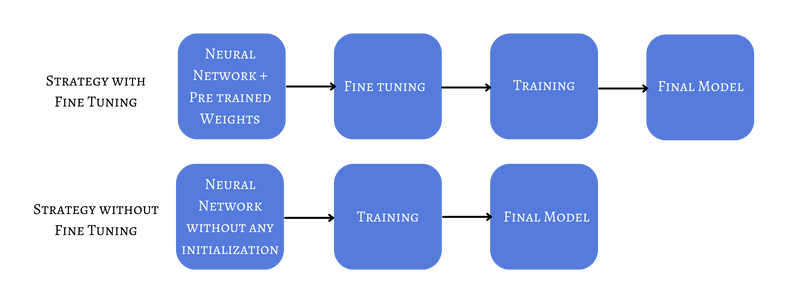
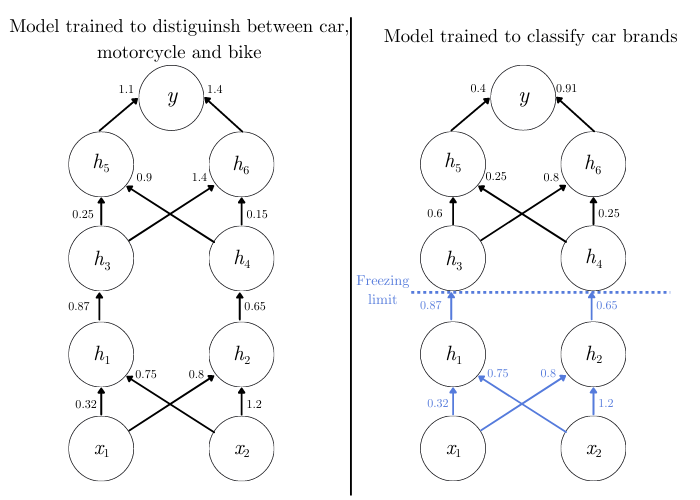

# 什么是神经网络中的微调？

1. 简介

    如今，一些卷积神经网络架构（如 [GPipe](https://arxiv.org/abs/1811.06965)）拥有多达 5.57 亿个参数。考虑到计算成本，用我们日常使用的计算机来训练这样的模型几乎是不可能的。

    在本教程中，我们将讨论克服这一问题的方法--微调。

2. 什么是微调？

    在深入了解微调的细节之前，我们先来看看为什么需要微调以及微调是什么。

    1. 动机

        假设我们想训练一个模型来检测人体细胞中的癌症。为了取得好的结果，我们决定使用大型深度神经网络架构。

        假设我们的训练数据集只有 1 000 个样本，但我们有一个用 200 000 个样本[训练](https://www.baeldung.com/cs/neural-network-pre-training)出来的网络，可以对人体组织图像进行分类，而且它有很多层和神经元。

        与其从头开始训练一个新的网络，我们可以重新使用现有的网络。因此，我们在新数据上开始训练，但权重初始化为组织分类网络的权重。这就是微调的一个例子。

        如果我们不使用这种方法，初始权重将是[随机](https://www.baeldung.com/cs/ml-neural-network-weights)的。在这种情况下，复杂的架构将需要大量时间进行[反向传播](https://www.baeldung.com/cs/neural-networks-backprop-vs-feedforward)。

        此外，如果我们在没有上述智能初始化策略的情况下将小数据集用于深度网络，我们很可能会过度拟合数据。

    2. 定义

        简而言之，微调是指将已训练好的网络权重作为训练新网络的起始值：

        

        目前的最佳实践建议，在解决与我们正在处理的问题类似的问题时，使用预先用大型数据集训练过的模型。如果我们手头的任务没有大量数据，但却有一个可随时使用的模型来解决相关问题，且数据量很大，那么这种方法就特别有用。

        如果选择的微调策略不合适，这也会导致过拟合的情况。

3. 微调策略

    我们将讨论两种不同的微调策略。在实际应用中，我们通常会将它们结合起来。

    1. 冻结图层

        最常见的方法是冻结图层。这意味着什么呢？

        当然，我们可以用预先训练好的权重来初始化神经网络，然后根据新的训练来调整所有权重。

        但这样一来，我们可能会失去任何学习能力。

        解决这个问题的一种方法是只冻结前几层，然后对其他层进行训练。冻结初始层的依据是，在初始阶段，网络正在学习基本特征。这正是我们在实施微调时想要提取的。或者，我们可以冻结除最后一层之外的所有层，在训练过程中调整其权重。

        当然，我们可能需要改变输出层，例如，如果旧网络可以区分两个类别，但当前问题中有更多类别。如果输入特征的数量不同，第一层的情况也一样。

        最后，我们可以在旧架构的基础上增加几层。这样，我们可以保留所有旧的权重，只改变新层的权重。

    2. 举例说明

        举个例子，假设我们有两个不同的任务。第一个任务是使用大型数据集训练一个模型，将车辆分类为汽车、摩托车或自行车。

        但是，在我们的新应用中，我们需要对小数据集进行汽车品牌分类。我们可以冻结连接第一个隐藏层的权重（$h_{1}$ 和 $h_{2}$），然后训练网络的其他部分。

        这样，我们就只能更新后续层的权重。因此，我们可以保留初始层学习到的特征，并在其他层中重点学习特定应用的特征：

        

        不过，我们也不要忘记最后一层。如果我们之前有三个类别，而现在有 35 个汽车品牌，那么我们就应该在训练前更新架构，以反映出这一点。

    3. 改变学习率

        微调的一个隐含假设是数据集没有本质区别。

        因此，我们假设之前的训练是有用的。因此，我们不想大幅改变权重值。

        可能影响权重的最重要参数之一是[学习率](https://www.baeldung.com/cs/ml-learning-rate)。该参数定义了权重的更新方式。

        由于我们假设使用的是一个良好的模型，因此在新的训练中应该降低学习率。这意味着起始模型应该在新数据集上表现良好。

        对于微调过程中的学习率，我们通常使用比平时小 10 倍的值。因此，我们的模型将尝试以小步快跑的方式来适应新的数据集。通过这种方法，我们可以避免丢失已经学习到的特征。

        例如，假设我们训练了一个模型来区分狗和猫。之前的学习率等于 0.01。但现在我们想训练一个模型来识别猫的品种。在这种情况下，我们可以使用相同的神经网络架构和权重，但将学习率调整为 0.001。

4. 缺点

    虽然我们讨论了微调的优点，但它并不是一个神奇的解决方案，不应该总是使用。

    第一个缺点是必须满足领域相似性要求。如果不满足这一要求，就没有理由进行微调。

    此外，我们还应该考虑到，我们无法改变给定架构的任何一层。如果我们想保留现有的所有权重，情况就更是如此。反过来，如果我们想使用自己的架构，微调也不是一种选择。

    此外，如果我们的微调选择（冻结哪一层、使用什么学习率）是错误的，我们最终可能会得到一个低质量的模型。例如，权重可能被局部最小值困住。在这种情况下，我们的模型永远不会收敛或获得任何学习能力。

    当然，这是机器学习中的主要问题之一，不仅仅是在使用微调时。但是，在这种情况下，从头开始训练（如果我们有大量数据的话）可以避免这种问题。

5. 结论

    在本文中，我们谈到了微调。当我们想要缩短训练时间时，我们应该始终考虑微调。使用之前训练中学习到的特征会让我们的模型收敛得更快。

    通过避免小数据集的过度拟合，微调可以帮助我们获得性能令人满意、泛化能力良好的模型。

## 相关文章

- [ ] [What Is Fine-Tuning in Neural Networks?](https://www.baeldung.com/cs/fine-tuning-nn)
