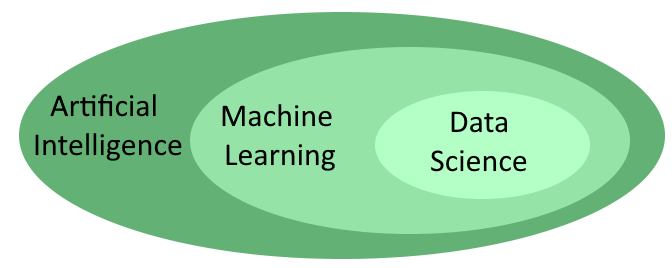
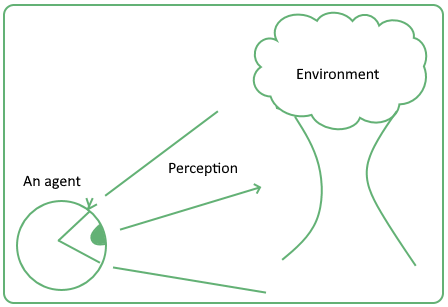

# [学习机器学习有哪些先决条件？](https://www.baeldung.com/cs/machine-learning-how-to-start)

1. 概述

    在本教程中，我们将初步介绍学习[机器学习](https://www.baeldung.com/spark-mlib-machine-learning)和人工智能所需的学科知识。

    首先，我们将了解传统上与机器学习相关的三个专业分支之间的区别。从这些区别中，我们可以推导出不同的职业发展路径，进而形成不同的专业。

    其次，我们将学习机器学习的先决学科。事实上，在深入研究机器学习之前，学生需要掌握一些背景知识。我们将了解我们到底需要什么样的初步知识，以及为什么。

    最后，我们将讨论人工智能研究的一些替代方法。这些替代方法虽然不太常见，但却能为了解它们的人带来巨大的专业和市场价值。

    在本教程的最后，我们将了解机器学习的先决条件是什么。我们还将了解它们与机器学习，特别是与人工智能的关系。

2. 数据科学、机器学习工程和人工智能

    当代学术界和公众讨论经常交替使用数据科学（Data Science）、机器学习（Machine Learning）和人工智能（Artificial Intelligence）这三个术语。然而，这三个名称所指向的概念略有不同，因此我们应将它们分开：

    - 数据科学是一门与数据集分析和从中提取人类可读见解有关的学科。
    - 机器学习是软件工程的一个分支；它涉及为实际软件应用构建和调整统计模型和数据管道
    - 人工智能是致力于在人工系统中复制人类认知的学科的总称。
    因此，它们相互关联，但并不等同。不过，更准确地说，我们可以说，除了数据科学是三者中最特殊的一门学科外，它们中的每一门学科都包含了另一门学科：

    

    现在让我们更详细地了解它们。

    1. 谁在每个分支中工作？

        数据科学家是在公司或公共机构的数据科学部门工作的专业人员。数据科学家的工作是处理数据集，这些数据集通常非常庞大。他们还能从中提取见解，以便高级管理层做出明智的决策。

        机器学习是软件工程师的工作领域。他们是开发企业使用的数据库以及与其利用相关的数据管道的专业人员。

        在纯人工智能领域工作的，大部分是学者和科学家。令人惊讶的是，他们中的许多人并不属于计算机科学系，而是与其他一些分支机构合作。除了显而易见的计算机科学外，其中最常见的是心理学、认知科学、神经学和哲学。

    2. 我们应该选择哪个分支？

        在这三个传统上与机器学习相关联的分支中做出选择，应基于我们对与之相关的学科的个人研究倾向：

        - 数据科学需要深厚的统计学、概率论和数学知识。这可能不是每个人都能掌握的，因此在决定是否选择这条职业道路时，应该进行深入思考。它还需要另一个正交学科的知识：许多数据科学家并不是纯粹的程序员，而是经济学家、营销专家或社会科学家。
        - 机器学习工程是软件工程师的工作领域，涉及使用多种语言编写和测试代码。如果程序员习惯于使用关系数据库、Java、C++ 和 Python，但又不想接触微积分，那么他可能应该考虑这种职业发展方向。
        - 人工智能是一门纯粹的学科，属于科学家的领域。如果一个人对基础或基本研究感兴趣，并希望通过对认知科学或心理学等其他领域的良好理论理解来补充自己在编程或统计方面的知识，那么他就应该接触这一领域。

        一旦决定了职业道路，我们就可以确定这三类专业人员都应该了解哪些学科。显然，每个学科的相关知识深度会根据我们选择的职业轨迹而有所不同，但所有三个分支的专业人员都应熟悉机器学习所有传统先决条件的基础知识。

3. 机器学习的传统先决条件

    所有想在机器学习领域工作的人，无论选择哪种具体的职业道路，都至少需要了解以下学科： 统计学、概率论、线性代数、微积分和编程。让我们来看看这是为什么，以及它们与机器学习有什么关联。

    1. 统计学

        统计学是一门对一系列观察结果的模式进行识别、提取和归纳的学科。虽然机器学习中并非所有的 "学习" 都基于统计学，但其中有相当一部分确实是基于统计学的。因此，在开始接触机器学习领域时，统计学通常是首先要学习的科目。

        统计学中的一些概念是机器学习的基础概念。这些概念是：

        - 观察、特征和数据集，统计学中的分析单位--观测，也是机器学习中的分析单位
        - 模式提取和统计建模。提取观察特征之间的模式或关系是机器学习中最常见的任务之一。
        - [回归分析](https://www.baeldung.com/kotlin-supervised-learning#linear-regression)。虽然机器学习有一些与统计不共享的模型，如[神经网络](https://www.baeldung.com/deeplearning4j)，但大多数模型在两者之间是共通的。这意味着，机器学习专业人员除了要熟悉统计学中常用的所有技术外，还要熟悉本学科特有的技术。

    2. 统计学与可复制性问题

        要理解机器学习模型的局限性，还需要了解统计学的理论基础，因为这些局限性是相同的。其中一个限制尤为重要，它与现象的可复制性问题有关。

        统计学是一门研究重复现象的科学，大多数机器学习也是如此。然而，并非所有现象都是可复制的，如果不可复制，机器学习就无法对其进行研究。通过了解统计何时可以应用，何时不可以应用，我们可以立即了解机器学习何时可以应用，何时不可以应用。

        假设我们生活在 17 世纪，还没有人观测到恒星爆炸。研究超新星的第一人第谷-布拉赫（Tycho Brahe）不可能在研究中使用统计分析，因为他所研究的现象在当时是独一无二的。这并不意味着不能研究独特的现象，而只是说统计分析不是研究的方法。

    3. 概率论

        概率论是一门研究结果不确定事件的学科。这些事件可能尚未发生，也可能已经发生。

        如果尚未发生，我们通常可以研究其发生的概率或其具有某些特征的概率。如果这些事件在过去已经发生过，在这种情况下，我们就可以用概率来表示我们对不确定性的衡量。

        概率论是构建涉及不确定性的机器学习模型的基础。有些模型，尤其是所有贝叶斯模型，都建立在概率论所阐述的理论假设之上。

        与统计学一样，机器学习专家也需要了解概率论，以便理解什么情况下模型会因为违反理论假设而无法应用。

    4. 线性代数

        线性代数是数学的一个分支，主要研究向量、向量空间、矩阵和张量，以及[围绕它们的所有运算](https://www.baeldung.com/java-matrix-multiplication)。由于与数据挖掘和统计建模相关的大多数活动都涉及对某种矩阵的计算，因此我们需要线性代数的知识才能使用这些模型。

        具体来说，将线性代数应用于机器学习的大部分时间都花在确定矩阵和张量的正确形状或维度上。然而，了解这门学科的具体理论也同样重要，因为机器学习中的一些典型任务，如降维和[主成分分析](https://www.baeldung.com/cs/principal-component-analysis)，需要了解实现这些任务的基本代数原理。

        线性代数通常是机器学习专业学生需要掌握的最简单的数学学科，因此，我们应该在学习统计学的同时或之后学习线性代数。

    5. 微积分

        微积分是一门研究连续性的学科，但经典计算中没有一件事是连续的。为什么微积分常常与机器学习联系在一起？要理解其中的原因，我们需要退一步，从计算机的角度来思考一般的科学建模。

        当我们对一种现象进行建模时，我们必须对其采用一些假设，这些假设是假定的，但从未被证明过。其中一个假设涉及当我们不观察变量时，也就是不进行相关测量时，变量会发生什么变化。

        我们永远无法保证在不进行测量时变量会发生什么变化。因此，一个最常见的假设是，我们测量的变量是连续的，如果我们进行更多的测量或提高仪器的分辨率，它们原则上可以在观测之间假设所有可能的值。

        然而，如果这一假设是错误的，那么我们由此推导出的所有结果也都是错误的。另一方面，如果假设成立，我们就有了一整套机器学习工具，可以用来处理收集到的数据。

    6. 微积分为何重要？

        因此，问题在于我们是否可以假设变量是连续的，从而在模型中应用微积分。为了回答这个问题，让我们回到计算机上来。

        计算机并不在连续空间中运行，而只是对连续空间进行近似。尽管如此，由于近似对于大多数实际用途来说已经足够好了，我们通常可以将测量视为连续的，从而应用微积分。

        值得注意的是，本段中的考虑不仅适用于数据集中的观测值，也适用于我们假定为连续的其他离散变量，例如神经网络中的权值或误差。如果它们不是连续分布的，我们就无法在神经元上应用[梯度下降](https://www.baeldung.com/java-gradient-descent)来指导它们的学习。

        实际上，在初次接触机器学习时，我们只需掌握足够的微积分知识，就能理解如何计算神经网络中最常见[激活函数](https://www.baeldung.com/cs/ml-nonlinear-activation-functions)的导数，而无需掌握更多。

    7. 编程

        最后，但并非最不重要的一点是，机器学习专家显然必须懂得编程。他们需要精通编程的程度差别很大。数据科学家需要的编程经验最少，而机器学习工程师和人工智能研究人员需要的编程经验最多。

        这些是通常与机器学习相关的编程语言：

        - 用于数据分析的 [Python](https://www.baeldung.com/java-working-with-python) 和 R
        - 用于生产的 Python、C 和 C++
        - 用于 [Java 虚拟机](https://www.baeldung.com/jvm-languages)的 [Scala](https://www.baeldung.com/scala-intro)、[Kotlin](https://www.baeldung.com/kotlin-supervised-learning) 和 [Java](https://www.baeldung.com/tensorflow-java)
        - 用于多代理模拟的 Unity（C#）和 NetLogo

        需要强调的是，从机器学习的角度来看，编程只是我们使用的一种工具。但这并不是我们工作的最终目的。

4. 同样重要但常被忽视的其他方法

    机器学习和人工智能还有其他理论方法，相应的学科也有很多，它们可以指导那些初次接触这一领域的人进行研究。我们在此讨论的是

    - 心理学和认知科学
    - 一般系统理论
    - 基于代理的建模
    - 复杂性理论

    现在让我们来看看它们与人工智能之间鲜为人知但同样重要的关系。

    1. 心理学与认知科学

        如前所述，人工智能是认知研究向非人类系统的延伸。所有人工神经网络工作的灵感来源实际上都是人脑，人工神经网络试图以可计算的方式复制人脑。

        通过人工神经网络复制人类认知的方法被称为 "连接主义"，是人工智能的两种理论方法之一。数据科学家和机器学习工程师在工作中主要采用这种方法。同样重要的是与人类符号推理相关的方法。

        符号学是第二种方法的名称，是涵盖人工智能在符号推理中应用的理论。知识图谱的构建、聊天机器人以及[自然语言处理](https://www.baeldung.com/apache-open-nlp)的方法论，都是基于象征主义的人工智能理论方法。

        机器学习工程师通常专注于人工智能的联结主义方法，而其他类型的工程师，如知识工程师，则致力于在专家系统中[实现符号推理](https://www.baeldung.com/java-ai#expert-systems)。这类职业通常要求既懂编程，又懂心理学或认知学。

    2. 通用系统理论和控制论

        系统理论或通用系统理论是一门学科，其重点是制定适用于所有其他系统理论的原则。从某种意义上说，由于大多数理论都涉及系统，因此它是一种以所有其他理论为内容的元理论。

        一般系统理论与机器学习之间的关系并不明显。不过，如果我们将机器学习系统概念化为必然嵌入在更大系统中的系统，两者之间的关系就会变得显而易见：

        

        这些更大的系统可以是社会的、生物的、电子的、信息的，也可以是其他类型的。但在所有情况下，总会存在某种非机器学习系统，其中包括作为其子系统的机器学习系统。由于没有一个机器学习系统是生活在真空中的，因此它的运行能力在很大程度上取决于它与大系统中其他组成部分的交互作用，而这种交互作用可以用一般系统理论来研究。

        通用系统理论还与控制论有关。后者是一门研究系统各组成部分之间的反馈和交流的学科。控制论则是现代计算机科学和人工智能学科的起源科学。

        通用系统理论是系统工程师的专业领域知识。他们是人工智能领域的专业人士，负责将机器学习系统集成到更大的社会或机器人系统中。如果我们对机器学习的兴趣与机器人或世界表征有关，那么通用系统理论就是我们的必由之路。

    3. 基于代理的建模

        基于代理的建模或多代理建模是一种方法论，而不是一门学科或理论方法。不过，由于它在人工智能计算机模拟中的广泛应用，在此还是有必要提一下。

        它与人工智能的关系源自 [Russel 和 Norvig](http://aima.cs.berkeley.edu/) 给出的智能定义。根据他们的定义，智能是一种从代理与其环境的互动中产生的属性。这意味着，在建立人工智能系统时，我们必须首先定义一个环境，然后才能建立一个在环境中运行的代理。

        任何基于代理建模方法的研究，都是从定义一个代理和这个代理所处的环境开始的。然后再定义该代理的目标及其与环境相关的感知能力：

        
        该方法通常涉及对学习过程的研究，学习过程发生在代理在其环境中的行为以及根据环境调整其行为的过程中。这种学习方式与机器学习中最常见的学习方式不同。事实上，它是基于一种自下而上而非自上而下的方法，在这种方法中，系统的规则并不是先验地明确编程出来的。

        基于代理的建模是机器学习领域最常见的方法之一。事实上，它允许研究系统的突发特性，而这些特性是我们无法通过其他方法分析得出的。

    4. 复杂性理论与非线性动力学

        人工智能的最后一种替代方法是使用复杂系统理论。复杂系统是指其行为不能还原为其组成部分的综合行为的系统，而是表现出突发特性的系统，我们不一定能通过研究其各组成部分的运行来推断出这些特性。

        复杂性理论的一个典型应用就是研究非线性系统。如果一个系统呈现出非线性动态，我们就不能正确地将其作为线性动态系统建模。一个典型的例子就是洛伦兹系统和相应的吸引子。

        如果我们将其作为非线性系统进行研究，就会发现该系统具有明显的动力学特征，但如果不将其作为非线性系统进行研究，就会发现该系统具有明显的动力学特征。机器学习中通常会遇到的许多系统都是隐秘的非线性系统；因为对于它们来说，机器学习模型在运行过程中会产生影响并改变其底层物理系统的效应。

        假设我们正在建立一个预测房价的模型，又假设根据该模型的预测，我们实际上决定购买或出售房屋。

        该模型及其预测将影响系统运行的各种因素。反过来，这最终会使模型失效。随着时间的推移，我们应该会发现模型的预测与其基础系统之间的差异越来越大。

        如果我们试图预测一个系统的未来行为，但同时我们的预测又会影响该系统的行为，那么通过标准的机器学习技术对系统进行建模就变得不可能了。在这种情况下，复杂性理论可以帮助我们解决原本无法解决的任务。

5. 结论

    在本文中，我们已经了解了通常与机器学习相关的三个不同分支--即数据科学、机器学习工程和人工智能--之间的联系和区别。

    我们还了解了机器学习研究的共同先决条件。与此同时，我们还找出了它们与专家的关系的原因。
