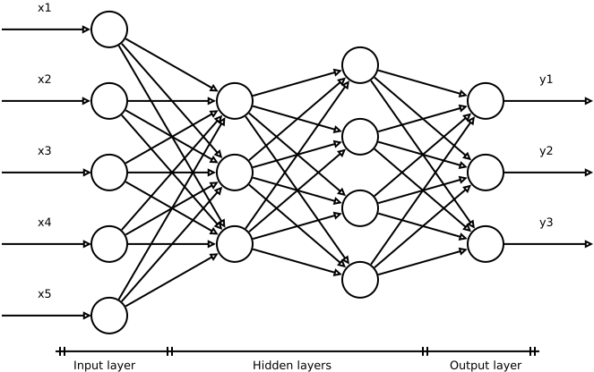

# [线性模型的不足：通往非线性函数之路](https://www.baeldung.com/cs/ml-linear-activation-functions)

1. 引言

    在本教程中，我们将分析激活函数在神经网络中的作用。实际上，激活函数在历史上走过了一条复杂的道路。因此，我们将研究其认识论、技术和数学方面是如何引导我们向非线性激活函数靠拢的。

    我们将从线性激活函数开始，分析其局限性。最后，我们将通过一些例子来说明为什么使用线性激活函数来解决非线性问题证明是不够的。

2. 前馈神经网络的结构

    我们将重点分析完全互联的前馈神经网络，其结构表示为

    

    这类网络没有递归连接，每个连接都将一层的单元与下一层的所有单元连接起来。

    它们是有监督神经网络的一个例子，通过呈现示例（数据集）进行学习，将网络输出与相对目标的测量值进行比较。

    传播从左到右进行。我们用向量 \mathbf{x} 表示输入单元集，用 \mathbf{y} 表示输出单元集。连接输入和输出的未知关系由单元内发生的数学变换建模。

    深度网络是一个包含多层的网络。

    1. 激活函数

        接下来，我们要介绍网络中每个单元的结构：

        

        每个连接都可以通过权值 $w_{i}$ 来放大或抑制相对输入 $x_i$ 的值。每个单元的 N 个连接集合为加权和：

        \[\Sigma=w_{0}+\sum_{i=1}^{N}w_{i}x_{i}\]

        信息主要存在于权重值中。训练过程的主要目的是找到权重的最优值。

        偏置被视为一个附加单元，其输出等于 1，权重为 $w_{0}$。它具有 y-截距（偏移）的功能。

        如果没有偏置，网络生成的模型将被迫从问题空间的原点或点$(\mathbf{x} =0, \mathbf{y} =0)$经过。偏差增加了灵活性，允许对不满足这一条件的数据集进行建模。

        总和 $\Sigma$ 根据一个叫做激活函数 $\phi$ 的函数进行转换。通常情况下，网络上所有单元的 $\phi$ 都是相同的；但它们也可能不同。如果 $\phi$ 是非线性的，那么神经网络就能够模拟数据中存在的非线性关系。

        [本-克罗斯（Ben Krose）和帕特里克-范-德-斯马格（Patrick van der Smag）](https://www.infor.uva.es/~teodoro/neuro-intro.pdf)的著作已经成为神经网络的经典之作，是神经网络的最佳入门读物。[Schmidhuber](https://arxiv.org/abs/1404.7828) 的论文和 [Bishop](https://www.amazon.com/Networks-Recognition-Advanced-Econometrics-Paperback/dp/0198538642) 的书对神经网络进行了技术性更强、更深入的阐述。

3. 知识与模型

    在人工神经网络中使用非线性激活函数的主要原因是技术性的。不过，也有认识论方面的原因。

    从某种意义上说，机器学习领域使用的算法是不可能的结果。这是由于缺乏理解和知识，导致无法用传统的科学方法来处理某些类别的问题。这一问题在神经网络等黑盒模型中尤为明显。

    这一事实导致了操作范式的改变，需要从新的角度来看待这些问题。我们可以将其表述为：构建预测模型的方式意味着放弃对现象的深刻理解。

    1. 模型的发展

        在过去的三个世纪里，直到最近，实证科学知识的进步主要是通过构建模型来实现的。非经验科学，如统计学和一般数学，有不同的操作方法。

        重要的是要明白，许多公认的科学模型和理论并不仅仅是我们测量数据的结果，也是对世界定性观察的结果。

        让我们想想一些非常复杂的物理理论，如广义相对论或量子力学。今天，我们认为它们是物理世界的有效表征。但是，通往这些理论的道路是漫长而复杂的。

        重要的是，定性知识和对现象进行推理的可能性让我们能够设计实验。通过这些实验，我们对不同的方案进行了比较，对模型进行了校准，使它们达到了目前的状态。

        这些理论的预测非常准确，因为这一过程使我们能够确定物理现象所依赖的所有变量和参数。

        在两种理论之间做出选择时，这个问题尤为明显，因为这两种理论都能令人满意地解释测量数据。在这种情况下，不能根据预测能力在两者之间做出最终选择。在这种情况下，通用性、简单性和优雅性等概念就会发挥作用。

        [奥卡姆剃刀](https://en.wikipedia.org/wiki/Occam%27s_razor)在科学界作为指导原则使用了几个世纪，它表达了这类考虑的重要性。

    2. 新范式

        问题在于，在传统的科学发展中，某些选择并非真正的选择。它们的线性或非线性结构是理论发展过程的结果，而正如我们所说，理论发展过程并不仅仅取决于测量数据。

        当现象复杂时，我们通常会求助于非线性模型。不过，也有很多自然规律受线性模型支配的例子。

        例如，将受弹簧作用的质量的力和位移联系起来的[虎克定律](https://en.wikipedia.org/wiki/Hooke%27s_law) - F=-kx，就是一个线性模型的例子，它可以准确预测真实的物理现象。

        近几十年来，由于计算能力的不断提高，出现了新的需求。数字技术使得收集海量数据成为可能，而这些数据必须以某种方式相互关联才能进行预测。

        在这种情况下，我们所讨论的物理模型的定性部分往往缺失。对世界的推理要困难得多，甚至是不可能的，在一般情况下无法帮助我们确定模型。

        其后果是，很多时候，即使模型已经选定，我们也无法知道所获得的结果是接近还是远离最佳可能解。这就迫使我们从一个新的角度、新的范式来处理这些问题。

        在这种情况下，模型的结构就成了一种选择，在很大程度上是任意的，必须在信息不完整的情况下进行操作。

    3. 举例说明

        考虑一下我们上网时许多在线服务提供的个性化广告。它们的准确性是广告商有兴趣以这种方式推广其产品的关键。

        从表面上看，我们可能会认为广告应该取决于年龄和过去的购买记录。但具体是怎样的呢？

        例如，我们的口味会随着时间的推移而改变，因此购买的时间长短可能也很重要。也许我们应该加上潜在客户的地理区域。我们还需要其他参数吗？

    4. 选择的任意性

        至少可以部分回答这些问题。

        然而，由于我们甚至无法确定问题所依赖的所有参数，为解决这个问题而建立的模型显然不可能像我们讨论过的传统科学模型那样精确。

        神经网络和其他黑盒算法可以在测量数据之间建立一种关系，以解决无法进行经典分析的未知问题。这些程序的优点在于它们可以在有限的时间内获得结果，无论结果是好是坏。以上讨论强调了人工神经网络的基础模型结构在很大程度上是一种任意选择。

        由于对这些算法所处理的问题的内在复杂性缺乏了解，因此需要选择最灵活的模型。我们的目标是在最有可能获得良好结果的情况下。非线性模型先验地提供了这些条件。

4. 线性模型和非线性模型

    数学函数有多种分类方法，其中之一是将其分为线性和非线性。

    线性函数是满足以下一般条件的函数：

    \[f( ax+by ) =af( x ) +bf( y )\]

    因此，线性模型就是由线性函数支配的程序；否则，它们就被称为非线性模型。

    这个区别很重要。我们可以近似地认为线性模型比非线性模型简单。

    在某些情况下，这种区别能让我们直观地了解模型如何随着自变量和参数的变化而演变，而非线性模型则要复杂得多。这就是线性模型和方程历来首先被研究的原因。

    如今，计算量可承受问题的复杂性使得有必要使用非线性方法。不过，也有一些非常复杂的线性程序。例如，用于预测静态时间序列的 [ARIMA](https://en.wikipedia.org/wiki/Autoregressive_integrated_moving_average) （自回归整合移动平均）模型就使用了线性方程。

    到目前为止，我们已经隐含地认为，模型的线性是由其使用的函数的线性给出的。然而，我们必须始终考虑到，线性统计模型并不等于线性函数。

    非线性函数可能导致线性模型。如果线性是由模型参数而非预测变量决定的，就会出现这种情况。我们将考虑人工神经网络的非线性特征，这是使用非线性激活函数的结果。

    一般来说，我们可以说非线性模型更灵活，可以模拟更复杂的现象。但是，非线性模型也有更多的自由度，并在数量之间建立更复杂的关系。因此，它们更难校准和测试。

    1. 考虑线性模型的直观方法

        假设我们想建立一个线性模型来预测一个依赖于单一自变量的问题。

        假设我们有一系列因变量（我们要预测的变量）和自变量的测量值。我们将因变量称为目标，自变量称为输入。然后，我们可以将这些数据绘制成二维图形。

        线性模型包括寻找最能解释测量数据的最佳直线。这条直线在包含观测数据的图形上的排列，可以让我们直观地了解模型的质量。

        [线性最小平方回归](https://en.wikipedia.org/wiki/Least_squares)就是这种模型的一个例子。该模型的目标是将数据集拟合到一条直线上，使观测值的平方偏差最小：

        

        要表示双变量问题的数据序列，我们需要一个三维图形。在这种情况下，线性模型由最能解释观测数据的平面方程构成。

        一般来说，当问题的规模增大时，线性模型的构建形式化为寻找最能适应观测结果并能让我们做出最准确预测的超平面。

        当我们需要绘制一条曲线来为问题建模时，我们就会面临一个非线性问题。

5. XOR 问题：一个 "简单-复杂" 的例子

    现在我们来看一个具体的例子。假设我们有一个数据集，我们想为这个数据集建立一个模型。

    如前所述，在神经网络中，模型的结构是任意的。因此，既然我们不希望复杂化，就决定使用线性模型。这种态度假定我们可以同时使用线性模型和非线性模型获得可接受的结果。

    然而，这种说法是错误的。我们将举例说明。

    XOR 运算符是许多编程语言中基本位运算符的一部分。它只有两种可能的值--真或假，并且取决于两个参数（x,y），而这两个参数也有两种可能的值。

    我们可以把它看作一个双变量数学函数，其值取决于两个命题或自变量的真假。

    所谓的真值表描述了这个问题：

    | x | y | XOR |
    |---|---|-----|
    | 0 | 0 | 0   |
    | 0 | 1 | 1   |
    | 1 | 0 | 1   |
    | 1 | 1 | 0   |

    (a)

    | 1 | 0 |
    |---|---|
    | 0 | 1 |

    (b)

    子表 (b) 是将真值表排列成笛卡尔表示法的一种方式。

    与自然语言中使用的逻辑析取不同，当两个参数为真时，XOR 为假。我们可以将其视为一个离散示例，并将其作为一个分类问题来分析，在这个问题中，函数的输出可能属于两个可能的类别。

    1. 线性模型无法解决 XOR 问题

        用线性方法解决 XOR 问题意味着我们可以在子表 (b) 中画出一条直线，将两个类别完全分开。

        然而，这样的直线并不存在。在神经网络中，单个线性神经元无法分离 XOR 问题这一定义明确的简单问题。[明斯基和帕帕特](https://en.wikipedia.org/wiki/Perceptrons_(book))在 1969 年正式证明了这一结果。

        如果我们使用两条线，问题就变得可分离了。在神经网络中，这意味着我们有不止一个神经元，网络允许获得两个决策边界。

        我们将在下一节中看到，这种方法无法推广到一般的非线性问题中。

6. 具有线性激活函数的多层网络

    增加一个神经元可以分离非线性 XOR 问题。这一操作增加了我们所说的 "决策边界" 的数量，从而提高了算法的解决能力，使其能够分离不同的可能性。

    原则上，我们可以将这一过程扩展到任何问题。这意味着，我们能够找出一组最佳条件，从而实现问题的线性可分性。

    我们可以考虑推广这种方法，增加层数和每层的单元数，从而获得更多的决策边界。然而，对于高度复杂的多维非线性问题，这种方法并不可行。

    XOR 是一个非线性问题，但可以线性化。这意味着，我们可以通过将我们的领域划分为子域来添加额外的条件，在每个子域中，行为都是线性的。在数学上，这意味着在每个子域中，支配我们问题的假设数学函数都有一个常数导数，与其他子域不同。

    然而，只有线性激活函数的多层网络并不能帮助我们完成这项任务。

    1. 线性激活函数的多层神经网络

        假设一个网络有 i、j 和 k 三层，每一层的输出都是下一层的输入，网络表达的整体函数为

        \[\sum_{i}w_{i}\left(\sum_{j}w_{j}\left(\sum_{k}w_{k}x_{k}+w_{k0}\right)+w_{j0}\right)+w_{i0}\]

        其中，每个和都包含每层的所有单元，子索引为 0 的权重表示偏置。经过计算，这个表达式可以归结为

        \[\sum_{i}\sum_{j}\sum_{k}w_{i}w_{j}w_{k}x_{k}+\sum_{i}\sum_{j}w_{i}w_{j}w_{k0}+\sum_{i}w_{i}w_{j0}+w_{i0}\]

        这对应于一个单层网络 （sum_{k}w'_{k}x_{k}+w'_{0}，其中：

        \[w'_{k}=\sum_{j}\sum_{k}w_{i}w_{j}w_{k}\]

        \[w'_{0}=\sum_{i}\sum_{j}w_{i}w_{j}w_{k0}+\sum_{i}w_{i}w_{j0}+w_{i0}\]

        线性函数的组合仍然是线性函数，如果数据中存在的关系本质上是非线性的，这样的结构可能会导致结果不佳。

        我们还可以证明，这样的单层网络中的单元数会随着问题规模的增大而呈指数增长，从而导致数据量不足以识别所有条件边界的情况。

7. 结论

    在本教程中，我们概述了线性问题和非线性问题之间的区别，以及前者如何不足以处理复杂的非线性问题。

    解决问题的思维方法至关重要。因此，我们还从方法论的角度简要讨论了这一问题。人工神经网络基础模型的特征在某种程度上是一种任意选择，但一般来说，线性模型并不是一个好的选择。

    所有这些考虑因素都趋向于非线性激活函数，并导致非线性多层网络的出现。
