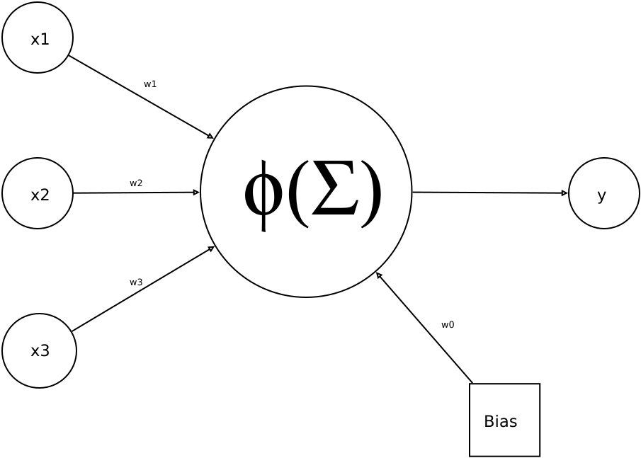
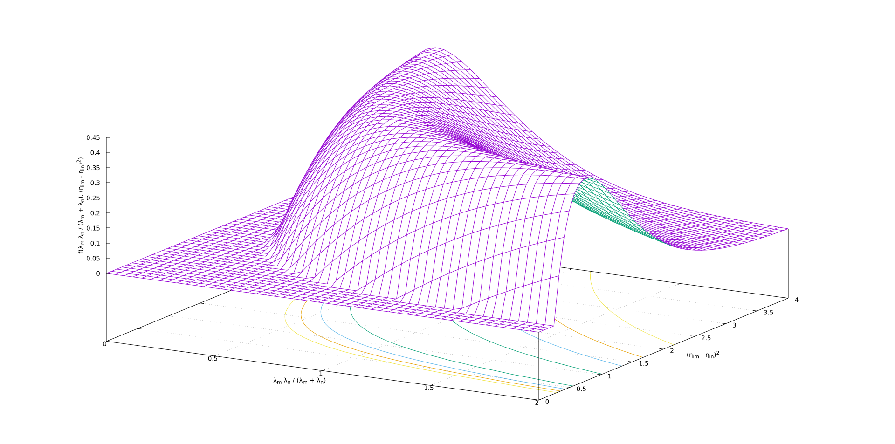
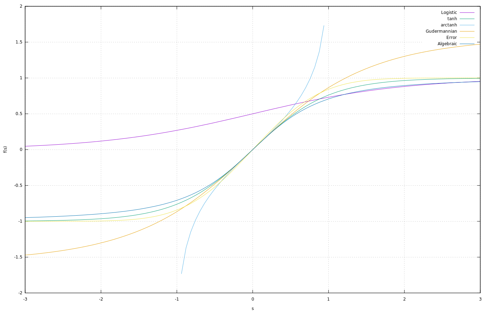
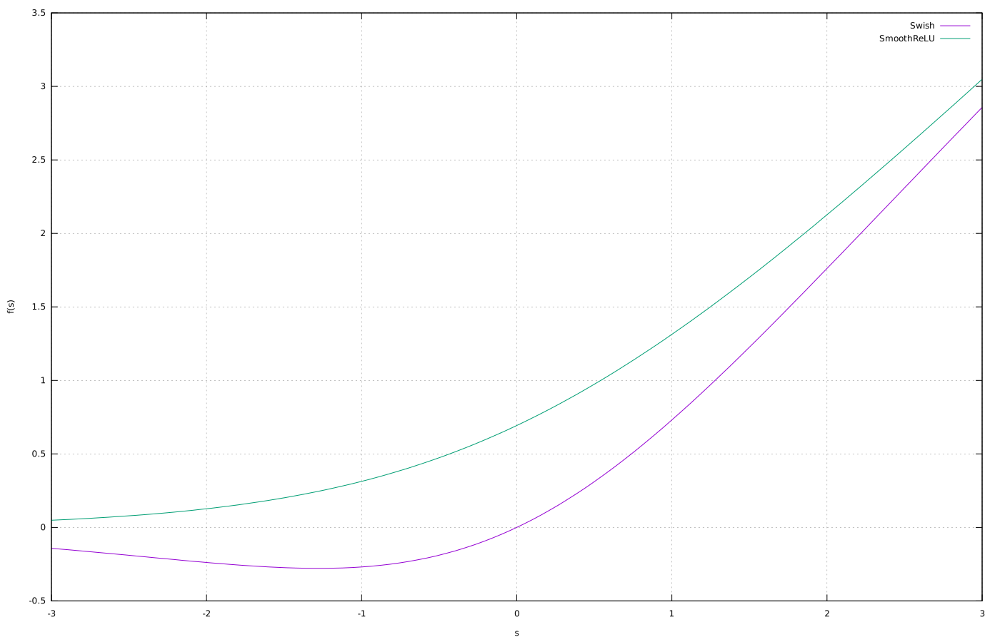

# [反向传播神经网络中的非线性激活函数](https://www.baeldung.com/cs/ml-nonlinear-activation-functions)

1. 简介

    在本教程中，我们将研究反向传播算法和其他学习程序中最常用的非线性激活函数。

    [上一篇文章](https://www.baeldung.com/cs/ml-linear-activation-functions)已经分析了使用非线性函数的原因。

2. 前馈神经网络

    反向传播算法在完全互联的前馈神经网络（FFNN）中运行：

    

    结构的单元：

    

    $\phi$ 函数对输入的加权和进行转换：

    \[\Sigma=w_{0}+\sum_{i=1}^{N}w_{i}x_{i}\]

    我们将在[线性模型一文](https://www.baeldung.com/cs/ml-linear-activation-functions)中更详细地讨论 FFNN。

3. 激活函数家族指南

    让我们以下面的非线性函数为例：

    

    根据我们在线性函数一文中的考虑，平面（线性模型）显然无法逼近图中的函数。

    在引言中，我们使用了 "单元(unit)" 一词，而不是 "神经元(neuron)"。生物类比在很多情况下会产生误导。

    神经网络是数学和统计程序，与生物神经网络的相似性有限。不过，这种类比在某些情况下可能有用，我们将讨论神经元的输出，以证明选择某些非线性函数族作为激活函数的合理性。

    生物神经元传递电信号。电信号通过细胞膜经轴突传播到下游神经元。当离子 $K^+$ 和 $Na^+$ 的浓度发生变化（动作电位）时，神经元会尝试重建电平衡，而电位差和电信号就是这种尝试的结果。

    1952 年，[霍奇金和赫胥黎](https://en.wikipedia.org/wiki/Hodgkin–Huxley_model)解释了这一机制的特点和随时间的变化，他们因此获得了 1963 年的诺贝尔医学奖。

    1. 突触

        信号从一个神经元传递到另一个神经元是通过突触传递进行的，突触传递有[两种类型](https://www.ncbi.nlm.nih.gov/pubmed/24619342)。如果两个神经元相互接触，则直接传递电信号（电突触）。如果两个神经元不接触，则信号通过化学神经递质传播（化学突触）。

        由于两个细胞之间有物理接触，电突触通常速度更快，而且是双向的，传统上与反射反应有关。然而，这种类型的信号不受调节，无法适应环境条件的变化。

        因此，进化产生了化学突触，通常出现在高等动物中，具有单向性，可以增强或抑制信号。

        化学突触的传输速率低于电子突触，但却具有可塑性，能够适应环境条件，从而导致学习，即校准神经元连接。

        如果要强行类比，人工神经网络中的可调权重就是一种类似于生物化学突触的数学模型。

    2. 阶跃函数

        生物神经元的输出是数字的，即发射与否。

        膜电位在非常有限的时间内达到最大值。在人工神经网络的单元信号建模中加入时间概念后，产生了[尖峰神经网络](https://en.wikipedia.org/wiki/Spiking_neural_network)，这是一个非常活跃的研究领域。当信号值超过阈值时就会产生信号，因此具有不连续性。

        下面我们将对这种行为或阶跃函数进行说明，我们可以将其视为生物神经元的激活函数：

        

4. 反向传播

    现在让我们简要介绍一下反向传播背后的理论。我们可以参考 [Krose 和 Van der Smagt](https://www.infor.uva.es/~teodoro/neuro-intro.pdf) 的经典论文以及 [Bishop](https://www.amazon.com/Networks-Recognition-Advanced-Econometrics-Paperback/dp/0198538642) 的著作。

    1. 通用逼近定理

        反向传播是我们开发的一种用于训练多层神经网络的算法。

        然而，对这种网络的需求似乎与 "通用逼近定理"（[Universal Approximation Theorem](https://en.wikipedia.org/wiki/Universal_approximation_theorem)）相矛盾。这一结果证明，具有单隐层和非线性激活函数的网络几乎可以逼近所有连续函数。第一个版本是 Cybenko 于 1989 年针对 sigmoid 激活函数提出的。

        遗憾的是，理论结果是一回事，应用又是另一回事：

        - 我们可以看到，单层网络中的单元数量是如何随着问题的大小呈指数增长的，在某些情况下无法应用或无法进行学习，从而获得较差的泛化技能。
        - 此外，通用逼近定理对学习过程一无所知

        进一步的研究完善了 Cybenko 的原始结果。

        1991 年，霍尼克证明，不是激活函数的具体选择，而是多层前馈结构本身赋予了神经网络成为通用近似器的潜力。这些考虑为寻找适用于多层神经网络的算法（如反向传播）提供了理由。

    2. 学习规则

        在有监督的神经网络中，目标的测量数据可用于校准给定输入的网络输出。

        学习过程包括网络权重的变化，从而获得对目标的最佳预测。这种变化是通过应用规则实现的。

        这类模型的几乎所有学习规则都是希伯（Hebb）于 1949 年提出的[希伯学习规则](https://en.wikipedia.org/wiki/Hebbian_theory)的变体。一些例子如下

        \[\Delta w_{jk}=\gamma y_{j}y_{k}\]

        \[\Delta w_{jk}=\gamma y_{j}(t_{k}-y_{k})\]

        其中，权重 $w_{jk}$ 指的是单元 j 和单元 k 之间的连接。

        请注意，输出层之前一层单元的输出会成为当前单元的输入$(y_j = x_k)$。

        $\gamma$ 是一个比例常数，称为学习率，是需要优化的网络参数之一。

        $t_k$ 是输出单元 k 的目标测量值。

        最后一条规则特别直观，因为它实现了权重的变化，而权重的变化取决于输出与期望值之间的差值，只需使用线性激活函数进行微分计算即可得到。

    3. 德尔塔法则

        假设一个单层网络使用网络输出与目标值之间的二次误差来衡量预测的好坏，并使用测量数据集的 P 条记录：

        \[E=\sum_{p=1}^{P}E^{p}=\frac{1}{2}\sum_{p=1}^{P}(d^{p}-t^{p})^{2}\]

        网络输出由线性加权和的激活函数给出：

        \[y=w_{0}+\sum_{j}w_{j}x_{j}\]

        误差表达式中的系数 1/2 是任意的，其作用是在微分过程中获得单位系数。

        对于模式 p，德尔塔法则将权重变化与误差梯度联系起来：

        \[\Delta_{p}w_{j}=-\gamma\frac{\partial E^{p}}{\partial w_{j}}\]

        负号表示我们试图通过改变权重来最小化误差，因此也被称为梯度下降法。

        导数可以用链式法则计算：

        \[\frac{\partial E^{p}}{\partial w_{j}}=\frac{\partial E^{p}}{\partial y^{p}}\frac{\partial y^{p}}{\partial w_{j}}\]

        根据前面的误差和输出表达式，我们可以得出

        \[\frac{\partial y^{p}}{\partial w_{j}}=x_{j}\]

        \[\frac{\partial E^{p}}{\partial y^{p}}=-(t^{p}-y^{p})\]

        从而得出最后的表达式：

        \[\Delta_{p}w_{j}=\gamma x_{j}(t^{p}-y^{p})\]

    4. 信用分配问题

        在上文提到的文章中，我们已经看到，具有线性激活函数的多层网络可以简化为具有包含线性激活函数单元的单层网络。在这种情况下，上一节中推导出的 Delta 规则是一种合适的学习规则。

        如果我们想利用多层和非线性激活函数提高网络的表达能力，就需要为连接两个任意层的权重找到学习规则。对于连接输出层的权重，原则上可以假设一个与上一节类似的程序。

        通过比较单元输出和目标值，可以获得学习规则。然而，对于前输出层，我们该如何改变权重以最小化误差呢？

        在这种情况下，我们没有目标作为指导搜索的帮助。此外，隐藏层中权重的变化会导致输出成为下游层的输入，以此类推，直到输出层。这是一个问题，因为只有在输出层，我们才能利用目标来了解所有权重的整体变化是否产生了微小的误差。

        这一难题被称为 "信用分配问题"（Credit Assignment Problem），它对我们现在所说的深度学习的发展构成了重大障碍。直到 1986 年，[鲁梅尔哈特、辛顿和威廉姆斯](https://www.iro.umontreal.ca/~vincentp/ift3395/lectures/backprop_old.pdf)发表了一篇经典文章，描述了反向传播算法。类似的算法早在 20 世纪 70 年代就已为人所知，但作者展示了如何将其用作学习程序。

    5. 广义德尔塔法则

        我们的想法是将 Delta 规则广义化，并使用链式规则来获得隐藏层权重变化的表达式：

        \[\Delta_{p}w_{jk}=-\gamma\frac{\partial E^{p}}{\partial w_{jk}}\]

        对于两个相互连接的层 j 和 k（k>j），加权和概括为

        \[s_{k}^{p}=w_{0k}+\sum_{j}w_{jk}y_{j}^{p}\]

        网络单元使用通用非线性激活函数：

        \[y_{k}^{p}=\phi\left(s_{k}^{p}\right)\]

        根据链式规则，可以得到输出层 o 和隐藏层 h 的单元的如下表达式：

        \[\frac{\partial E^{p}}{\partial s_{o}^{p}}=-(t_{o}^{p}-y_{o}^{p})\phi_{o}'(s_{o}^{p})\]

        \[\frac{\partial E^{p}}{\partial s_{h}^{p}}=\phi'_{h}(s_{h}^{p})\sum_{o=1}^{N_{o}}\frac{\partial E^{p}}{\partial s_{o}^{p}}w_{ho}\]

        上述表达式涉及激活函数 $\phi^{'}$ 的导数，因此需要连续函数。

        4.6. 从生物神经元到非线性人工神经网络

        我们迄今为止所做的考虑为我们提供了一个选择非线性数学函数作为激活函数的标准。根据反向传播的要求，它们必须是连续的、可微分的，并且能再现生物神经元输出的趋势。

        我们将研究两个可能的类别：sigmoid 函数和 ReLU 系列。

5. 西格玛激活函数

    西格玛函数是有界、可微、实数函数，对所有实数输入值都有定义，并且在每一点都有一个非负导数。下面是一些重要的西格玛函数及其主要特征。

    1. 对数函数

        logistic 函数的输出范围为 $[0:1]$：

        \[\phi(s_{k})=\frac{1}{1+e^{-s_{k}}}=\frac{e^{s_{k}}}{1+e^{s_{k}}}\]

        它的优点是梯度平滑，缺点是计算成本高。

    2. 双曲正切

        双曲正切具有物流函数的优点和缺点，但输出范围为 $[-1:1]$：

        \[\phi(s_{k})=\tanh(s_{k})\]

    3. 软最大值

        我们可以在分类问题中使用 Softmax，通常是在输出层：

        \[\phi(s_{k})=\frac{e^{s_{k}}}{\sum_{i}e^{s_{j}}}\]

    4. 反双曲正切（arctanh）

        arctanh 与上述公式类似，但使用较少：

        \[\phi(s_{k})=\mathrm{\tanh^{-1}}(s_{k})=\frac{1}{2}\ln\left(\frac{1+s_{k}}{1-s_{k}}\right)\]

    5. 古德曼函数

        Gudermannian 函数将圆函数和双曲函数联系起来，而不明确使用复数：

        \[\phi(s_{k})=\int_{0}^{s_{k}}\frac{dt}{\cosh t}=2\tan^{-1}\left[\tanh\left(\frac{s_{k}}{2}\right)\right]\]

    6. 误差函数

        误差函数也叫高斯误差函数。在统计学中，对于 x 的非负值，以及均值为 0、方差为 1/2 的正态分布随机变量 y，erf x 是 y 落在 $[-x:x]$ 范围内的概率：

        \[\phi(s_{k})=\mathrm{erf}(s_{k})=\frac{2}{\sqrt{\pi}}\int_{0}^{s_{k}}e^{-t^{2}}dt\]

    7. 广义 Logistic

        广义 Logistic 函数可以简化为 a=1 时的物流函数：

        \[\phi(s_{k})=\left(1+e^{-s_{k}}\right)^{-a},\,a>0\]

    8. 库马拉斯瓦米函数

        库马拉斯瓦米函数是 logistic 函数的另一个广义化。当 a=b=1 时，它还原为 logistic 函数：

        \[\phi(s_{k})=1-\left[1-\left(\frac{1}{1+e^{-s_{k}}}\right)^{a}\right]^{b}\]

    9. 平滑步函数

        平滑步函数是

        \[\phi(s_{k})=\left\{ \begin{array}{ll} \left(\int_{0}^{1}(1-t^{2})^{N}\,dt\right)^{-1}\int_{0}^{s_{k}}(1-t^{2})^{N}\,dt,\, & |s_{k}|\leq1\\ \mathrm{sgn}(s_{k}), & |s_{k}|\geq1 \end{array}\right.,\,N\geq1\]

    10. 代数函数

        最后是代数函数

        \[\phi(s_{k})=\frac{s_{k}}{\sqrt{1+s_{k}^{2}}}\]

    11. 西格码激活函数的问题

        应用所列函数作为激活函数时，通常需要对所考虑问题的数据集进行重新缩放。

        例如，如果我们使用 logistic 函数，我们的目标值必须在 $[0:1]$ 范围内进行归一化，这样函数值才能接近目标值。所有激活函数都有这种需求，而不仅仅是 sigmoid 函数。

        然而，这些函数在 $s_k$ 值较大和较小时都会出现饱和效应，从而降低网络的解析能力：

        

        这种机制导致了所谓的梯度消失问题。即在某些条件下梯度消失，这可能会阻碍学习过程。这一缺点可以通过使用较窄的归一化区间来缓解，例如 logistic 函数的归一化区间为 $[0.1:0.9]$，而 $\tanh$ 函数的归一化区间为 $[-0.9:0.9]$。

        此外，一般来说，sigmoid 函数的计算量较大。

6. 整型线性单元 ReLU 系列

    1. 一般特征

        ReLU 系列有许多优点：

        - 生物合理性
        - 梯度传播效果更好：与双向饱和的 sigmoid 激活函数相比，梯度消失问题更少
        - 计算效率高：只需比较、加法和乘法
        - 规模不变

        下图显示了下面提到的一些函数的图形表示：

        

    2. ReLU

        虽然 ReLU 看起来像一个线性函数，但它有一个导数函数，并允许反向传播：

        \[\phi(s_{k})=\max(0,s_{k})\]

        然而，它也存在一些问题。首先是垂死 ReLU 问题。当输入接近零或为负时，函数的梯度变为零，网络无法进行反向传播，也就无法学习。这是梯度消失问题的一种形式。

        在某些情况下，网络中的大量神经元会陷入死亡状态，从而有效降低模型的容量。这种问题通常出现在学习率设置过高的情况下。使用 Leaky ReLU 可以缓解这一问题，因为 Leaky ReLU 会在 x<0 时分配一个小的正斜率。

        此外，它还是一个无界函数，这意味着它没有最大值或最小值。

    3. Leaky ReLU

        Leaky ReLU 通过在负值部分设置一个小斜率来缓解垂死 ReLU 问题，并允许对负值应用反向传播：

        \[\phi(s_{k})=\left\{ \begin{array}{ll} s_{k}, & x>0\\ 0.01s_{k}, & \mathrm{otherwise} \end{array}\right.\]

        然而，它无法对 $s_k < 0$ 进行一致的预测。

    4. 参数 ReLU

        参数 ReLU 允许在学习过程中插入参数 a，而不是像 Leaky ReLU 那样定义一个任意值：

        \[\phi(s_{k})=\left\{ \begin{array}{ll} s_{k}, & x>0\\ as_{k}, & \mathrm{otherwise} \end{array}\right.\]

    5. 噪声 ReLU

        另一种是 ReLU 的扩展，叫做噪声 ReLU。主要区别在于输出包含由高斯概率密度 $\mathcal{N}$ 产生的噪声，其均值为零，标准差为 $\sigma$：

        \[\phi(s_{k})=\max(0,s_{k}+\mathcal{N}(0,\sigma(s_{k}))\]

    6. 指数线性单位

        指数线性单元（ELU）试图让平均激活度更接近零，从而加快学习速度。ELU 可以获得比 ReLU 更高的分类准确率：

        \[\phi(s_{k})=\left\{ \begin{array}{ll} s_{k}, & x>0\ a(e^{s_{k}}-1), & \mathrm{otherwise}. \end{array}\right.,\,a>0\]

    7. 软加或平滑 ReLU

        ReLU的平滑近似（Softplus/SmoothReLU）函数有一个显著特点，即它的导数是对数函数：

        \[\phi(s_{k})=\ln\left(1+e^{s_{k}}\right)\]

    8. Swish 函数

        Swish 函数是由谷歌开发的，它与 ReLU 函数具有相同的计算效率，但性能更优越：

        \[\phi(s_{k})=\frac{s_{k}}{1+e^{-s_{k}}}\]

7. 复杂非线性激活函数

    1. 复杂问题

        我们之前考虑的所有激活函数都是真实的。但在一些应用领域中，会用到具有复杂函数的模型。

        一个典型的例子是电磁系统，其中许多系统都模拟某种具有振幅和相位的波现象。波是一种周期性函数，可以用虚指数来表示，欧拉公式中的 "$e^{ix}$" 就是波的复数特征：

        \[e^{ix}=\cos x+i\sin x\]

        其中 i 是虚数单位。

        我们可以使用虚激活函数的其他应用领域包括：电磁波和光波、模拟和数字电路中的电信号；电子波；超导体；量子计算；声波和超声波；周期类型学和度量；循环动力学中的高稳定性；混沌和分形；四元数。

    2. 复值神经网络中的激活函数

        我们可以通过几种方法用神经网络处理本质上复杂的问题。例如，我们可以设计一个网络，将模型的实部和虚部作为单独的输出单元，只使用实函数，但也可以直接处理它们。

        这个话题非常广泛。重要的问题是，我们可以利用复杂的非线性激活函数对反向传播进行扩展，形成所谓的复值神经网络 ([CVNN](https://www.amazon.com/Complex-Valued-Networks-Studies-Computational-Intelligence/dp/3642276318/ref=sr_1_1?dchild=1&keywords=Hirose%2C+Akira.+Complex-Valued+Neural+Networks&qid=1588159745&s=books&sr=1-1))。

        这些激活函数使用了我们在前面章节中分析过的一些 sigmoid 函数的表达式。网络的每个单元都会产生一个复数输出，我们可以将其汇总，成为下一层单元的复数输入。

        通常，我们会考虑两种主要的函数形式，即实像型激活函数：

        \[\phi(s_{k})=f_{\Re}(s_{k})+if_{\Im}(s_{k})=\tanh(\Re(s_{k}))+i\tanh(\Im(s_{k}))\]

        和振幅相位型激活函数：

        \[\phi(s_{k})=\tanh(|s_{k}|)e^{i\arg(u)}\]

        其中 arg 是复数 $s_k$ 的参数，$\Re$ 和 $\Im$ 是其实部和虚部。

8. 结论

    在本教程中，我们概述了反向传播算法中使用的非线性激活函数。

    我们没有简单罗列数学函数及其特点，而是试图以一种连贯的方法来解决这个问题，突出问题和需求，从逻辑的角度出发，引出本文的论述。

    一些不太为人所知的扩展，如虚函数，最近使我们有可能扩展其应用。
