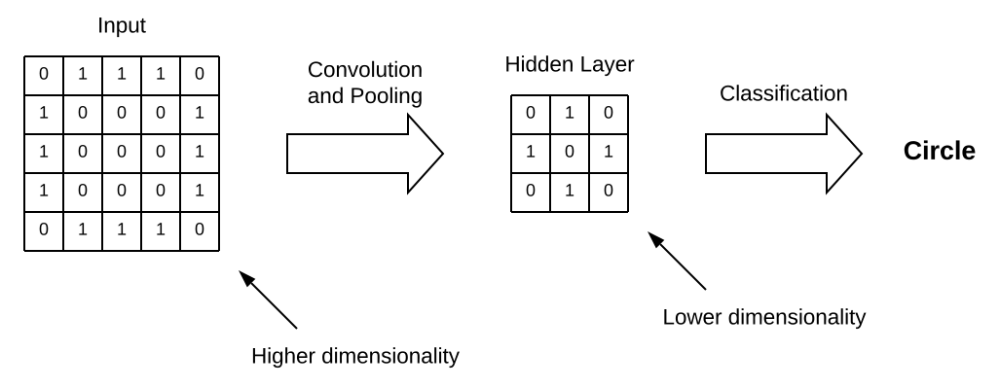
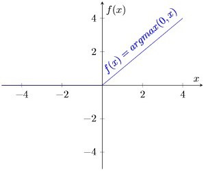
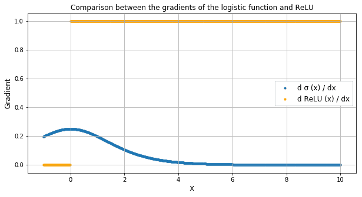
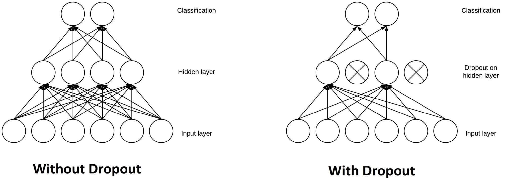
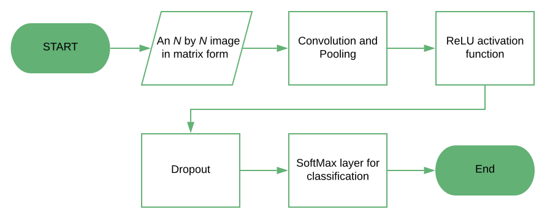

# [ReLU 和 Dropout 层在 CNN 中的工作原理](https://www.baeldung.com/cs/ml-relu-dropout-layers)

1. 概述

    在本教程中，我们将使用一个示例网络架构来学习卷积神经网络的两个基本组件--整流线性单元和凋零层。

    最后，我们将了解将它们插入 CNN 的理由。此外，我们还将了解在自己的卷积神经网络中实现它们所需的步骤。

2. CNN 的维度诅咒

    在构建任何神经网络时，我们都必须假设两个基本假设：

    - 1 - 输入特征的线性独立性
    - 2 - 输入空间的低维度

    我们通常使用 CNN 处理的数据（音频、图像、文本和视频）通常不满足这两个假设，而这正是我们使用 CNN 而非其他神经网络架构的原因。

    在 CNN 中，通过在训练过程中执行[卷积和池化](https://www.baeldung.com/kotlin-supervised-learning#building-ann)，隐藏层的神经元可以学习输入的可能抽象表征，这通常会降低输入的维度。

    然后，网络假定这些抽象表征（而非底层输入特征）是相互独立的。这些抽象表征通常包含在 CNN 的隐藏层中，其维度往往低于输入维度：

    

    因此，CNN 有助于解决所谓的 "维度诅咒" 问题。"维度诅咒" 是指执行机器学习任务所需的计算量与输入维度的单位增加量呈指数增长关系。

3. 整流线性单元

    1. 为什么不在 CNN 中使用西格玛函数？

        经过训练的 CNN 具有隐藏层，其神经元对应于输入特征的可能抽象表示。当面对一个未知输入时，CNN 并不知道它所学习的抽象表征中哪一个与该特定输入相关。

        对于隐藏层中代表特定已学抽象表征的任何给定神经元，都有两种可能的（模糊）情况：要么该神经元相关，要么不相关。

        如果神经元不相关，并不一定意味着其他可能的抽象表征也会因此而降低可能性。如果我们使用的激活函数的图像包括 $\mathbb{R^{-}}$，这就意味着，对于神经元的特定输入值，该神经元的输出会对神经网络的输出产生负作用。

        这通常是不可取的：如上所述，我们假设所有学习到的抽象表征都是相互独立的。因此，对于 CNN 而言，最好使用非负激活函数。

        最常见的此类函数是整定线性函数，使用该函数的神经元称为整定线性单元（ReLU），即 $f(x) = argmax(0,x)$：

        

    2. 计算 ReLU

        与 $\sigma{(x)}$ 或 $\tanh{(x)}$ 等西格玛函数相比，该函数有两大优势。

        - ReLU 的计算非常简单，因为它只需要比较输入值和 0 值。
        - 它还具有 0 或 1 的导数，这取决于输入是否分别为负值。

        尤其是后者，对训练过程中的反向传播有着重要影响。事实上，这意味着计算神经元的梯度在计算上并不昂贵：

        $$<\text{ReLU'(x) = }\left. \begin{cases} 0, & \text{for } x < 0 \\ 1, & \text{for } x \geq 0 \\ \end{cases} \right\}$$

        相反，非线性激活函数（如西格玛函数）一般不具备这种特性。

        因此，使用 ReLU 有助于防止运行神经网络所需的计算量呈指数增长。如果 CNN 的规模扩大，增加额外 ReLU 的计算成本将呈线性增长。

        ReLU 还能防止出现所谓的 "梯度消失" 问题，这在使用正弦函数时很常见。这个问题指的是神经元的梯度在输入值较高时趋近于零。

        正弦函数的导数在接近正无穷大时会趋向于 0，而 ReLU 则始终保持恒定的 1。这样，即使激活函数的输入值很高，误差的反向传播和学习也能继续：

        

4. 剔除层

    CNN 的另一个典型特征是 "剔除层"。剔除层是一个掩码，它使某些神经元对下一神经元的贡献无效，而对其他神经元不做任何修改。我们可以将 "剔除层" 应用于输入矢量，在这种情况下，"剔除层" 会使输入矢量的某些特征无效；但我们也可以将 "剔除层" 应用于隐藏层，在这种情况下，"剔除层" 会使某些隐藏神经元无效。

    滤波层在训练 CNN 时非常重要，因为它们可以防止训练数据过度拟合。如果没有它们，第一批训练样本对学习的影响就会过大。这反过来又会阻止学习只出现在后面样本或批次中的特征：

    

    假设我们在训练过程中连续向 CNN 展示了十张圆形图片。CNN 不会学习到直线的存在；因此，如果我们之后再给它看一张正方形的图片，它就会非常困惑。我们可以通过在网络架构中添加 "Dropout" 层来防止这些情况的发生，从而避免过度拟合。

5. 带有 ReLU 和剔除层的 CNN

    该流程图显示了带有 ReLU 和 Dropout 层的 CNN 的典型架构。这种结构在图像分类任务中非常常见：

    

6. 结论

    在本文中，我们已经了解了什么情况下我们更倾向于使用 CNN 而不是 NN。当输入特征不独立时，我们更倾向于使用 CNN。我们还了解了使用 ReLU 作为激活函数的原因。

    ReLU 易于计算，并且在误差的反向传播中具有可预测的梯度。

    最后，我们讨论了 Dropout 层如何在训练过程中防止模型过拟合。值得注意的是，Dropout 会随机停用层中的某些神经元，从而使其对输出的贡献无效。
