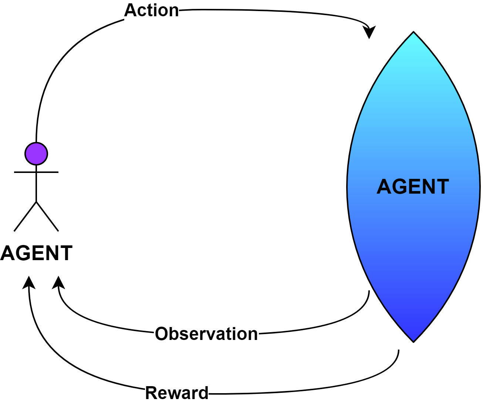
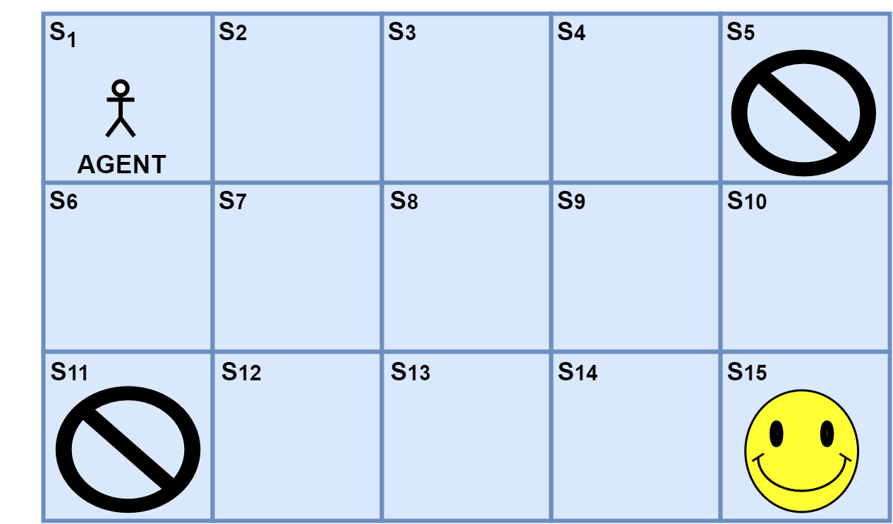

# 什么是强化学习中的贝尔曼算子？

[机器学习](https://www.baeldung.com/cs/category/ai/ml)

[强化学习](https://www.baeldung.com/cs/tag/reinforcement-learning)

1. 简介

    在本教程中，我们将介绍[贝尔曼](https://www.ams.org/journals/bull/1954-60-06/S0002-9904-1954-09848-8/S0002-9904-1954-09848-8.pdf)方程在强化学习中的应用。

2. 强化学习

    在[机器学习](https://www.baeldung.com/cs/ml-fundamentals)中，我们通常使用传统的监督和无监督方法来训练模型。此外，我们还可以使用一种称为[强化学习](https://www.baeldung.com/cs/reinforcement-learning-neural-network)的独立学习模型。这种技术允许我们设计一个框架，让模型了解环境并得出解决方案：

    

    此外，该模型的工作原理是为其为达到目标而了解环境的每个行动分配奖励。代理试图找到目标输出，但有时会找到近似输出。这时，代理会将其误认为是唯一的路径，并在回溯时将其标记为解决方案。由于路径中的所有状态都标记为 1（正奖励），这将导致难以到达目标位置。

    换句话说，这种环境下的价值函数不一定总是合适的。因此，我们创建了贝尔曼算子，以加强利用强化学习推导解决方案的能力。

3. 贝尔曼算子

    贝尔曼算子以理查德-E-贝尔曼的名字命名，它通过对下一步行动的提示来设定奖励。

    强化代理的目标是继续行动，产生最大回报。贝尔曼方法考虑了当前行动的奖励和未来行动的预测奖励，可以用以下公式来说明：

    \[V(S_{c})= max_{a}[R(S_{c},a) + \curlyvee V(S_{n})]\]

    其中，$S_{c}$ 和 $S_{n}$ 表示当前状态和下一状态，a 表示行动，V 表示状态值，$R(S_{c}, a)$ 是某一状态下行动的奖励，$\curlyvee$ 表示限制值范围为（0,1）的因子。

    1. 实例

        我们可以假设一个游戏环境的例子，玩家的目标是到达一个目标位置，在那里玩家可以获得最高的奖励。让我们将游戏环境可视化：

        

        环境空间中有一个来自源位置的代理，其目标是到达目标位置。此外，代理可获得三种奖励，如正奖励（+1）、中性奖励（0）和负奖励（-1）。此外，目标位置的奖励为 1。此外，正常状态下的奖励为中性，任何不理想状态下的奖励为负。然而，可能的动作有右、左、上和下。此外，我们将 $\curlyvee$ 的值取为 0.9，这样下一个状态的值在决定状态值时就会有所区别。

        代理会探索环境，并根据贝尔曼算子计算每个状态的值。例如，目标位置是 $S_{15}$，到达该位置的奖励是 1。假设代理按照覆盖状态 $S_{1},S_{2},S_{3},S_{8},S_{13},S_{14}$ 和最后的 $S_{15}$ 的路径移动，而不移动到更接近负奖励状态的状态。由于贝尔曼函数考虑的是下一个状态的值，因此我们以相反的顺序进行计算：

        假设状态 $S_{15}$ 的值为 0，因为它是最终目标状态。现在，我们可以计算

        \[V(S_{14})= R(S_{14},right) + \curlyvee V(S_{15})= 1 + (0.9) (0)=1\]

        \[V(S_{13})= R(S_{13},right) + \curlyvee V(S_{14})= 0 + (0.9) (1)=0.9\]

        \[V(S_{8})= R(S_{8},down) + \curlyvee V(S_{13})= 0 + (0.9) (0.9)=0.81\]

        \[V(S_{3})= R(S_{3},down) + \curlyvee V(S_{8})= 0 + (0.9) (0.81)=0.0.73\]

        \[V(S_{2})= R(S_{2},right) + \curlyvee V(S_{3})= 0 + (0.9) (0.73)=0.66\]

        \[V(S_{1})= R(S_{1},right) + \curlyvee V(S_{3})= 0 + (0.9) (0.66)=0.59\]

        因此，它得到了一幅通往目标状态的状态图。最后，无论代理的源位置如何，它都会通过跟随数值递增的状态到达目标位置。

4. 优缺点

    让我们来看看在强化学习中使用贝尔曼算子的一些主要优缺点。

    1. 优点

        使用其他算法寻找从源到解的路径时，我们会将所有状态的值标记为 1。从不同的源位置出发，代理观察到路径中所有状态的值都是 1。这样就折叠了设置。

        利用贝尔曼公式，即使在代理找到通往目标的路径后，我们也能获得环境的映射。例如，我们可以在单源最短路径算法中适当使用贝尔曼算子。

    2. 缺点

        贝尔曼作为一个优化方程，至少可以在对环境有基本了解的情况下工作，例如，在我们不知道哪些状态应该标记为负奖励和中性的环境中。这样，值函数就很难给出错误的结果，也就无法实现整个想法。因此，它不适合复杂和较大的环境空间。

5. 结论

    在本文中，我们介绍了强化学习背后的一般思想，以及贝尔曼算子如何帮助实现学习技术。此外，我们还讨论了一个例子以及贝尔曼算子的优缺点。
