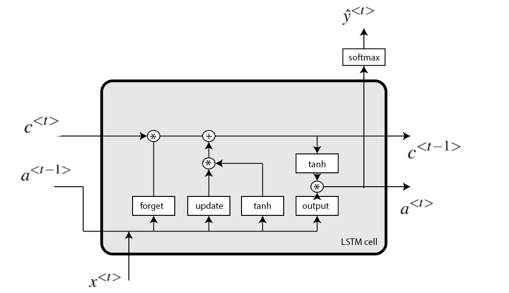

# 双向和单向 LSTM 的区别

[机器学习](https://www.baeldung.com/cs/category/ai/ml)

[神经网络](https://www.baeldung.com/cs/tag/neural-networks)

1. 简介

    在本教程中，我们将介绍一种常用于连续数据类型的递归神经网络，称为长短期记忆（LSTM）。这无疑是最常用的递归神经网络之一。首先，我们将简要介绍神经网络以及递归神经网络的术语。

    然后，我们将深入探讨 LSTM 架构，并解释双向 LSTM 和单向 LSTM 的区别。最后，我们将提到这两种网络的几种应用。

2. 神经网络

    神经网络是受生物神经网络启发而明确创建的算法。神经网络的基础是根据网络类型相互连接的神经元。最初，人们的想法是创建一个能像人脑一样运作的人工系统。

    神经网络有很多种类型，但大致可分为三大类：

    - [前馈神经网络](https://www.baeldung.com/cs/neural-net-advantages-disadvantages#neural-networks)
    - [卷积神经网络](https://www.baeldung.com/cs/ai-convolutional-neural-networks)
    - [递归神经网络](https://www.baeldung.com/cs/nlp-encoder-decoder-models#2-basic-rnn-units)
    在大多数情况下，它们之间的区别在于组成它们的神经元类型，以及信息如何在网络中流动。

    在本教程中，我们将只讨论递归神经网络，尤其是 LSTM。

3. 递归神经网络

    在标准前馈神经网络中，每个输入向量分量都有自己的权重，而在递归网络中，每个分量共享相同的权重。一般来说，递归网络的优势在于输入向量的每个位置都共享权重。此外，通过共享权重，一个模型可以处理不同长度的序列。另一个优点是减少了网络需要学习的参数（权重）数量。

    递归网络的基本原理是，输入向量和上一步的一些信息（通常是一个向量）被用来计算输出和传递给下一步的信息。一般来说，用于计算每一步输出值的公式称为单元（块）。

    因此，对于最简单的递归网络，一个区块可以由以下关系式定义：

    \[\begin{align*} a^{<t>} &= f_{1}(W_{aa}a^{<t-1>} + W_{ax}x^{<t>} + b_{a})\\ \hat{y}^{<t>} &= f_{2}(W_{ya}a^{<t>} + b_{y}), \end{align*}\]

    $x^{<t>}$ 是输入序列中的一个向量或数字，t 表示计算递归关系的步骤，$W_{aa}$、$W_{ax}$、$W_{ya}$、$b_{a}$ 和 $b_{y}$ 是给定维度的权重矩阵和向量，$f_{1}$ 和 $f_{2}$ 是激活函数。通常，对于 $f_{1}$，我们会使用 tanh 或 ReLU，而对于 $f_{2}$，由于它计算输出值，我们会使用 sigmoid 或 softmax。最后，在下图中，我们可以看到该模块的整体结构：

    - [ ] ?dr?

4. LSTM

    LSTM 是一种特殊的递归神经网络。具体来说，引入这种架构是为了解决梯度消失和爆炸的问题。此外，这种类型的网络更适合保持长距离连接，识别序列开头和结尾值之间的关系。

    LSTM 模型引入了表达式，特别是门。事实上，有三种类型的门：

    - 遗忘门(forget gate) - 控制记忆单元从上一步的记忆单元接收多少信息
    - 更新（输入）门(update (input) gate) - 决定是否更新存储单元。此外，它还控制当前存储单元从潜在的新存储单元接收多少信息。
    - 输出门(output gate) - 控制下一个隐藏状态的值
    在数学上，我们将 LSTM 模块定义为

    \[\begin{align*} &\Gamma_{u} = \sigma(W_{uu}a^{<t-1>} + W_{ux}x^{<t>} + b_{u})\\ &\Gamma_{f} = \sigma(W_{ff}a^{<t-1>} + W_{fx}x^{<t>} + b_{f})\\ &\Gamma_{o} = \sigma(W_{oo}a^{<t-1>} + W_{ox}x^{<t>} + b_{o})\\ &\hat{c}^{<t>} = tanh(W_{cc}a^{<t-1>} + W_{cx}x^{<t>} + b_{c})\\ &c^{<t>} = \Gamma_{u}\odot \hat{c}^{<t>} + \Gamma_{f}\odot c^{<t-1>}\\ &a^{<t>} = \Gamma_{o}\odot \tanh(c^{<t>}), \end{align*}\]

    W 和 b 是权重矩阵和向量，t 是递归网络的当前迭代，$\Gamma_{u}$ 是更新门，$\Gamma_{f}$ 是遗忘门，$\Gamma_{o}$ 是输出门，$\hat{c}^{<t>}$ 是存储单元的潜在值，$c^{<t>}$ 是存储单元的当前值，$a^{<t>}$ 是输出值或隐藏状态。LSTM 模块的结构如下所示

    
5. 双向 LSTM

    双向 LSTM（BiLSTM）是一种递归神经网络，主要用于自然语言处理。与标准 LSTM 不同的是，它的输入是双向的，能够利用来自两侧的信息。它也是一种功能强大的工具，可用于在序列的两个方向上对单词和短语之间的序列依赖关系进行建模。

    总之，BiLSTM 增加了一个 LSTM 层，从而逆转了信息流的方向。简而言之，这意味着输入序列在新增的 LSTM 层中逆向流动。然后，我们将两个 LSTM 层的输出以平均、求和、乘法或并集等几种方式组合起来。

    下图展示了未滚动的 BiLSTM，以作说明：

    

    1. 优势

        在实际问题中，尤其是在 NLP 中，这种架构有很多优势。主要原因是输入序列的每个组成部分都包含过去和现在的信息。因此，BiLSTM 可以将两个方向的 LSTM 层结合起来，产生更有意义的输出。

        例如，句子

        Apple is something that...

        可能是关于苹果这种水果，也可能是关于苹果公司。因此，LSTM 不知道 "Apple"是什么意思，因为它不知道未来的语境。

        相比之下，在这两个句子中，最有可能的情况是：

        Apple is something that competitors simply cannot reproduce.

        和

        Apple is something that I like to eat.

        BiLSTM 对序列（句子）中的每个成分（单词）都会有不同的输出。因此，BiLSTM 模型适用于一些 NLP 任务，如句子分类、翻译和实体识别。此外，它还可应用于语音识别、蛋白质结构预测、手写识别等类似领域。

        最后，关于 BiLSTM 与 LSTM 相比的缺点，值得一提的是 BiLSTM 是一种速度更慢的模型，需要更多时间进行训练。因此，我们建议只有在确有必要的情况下才使用它。

6. 结论

    本文介绍了一种名为 BiLSTM 的循环神经网络。在介绍了神经网络之后，我们深入解释了单向和双向 LSTM 算法。除了这些方法在算法上的差异外，我们还提到了它们在应用上的主要区别。

- [ ] [Differences Between Bidirectional and Unidirectional LSTM](https://www.baeldung.com/cs/bidirectional-vs-unidirectional-lstm)
