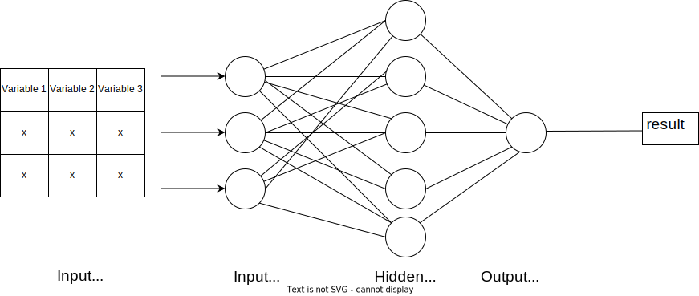

# [神经网络：二进制输入与离散输入与连续输入](https://www.baeldung.com/cs/binary-vs-discrete-vs-continuous-inputs)

1. 简介

    在本教程中，我们将回顾神经网络的二进制输入、离散输入和连续输入：它们是什么，如何表示，以及它们的不同之处。

2. 定义

    神经网络是明确为模拟生物神经网络而创建的算法。因此，神经网络由相互连接的神经元组成，通过三层或更多层处理数据。神经网络主要用于模式识别任务、预测建模任务、计算机视觉和许多其他应用。

    输入层是每个神经网络的初始层，由接受输入数据的神经元组成。这一层接受数据并将其转换为输出。有鉴于此，神经网络的运行离不开数据。没有数据，神经网络就无法学习模式或处理任何事情。

    输入到神经网络的数据有不同的格式，这取决于数据所代表的信息。本教程将讨论其中三种格式：

    

3. 二进制输入

    当我们谈论二进制输入时，我们指的是 0 和 1 格式的输入。在计算机科学中，“0”和“1”形式的数据被称为[二进制数](https://www.baeldung.com/java-binary-numbers#introduction)。对于神经网络来说，包含这些二进制数的数据会以矩阵形式编译并输入输入层。

    神经网络的二进制输入通常会编码一些信息。例如，假设我们有一个由几个问题的答案组成的数据集。在这个数据集中，我们将答案分为“是”和 “否”。因此，“是”和“否”的答案被编码为二进制值，其中“是”为 1，“否”为 0：

    

    1. 特征

        另外，二进制输入也可以用来表示分类变量。例如，具有男性和女性值的变量性别可以用二进制输入表示。也就是说，男性用 1 表示，女性用 0 表示，反之亦然。有鉴于此，二进制输入不能分成子部分。例如，我们不能将 0 的一半作为一个值。

4. 离散输入

    离散输入指的是有限且可数的数字数据。这些输入只能取特定的值。例如，在我们的调查答案数据集中，假设参与者拥有的鞋子数量是数据集的一部分。在这种情况下，与鞋子数量相关的值是一个整数。这意味着它只能在整数范围内取值。我们可以说这是一个离散输入的例子：

    

    1. 特征

        与二进制输入类似，离散输入也可用于表示分类数据。具体来说，就是具有可计数值的分类数据。最重要的是，离散输入通常是非负数，因为它们是可数的。此外，离散输入是不可测量的，可以随着时间的推移保持不变。例如，在鞋子数量的例子中，我们无法测量参与者拥有的鞋子数量。我们只能计算鞋子的数量。

5. 连续输入

    相反，连续输入指的是具有无限多个值的输入数据。这些输入通常是可测量的，并且会随着时间的推移而变化。例如，假设我们将回答问题所花费的小时数作为数据集中的一个变量。该数据可以取任何值，并且会发生变化。我们将其称为连续输入：

    

    1. 特征

        连续输入的另一个关键点是数值可以细分为多个部分。具体来说，我们指的是以小数形式附加部分的数据。之所以能做到这一点，是因为连续输入通常是可测量的，因此精度是关键。数值的细分提高了连续输入的精度。

6. 异同

    二进制输入、离散输入和连续输入之间的异同可以这样概括：

    |二进制输入|离散输入|连续输入|
    |-|-|-|
    |只能取两个值：零或一|数值数量有限|可以有无数个值|
    |在时间间隔内恒定不变|在一定时间间隔内恒定不变|可随时间间隔变化|
    |数据不可细分|无法细分|可细分为多个部分|
    |数据无法测量|无法测量|数据可测量|

7. 结论

    在本教程中，我们回顾了神经网络的二进制、离散和连续输入。首先，二进制输入只能有两个值：0 和 1。其次，离散输入可以取可数的值，通常不止一个。最后，连续输出有无限多个值。总之，二进制、离散和连续输入描述了通常输入神经网络的各种数据表示。
