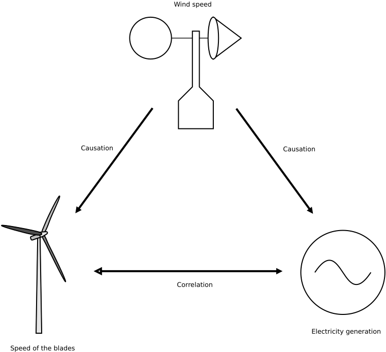
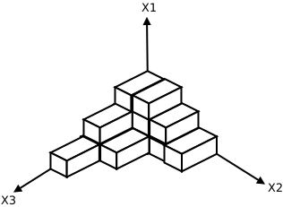
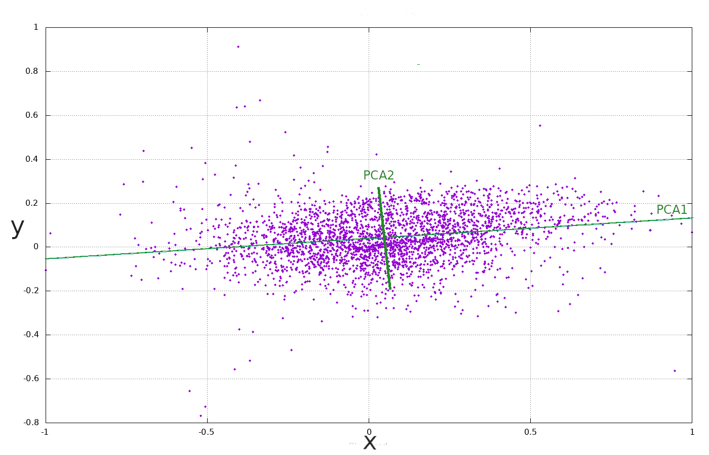

# [相关特征与分类精度](https://www.baeldung.com/cs/correlation-classification-algorithms)

1. 简介

    在本教程中，我们将分析相关现象对机器学习算法（如分类算法）的影响。

    接下来的讨论适用于一般模式识别问题。

2. 插曲： 相关性与因果性

    相关性并不意味着因果关系。例如，风力增大会导致风力发电场的叶片速度增加，从而增加发电量，但叶片速度的增加并不会导致风力增大。然而，这两种现象是相关的，我们可以根据其中一种现象的数值预测另一种现象的数值。

    下图展示了同一例子的另一种观点：

    

    从认识论的角度来看，这两个概念在逻辑上是不同的：相关性是对称的（变量 A 与变量 B 相关意味着变量 B 与变量 A 相关），而因果性是不对称的，正如我们在刚才的例子中所看到的。

    相关性是一个我们可以从统计学角度进行分析的概念。鉴于大多数机器学习方法都具有统计学性质，因此，一般来说，只谈相关性而不谈因果性是有道理的。

    关于这些概念的精彩讨论，请参阅我们的相关系数实际含义[教程](https://www.baeldung.com/cs/correlation-coefficient)。

    相关现象不会影响分类器的结构和工作方式。但是，它们会对单个预测产生负面影响，从而影响最终结果的质量。

    正如我们将要看到的，原因在于使用算法分析问题时出现的一些通用限制。在这些限制中，最重要的是可用数据集的大小。

3. 相关性和共线性

    相关性和共线性是不同的现象，但它们有联系点，因此我们将它们视为相关性的例子。

    如果一个变量的增加与另一个变量的增加相关，那么相关性可能是正的；如果一个变量的增加与另一个变量的减少相关，那么相关性可能是负的。

    1. 相关性

        在统计学中，相关性是衡量两个随机变量之间的依赖程度（正如我们所看到的，不一定是因果关系）。一般来说，"相关"一词意味着一种线性关系。

        相关性可以是一种积极的现象，因为它可以使我们在知道一个变量的值的情况下对另一个变量做出预测。

        相关性是依赖性的同义词，因此从统计学的角度来看，两个独立的随机变量并不相关。

        相关性有几种测量方法，称为相关系数（通常用 $\rho$ 或 r 表示）。最常见的是[皮尔逊相关系数](https://www.baeldung.com/cs/correlation-coefficient)，它衡量两个变量之间的线性依赖程度。即使两个变量之间的数学依赖关系遵循非线性函数，这种线性关系也是有意义的。

        其他相关系数对非线性关系也很敏感，如[斯皮尔曼秩相关系数](https://www.baeldung.com/cs/correlation-coefficient)和[互信息](https://en.wikipedia.org/wiki/Mutual_information)。

    2. 相关系数

        皮尔逊积幂相关系数 (PPMCC)，又称皮尔逊相关系数或简称相关系数，是对原始数据进行最小二乘拟合的质量度量。在数学上，它是两个变量的协方差 $\Sigma$ 与它们的标准偏差 $\sigma (X)$, $\sigma (Y)$ 之间的比率：

        \[\rho_{XY}=\frac{\Sigma_{XY}}{\sigma(X)\sigma(Y)}=\frac{\mathrm{E}\left[(X-\mu_{X})(Y-\mu_{Y})\right]}{\sigma(X)\sigma(Y)}=\frac{\mathrm{E}\left[XY\right]- \mathrm{E}[X]\mathrm{E}[Y]}{\sqrt{\mathrm{E}[X^{2}]-\mathrm{E}[X]^{2}}\sqrt{\mathrm{E}[Y^{2}]-\mathrm{E}[Y]^{2}}}\]

        其中，对于一个有 N 条记录且均值为 $\mu$：

        \[\Sigma_{XY}=\frac{1}{N}\sum_{i=1}^{N}(x_{i}-\mu_{X})(y_{i}-\mu_{Y})\]

        在不提及手段的情况下，我们可以将其等价表达为

        \[\mathbf{\Sigma}_{XY}=\frac{1}{2n^{2}}\sum_{i}^{N}\sum_{j=i}^{N}(x_{i}-x_{j})(y_{i}-y_{j})=\frac{1}{n^{2}}\sum_{i}^{N}\sum_{j>i}^{N}(x_{i}-x_{j})(y_{i}-y_{j})\]

    3. 共线性

        在统计学中，共线性（也称多重共线性）是指多元回归模型中的一个预测变量可以在很大程度上通过其他预测变量进行线性预测的现象。

        多重共线性不会降低整个模型的预测能力或可靠性，至少在样本数据集中是如此；它只会影响对单个预测因子的计算。也就是说，具有共线性预测因子的多元回归模型可以显示整组预测因子对结果变量的预测效果，但它可能无法给出关于任何单个预测因子或预测因子之间冗余的有效结果。

        无多重共线性通常是指不存在完全的多重共线性，即预测因子之间存在精确的（非随机的）线性关系。

        对于一般线性模型

        \[y=\beta\mathbf{X}+\epsilon\]

        重组这个表达式的矩阵形式，我们就可以写出统计预测因子了：

        \[\hat{\beta}=\left(\mathbf{X}^{\mathrm{T}}\mathbf{X}\right)^{-1}\mathbf{X}^{\mathrm{T}}y\]

        然而，在共线性的情况下，我们无法计算逆。因此，这个预测器并不存在。这值得我们去理解。

    4. 共线性问题

        我们将注意力集中在方阵上，因为只有方阵我们才能计算其逆。乘积 $\mathbf{X}^{\mathrm{T}}\mathbf{X}$ 是一个正方形矩阵。

        正方形矩阵的秩是线性独立行或列的数目。全秩矩阵的线性独立行数或列数等于矩阵的行数或列数，否则称为秩不足矩阵，在这种情况下，对于矩阵 $\mathbf {A} (N \times N)$，我们有 $\mathrm {rank} ( \mathbf {A}) <N$。

        对于非正方形矩阵，秩是行和列之间的最小值。一般来说，如果所有列（特征）都是独立的，那么数据集的输入矩阵就是全秩的。

        因此，在存在共线性（完全多重共线性）的情况下，数据矩阵的秩是有缺陷的。

        代数学的两个基本结果证明了这一点：

        1. $rank(\mathbf{A})=rank(\mathbf{A}^{T}\mathbf{A})=rank(\mathbf{A}\mathbf{A}^{\mathrm{T}})$
        2. 如果 $\mathbf{A}$ 是秩缺失的(rank-deficient)，则 $\det (\mathbf{A})=0$

        在我们的预测器中，如果从数据集中得到的通用非方阵 $\mathbf{X}$ 是秩缺陷的，那么方阵 $\mathbf{X}^{\mathrm{T}}\mathbf{X}$ 就是秩缺陷的，它的行列式是空的。

        对于一个 2 x 2 矩阵，可以根据表达式计算其逆：

        \[\mathbf{{A}}=\left(\begin{array}{cc} a & b\\ c & d \end{array}\right)\]
        \[\mathbf{A}^{-1}=\frac{1}{ad-bc}\left(\begin{array}{cc} d & -b\\ -c & a \end{array}\right)\]

        但是 $ad-bc = \det (\mathbf {A})$，从这个结果和前面的两个性质可以看出，在共线性的情况下，线性预测器是不存在的。这个结果可以推广到任何阶数的矩阵。

        多重共线性是数据矩阵的特征，而不是基本统计模型的特征。

4. 维度的诅咒

    数据集中的记录数决定了我们在统计模型中可以处理的最大特征数。在某些情况下，可能有必要应用一些预处理技术，将数据集转换为等价数据集，以更大程度地保证获得良好的结果。

    让我们以排版字符识别系统为例，该系统的目的是从一系列图像开始，尽可能实现最佳分类。

    第一步是识别一些特征（特征提取），即一些输入参数，我们可以将这些参数与分类器预测的每幅图像所属的类别联系起来。

    我们可以直观地认为，增加特征的数量可以提高分类器的性能。在这种情况下，我们要做的是增加进入系统的信息，这原则上会导致以更高分辨率识别模式的可能性，从而改善输入和输出之间的映射。

    在这种情况下，我们可以任意增加特征的数量，例如用图像的一个像素来识别系统的每个输入，从而获得数千或数万数量级的输入维度。

    然而，经验实践表明，增加的特征数量超过一定限度，分类器的性能就会下降。让我们来看看原因何在。

    1. 一个例子

        我们将每个变量划分为一定数量的区间。如下图所示，我们将整个输入空间分割成几个单元格：

        

        数据集的每个实例都对应于其中一个单元格中的一个点，以及输出变量 y 的一个值。

        给定输入空间中的一个新点，我们可以通过计算数据集中与给定点同属一个单元的所有点，并求出 y 值的平均值，从而确定相应的 y 值。

        增加细分的数量可以提高系统的分辨率，但代价是单元格的数量呈指数级增长。如果每个输入变量被划分为 M 个范围，输入维度为 D，那么单元格的总数等于 $M ^ {D}$。

        当我们将 D 增加到一定限度后，分类器的质量就会变差，因为我们会遇到这样的情况，即单元格内没有数据集的代表点。在这种情况下，唯一的解决办法就是增加数据集的记录数或减少特征数。

        然而，在实际问题中，数据集通常是由一系列测量数据组成的，因此在建立分类器时，记录的数量是固定的。实际上，数据集的大小决定了我们在系统中可以 "解决" 的最大特征数量。

        相关性和共线性虽然不会全面影响分类器的性能，但从实际角度来看却是负面因素。在这种情况下，我们会得到冗余数据，这可能会导致我们的分类器不得不处理超出数据集内在解析能力的大量特征。

        因此，规则是对数据集进行预处理，以可控和可重现的方式获得包含大部分原始信息的最少特征数量，其中数据的方差就是这种信息量的度量。

        这正是主成分分析法的作用。

5. 主成分分析（PCA）

    输入矩阵的相关性和共线性被视为畸变。它们会带来冗余信息，正如我们在上一节图像的极端情况下所看到的那样，会导致数据量不足，无法在输入空间的所有区域获得足够的分辨率。

    让我们把讨论过的问题形式化。我们称 $\mathbf {X}$ 为数据集的输入矩阵，由 D 个特征（列）和 N 行（数据集的记录）组成。在输入中存在相关性的情况下，我们会遇到以下问题：

    1. 在建立分类器的过程中，我们需要确定输入和输出之间的映射所依赖的特征。由于没有一般的模型，特征的选择在一定程度上是任意的，并且在一般情况下会在数据集中引入相关性。
    2. 在这种情况下，如果不是所有的成分都是线性独立的，$\mathbf {X}$ 可能会有秩缺陷
    3. 具有高方差的特征是好事，因为它们的信息量更大、更重要
    4. 相关性高或协方差高的特征是不好的，因为它们可以相互推导而几乎不会损失信息，因此将它们放在一起是多余的。在这种情况下，对于可用数据数量所提供的功能而言，特征数量的选择可能过多了

    我们正在寻找的是一种方法：

    1. 如果可能的话，将原始的 $\mathbf {X}$ 输入矩阵转换成一个新的全等级 $\mathbf{X}'$ 矩阵。这就解决了与相关性和共线性有关的大部分问题
    2. 确定一个标准，以可控的方式减少输入的大小，消除对输入和输出之间的映射不重要的信息。

    PCA 可以解决这些问题。它是将原始数据旋转并投影到一组新的线性独立轴上，新轴的数量与特征的数量相等。在理想情况下，结果是一个新的全等级数据矩阵。这个新矩阵成为新的数据集，比原始数据集更小，其中特征的数量保留了原始数据的任意信息量。

    下图展示了将原始轴（x、y）旋转和投影到一组新的正交轴 PCA1 和 PCA2 的过程：

    

    有关 PCA 的详细介绍，请参阅我们的 [PCA 教程：主成分分析](https://www.baeldung.com/cs/principal-component-analysis)。

6. 结论

    在本教程中，我们分析了相关现象在预测方法中一般是如何有害的。

    数据集的固定大小限制了我们可以纳入算法的最大特征量。在相关效应的情况下，数据包含冗余信息。在这种情况下，我们可以有控制地缩小数据集的规模，消除部分冗余信息。

    主成分分析法就是用于此目的的方法之一，是机器学习领域每位技术人员必备知识技术库的一部分。
