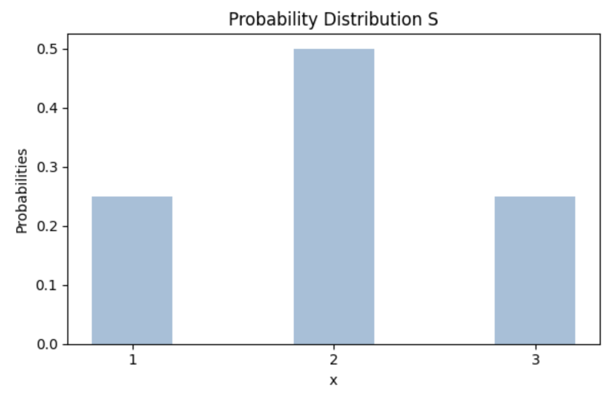
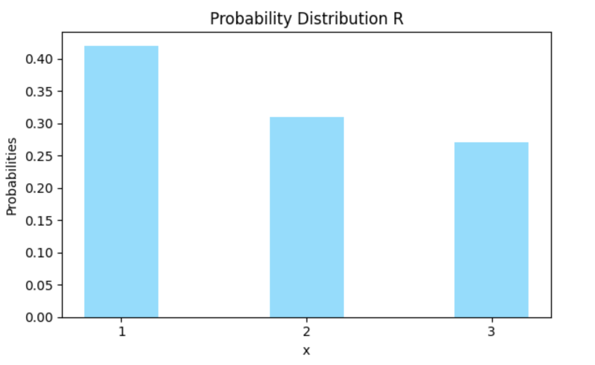
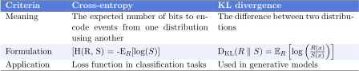

# 交叉熵与 KL Divergence 有什么区别？

[机器学习](README-zh.md) [数学与逻辑](https://www.baeldung.com/cs/category/core-concepts/math-logic)

[概率和统计](https://www.baeldung.com/cs/tag/probability-and-statistics)

1. 简介

    在本教程中，我们将回顾[交叉熵](https://www.baeldung.com/cs/cross-entropy)与库尔贝克-莱布勒（[KL](https://en.wikipedia.org/wiki/Kullback–Leibler_divergence)）发散之间的区别。

2. 熵

    在深入研究交叉熵和 KL 发散之前，我们先来回顾一下与这两个术语相关的一个重要概念：熵。

    在信息论中，熵量化了不确定性，即随机变量的概率分布中所包含的信息。熵高表示不可预测（不确定性），而熵低则表示可预测性。

    让我们来看看 S 在 $\{1, 2, 3 \}$ 上的概率分布：

    

    这是一个数据集中在均值附近的分布。相反，数据分散的分布代表高熵分布：

    

3. 交叉熵

    交叉熵是我们使用另一种分布对一种概率分布中的事件进行编码所需的预期比特数：

    \[H(R, S) = -\mathbb{E}_R[\log(S)] \]

    对于离散变量（分布），S 和 R 代表特定离散值的概率，交叉熵 H(R, S) 的计算方法是将一个概率分布的负和乘以另一个概率分布的对数：

    \[ H(R, S) = -\sum_{x} R(x) \log S(x) \]

    我们对连续变量使用积分，其中 S 和 R 代表概率密度函数：

    \[ H(R, S) = -\int_{-\infty}^{\infty} R(x) \log\left(S(x)\right) \, dx \]

4. KL 发散

    KL 分歧（$D_{\text{KL}}$）也称为相对熵，它量化了两个概率分布之间的不相似性。

    回到我们的两个概率分布 R 和 S，$D_{\text{KL}}$ 是根据所有可能事件的概率分布 S 和 R 的对数比率之间的期望差计算出来的：

    \[ D_{\text{KL}}(R\parallel S) = \mathbb{E}_R\left[\log\left(\frac{R(x)}{S(x)}\right)\right] \]

    我们对离散变量使用求和：

    \[ D_{\text{KL}}(R \parallel S) = \sum_{x} R(x) \log\left(\frac{R(x)}{S(x)}\right) \]

    另一方面，对于连续变量，我们取积分：

    \[D_{\text{KL}}(R \parallel S) = \int_{-\infty}^{\infty} R(x) \log\left(\frac{R(x)}{S(x)}\right) \, dx \]

5. 举例说明

    让我们假设概率分布 R 和 S 在 $\{1,2,3\}$ 上取值：

    \[ R = \begin{pmatrix} 1 & 2 & 3 \\ 0.42 & 0.31 & 0.27 \end{pmatrix} \qquad S = \begin{pmatrix} 1 & 2 & 3 \\ 0.25 & 0.5 & 0.25 \end{pmatrix} \]

    交叉熵 H（R，S）是：

    \[ \begin{aligned} H(R, S) & = -\sum_{x} R(x) \log S(x) \\ & = -\left(0.42 \cdot \log(0.25) + 0.31 \cdot \log(0.5) + 0.27 \cdot \log(0.25)\right) \\ & = -\left(0.42 \cdot (-1.39) + 0.31 \cdot (-0.69) + 0.27 \cdot (-1.39)\right) \\ & = -\left(-0.58 - 0.21 - 0.38\right) \\ & = -\left(-1.17\right) \\ & = 1.17 \end{aligned} \]

    KL发散：

    \[ \begin{aligned} KL(R || S) & = \sum_{x} R(x) \log\left(\frac{R(x)}{S(x)}\right)\\ & = 0.42 \cdot \log\left(\frac{0.42}{0.25}\right) + 0.31 \cdot \log\left(\frac{0.31}{0.5}\right) + 0.27 \cdot \log\left(\frac{0.27}{0.25}\right) \\ & = 0.42 \cdot 0.39 + 0.31 \cdot (-0.41) + 0.27 \cdot 0.13 \\ & = 0.16 - 0.13 + 0.03 \\ & = 0.07 \end{aligned} \]

6. 比较

    交叉熵和 KL 发散有一些相似之处：

    - 两个度量都不一定对称，所以 $D_{\text{KL}}(R \| S) \neq D_{\text{KL}}(S \| R)，H(R,S) \neq H(S,R)$
    - 都取值为零，当且仅当两个概率分布是完全匹配的时候。

    然而，这些度量标准并不相同：

    

    在机器学习中，交叉熵被用作分类任务中的损失函数，用于计算观察数据与预测输出之间的差异。它量化了预测数据与观察数据的接近程度。KL 发散在[生成模型](https://www.baeldung.com/cs/vae-vs-gan-image-generation#differences-between-vaes-and-gans)中用于鼓励模型生成与实际数据更相似的样本。

7. 结论

    本文概述了交叉熵和 KL 发散。

    它们之间有细微的差别。交叉熵通过测量使用另一种分布逼近一种概率分布所需的预期比特数来量化两种概率分布之间的差异。相比之下，KL发散量化的是一种概率分布之间的差异。
