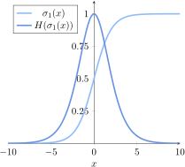
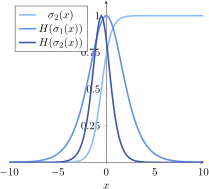
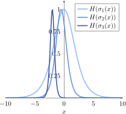
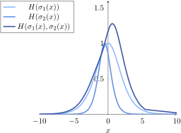
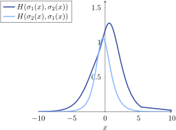

# [什么是交叉熵？](https://www.baeldung.com/cs/cross-entropy)

1. 概述

    在本教程中，我们将研究机器学习中交叉熵的定义。

    我们将首先讨论信息论中的熵概念及其与监督学习的关系。

    然后，我们将了解如何根据单变量分布中熵的定义推导出二变量分布中的交叉熵。这样，我们就能很好地理解二者如何相互泛化。

    最后，我们将了解如何使用交叉熵作为损失函数，以及如何通过梯度下降优化模型参数。

2. 熵

    1. 监督学习中的熵和标签

        在关于[熵的计算机科学定义](https://www.baeldung.com/cs/cs-entropy-definition)的文章中，我们讨论了二进制变量的[信息熵](https://www.baeldung.com/cs/cs-entropy-definition#magicparlabel-8508)与符号序列中的[组合熵](https://www.baeldung.com/cs/cs-entropy-definition#magicparlabel-8499)的关系。

        我们首先将 x 定义为随机分布的二进制变量。然后，我们可以计算出其香农熵量 H，即该变量可以承担的两个符号（0 和 1 位）的组合熵。H 的计算公式如下

        $$H = - \sum_{i=1}^{|x|} p(x_i) \times \text{log}_{2} p(x_i)$$

        当我们研究[监督机器学习](https://www.baeldung.com/cs/machine-learning-intro#supervised)中的[分类](https://www.baeldung.com/cs/ml-classification-vs-clustering#classification)问题时，我们试图学习一个函数，从有限的[标签](https://www.baeldung.com/cs/ml-labeled-vs-unlabeled-data#2-labeled-data)集合中为观测[特征](https://www.baeldung.com/cs/feature-vs-label#features)分配一个标签。因此，标签或类别 c 的集合 $C = \{c_1, c_2, ... , c_n\}$ 包含多个不同的符号，我们可以将其视为模型输出所假设的可能值。因此，我们可以计算分类预测模型输出的类标签的熵值。

    2. 概率分类而非确定分类

        有两种方法可以让我们从概率而非标签的离散分布中过渡到熵的概率定义。第一种方法是将类别出现的相对频率解释为其出现的概率。也就是说，我们可以将 $p(c_i)$ 视为类别 $c_i$ 在类别分布中出现的次数除以分布的长度。

        其次，有些分类模型本质上是概率模型，不会输出单点预测，而是输出概率分布。这与分类模型外层使用的激活函数有关。机器学习模型输出层最常用的概率函数有

        - [逻辑函数](https://www.baeldung.com/cs/cost-function-logistic-regression-logarithmic-expr#1-a-review-on-the-logistic-function)
        - [软最大函数](https://www.baeldung.com/cs/ml-nonlinear-activation-functions#3-softmax)
        - [双曲正切函数](https://www.baeldung.com/cs/ml-nonlinear-activation-functions#2-hyperbolic-tangent)（如果归一化为区间（0,1））。

        这些函数输出一个或一组介于 0 和 1 之间的值，因此我们可以将其解释为观察结果的类别隶属度的概率分布。

    3. 标签的熵和概率分布

        尤其是软最大（softmax）函数，它不是输出 C 中最有可能作为给定输入标签的单一类别 c，而是返回整个 C 集的概率分布 P(C)。

        随后，我们可以利用它们来计算类标签 C 及其相关概率 P(C) 分布的熵：

        $$H = - \sum_{i=1}^n p(c_i) \times log p(c_i)$$

    4. 分类中的熵的实际例子

        举例来说，假设我们使用逻辑回归进行二元分类。逻辑模型的输出是一个介于 0 和 1 之间的值，我们通常将其解释为输入隶属于第一类的概率 P(y=1|x) = P(1)。这意味着第二个可能的类别有一个相应的概率 P(y=0 |x) = P(0) = 1- P(1)，即二元分类中的 “无数据” 概率（[terium non datur](https://en.wikipedia.org/wiki/Law_of_excluded_middle)）。

        我们可以初步假定，逻辑模型的输入只有一个特征，没有[偏置项](https://www.baeldung.com/cs/neural-networks-bias)，且唯一输入的参数等于 1。 从这个意义上说，该模型完全符合带 $\beta_0 = 0 \vee \beta_1 = 1$ 的西格玛函数 $\sigma_1(x) = \frac{1} {1-e^{- (\beta_0 + \beta_1 \times x)} }$。

        然后，我们可以把两个概率 $\sigma_1(x)$ 和 $1-\sigma_1(x)$ 解释为二元随机变量的概率分布，并相应地计算熵度量 H：

        

        毫不奇怪，当分类的输出结果不确定时，$\sigma_1(x)$ 的熵最大。当分配给每个类别的概率相同时，就会出现这种情况。

    5. 使用多种概率分布

        我们也可以使用多种概率分布和各自的模型。例如，如果我们要比较逻辑回归的多个模型（如上文定义的模型）的输出结果，就属于这种情况。

        假设我们想比较前一个模型 $\sigma_1(x)$ 和后一个模型 $\sigma_2(x)$。进行这种比较的一种方法是研究相对的两个概率分布及其熵之间存在的差异。

        如果我们假设 $\sigma_2(x)$ 的两个参数是 $\beta_0 = 1$ 和 $\beta_1 = 2$，那么我们就会得到一个模型 $\sigma_2(x) = \frac{1} {1+e^{(-1-2 \times x)}}$ 与此相关的熵：

        

        请注意，这两个模型的熵并不一致。这意味着，作为一般规则，两种不同概率分布的熵是不同的。

    6. 某些熵比其他熵更相等

        最后，如果我们将 $H(\sigma_1(x))$ 和 $H(\sigma_2(x))$ 这两个熵与第三个熵 $H(\sigma_3(x))$ 进行比较，后者来自一个参数为 $\beta_0 = -10$ 和 $\beta_1 = -5$ 的逻辑模型，我们就会看到这样的结果：

        

        在我们看来，与分类器 $\sigma_1(x)$ 和 $\sigma_2(x)$ 相关联的前两个概率分布的熵比第三个分类器 $\sigma_3(x)$ 的熵更相似。

        这给了我们一个直观的想法，即如果我们想比较不同概率模型之间的预测结果，甚至是一个概率模型与某个已知概率分布之间的预测结果，我们需要使用某种无量纲度量来比较它们各自的熵。

3. 交叉熵

    1. 交叉熵的定义

        在此基础上，我们可以将单变量随机分布的熵的概念扩展为双变量分布的交叉熵的概念。或者，如果使用概率论术语，我们可以从概率分布的熵扩展到两个不同概率分布的交叉熵的度量。

        两个概率分布 P 和 Q 的交叉熵 $H(p, q)$ 具有以下公式：

        $$H(p, q) = -\sum_{i=1}^n p(x_i) \times \text{log}\ q(x_i)$$

    2. 用于模型比较的交叉熵

        我们可以应用这个公式来比较上一节中两个模型 $\sigma_1(x)$ 和 $\sigma_2(x)$ 的输出结果：

        $$H(\sigma_1(x), \sigma_2(x)) = -\ \sigma_1(x) \times \text{log}\ \sigma_2(x) - (1- \sigma_1(x)) \times \text{log} (1- \sigma_2(x)))$$

        这就是这两个特定模型的交叉熵图：

        

        请注意，交叉熵通常（但不一定）高于两个概率分布的熵。我们对这一现象的直观理解是把交叉熵想象成两种分布的总熵。不过，更准确地说，我们可以认为两个分布的交叉熵与这些分布的熵之间的距离越大，两个分布之间的差异就越大。

    3. 配对排序很重要

        还要注意的是，我们在 H 算子中插入项的顺序也很重要。两个函数 $H(p(x), q(x))$ 和 $H(q(x), p(x))$ 通常是不同的。例如，这是比较两个逻辑回归模型交叉熵的图表，同时交换了项：

        

        当我们计算观察到的概率分布（例如分类模型的预测值）与目标类分布之间的交叉熵时，这一点尤为重要。在这种情况下，真实的概率分布总是第一个项 $\boldsymbol{p(x)}$，而模型的预测总是第二个项 $\boldsymbol{q(x)}$。

4. 通过交叉熵优化模型

    1. 作为损失函数的交叉熵

        交叉熵在机器学习中最重要的应用是将其用作损失函数。在这种情况下，交叉熵的最小化（即损失函数的最小化）可以优化模型参数。在模型优化中，我们通常使用所有训练观测值和各自预测值之间的交叉熵的平均值。

        让我们使用逻辑回归模型 $\hat{y} = \sigma(x)$ 作为预测模型。那么，作为其损失函数的交叉熵为

        $$L(x, y) = -\frac {1} {n} \sum_{i=1}^n y_i \times \text{log}\ \sigma(x_i)$$

    2. 交叉熵的算法最小化

        然后，我们可以通过优化构成模型预测的参数来最小化损失函数。典型的算法方法是在 $\boldsymbol{\beta}$ 所跨的参数空间上进行[梯度下降](https://www.baeldung.com/cs/gradient-descent-vs-ascent#gradient-descent)。

        上面我们讨论了如何计算逻辑模型的预测值。具体来说，我们指出预测结果是以输入和参数线性组合的 logistic 函数来计算的：

        $$\sigma(x, \beta) = \frac {1} {1+ e^{- x \times \beta} }$$

        我们还知道 logistic 函数的导数是

        $$\sigma'(x, \beta) = \sigma(x, \beta) \times (1- \sigma(x, \beta) )$$

        由此，我们可以得出与参数 $\beta$ 相关的梯度为

        $$\nabla_{\beta} \sigma(x_i) = \sigma_i \times (1- \sigma_i ) \times x_i$$

        最后，我们可以计算出损失函数的梯度为

        $$\nabla_{\beta} L(x, y) = - \frac {1} {n} \sum_{i=1}^n (y_i - \sigma_i) \times x_i$$

        最后，我们可以通过梯度下降来优化模型。

5. 结论

    本文研究了交叉熵的定义。我们从单变量概率分布的熵的形式化开始。然后，我们将其推广到双变量概率分布及其比较。

    此外，我们还分析了交叉熵作为分类模型损失函数的作用。

    与此相关，我们还研究了通过梯度下降进行参数优化以最小化交叉熵的问题。
