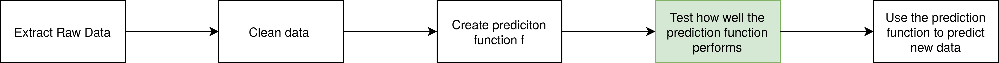

# 0-1 损失函数解析

[深度学习](https://www.baeldung.com/cs/category/ai/deep-learning) [机器学习](https://www.baeldung.com/cs/category/ai/ml)

[训练](https://www.baeldung.com/cs/tag/training)

1. 简介

    在本教程中，我们将仔细研究 0-1 损失函数。它是衡量二元分类和多分类算法质量的重要指标。

    一般来说，损失函数在决定机器学习算法对给定数据集是否有用方面起着关键作用。

2. 衡量模型质量

    在机器学习过程中，我们有多个步骤，包括清理数据和创建预测函数：

    

    我们要仔细研究的步骤用绿色标记：测量预测函数的质量。但是，我们如何才能知道我们创建的模型是否真正代表了数据的底层结构呢？

    为了衡量数据模型的质量，我们可以使用三种不同的指标：损失率、准确率和精确率。还有更多指标，如 F1 分数、召回率和 AUC，但我们将重点关注这三个指标。

    损失函数将实际值与预测值进行比较。有几种比较方法。损失为 0 表示预测完美。损失量的解释取决于给定的数据集和模型。机器学习中常用的损失函数是平方损失：

    \[\mathcal{L}_{sq} =\frac{1}{n}\sum^n_{i=1}(\tilde{y_i}-y_i)^2\]

    在这个公式中，$\tilde{y_i}$ 是正确的结果，$y_i$ 是预测的结果。将差值平方实际上只会得到正结果，并会放大较大的误差。正如我们所看到的，我们还将总和除以 n 取平均值，以补偿数据集的大小。

    另一个统计指标是准确度，它直接衡量我们预测的正确率或错误率。在这种情况下，错误的大小并不重要，重要的是我们的预测是错误还是正确。准确率可以用公式计算：

    \[\text{Accuracy}=\frac {\text{correct classifications}}{\text{all classifications}}\]

    通过最后一个指标--精确度，我们可以计算出预测结果的接近程度。不是与原始值的接近程度，而是相互之间的接近程度。精确度的计算公式如下

    \[\text{Precision}=\frac {\text{TP}}{\text{TP+FP}}\]

    TP 表示真阳性，FP 表示假阳性。

3. 示例

    让我们看一个例子来更好地理解这个过程。假设我们正在处理一个包含三张图片的数据集，我们想检测图片中是否有狗。我们的机器学习模型会给出每张图片显示狗的概率。在本例中，第一张图片的概率为 80%，第二张图片的概率为 70%，第三张图片的概率为 20%。我们将图片识别为狗图片的阈值是 70%，而实际上所有图片都是狗。

    因此，我们的损失为 $\mathcal{L}_{sq} = \frac{1}{3}((1-0.8)^{2}+(1-0.7)^{2}+(1-0.2)^{2}) \approx 0.256$，准确率为 $\frac{2}{3}$，精度为 $\frac{2}{3}$，因为我们有 2 个真阳性和 1 个假阳性。

4. 0-1 损失函数

    0-1 损失函数实际上与我们在第 2 章中介绍的精确度是同义词，尽管它的计算公式经常以不同的方式呈现：

    \[\mathcal{L}_{01}(\tilde{y},y) =\frac{1}{n}\sum^n_{i=1} \delta_{\tilde{y_i} \ne y_i} \text{ with } \delta_{\tilde{y_i} = y_i} =
    \begin{cases}
    & \text{0, if } \delta_{\tilde{y_i} \ne y_i} \\
    & \text{1, otherwise }
    \end{cases}\]

    这样就可以对我们的结果进行不同的权衡。例如，在进行疾病识别时，我们可能希望假阴性结果越少越好，因此我们可以借助损失矩阵对它们进行不同的权衡：

    \[ A = \left[ {\begin{array}{cc} 0 & 5 \\ 0.5 & 0 \\ \end{array} } \right] \]

    这种损失矩阵会放大假阴性结果，而只占真阳性结果损失的一半。

    一般损失矩阵的形式是

    \[ A = \left[ {\begin{array}{cc} TN & FN \\ FP & TP \\ \end{array} } \right] \]

    我们的0 -1损失函数还存在问题 它不可微 因此无法使用[梯度下降](https://www.baeldung.com/java-gradient-descent)等方法。幸运的是，我们仍然可以使用其他分类算法，如 [K-Means](https://www.baeldung.com/cs/k-means-for-classification) 或 [Naive Bayes](https://www.baeldung.com/cs/naive-bayes-classification-performance)。

5. 结论

    在本文中，我们介绍了机器学习度量中 0-1 损失函数的特性。
