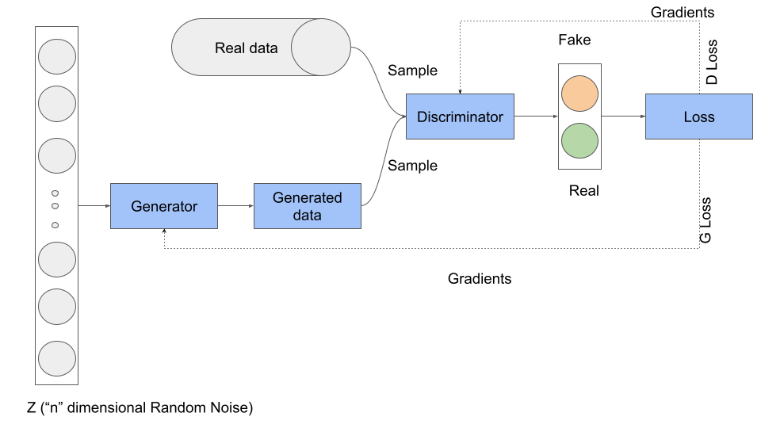
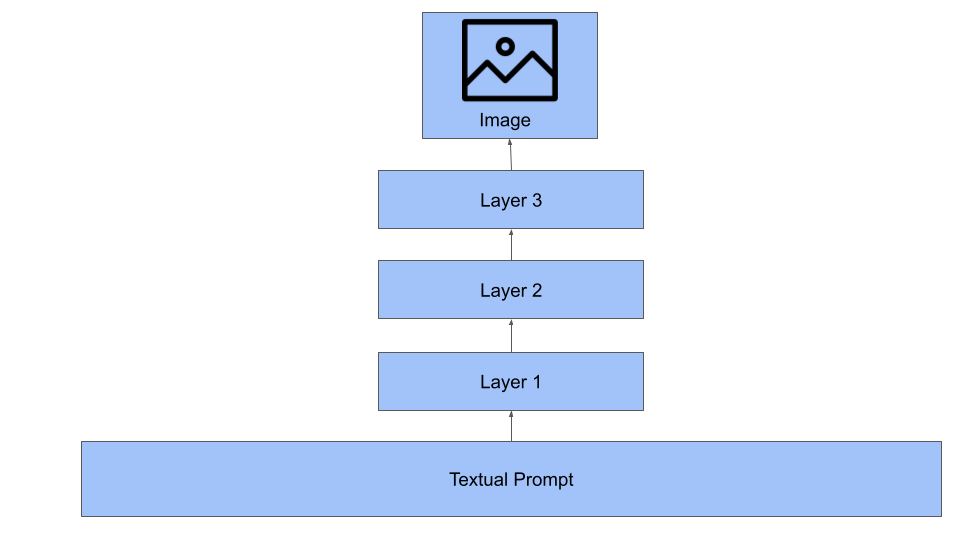

# 人工智能图像生成器如何工作？

[深度学习](https://www.baeldung.com/cs/category/ai/deep-learning) [机器学习](https://www.baeldung.com/cs/category/ai/ml)

[对抗网络](https://www.baeldung.com/cs/tag/gan)

1. 概述

    人工智能（AI）能够创造出令人惊叹和富有想象力的视觉效果，正在彻底改变图像生成技术。人工智能图像生成器使用[神经网络](https://www.baeldung.com/cs/neural-networks-pooling-layers)等复杂算法，制作出从栩栩如生的肖像到超现实的风景等各种图像。

    在本教程中，我们将讨论人工智能图像生成器，特别是 DALL-E 及其在现实世界中的应用。

2. 精确图像合成的挑战

    在不断发展的人工智能领域，有一个引人入胜的问题十分突出：如何将文字描述准确地转化为相应的视觉图像。例如，让我们以 "秋树环绕的宁静湖泊"这一描述为例。这句话可能会立即唤起人类的生动印象，包括秋叶在静水中倒映出的丰富色调。

    然而，对于人工智能来说，这需要复杂的算法来生成匹配的图片。随着研究的深入，我们发现人工智能系统需要理解语言的细微差别、词语背后的语境以及不同元素的无数可视化方式。

    当考虑 "梦幻般的异世界景观"这样的抽象描述时，另一个挑战就出现了。这样的短语为解释留下了很大的空间，使得人工智能制作出既能抓住本质又能忠实于文本说明的图像变得更具挑战性。因此，从文本中合成图像还需要把握文字背后的微妙之处和情感。

3. 关键架构和模型

    在人工智能驱动的图像生成中，特定的架构和模型因其效率和功能而脱颖而出。

    1. 生成式对抗网络

        生成式对抗网络（[GAN](https://www.baeldung.com/cs/vae-vs-gan-image-generation)）是人工智能图像生成的前沿技术。

        [生成式对抗网络](https://www.baeldung.com/cs/neural-networks-image-recognition#1-generative-adversarial-networks-gans)由两个主要部分组成：生成器和判别器。生成器从随机噪音中生成图像。另一方面，鉴别器对这些图像进行评估，试图确定它们是真实的还是人工生成的。通过持续的拉锯战，生成器不断改进其生成图像的能力，以达到欺骗鉴别器的目的：

        

        在训练过程中，生成器和鉴别器之间展开了激烈的竞争：生成器努力欺骗鉴别器，而鉴别器则不断提高自己的鉴别能力。在衡量其性能的[损失](https://www.baeldung.com/cs/gan-loss#the-generator)函数的指导下，两个网络都在不断改进。经过充分训练后，生成器就能熟练地将噪声转化为逼真的图像。

    2. DALL-E

        DALL-E 融合了先进的技术和富有想象力的应用。DALL-E 的基础是著名的[变压器架构](/ai/rnns-transformers-nlp-zh.md)，它不仅仅是另一种文本处理工具。它能将文字描述转化为令人着迷的图像。

        我们必须深入其核心，才能了解 DALL-E 的工作原理。首先，输入文本提示。在第一层，DALL-E 对文字描述的语义和细微差别进行解释。在下一层，它将这种理解与大量的训练数据联系起来。让我们把这想象成 DALL-E 搜索其庞大的文本-图片对内存，以找到最相关的匹配或参考。

        当我们进入第三层时，系统会利用学习到的模式，考虑以前的关联，并形成与输入文本产生共鸣的图像。

        例如，当输入"霓虹灯闪烁的未来城市天际线"这样的提示时，DALL-E 会筛选它所学到的相关概念，并开始图像生成过程。

        下面是它的流程图：

        

        我们从最底层的文字输入开始。在此基础上，通过三层处理，生成合适的图像。

4. 现实世界中的应用

    例如，在时尚行业中，设计师可以使用 GAN 来可视化和创造创新的服装设计。我们只需在生成器中输入一些规格，就能创造出独特的时尚创意。

    此外，我们还可以利用 GANs 制作各种[绘画](https://www.mdpi.com/2076-3417/13/2/867)作品，将不同的艺术风格融为一体。

    GANs 对医学的贡献也很大。它们有助于生成用于培训和研究的[医学图像](https://www.nature.com/articles/s41598-022-13658-4)。通过生成高质量、逼真的图像，研究人员可以分析病情和疾病，而不必完全依赖于难以获得的真实世界样本。

    在广告领域，它们可以根据特定的文字提示制作[定制图形](https://journals.sagepub.com/doi/full/10.1177/13548565231185865)，从而高效、有针对性地生成独特的营销材料。

    此外，[教师](https://www.linkedin.com/pulse/how-teachers-can-use-artificial-intelligence-ai-play-dr-samia/)可以利用生成器创建与文字描述相对应的视觉辅助工具，增强学生的学习体验。例如，如果配上 DALL-E 生成的图像，复杂的科学概念就会变得更容易理解。

    最后，图像生成器可以为娱乐业的编剧和[创作者](https://www.diva-portal.org/smash/get/diva2:1773397/FULLTEXT01.pdf)提供帮助。将书面概念转化为视觉原型可以简化角色和场景的设计过程，更轻松地将创意构想变为现实。

5. 对社会的影响

    在拥抱人工智能的变革力量时，我们还必须思考其更广泛的社会影响。首先，人工智能的快速发展引发了有关[数据隐私](https://academic.oup.com/idpl/article-abstract/2/3/163/660554)的重要讨论。庞大的数据集助长了强大的模型，强调了合乎道德的数据处理和用户同意的重要性。

    此外，人工智能中的[偏差](https://theconversation.com/eliminating-bias-in-ai-may-be-impossible-a-computer-scientist-explains-how-to-tame-it-instead-208611#:~:text=Bias%20in%20generative%20AI%20systems,also%20be%20biased%20by%20design.)也是另一个亟待解决的问题。如果根据有偏差的数据进行训练，模型可能会在不经意间延续现有的偏见，影响医疗保健、金融和执法等敏感领域的结果。因此，创建无偏见的算法是人工智能公平应用的首要问题。

    此外，不可否认的是，随着人工智能的进步，[工作环境](https://www.linkedin.com/pulse/impact-generative-ai-job-automation-navigating-landscape-ameen-alam/)也在发生变化。人工智能在带来效率和自动化的同时，也对某些职业的相关性提出了挑战。这种演变凸显了更新教育课程和再培训计划的紧迫性。

    此外，人工智能生成真实内容的能力也引发了人们的担忧。将真实内容与人工智能生成的内容[区分](https://www.linkedin.com/pulse/human-generated-content-vs-ai-generated-darayush-mistry/)开来成为一个真正的问题，尤其是在与错误信息作斗争的时代。

    最后，人工智能决策的[问责制](https://philarchive.org/archive/LECTCO-8)仍然是一个关键问题。当人工智能系统做出决策时，谁来承担责任？制定明确的指导方针至关重要。

6. 优势与风险

    人工智能驱动的图像生成器带来了诸多好处，同时也带来了一系列风险。广告、娱乐和教育可以从量身定制的即时视觉内容中获益，提高参与度和理解力。

    然而，从另一个角度看，这些技术可能会被恶意利用，例如制作欺骗性的视觉效果或深度伪造。人工智能生成的图像可能会无意中与现有的艺术作品或照片相似，因此人们对侵犯版权的担忧也在增加：

    | 优势            | 风险          |
    |---------------|-------------|
    | 机器创造性地生成图像    | 欺骗性深度伪造的可能性 |
    | 为特定行业量身定制视觉效果 | 对侵犯版权的担忧    |
    | 提高广告参与度       | 滥用传播错误信息    |
    | 高效制作视觉辅助材料    | 内容创作中的道德问题  |

7. 结论

    在本文中，我们讨论了使用 GAN 和 DALL-E 从文本生成图像的问题。虽然这些工具为现实世界的应用提供了卓越的进步，但它们也面临着挑战，包括伦理和社会影响。

    因此，在我们前进的过程中，必须权衡不可否认的益处和固有的风险，确保这项技术和谐地融入我们的生活。
