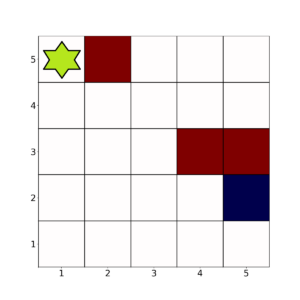
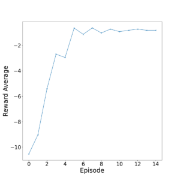
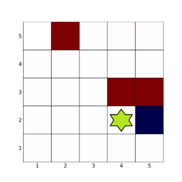

# 无模型强化学习与基于模型的强化学习

[深度学习](https://www.baeldung.com/cs/category/ai/deep-learning)

[强化学习](https://www.baeldung.com/cs/tag/reinforcement-learning)

1. 引言

    我们无时无刻不在与环境互动。我们所做的每一个决定都会以某种未知的方式影响我们的下一个决定。这种行为是强化学习（[RL](https://www.baeldung.com/cs/machine-learning-intro#reinforcement)）的核心，在强化学习中，交互和影响的规则不是未知的，而是预定义的。

    强化学习算法可以是无模型的（MF），也可以是基于模型的（MB）。如果代理可以通过预测其行动的后果来学习，那么它就是 MB。如果代理只能通过经验来学习，那么它就是 MF。

    在本教程中，我们将举例说明 MF 算法和 MB 算法的异同。

2. 强化学习的基本原理

    在强化学习中，我们有一个可以在环境中采取行动的代理。此外，从一种环境状态过渡到另一种环境状态的概率也与之相关。这些转换可以是确定的，也可以是[随机](https://www.baeldung.com/cs/randomness#the-theoretical-bases-of-randomness)的。

    最终，RL 的目标是让代理学会如何驾驭环境，以最大化累积奖励指标。

    最后，我们将[策略](https://www.baeldung.com/cs/ml-policy-reinforcement-learning)定义为代理为实现奖励最大化而改进的算法。

    最重要的是，策略可以是 MF 或 MB。首先，让我们开始探讨 MF 策略的含义！

3. 无模型 RL

    简单地说，无模型算法是基于其行动的后果来完善其策略的。让我们举例说明！

    考虑这个 5 次 5 环境：

    

    在这个例子中，我们希望代理（绿色）避开红色方格，用尽可能少的步骤到达蓝色方格。

    为此，我们需要定义一个适当的奖励函数。下面是一种方法：

    - 落在空方格上：-1 分
    - 落在红色方格上：-100 分
    - 落在蓝色方格上 +100分

    代理有 4 种可能的行动：向左、向右、向上和向下。在边上，它只有 2 或 3 种选择。

    让我们看看如何利用 [Q-learning](https://www.baeldung.com/cs/epsilon-greedy-q-learning) 来优化代理的行动。

    1. Q 学习

        让我们以 15 次迭代 1000 次为例。

        下面是以每集平均奖励表示的代理表现图：

        

        我们可以看到，代理在大约 8 个阶段（8000 次迭代）就能很好地完成任务。

        然而，Q-learning 存在对奖励短视的问题。使用[深度Q-learning](https://www.baeldung.com/cs/reinforcement-learning-neural-network#reinforcement_learning_with_neural_networks)可以部分解决这个问题，因为它使用的是神经网络而不是 Q 表。

        不过，Q-learning 的计算速度往往比基于模型的方法更快。这是由于没有使用环境模型。

4. 基于模型的 RL

    在某种程度上，我们可以说 Q-learning 是基于模型的。毕竟，我们正在建立一个 Q 表，它可以被看作是环境的一个模型。然而，在该领域，基于模型的术语并不是这样使用的。

    要将代理归类为基于模型的代理，代理必须超越环境模型的实现。也就是说，代理需要预测与某些行动相关的可能回报。

    这样做有很多好处。例如，代理与环境交互几次。然后，模型利用这些信息模拟后续迭代，而无需与环境互动。

    利用[监督学习](https://www.baeldung.com/cs/examples-supervised-unsupervised-learning#supervised-learning)，我们可以优化模型，以确定哪些轨迹最有可能产生最大回报。

    如果操作得当，这可以将学习速度提高几个数量级。

    然而，模型使用的信息是由代理提供的，而代理提供的信息是有限的。因此，我们有可能建立一个糟糕的模型-一个导致代理做出次优决策的模型。

    让我们进一步探讨这个问题。

    1. 模型预测控制

        模型预测控制（[Model Predictive Control](https://ieeexplore.ieee.org/stamp/stamp.jsp?tp=&arnumber=9207398)）是一种基于模型的算法，可以降低这种风险。

        与之前的算法一样，它可以确定一个最优轨迹。不过，代理只采取一次行动，然后再确定新的最优轨迹。

        这样，我们需要的轨迹优化步骤就更少。如果操作得当，这可以在不降低性能的情况下进一步加快 RL 算法的速度。

        让我们回到前面的例子，来说明基于模型的 RL 是如何发挥作用的。

    2. 模型预测学习

        首先，我们假设现在的行动是随机的。因此，给定的行动在每个相邻方格中的着陆概率是不同的。

        假设代理发现自己处于这样的排列中：

        

        现在，如果行动是确定的，那么显然向右移动是最优的。

        然而，在这个随机例子中，假设行动极不可能导致向右移动。

        基于模型的算法可以逼近这些概率，然后模拟轨迹。例如，它可以告诉代理，向下、向右、再向上移动更有可能获得更高的奖励。

        [蒙特卡洛学习法](https://towardsdatascience.com/monte-carlo-learning-b83f75233f92)就是这种算法的一个例子。它的工作原理是收集代理每集的行动轨迹。然后根据这些采样轨迹调整代理的行为。

        与模型预测控制（Model Predictive Control）等方法不同，它不对任何轨迹进行建模，因此不会产生偏差。不过，调整只发生在每一集之后，这可能会使算法变得缓慢。

5. 结论

    在本文中，我们已经建立了对 MB 和 MF RL 算法差异的直观认识。为此，我们探讨了 RL 的基本原理，并在此基础上通过一个简单的例子探讨了这两种算法之间的差异。
