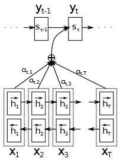
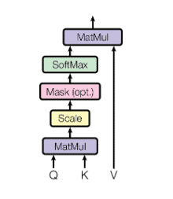

# [关注与自我关注](https://www.baeldung.com/cs/attention-self-badhanau-differences)

1. 简介

    大型语言模型的核心组件是转换器模块。注意机制是变换器块的核心组件。注意机制有许多种形式，并根据特定用途进行了设置。注意机制的种类和变化反映了它的发展历史。在许多情况下，历史、相关行话和命名上的区别会增加理解核心概念的难度。

    在本教程中，我们将介绍并区分注意力的两种主要类型和用途。这就是"注意"和"自我注意"。这些常用术语是循环编码器-解码器和变换器架构的核心。我们将介绍它们在该管道中的背景和用途，并强调它们之间的区别。

2. 注意

    注意（Attention）试图在循环处理输入序列时解决问题。在传统的递归编码器-解码器架构中，编码器上下文（encoder context）这一历史项被保留下来，并添加或附加到解码器的每个输入向量中。因此，这种保存历史记录的简单方法无法实现长期记忆和重构能力。需要编码的信息太多，数据会丢失。

    注意力机制解决的问题是，如何理解可能很长的数据序列中哪些是重要的。由于这一点会随着输入的变化而变化，我们显然需要一个动态系统。

3. 巴达诺注意力

    将可变长度序列拟合到固定长度向量的解决方案是增加一个步骤。[巴达瑙注意力机制](https://arxiv.org/pdf/1409.0473.pdf)为序列的每个部分生成一个上下文向量。然后，它动态计算这些上下文向量的加权和，为解码器的每个输入创建一个新的上下文向量。这种上下文向量的加权和就是（巴达诺）注意力。

    这种想法也被称为加法注意力，它非常强大，而且存在许多变体作为可能的扩展和改进。这就引出了自注意力或点积注意力。

    首先，我们将介绍巴达瑙的技术细节。迪米特里-巴达瑙提出的巴达瑙注意力是编码器-解码器范式的一部分。编码器 E 是一个标准的双向RNN。这种结构为每个序列元素构建了一个隐藏表示。解码时，我们使用每个编码为解码器构建上下文。因此，我们将组合这些编码的方法称为注意力：

    

    1. 技术细节：解码器

        解码器将上一个标记、隐藏状态和来自编码器的上下文作为输入，并生成下一个标记。此外，Badhanau 解码器与其他同类解码器的不同之处在于，输入解码器的上下文向量是编码器编码的动态组合，而不是整个序列的静态单一编码。

        解码器之前的隐藏状态通过对齐模块传递给每个编码器输出向量。对输出进行软最大值(softmax)计算，以确定哪个编码器状态与当前解码器状态最匹配。软最大值是计算编码器输出加权和的权重。这就产生了当前解码器状态的上下文向量。然后，这个上下文将被用来创建下一个解码器输出。

        我们可以将每个输入的解码器上下文定义为：

        (1) $c_i = \sum_{i}^{T} \alpha_{i,t}h_i$

        其中，$h_i$ 是编码器的隐藏状态编码，$\alpha$ 是为特定隐藏编码器状态计算的软最大权重，即注意力。

        attention $\alpha$ 是根据每个编码器的隐藏状态和解码器的当前隐藏状态计算得出的。

        (2) $e_{t,i} = a(s_{t-1},h_i)$

        我们计算 $\alpha$ 为 ：

        (3) $\alpha_{I,t} = softmax(e_{t,I})$

        最后，我们还将注意力函数计算定义如下

        (4) $a(s_{t-1},h_i) = v^TtanH(W[h_i ; s_{t-1}])$

        其中，v 和 W 分别是可学习的权重向量和矩阵。我们可以将与 W 的乘法运算分成两部分，分别计算 $h_i$ 和 $s_{t-1}$，然后相加，或者如图所示进行一次更大的乘法运算。

4. 自我关注

    首先，自我注意力以一种令人信服的方式建立在注意力的概念之上。它摒弃了递归的概念，允许沿着序列并行计算，而不是按顺序计算。自我注意是转换器架构的一项关键创新，它成功地推动了自然语言任务的发展。

    自我注意建立在与巴达诺注意力相同的基本概念之上。其目的是通过计算标记性句子嵌入的权重向量来判别哪些句子元素是最重要的。

    一般来说，我们说自我注意是并行运行的，递归并不限制它。为了实现这一点并保持序列信息，我们构建了一个序列编码，并将其附加到每个输入标记上。这有多种实现方法。标准的方法是将正弦和余弦函数结合起来，生成唯一的位置嵌入。然而，这仍然不是免费的午餐，放弃递归也迫使我们在序列上使用固定长度的窗口，即上下文长度。

    1. 技术细节

        对于给定的输入序列，注意力机制通过线性变换计算出查询、键和值矩阵。此外，查询矩阵和关键矩阵之间的点积用于计算每个输入词或标记与序列中每个标记的得分。软最大值（softmax）会将这一分数转化为序列中每个其他向量的归一化权重。简而言之，这个权重就是我们的注意力分数。此外，我们还将其与值矩阵相乘，得出我们的关注序列输出。下式概括了这一过程：

        (5) $Attention(Q,K,V) = softmax(\frac{QK^T}{\sqrt{d_k}})V$

        除以 $\sqrt{d_k}$ 是注意力中引入的一个缩放因子，它扩展了现有的点积注意力，产生了缩放点积注意力。这种缩放有助于减少大维度乘法的影响，通过 softmax 运算产生小梯度。

        最后，下图展示了整个计算过程：

        

5. 差异

    总而言之，注意力和自我注意力的相似之处在于，它们都构建了一个加权向量，作为序列元素的重要性或注意力分数。而自我注意力则对输入序列起内部作用。

    总之，两者的主要区别在于

    | |注意 |自我注意 |
    |-|-|-|
    |语境 |我们通常在序列到序列模型中使用 Bahdanau 注意力，重点关注序列的排列和翻译。|自我注意是一种更通用的机制，用于捕捉序列内的关系。它可用于各种架构，尤其是转换器模型。|
    |学习参数 |Bahdanau 注意涉及学习配准模型的参数，从而使参数数量更加复杂。|自注意力依赖于点乘和缩放，注意力权重完全基于输入序列，无需额外学习配准参数。|

6. 结论

    在本文中，我们强调了巴达诺注意力和自我注意力之间的区别。因此，我们清楚地深入探讨了注意机制的内部运作及其发展历史。

    总之，注意是理解大型语言模型运作和训练复杂性的一个基本概念。了解这些发展的历史和背景也能让我们深入了解它们的功能和实用性。
