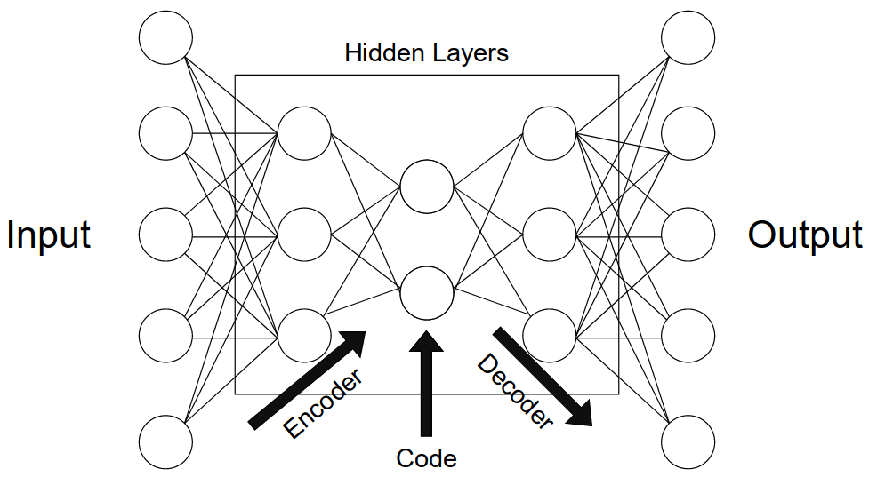
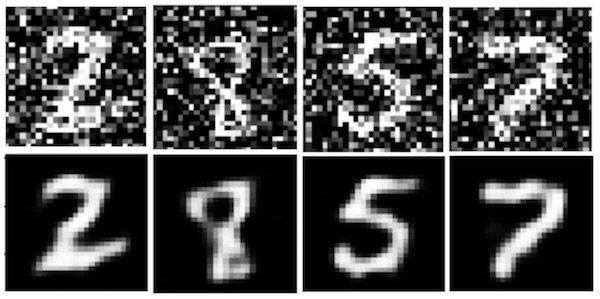
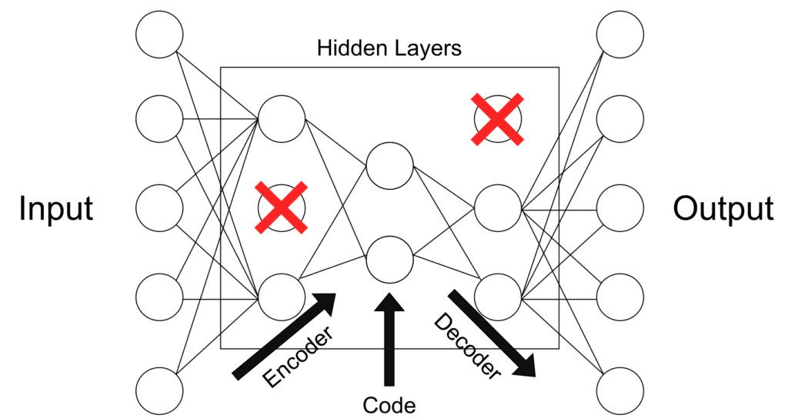
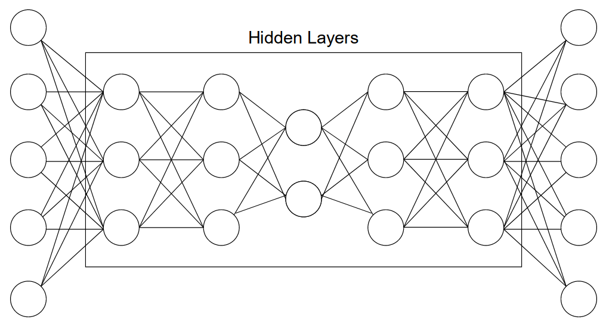

# 自动编码器详解

[深度学习](https://www.baeldung.com/cs/category/ai/deep-learning) [机器学习](https://www.baeldung.com/cs/category/ai/ml)

[神经网络](https://www.baeldung.com/cs/tag/neural-networks)

1. 引言

    信息论是一个备受关注的科学领域，因为它有望为当今的数据存储和数据分析问题提供答案。毕竟，正是这一领域为数据压缩提供了理论基础。虽然有纯粹的统计方法，但机器学习提供了灵活的神经网络结构，可以为各种应用压缩数据。

    在本教程中，我们将讨论不同常见自动编码器类型的功能、结构、超参数、训练和应用。

2. 功能

    压缩数据的方法有很多，纯粹的统计方法（如主成分分析 ([PCA](https://www.baeldung.com/cs/principal-component-analysis))）可以帮助识别造成数据变化的关键特征，并使用这些特征以更少的比特来表示信息。这种类型的压缩可称为"降维"。不过，这种 PCA 解决方案只能提供线性不相关特征的编码。

    机器学习替代方案提出了结构为自动编码器模型的神经网络。自动编码器可以学习更丰富的非线性编码特征。这些特征可以相互关联，因此不一定相互正交。利用这些函数，我们可以在潜在空间中表示复杂的数据。

    例如，在讨论用于面部识别的卷积神经网络（CNN）时，这些网络可用作图像数据的自动编码器。通过对图像进行编码，只需降低一点点质量，就能让用户使用更少的空间来存储照片。输出和输入图像之间的质量差异或损失称为重建损失。

    自动编码器的主要目标是用尽可能少的代码表示复杂的数据，同时几乎没有重建或"压缩"损失。为此，自动编码器必须查看数据并构建一个函数，将特定的数据实例转换为有意义的代码。我们可以把这看作是使用更少的维度对原始数据进行重新映射。我们还可以记住，解码器稍后必须对这些代码进行解释，才能访问数据。

3. 一般结构

    为了更好地理解这些模型的功能，我们将它们分解成各个组成部分。我们将按照数据在神经网络中移动的顺序来描述结构，首先讨论编码器，然后是瓶颈或 "代码"，最后是解码器。自动编码器的这些分段可以看作是模型中的不同节点层。下图有助于解释这三个不同的组成部分。箭头表示模型中的数据流：

    

    1. 编码器

        编码器的作用是将数据压缩成代码。在神经网络中，我们可以通过连接一系列池化层来实现这一现象，每个池化层都会减少数据的维数。这样，我们就可以只保留与编码相关的部分，从而消除数据的噪声。

        神经网络中维度最少的那一层，通常位于所有层的中间，被称为瓶颈层。如果我们有兴趣保留特定实例的更多信息，就需要更大的编码量。"代码大小"这个超参数非常重要，因为它定义了有多少数据可以被编码，同时也规范了我们的模型。代码太大会代表更多的噪音，但代码太小又可能无法准确地代表手头的数据。

    2. 解码器

        网络的解码器组件是代码的解释器。在卷积神经网络中，它可以根据特定代码重建图像。我们可以将这一组件视为数值提取、解释或解压缩工具。图像分割通常也是解码器的工作。如果我们保留上一个对狗图片进行分类的例子，我们可以继续解码，同时在每一层解码器节点上添加之前压缩层的副本。这样，我们就能获得一张带有像素子集的照片，这些像素子集能识别照片中的狗，并将狗与背景和其他物体分割开来。

        变异自动编码器（VAE）等生成模型甚至可以使用解码器来呈现不存在的数据。这对数据扩增非常有用。有了生成模型的多样化数据集，其他模型就能更全面地学习数据。

4. 不同类型

    自动编码器应用于机器学习和计算机科学的许多不同领域。以下是我们可以遇到的主要类型及其各自的常见应用。

    1. 去噪自编码器

        这类自动编码器旨在对噪声数据进行高效编码，从而将随机噪声排除在代码之外。这样，自动编码器的输出就会去噪，从而与输入不同。我们可以使用流行的 MNIST 数据集来了解其实现过程，如下图所示：

        

        这类自动编码器可用于特征提取和数据去噪。

    2. 稀疏自编码器

        这种类型的自动编码器会明确惩罚隐藏节点连接的使用。这将对模型进行规整，使其不会过度拟合数据。这种"稀疏性惩罚"被添加到重构损失中，以获得全局损失函数。或者，我们也可以直接删除隐藏层中一定数量的连接：

        

        这更像是一种正则化方法，可用于多种编码器类型。应用可能有所不同。

    3. 深度自动编码器

        深度自动编码器由两个对称的深度信念网络组成。这种结构类似于上文使用节点和连接来表示自动编码器的 "一般结构"。这些镜像组件可被描述为充当编码器和解码器的两台受限玻尔兹曼机：

        

        这种类型的自动编码器可广泛用于特征提取、降维和数据压缩等用途。

    4. 收缩式自动编码器

        当输入发生微小变化时，收缩式自动编码器会对代码中的巨大变化进行惩罚。这意味着相似的输入应具有相似的编码。这通常意味着自动编码器捕捉到的信息是有意义的，代表了数据中的巨大差异。为了实现这一点，我们可以在自动编码器的全局损失函数中添加惩罚损失。

        数据增强是这类自动编码器的一个重要应用类型。

    5. 不完全自动编码器

        与输入相比，这类自编码器的隐藏维度较小。这意味着它们只擅长捕捉数据中最重要的特征。这类自动编码器通常不需要正则化，因为它们的目的不是重现与输入相似的输出，而是依靠压缩阶段捕捉数据中的有意义特征：

        

        特征提取是这类自动编码器的主要应用类型。

    6. 卷积自动编码器

        卷积自动编码器可以使用不同信号的总和进行编码和解码。最常见的版本可能是 U-Net 卷积模型。这种为生物成像应用而开发的模型可以解释整个图像中不同滤波器的输出，从而对图像数据进行分类和最终分割。如今，类似的卷积模型也被用于分割图像。

        这些自动编码器可应用于计算机视觉和模式识别。

    7. 变异自动编码器

        变异自动编码器或 VAE 假设将数据编码为空间中的分布而非单点。这是一种拥有更有规则的潜在空间的方法，我们可以更好地利用它来生成新数据。因此，VAE 被称为生成模型。Diederik P Kingma 和 Max Welling 发表的 "[自动编码变异贝叶斯](https://arxiv.org/abs/1312.6114)"原始论文详细介绍了这些特殊模型的完整功能。

        实现这种潜在空间分布的过程与训练过程有些不同。首先，我们不是将实例映射为空间中的一个点，而是将其映射为正态分布的中心。接下来，我们从该分布中选取一个点进行解码，并计算出将在整个网络中反向传播的重构误差。

5. 结论

    本文讨论了不同常见自动编码器类型的作用、结构、超参数、训练和应用。
