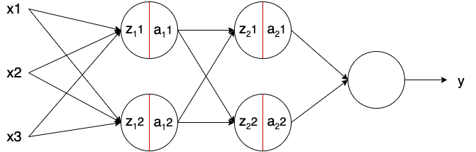

# 卷积神经网络中的批量归一化

[深度学习](https://www.baeldung.com/cs/category/ai/deep-learning)

[卷积神经网络](https://www.baeldung.com/cs/tag/cnn) [神经网络](https://www.baeldung.com/cs/tag/neural-networks)

1. 简介

    训练深度神经网络是一项艰巨的任务，需要解决多个问题。尽管深度神经网络潜力巨大，但其运行速度较慢，而且容易出现过度拟合。因此，在深度学习研究中，解决这些问题的方法研究一直存在。

    批量规范化（通常缩写为 Batch Norm）就是这些方法中的一种。目前，它是深度学习领域广泛使用的一种技术。它能提高神经网络的学习速度，提供正则化，避免过拟合。

    但它为何如此重要？它是如何工作的？此外，它如何应用于卷积神经网络等非规则网络？

2. 规范化

    要充分理解批处理规范的工作原理以及它的重要性，我们先来谈谈规范化。

    归一化是一种用于标准化数据的预处理技术。换句话说，就是让不同来源的数据在同一范围内。如果在训练前不对数据进行归一化处理，就会给我们的网络带来问题，使其训练难度大大增加，学习速度也会降低。

    例如，假设我们有一个汽车租赁服务。首先，我们要根据竞争对手的数据预测每辆车的合理价格。每辆车有两个特征：车龄（以年为单位）和总行驶公里数。这两个特征的范围可能非常不同，从 0 年到 30 年不等，而行驶距离可能从 0 到数十万公里不等。我们不希望地物的范围存在这些差异，因为范围较大的值可能会使我们的模型偏向于夸大它们的重要性。

    对数据进行归一化处理主要有两种方法。最直接的方法是将数据在 0 到 1 的范围内进行缩放：

    \[x_{normalized}=\frac{x - m}{x_{max} - x_{min}}\]

    x 是要归一化的数据点，m 是数据集的平均值，$x_{max}$ 是最高值，$x_{min}$ 是最低值。这种技术一般用于数据的输入。范围较大的非标准化数据点会导致神经网络不稳定。相对较大的输入会逐层向下传递，导致梯度爆炸等问题。

    另一种用于归一化数据的技术是使用以下公式强制数据点的平均值为 0，标准差为 1：

    \[x_{normalized}=\frac{x - m}{s}\]

    其中 x 是要归一化的数据点，m 是数据集的均值，s 是数据集的标准差。现在，每个数据点都模拟了标准正态分布。所有特征都在这个范围内，就不会有偏差，因此我们的模型学习效果会更好。

    在 "批次规范"（Batch Norm）中，我们使用最后一种技术对网络内部的数据批次进行规范化处理。

3. 批量规范化

    批规范化是一种在神经网络层之间而非原始数据中进行规范化的技术。它是在迷你批次而非完整数据集上完成的。它的作用是加快训练速度，使用更高的学习率，使学习更容易。

    根据上一节讲解的技术，我们可以将批规范的归一化公式定义为

    \[z^N = \left( \frac{z - m_z}{s_z} \right)\]

    其中 m_z 是神经元输出的平均值，s_z 是神经元输出的标准偏差。

    1. 如何应用？

        在下图中，我们可以看到一个普通的前馈神经网络：$x_i$ 是输入，z 是神经元的输出，a 是激活函数的输出，y 是网络的输出：

        

        批处理规范（Batch Norm）--在图像中用红线表示--在应用激活函数之前应用于神经元的输出。通常情况下，神经元在没有 Batch Norm 的情况下计算如下：

        \[z = g(w, x) + b; \hspace{1cm} a = f(z)\]

        其中，g() 是神经元的线性变换，w 是神经元的权重，b 是神经元的偏置，f() 是激活函数。模型学习参数 w 和 b：

        \[z = g(w, x); \hspace{1cm} z^N = \left( \frac{z - m_z}{s_z} \right) \cdot \gamma + \beta; \hspace{1cm} a = f(z^N)\]

        其中，$z^N$ 是批规范（Batch Norm）的输出，$m_z$ 是神经元输出的平均值，$s_z$ 是神经元输出的标准偏差，而 $\gamma$ 和 $\beta$ 是批规范（Batch Norm）的学习参数。请注意，神经元的偏差（b）已被去除。这是因为当我们减去平均值 $m_z$ 时，z 值上的任何常数（如 b）都会被忽略，因为它本身就会被减去。

        参数 $\beta$ 和 $\gamma$ 分别表示平均值和标准偏差。因此，批处理规范在一层上的输出结果是一个平均值为 $\beta$ 、标准偏差为 $\gamma$ 的分布。这些值是通过历时和其他学习参数（如神经元的权重）来学习的，目的是减少模型的损失。

    2. Python 实现

        使用 Keras、Tensorflow 或 Pytorch 等现代机器学习框架，批处理规范的实现非常简单。它们自带了最常用的方法，一般都是最新的技术。

        使用 Keras，我们可以用批处理规范（Batch Norm）实现一个非常简单的前馈神经网络：

        ```python
        from tensorflow.keras.models import Sequential
        from tensorflow.keras.layers import Dense, BatchNormalization

        model = Sequential([
            Dense(16, input_shape=(1,5), activation='relu'),
            BatchNormalization(),
            Dense(32, activation='relu'),
            BatchNormalization(),
            Dense(2, activation='softmax')
        ])
        ```

    3. 批量归一化为何有效？

        既然我们已经知道如何应用和实现批量规范化，那么它为什么能起作用呢？它如何加快训练速度并使学习变得更容易？

        人们认为，批量规范化对所有这些都有影响，这其中有不同的原因。在此，我们将揭示其中最重要的直观原因。

        首先，我们可以看到将输入归一化，使其具有相似的数值范围是如何加快学习速度的。一个简单的直觉是，批处理规范正在对网络各层的值进行类似处理，而不仅仅是输入。

        其次，[谢尔盖](https://arxiv.org/pdf/1502.03167.pdf)等人在最初的论文中声称，批处理规范减少了网络的内部协变量偏移。协变量偏移是数据分布的变化。例如，回到我们关于汽车租赁服务的例子，假设我们想把其他摩托车也包括进来。如果我们只看之前只包含汽车的数据集，我们的模型很可能无法预测摩托车的价格。这种数据变化（现在包含摩托车）被命名为协变量偏移，由于它是实际问题中的常见问题，因此越来越受到关注。

        内部协变量偏移是指神经网络内部层输入分布的变化。对于内部层中的神经元来说，从上一层接收到的输入是不断变化的。这是因为在训练过程中，神经元和权重之前进行了多次计算。

        应用批处理规范可以确保层输入的平均值和标准偏差始终保持不变，分别为 \beta 和 \gamma。这样，各层输入分布的变化量就会减少。更深的层对输入值会是什么有一个更稳固的基础，这在学习过程中很有帮助。

        最后，批规范似乎具有正则化效果。 因为它是在迷你批次而不是整个数据集上计算的，所以每次看到的模型数据分布都有一些噪音。这可以起到正则化的作用，有助于克服过度拟合，帮助更好地学习。不过，增加的噪声很小。因此，它本身一般不足以正确正则化，通常与 Dropout 一起使用。

4. 卷积神经网络中的批量规范化

    批量规范化在卷积神经网络中的作用非常相似。虽然我们可以用与之前相同的方法来做，但我们必须遵循卷积特性。

    在卷积中，我们有共享的滤波器，这些滤波器沿着输入的特征图（在图像中，特征图通常是高度和宽度）。这些滤波器在每个特征图上都是相同的。因此，以同样的方式对输出进行归一化，并在特征图上共享是合理的。

    换句话说，这意味着用于归一化的参数是与整个特征图一起计算的。在常规的批处理规范中，每个特征都有不同的平均值和标准偏差。在这里，每个特征图都有一个单一的平均值和标准偏差，用于它所包含的所有特征。

    1. 用 Python 实现

        同样，使用现代框架在卷积神经网络中实现 Batch Norm 非常简单。它使用我们之前使用过的相同函数，在后台完成操作：

        ```python
        from tensorflow.keras.models import Sequential
        from tensorflow.keras.layers import Dense, BatchNormalization, Conv2D, MaxPooling2D

        model = Sequential([
        Conv2D(32, (3,3), input_shape=(28, 28, 3) activation='relu'), 
        BatchNormalization(),
        Conv2D(32, (3,3), activation='relu'), 
        BatchNormalization(),
        MaxPooling2D(),
        Dense(2, activation='softmax')
        ])
        ```

5. 结论

    在这里，我们看到了如何将批量规范化应用到前馈神经网络和卷积神经网络中。我们还探讨了批归一化如何以及为何能提高模型和学习速度。

    最后，我们看到了使用 Keras 等现代机器学习框架对这种方法的一些简单实现。
