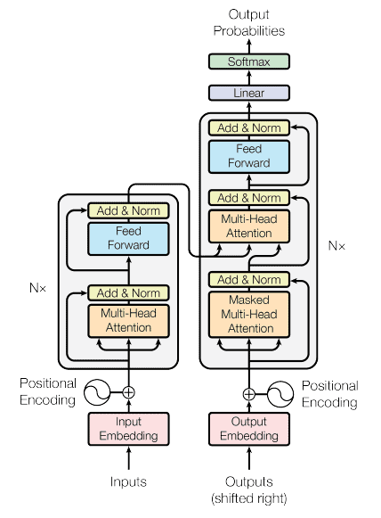
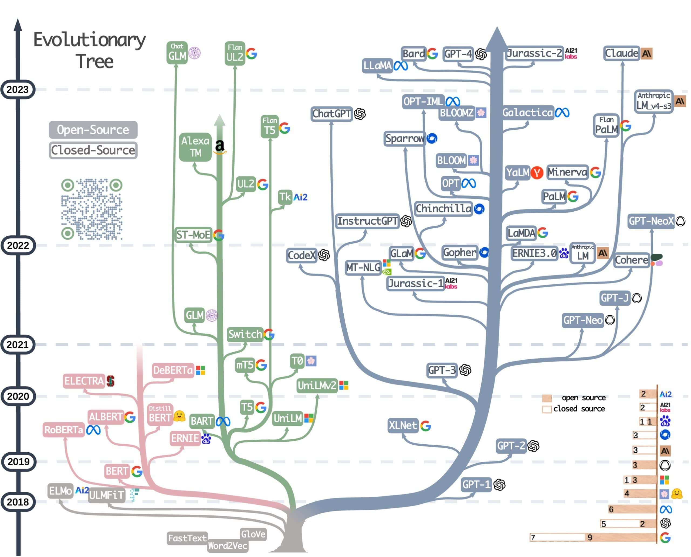
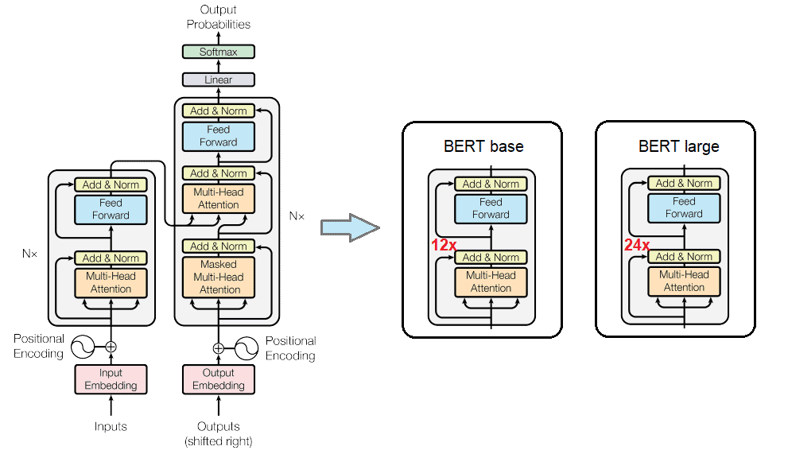
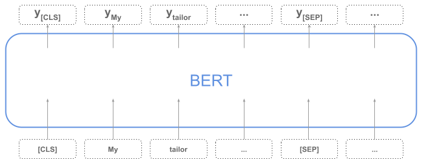
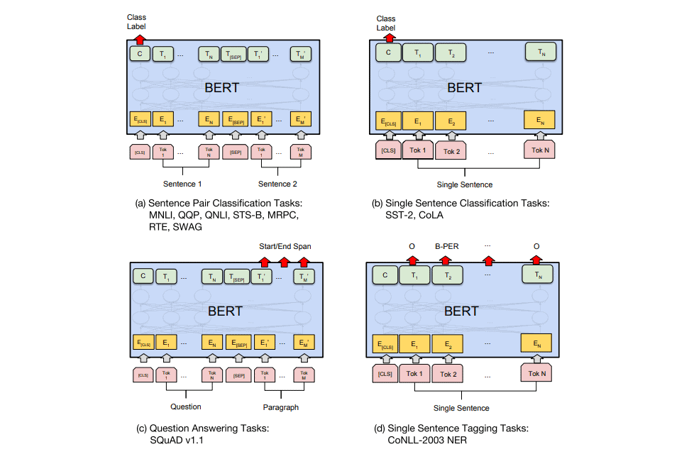
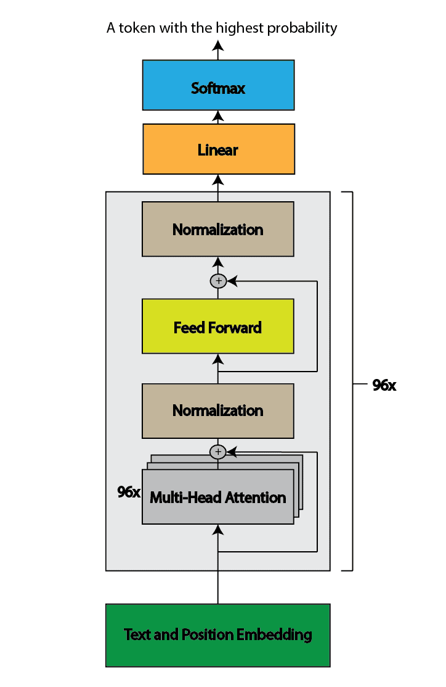

# [BERT 与 GPT-3 架构的比较](https://www.baeldung.com/cs/bert-vs-gpt-3-architecture)

1. 简介

    在本教程中，我们将解释 BERT 和 GPT-3 架构之间的区别。虽然这两种模型都是使用转换器构建的大型语言模型，但它们的应用却有很大不同。首先，我们将简要介绍注意力机制、转换器和转换器类型。随后，我们将对 BERT 和 GPT-3 模型进行更深入的探讨。

2. 注意机制和变压器

    多年来，神经网络一直被用于自然语言处理（NLP）。然而，重大的进步和社区的发展真正始于注意力机制的引入。

    2017 年，谷歌大脑的研究人员撰写了著名的论文《注意力就是你所需要的一切》，首次提出了这一创新方法。该论文提出的技术使神经网络在处理数据时能够专注于输入序列的特定部分。

    使用注意力机制（尤其是自我注意力）的模型被称为 "Transformers"。转换器在机器翻译、分类、生成等各种 NLP 任务中都表现出了最先进的性能。以下是 "[注意力就是你所需要的一切](https://arxiv.org/abs/1706.03762)" 论文中的转换器模型架构：

    

3. 转换器类型

    最初的 "Attention is All You Need" 论文介绍了一种由编码器和解码器两部分组成的变换器模型。然而，随着时间的推移，随后的发展导致了新的变压器模型的诞生，这些模型要么只包含一个编码器组件，要么只包含一个解码器组件。这种演变产生了专门用于特定任务的变压器模型。

    因此，我们可以将变压器型号分为以下几类：

    - 纯编码器转换器--适用于需要理解输入内容的任务，如句子分类和命名实体识别。一些流行的模型有 BERT、RoBERTa 和 DistilBERT。
    - 纯解码变换器--适用于文本生成等生成任务。一些常用的模型有 GPT、LLaMA 和 Falcon
    - 编码器-解码器转换器--适用于需要输入的生成任务，如翻译或摘要。流行的编码器-解码器模型有 BART、T5 和 UL2。

    上述所有模型都是大型语言模型（LLM）。它们使用人类语言运行，通常有几亿到几亿兆个参数。LLM 是当今的热门话题。许多大型科技公司都积极参与了它们的开发。下图展示了最流行的 LLM 的进展情况：

    

4. BERT 架构

    BERT（Bidirectional Encoder Representations from Transformers）是谷歌于 2018 年开发的语言模型。该模型的关键技术创新在于其双向性。BERT 论文的研究结果表明，与单向语言模型相比，经过双向训练的语言模型能够更好地理解语言语境和语流。

    如今，BERT 模型有很多种类型。在此，我们将介绍两种原始类型的 BERT 的架构：基础模型和大型模型。这些模型使用与原始转换器相同的编码器架构。一句话，BERT 是原始变压器模型中多个编码器的堆叠：

    

    基础模型有 12 层变压器，而大型模型有 24 层。此外，前馈网络（隐藏神经元数量）也存在差异。基础模型的前馈网络有 768 个神经元，而大型模型有 1024 个神经元。BERT 基础模型共有 1.1 亿个参数，BERT 大型模型共有 3.4 亿个参数。BERT 的输入层和隐藏层嵌入的大小相同。此外，这两个模型一次最多可接受 512 个标记，这意味着输入嵌入矩阵的大小是隐藏大小的 512 倍。

    值得一提的是，BERT 是使用屏蔽语言模型 (MLM) 目标进行预训练的。它学会预测句子中的屏蔽词。在将单词序列输入 BERT 之前，每个序列中 15%的单词会被随机替换为 MASK 标记。然后，模型会根据序列中其他非屏蔽词提供的上下文，尝试预测屏蔽词的原始值。

    这种双向训练允许 BERT 从每个单词的左右两侧捕捉上下文信息：

    

    1. BERT 应用

        得益于 MML，BERT 可以通过考虑给定句子中的左右上下文来学习单词的上下文表示。但在此之后，我们可以根据具体目的对 BERT 模型进行微调。

        例如，第一个输入标记 [CLS] 代表 "分类"，而第一个输出可以代表句子分类。除此之外，[BERT](https://arxiv.org/abs/1810.04805) 还可以针对其他任务进行调整和微调，如句子对分类、问题解答、句子标记等：

        

5. GPT-3 架构

    首先，需要注意的是，GPT-3 并非开源模型，这意味着其开发和架构的确切细节并不公开。不过，尽管存在这种限制，还是有一些关于该模型的公开信息。

    GPT-3（生成式预训练变换器 3）采用了与基于变换器架构的原始 GPT 模型类似的架构。它使用一个带有自我注意机制的变压器解码器块。它有 96 个注意力块，每个块包含 96 个注意力头，共有 1 750 亿个参数：

    

    GPT-3 比 BERT 大得多。它一次最多可接受 2048 个标记，输入嵌入向量有 12288 个维度。

    与 BERT 不同，GPT-3 是一个单向模型。自回归模型会根据前面的上下文预测序列中的下一个标记。该模型在一次前向传递中只预测一个标记，然后将该标记追加回输入，并自回归生成下一个标记，直到不生成停止标记为止。

    需要注意的是，BERT 和 GPT 模型具有相同的基础架构组件，包括注意层、归一化层和前馈层。它们之间的主要区别在于模型训练过程中采用了不同的预训练任务。由于进行了预训练，这些共享组件以不同的方式进行了调整，从而产生了不同的行为。

6. 结论

    在本文中，我们解释了 BERT 和 GPT-3 这两个语言模型的架构。这两个模型都是转换器，在其架构中共享类似的组件。

    最初的 GPT-1 和 BERT 的组件数量大致相同，而 GPT-3 模型则要大一千倍以上。这是因为生成式人工智能是一个被广泛讨论的话题，导致各大科技公司投入巨资开发更大的模型。这些模型旨在实现更优越的性能，更适合商业化。

    总之，这两种模型的组成部分非常相似，但训练的目的却完全不同。这导致了其他行为和不同的应用。
