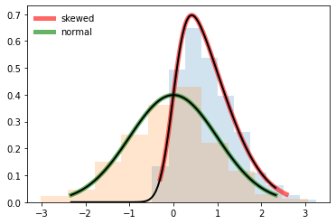

# 偏差与误差的区别

[深度学习](https://www.baeldung.com/cs/category/ai/deep-learning) [机器学习](https://www.baeldung.com/cs/category/ai/ml)

[训练](https://www.baeldung.com/cs/tag/training)

1. 导言

    在本教程中，我们将回顾[偏差](https://www.baeldung.com/cs/machine-learning-biases)和误差之间的区别。首先，我们将定义并描述这两个术语。接下来，我们将回顾机器学习中不同类型的错误和偏差，以及如何解决它们。最后，我们将强调两者之间的区别。

2. 什么是偏差？

    在机器学习中，偏差指的是系统或模型产生系统性偏见结果的情况。

    要理解偏差，我们必须研究其根本原因。机器学习模型中的偏差发生在机器学习过程的任何阶段。这可能是数据集或模型配置中的某些特征或值造成的。例如，如果一个数据集主要包含某个人群的信息，那么这个数据集就可能偏向于这个人群。

    有偏见的模型会导致预测不准确和结果偏差。例如，在我们前面的数据集示例中，使用该数据得出的任何结果都不能代表整个人群。

    1. 偏差类型

        在机器学习过程的不同阶段会出现不同类型的偏差。本节将介绍其中几种。

        当算法对手头的任务产生了有偏见的结果时，就会出现算法偏差。例如，假设我们有一个机器学习系统，该系统会根据候选人完成的任务为其打分。如果底层算法开始给女性候选人打出低于男性候选人的分数，我们就称之为算法偏差。

        相反，抽样偏差发生在数据收集或数据选择过程中。在抽样偏差中，手头的数据偏向于特定类型的数据。例如，在我们的分数分配系统中，假设我们在训练数据中抽取的男性样本多于女性样本。这就会产生偏向男性的结果。

        当我们对手头的任务有先入为主的假设时，就会产生确认偏差。在我们的分数分配系统示例中，假设我们从经验中得知男性在某些任务中的表现优于女性。如果系统输出的结果与我们所知道的相反，我们可能会有意或无意地调整列车，以获得与我们的假设一致的结果。

        还存在其他类型的偏差，如[偏见偏差](https://www.baeldung.com/cs/machine-learning-biases#types_of_biases_in_machine_learning)、[聚合偏差](https://www.statisticshowto.com/aggregation-bias/#:~:text=What%20is%20Aggregation%20Bias,of%20confounding%20and%20aggregation%20bias.)、[部署偏差](https://www.kaggle.com/code/alexisbcook/identifying-bias-in-ai)和[测量偏差](https://www.kaggle.com/code/alexisbcook/identifying-bias-in-ai)。

    2. 如何识别和处理偏差？

        根据手头的任务，我们可以持续评估机器学习系统的结果，以确定结果中是否存在某种形式的偏见。另外，我们还可以通过绘制数据分布图来检查数据是否存在偏差，如下图所示。这可以在用于任何机器学习任务之前完成：

        

        对于非数值型数据，我们可以使用探索性数据分析将数据可视化。此外，我们还开发了一些工具来检测和消除机器学习模型中的偏差。谷歌的 [What-If](https://pair-code.github.io/what-if-tool/) 工具就是一个例子。What-If 是一款开源软件，允许用户探测机器学习模型。它还允许用户分析他们的数据和产生的输出，并从根本上找出任何偏差。

        IBM 的 [AI Fairness 360](https://www.ibm.com/opensource/open/projects/ai-fairness-360/) 是另一款帮助用户识别偏见并消除偏见的工具。它提供了使用公平性指标分析和识别机器学习模型中偏见的工具。此外，用户还可以使用该应用程序提供的内置算法消除模型中的偏见。

3. 什么是错误？

    错误是一个术语，指任何不正确和不准确的东西。在机器学习中，错误可以让人了解预测的准确性。另外，误差也可以指预测值与基本真实值之间的差异。

    在机器学习中，错误是由模型或模型配置随机造成的。这些误差会导致使用中的机器学习模型产生不准确的预测或结果。

    1. 错误类型

        机器学习中最常见的误差类型是预测误差。预测误差是指预测值与观察值之间的实际差异。此外，还有其他一些特定类型的误差。我们将在本节中讨论其中几种。

        机器学习中存在的其他类型的误差是[第一类误差](https://www.datasciencecentral.com/understanding-type-i-and-type-ii-errors/#:~:text=A%20type%20I%20error%2C%20or,positive%20result%20has%20been%20assumed)和[第二类误差](https://www.datasciencecentral.com/understanding-type-i-and-type-ii-errors/#:~:text=A%20type%20I%20error%2C%20or,positive%20result%20has%20been%20assumed)。第一类错误或假阳性错误是指当零假设为真但被拒绝时出现的错误。例如，假设我们有一个预测病人疾病的系统。如果系统预测病人 A 患有某种疾病，但实际上他并没有患病，这就是所谓的第一类错误。

        第二类错误或假阴性错误是指接受了错误的零假设。以我们的疾病预测系统为例，假设系统预测病人 B 没有患病，但实际上他患病了。这就是我们所说的第二类错误。

    2. 如何识别和处理错误？

        为了识别预测错误，我们通常使用均方根误差（[RMSE](https://welpmagazine.com/how-to-measure-error-in-machine-learning-models/)）等指标。RMSE 可确定预测值与数据中的实际值相差多远：

        \[RMSE=\sqrt{\frac{1}{N} {\textstyle \sum_{i=1}^{N}}\left ( \hat{y_{i}} - y_{i}  \right )^{2}}\]

        假阳性误差通常通过计算假阳性率来确定，其中 FP 是假阳性样本的数量，TN 是真阴性样本的数量：

        \[FPR=\frac{FP}{FP+TN}\]

        因此，假阴性误差通常通过计算假阴性率来确定，其中 FN 是假阴性样本的数量，TN 是真阴性样本的数量：

        \[FNR=\frac{FN}{FN+TN}\]

        最重要的是，可以通过编辑模型配置来解决误差问题，从而产生准确的结果。这可以通过超参数调整方法来实现。

4. 差异

    机器学习中的偏差和误差之间存在细微差别。我们将其总结如下：

    | 偏见         | 错误       |
    |------------|----------|
    | 产生有偏见的结果   | 导致不准确的结果 |
    | 人工或通过软件包识别 | 通过计算发现   |
    | 系统性出现      | 随机发生     |

5. 结论

    在本教程中，我们回顾了偏差和错误。偏差会产生系统性的偏见结果，而错误则会产生不准确的结果。错误通常通过计算和指标（如假阳性率、假阴性率和 RMSE）来识别。偏差可通过手动或可用的软件程序（如 What-If 工具和 AI Fairness 360）来识别。
