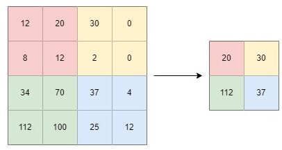

# 什么是卷积网络中的通道？

[深度学习](https://www.baeldung.com/cs/category/ai/deep-learning) [机器学习](https://www.baeldung.com/cs/category/ai/ml)

[卷积神经网络](https://www.baeldung.com/cs/tag/cnn) [神经网络](https://www.baeldung.com/cs/tag/neural-networks)

1. 简介

    在本教程中，我们将讨论卷积神经网络（CNN）的通道以及用于修改输入图像的不同技术。

    CNN 是一类人工神经网络（ANN），主要应用于[模式识别](https://www.baeldung.com/cs/pattern-recognition-time-series)、图像分析和处理等机器学习领域。

2. 卷积

    首先，数字图像是像素在矩形坐标中的二维表示。因此，每幅图像都由像素组成，而每个像素都是三原色的组合。

    卷积是对两个图像（矩阵）进行的操作。因此，一个矩阵由另一个矩阵（称为内核）处理。根据所需的图像效果，应用于输入图像的内核会有很大不同。

    二维卷积的定义和卷积的数学公式是

    (1) \[\begin{equation*} \begin{aligned} y[m, n] = x[m, n]* h[m, n] = \sum_{j = - \infty}^{\infty} \sum_{i = - \infty}^{\infty} x[i, j] \cdot h[m-i, n-j] \end{aligned} \end{equation*}\]

    其中，x、h、y、m 和 n 分别表示像素的矩形坐标、应用的滤波器、卷积的输出以及图像和滤波器的尺寸。

    1. 不同类型的内核

        根据所需的效果，核(kernel)可以对图像产生不同的影响。

        - 模糊化(Blurring)： 产生一个中心像素比边缘像素贡献更多信息的内核。
        - 锐化(Sharpening)： 生成的内核可使图像更清晰，并增强其清晰度。
        - 浮雕(Embossing)：生成的内核中，每个像素都被高光或阴影取代。
        - 边缘检测(Edge Detection)：生成的内核可以识别图像中的边缘，从而检测图像中物体的边界。

        除上述外，许多不同的内核还可以对输入图像进行各种修改。

    2. 卷积实例

        假设我们有一幅图像，它可以表示为一个矩阵，矩阵中的每个像素都包含一个值。

        \[\begin{bmatrix}  1 & 2 & 3 \\ 4 & 5 & 6 \\ 7 & 8 & 9 \end{bmatrix}\]

        假设我们选择用一个内核来修改这个图像，以达到某些效果。

        \[\begin{bmatrix}  -1 & -2 & -1 \\ 0 & 0 & 0 \\ 1 & 2 & 1 \end{bmatrix}\]

        根据上面的公式计算输出矩阵的第一个元素：

        (2) \[\begin{equation*} \begin{aligned} y[0, 0] = \sum_{j} \sum_{i} x[i, j] \cdot h[0 - i, 0 - j] = x[-1, -1] \cdot h[1, 1] + x[0, -1] \cdot h[0, 1] \\+ x[1, -1] \cdot h[-1, 1] +x[-1, 0] \cdot h[1, 0] + x[0, 0] \cdot h[0, 0] + x[1, 0] \cdot h[-1, 0] + x[-1, 1] \cdot h[1, -1] \\+ x[0, 1] \cdot h[0, -1] + x[1, 1] \cdot h[-1, -1] = 0 \cdot 1 + 0 \cdot 2 + 0 \cdot 1 + 0 \cdot 0 + 1 \cdot 0 + 2 \cdot 0  + 0 \cdot (-1) \\+ 4 \cdot (-2) + 5 \cdot (-1) = -13 \end{aligned} \end{equation*}\]

        我们用类似的方法计算卷积运算。

        \[\begin{bmatrix}  1 & 2 & 3 \\ 4 & 5 & 6 \\ 7 & 8 & 9 \end{bmatrix} * \begin{bmatrix}  -1 & -2 & -1 \\ 0 & 0 & 0 \\ 1 & 2 & 1 \end{bmatrix} = \begin{bmatrix}  -13 & -20 & -17 \\ -18 & -24 & -18 \\ 13 & 20 & 17 \end{bmatrix}\]

        从下图中我们可以看到，滤波器（深蓝色）应用于输入图像（蓝色），并产生卷积输出（绿色图像）：

        

        注意，如果我们应用了多个卷积核，就会产生多个通道，每个卷积核产生一个通道。

3. 通道输入

    在机器学习中，神经网络对多通道图像进行处理。每个通道代表一种颜色，每个像素由三个通道组成。在彩色图像中，有三个通道：红色、绿色和蓝色。RGB 图像可以描述为一个 $w \times h \times n\_c$ 矩阵，其中 w、h 和 $n\_c$ 分别表示宽度、高度和通道数。因此，在处理 RGB 图像时，会对其应用一个三维张量。

    与 RGB 图像不同，灰度图像是单通道的，可以描述为一个 $w \times h$ 矩阵，其中每个像素都代表光强度的信息。

4. 卷积层

    卷积层通常涉及多个通道，其中一层的每个通道都与下一层的通道相关联，反之亦然。CNN 模型的基本结构由卷积层、池化层组成：

    具有卷积层和池化层的 CNN 架构：

    

    如上图所示，卷积层接收一个 $w \times h$ 的输入图像，并产生一个由激活图组成的输出，其中 w 和 h 分别是宽度和高度。这种卷积的滤波器是一个维数为 $f \times f \times n\_c$ 的张量，其中 f 是滤波器的大小，通常为 3、5、7 或 11，$n\_c$ 是通道数。卷积网络中卷积矩阵的深度就是通道的总数，并且必须始终与输入的通道数相同。因此，通道深度越大，空间分辨率越低。

5. 特征技术

    提及卷积层中广泛使用的某些技术会有所帮助： 池化（Pooling）、填充（Padding）和跨步（Strides）。

    1. 池化

        大多数 CNN 架构都包含一种称为 "池化"的操作。池化是一种广泛使用的技术，主要用于减少特征图的维数。因此，添加池化滤波器可加快神经网络的性能，并加快训练速度，因为它减少了 CNN 需要学习的参数数量，并使输出更小。

        此外，池化滤波器还有助于学习最关键的特征，并去除异常值和不变量。

        目前已经提出了不同的池化方法。最广泛使用的是最大池化和平均池化。

        池化涉及对输入图像进行降采样并降低其维度：

        

    2. 最大值池化

        最大值池化是一种池化技术，它计算每个窗口补丁中的最大值。滤波器只需选取特征图感受野中最大的像素值。例如，如果区域（红色）中有 4 个像素，其值分别为 12、20、8 和 12，我们就选择 20。

        

    3. 平均池化

        平均池化是一种池化技术，可以计算窗口补丁中像素值的平均值。例如，如果实地（红色）中有 4 个像素，其值分别为 12、20、8 和 12，那么平均池滤波的结果就是 13。

        

    4. 填充

        除了池化，大多数 CNN 架构还包含一种称为"填充"的操作。填充也是一种广泛使用的方法，用于确定附加到输入图像中的像素数量。当 CNN 需要处理扩展格式的图像时，这是一项非常有用的技术。增加图像中的像素数量可使 CNN 在学习阶段获得更准确的结果，因为通常贡献较少的边框像素往往更靠近中间。

        在 CNN 中，如果使用零填充，那么图像的边框将由值为零的像素填充。一幅 7 x 7 的图像有一层零填充，即：

        

    5. 步长

        步长是神经网络滤波器的一个参数，用于压缩数据。它表示卷积滤波器在输入图像或视频上移动的步数。换句话说，步长通过调整滤波器在输入图像上移动所需的单位数量，来管理滤波器在图像上每一步的移动距离。

        在 CNN 中，如果神经网络的步长设置为 2，那么滤波器每次将移动两个像素或单位。因此，内核和输入图像的某些位置会被跳过。跨距可以使激活图更小，从而提高 CNN 的性能和执行时间。不过，在某些情况下，它可能会导致信息丢失。

        Stride = 1 和 Stride = 2 将分别产生 5 x 5 和 3 x 3 的特征图：

        

        我们可以看到，Stride = 2 使滤波器在图像中的滑动速度更快，在特征图上产生的结果更少。

6. 结论

    本文介绍了卷积神经网络。特别是，我们详细讨论了卷积神经网络的通道，并介绍了用于图像输入的一些技术。
