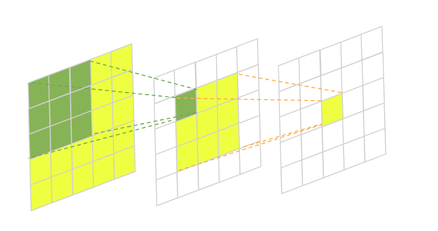
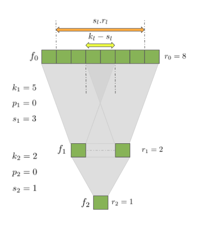

# 如何计算 CNN 的感受野大小

[计算机视觉](https://www.baeldung.com/cs/category/ai/computer-vision) [深度学习](https://www.baeldung.com/cs/category/ai/deep-learning)

[卷积神经网络](https://www.baeldung.com/cs/tag/cnn) [神经网络](https://www.baeldung.com/cs/tag/neural-networks)

1. 简介

    卷积神经网络的感受野（receptive field）是一个重要的概念，在设计新模型或试图理解现有模型时，这个概念非常有用。了解了它，我们就能进一步分析我们感兴趣的神经架构的内部工作原理，并思考最终的改进方案。

    在本教程中，我们将讨论 CNN 的感受野到底是什么、为什么它很重要以及如何计算它的大小。

2. 定义

    那么，什么是卷积神经网络的感受野呢？从形式上讲，它是特定 CNN 特征受输入空间影响的区域。更非正式地说，它是张量中经过卷积后产生特征的部分。因此，从根本上说，它让我们知道，当数据在网络各层流动时，我们从哪里获得结果。为了进一步阐明这一概念，让我们来看看这个插图：

    

    在这张图片中，我们有一个两层的全卷积神经网络，每层都有一个 3×3 的内核。绿色区域表示第二层中一个像素的感受野，黄色区域表示第三层中一个像素的感受野。

    通常，我们最关心的是初始输入中感受野的大小，以了解 CNN 从中覆盖了多少区域。这在许多计算机视觉任务中都至关重要。以图像分割为例。网络接收输入图像并预测每个像素的类别标签，在此过程中建立语义标签图。如果网络在进行预测时没有足够的能力考虑到周围的像素，一些较大的物体可能会留下不完整的边界。

    同样的道理也适用于物体检测。如果卷积神经网络没有足够大的感受野，图像上一些较大的物体就可能无法被检测到。

3. 问题解释

    1. 符号

        我们将考虑具有 L 层（$l=1,2,...,L$）的全卷积网络（FCN）。 第 l 层的输出特征将表示为 f_l。因此，输入图像将表示为 f_0，最终输出特征图将对应于 f_L。每个卷积层 l 都有自己的配置，包含 3 个参数值--内核大小、步长和填充。我们将分别用 $k_l$、$s_l$ 和 $p_l$ 表示它们。

        我们的目标是计算输入层 $r_0$ 的感受野大小。 那么我们该如何做呢？如果我们再看一下上面的插图，就会发现各层感受野的大小之间存在类似金字塔的关系。

        如果我们对金字塔底座的大小感兴趣，我们可以用从上到下的方法递归描述它。此外，我们已经知道了最后一层感受野的大小 $- r_L$。它总是等于 1，因为最后一层的每个特征只对自己有贡献。剩下的工作就是找到一种用 $r_l$ 来描述 $r_{l-1}$ 的通用方法。

    2. 简化示例

        让我们进一步简化问题，将神经网络想象成一维卷积的堆栈。这并不意味着丧失一般性，因为大多数情况下卷积核在维度上是对称的。即使我们使用的是不对称的卷积核，我们也可以分别在不同维度上应用相同的解决方案。这就是我们简单的 1-D CNN：

        

        如果我们看一下 $f_2$ 和 $f_1$ 之间的关系，就很容易明白为什么感受野(receptive field)的大小是 2 - 大小为 2 的内核只应用了一次。但当我们从 $f_1$ 到 $f_0$ 时，情况就开始变得复杂了。

    3. 大小公式

        我们希望用 $r_l$ 来描述 $r_{l-1}$，并提出一个在任何地方都适用的通用解决方案。首先，让我们尝试计算上述结构中的 $r_0$。一个不错的猜测是用 $s_l$ 来缩放 $r_l$，图中橙色箭头表示 $s_l$。这样做很接近，但还不够。我们没有考虑到当内核大小与跨距大小不同时，会出现一些不匹配的情况。

        在我们的例子中，$k_1=5$，$s_1=3$，因此存在 2 的不匹配，用黄色箭头表示。这种不匹配一般可以描述为 $k_l-s_l$，因此当 $k_l >s_l$ 时，我们就会出现像 $f_0$ 那样的重叠。如果反过来，$k_l<s_l$，就会出现缺口，$k_l-s_l$ 将为负值。无论如何，我们只需将这一差值加到当前层的缩放感受野中即可。

        计算公式如下：

        \[r_{l-1}=s_l.r_l+(k_l-s_l)\]

        我们可以在网络中递归应用该公式，得到 $r_0$。然而，事实证明我们可以做得更好。还有另一种方法，可以只用 $k_l‘s$ 和 $s_l's$ 来分析求解 $r_0$ 的递归方程：

        \[r_{0}=\sum_{l=1}^{L}\left(\left(k_{l}-1\right) \prod_{i=1}^{l-1} s_{i}\right)+1\]

        该公式的完整推导过程可参见 [Araujo](https://distill.pub/2019/computing-receptive-fields/#solving-receptive-field-region) 等人的研究。

    4. 开始和结束索引公式

        既然我们可以计算出影响输出特征图的区域大小，那么我们也可以开始考虑该区域的精确坐标了。例如，这在调试复杂的卷积结构时可能会很有用。

        让我们用 $u_l$ 和 $v_l$ 表示区域的最左坐标和最右坐标，这两个坐标用于计算最后一层 $f_L$ 中的特征。我们还将定义第一个特征索引为零（不包括填充）。以这个简单的神经网络为例，其中 $u_2 = v_2=0，u_1=0，v_1=1，u_o=-1，v_o=4$：

        Capture2 为了表达起始和结束索引之间的关系，我们不妨再次进行递归思考，得出一个公式，在给定 $u_l、v_l$ 的情况下给出 $u_{l-1}、v_{l-1}$。例如，当 $u_l=0$ 时，$u_{l-1}$ 就是上一层最左边的索引，或者 $u_{l-1}=-p_l$。 但是当 $u_l=1$ 时会发生什么呢？我们需要把最左边的索引从$-p_l$移开，即$u_{l-1}=-p_l + s_l$。对于 $u_l=2$，同样的计算方法是 $u_{l-1}=-p_l + 2s_l$，以此类推。由此得出以下公式：

        \[u_{l-1}=-p_{l}+u_{l} \cdot s_{l}\]

        要找到最右边的索引 $v_{l-1}$，我们只需要加上 $k_l-1$：

        \[v_{l-1}=-p_{l}+v_{l} \cdot s_{l}+k_{l}-1\]

4. 伪代码

    1. 求感受野的大小

        使用解析解来计算输入层的感受野是非常简单的：

        

    2. 查找感受野的起点和终点指数

        要找到 CNN 在输入层 u_0 和 v_0 中感受野的起点和终点指数，我们只需使用上述公式并加以应用即可：

        

5. 结论

    在本文中，我们了解了卷积神经网络的感受野以及了解感受野大小的原因。我们还花了一些时间，跟进了几个非常有用的公式的推导，用于计算感受野的大小和位置。
