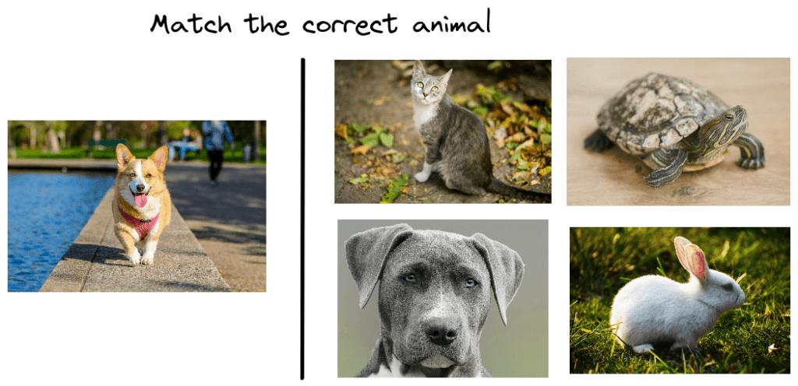
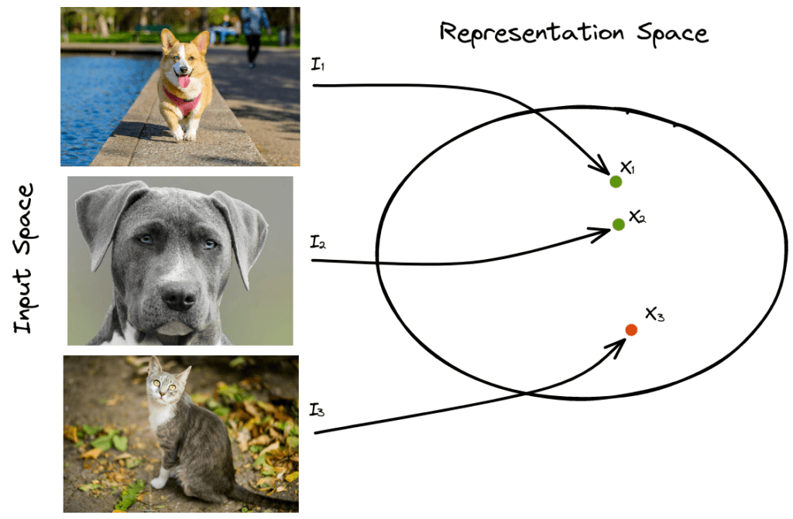
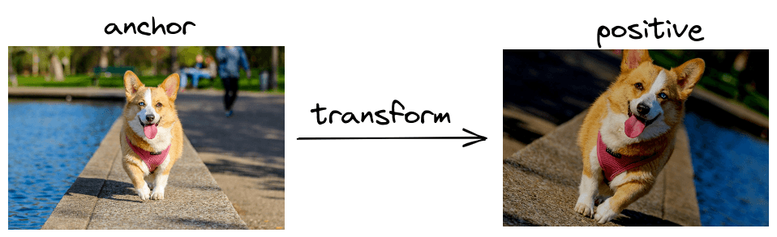

# 对比学习简介

[深度学习](https://www.baeldung.com/cs/category/ai/deep-learning) [机器学习](https://www.baeldung.com/cs/category/ai/ml)

[训练](https://www.baeldung.com/cs/tag/training)

1. 概述

    在本教程中，我们将介绍对比学习领域。首先，我们将讨论这一技术背后的直觉和基本术语。然后，我们将介绍最常见的对比训练目标和不同类型的对比学习。

2. 直觉

    首先，我们来谈谈对比式学习背后的直觉。下面，我们可以看到一个很多孩子都会玩的传统游戏：

    

    这个游戏的目的是观察右边的图片，寻找与左边图片相似的动物。在我们的游戏中，孩子要在右边的四张图片中寻找一只狗。首先，孩子必须将四种动物中的每一种与狗进行比较，然后得出结论，左下方的图片描绘的是一只狗。

    许多调查显示，孩子们用这种方法学习新概念比阅读一本关于动物的书更容易。但为什么这种方法更有效呢？

    原来，对于像孩子这样没有任何知识储备的人来说，通过对比相似和不相似的事物来学习新事物要比一个一个地去认识要容易得多。刚开始，孩子可能认不出狗。但一段时间后，孩子就能学会分辨狗的共同特征，如鼻子的形状和身体的姿势。

3. 术语

    受前述观察的启发，对比学习旨在通过对比相似和不相似的样本来学习数据的低维表示。具体来说，它试图利用欧氏距离（euclidean distance）使相似样本在表征空间中相互靠近，并将不相似的样本推远。

    假设我们有三张图像 $I_1$、$I_2$ 和 $I_3$。前两张图像描述了一只狗，第三张图像描述了一只猫，我们希望为每张图像学习一个低维表示（$x_1$、$x_2$ 和 $x_3$）：

    

    在对比学习中，我们希望最小化相似样本之间的距离，最大化不相似样本之间的距离。在我们的例子中，我们希望最小化距离 $d(x_1,x_2)$，最大化距离 $d(x_1,x_3)$ 和 $d(x_2,x_3)$，其中 d() 是一个度量函数，如欧几里得。

    与锚点样本（$I_1$）相似的样本定义为正样本（$I_2$），不相似的样本定义为负样本（$I_3$）。

4. 培训目标

    对比学习最重要的部分是训练目标，它引导模型学习对比表征。让我们来介绍一下最常见的目标。

    1. 对比损失

        [对比损失](http://yann.lecun.com/exdb/publis/pdf/chopra-05.pdf)是最早用于对比学习的训练目标之一。它将一对相似或不相似的样本作为输入，将相似样本拉近，将不相似样本拉远。

        更正式地说，我们假设有一对样本（$I_i，I_j$）和一个标签 Y，如果样本相似，标签 Y 等于 0，否则等于 1。为了提取每个样本的低维表示，我们使用[卷积神经网络](https://en.wikipedia.org/wiki/Convolutional_neural_network) $f$ 将输入图像 $I_i$ 和 $I_j$ 编码到一个嵌入空间，其中 $x_i = f(I_i)$，$x_j = f(I_j)$。对比度损失的定义是

        \[\mathbf{L = (1-Y) *||x_i - x_j||^2 + Y* max(0, m - ||x_i - x_j||^2)}\]

        其中，m 是一个超参数，定义了不同样本之间的下限距离。

        如果我们更详细地分析上式，会发现有两种不同的情况：

        - 如果样本是相似的（$Y=0$），那么我们要最小化与它们的欧氏距离相对应的项 $||x_i - x_j||^2$。
        - 如果样本不相似 ($Y=1$)，则我们最小化 $max(0, m - ||x_i - x_j||^2)$，这相当于最大化它们的欧氏距离，直到某个极限 m。

    2. 三重损失

        对比损失的一个改进是[三重损失](https://arxiv.org/abs/1503.03832)，它通过使用三重样本而不是成对样本来超越前者。

        具体来说，它需要输入一个锚样本 I、一个正样本 $I^{+}$ 和一个负样本 $I^{-}$。在训练过程中，损失会强制要求锚样本与正样本之间的距离小于锚样本与负样本之间的距离：

        \[\mathbf{L = max(0, ||x - x^{+}||^2 - ||x - x^{-}||^2 + m)}\]

        当我们使用三重损失训练模型时，由于我们同时使用相似和不相似样本更新网络，因此收敛所需的样本更少。这就是为什么三重损失比对比损失更有效的原因。

5. 学习类型

    对比学习的理念既可用于监督学习任务，也可用于非监督学习任务。

    1. 监督学习

        在这种情况下，每个样本的标签在训练过程中都是可用的。因此，我们只需查看标签，就能轻松生成正负对或三胞胎。

        然而，生成所有可能的配对或三元组需要大量的时间和计算资源。而且，在每个数据集中，都会有很多已经满足对比度训练目标且损失为零的负数对或三胞胎，从而导致训练收敛缓慢。

        为了解决这个问题，我们必须生成硬负对和硬负三元组，即它们的损失值很高，即相距很远的相似负对和非常接近的不相似负对。目前已提出了许多硬负挖掘方法，这些方法通常使用快速搜索算法来研究硬对和硬三胞胎的表示空间。在自然语言处理中，生成硬否定句对的一种简单方法是在锚句中添加一个否定词。

    2. 无监督

        当我们没有标签样本时，就会使用[自监督学习](https://en.wikipedia.org/wiki/Self-supervised_learning)，利用数据的某些属性生成伪标签。

        一个著名的无监督对比学习框架是[SimCLR](https://arxiv.org/abs/2002.05709)。它的主要思想是通过对锚图像进行裁剪、翻转和颜色抖动等随机变换来生成正图像对，因为这些变化会保持图像的标签不变：

        

6. 结论

    在本教程中，我们讨论了对比学习。首先，我们介绍了对比学习的直觉和术语，然后讨论了训练目标和不同类型。
