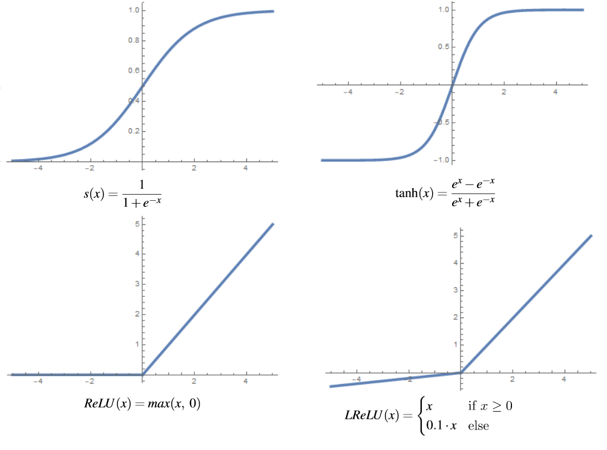
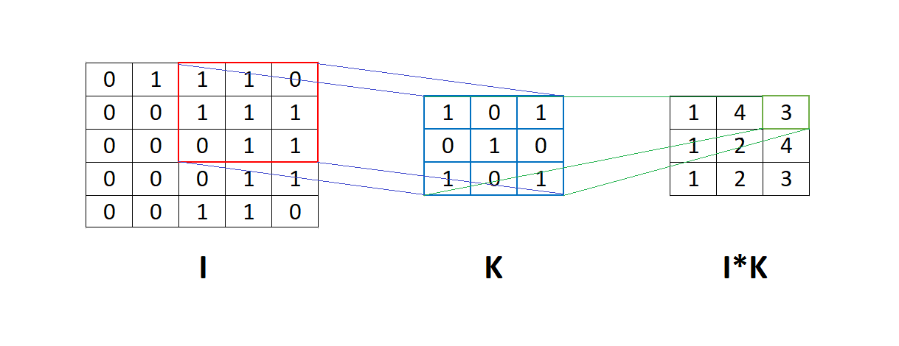

# [卷积神经网络与普通神经网络对比](https://www.baeldung.com/cs/convolutional-vs-regular-nn)

[深度学习](https://www.baeldung.com/cs/category/ai/deep-learning)

[卷积神经网络](https://www.baeldung.com/cs/tag/cnn) [神经网络](https://www.baeldung.com/cs/tag/neural-networks)

1. 简介

    在本教程中，我们将介绍普通神经网络（也称为全连接神经网络）与卷积神经网络之间的显著区别。我们使用这两种类型的网络来解决各个领域的复杂问题，例如图像识别、物体检测、建筑预测模式等。

    虽然我们可能同时使用这两种网络来解决相同的问题，但选择特定的网络也有一些利弊。因此，除了架构上的差异，我们还将介绍它们在应用上的差异。

2. 神经网络

    神经网络是一种明确用来模拟生物神经网络的算法。一般来说，其想法是创建一个能像人脑一样运作的人工系统。神经网络基于相互连接的神经元，具体取决于网络的类型。神经网络有很多种类型，但大致可分为三类：

    - 全连接神经网络（常规神经网络）
    - 卷积神经网络
    - 递归神经网络

    它们之间的主要区别在于组成它们的神经元类型以及信息如何在网络中流动。

3. 常规神经网络

    常规或全连接神经网络（FCNN）是最古老、最常见的神经网络类型。基本上，第一个多层神经网络的数学模型，即多层感知器（MLP），就是一个全连接神经网络。

    要理解这种类型的网络，我们需要解释它的一些组成部分。

    1. 人工神经元

        人工神经元是所有神经网络的基础。它们是受生物神经元启发的单元。每个人工神经元接收输入并产生一个输出，然后将其传输给其他多个神经元。输入通常是来自外部数据样本的数值，但也可以是其他神经元的输出。神经网络最终输出神经元的输出代表定义预测的值。

        为了得到神经元的输出，我们需要计算所有输入和连接权重的加权和。然后，我们在总和中加入偏置，并应用激活函数。在数学上，我们将加权和定义为：

        (1) \[\begin{align*} z^{(i)} = w_{1}x_{1}^{(i)} + w_{2}x_{2}^{(i)} + .. .+ w_{k}x_{k}^{(i)} + b \end{align*}\]

        其中，$w_{i}$ 为权重，$x_{i}$ 为输入，b 为偏置。之后，一个激活函数被应用于加权和 $z^{(i)}$，它代表神经元的最终输出。

    2. 激活函数

        我们可以在常规神经网络中使用多种激活函数。例如，我们将 sigmoid 函数定义为：

        (2) \[\begin{align*} s(x) = \frac{1}{1 + e^{-x}} \end{align*}\]

        由于它的定义，我们几乎总是将它用作二元分类中的输出神经元。对于隐藏层来说，双曲正切函数通常是更好的选择，我们将其定义为：

        (3) \[\begin{align*} \tanh(x) = \frac{e^{x}-e^{-x}}{e^{x}+e^{-x}}\end{align*}\]

        这个函数的图形与 sigmoid 函数非常相似。根据经验，双曲正切会产生更好的结果，因为该函数输出的平均值更接近于 0，从而将数据集中起来，使下一层的学习更加容易。

        这两种激活函数的一个缺点是，输入值越大，它们的梯度值越小，这意味着函数的斜率在这些点上接近于零。这就是所谓的梯度消失问题，可以通过将输入数据归一化到合适的范围或使用不同的激活函数来解决。在机器学习中，一种普遍流行且不存在这一问题的函数被称为整定线性单元（ReLU）。我们将该函数定义为：

        (4) \[\begin{align*} ReLU(x) = max(x,\ 0)\end{align*}\]

        尽管这个函数在 x=0 处不可微，但我们明确地取 0 或 1 作为该点的导数，这也是域中所有其他点的导数的唯一值。

        不过，这个函数并不理想，因为它可能导致"死神经元"问题，即激活函数值总是为零。ReLU 函数会将负输入值返回零，当偏置相对于其他权重具有较大负值时，负输入值经常会出现。

        计算梯度值时，它又等于零，因此权重不会更新，这就形成了一个恶性循环，神经元很少与零相差。我们可以通过将 ReLU 函数修改为泄漏整流线性单元（LReLU）来解决这个问题：

        (5) \[\begin{equation*} LReLU(x)= \begin{cases} x & \text{if $x \geq 0$}, \\ a\cdot x & \text{else,} \end{cases} \end{equation*}\]

        其中 a 通常是一个小常数，例如 a=0.01。下面是上述函数的图形：

        

    3. 应用

        全连接神经网络的应用领域非常广泛。基本上，所有与分类和回归相关的问题，至少在理论上，我们都可以用全连接神经网络来解决。一些具体应用包括

        - 股市预测
        - 垃圾邮件分类
        - 预测社会趋势
        - 天气预报
        - Portofolio 管理
        - 信用评级预测
        - 欺诈检测及类似

4. 卷积神经网络

    卷积神经网络（CNN）是一种至少有一个卷积层的神经网络。我们使用它们来获取局部信息，例如从图像中的相邻像素获取信息，并从参数数量上降低模型的整体复杂性。

    除了典型的卷积层和池化层，这类网络通常还包括全连接层。

    1. 人工神经元

        与全连接层中的人工神经元不同，卷积层中的神经元并不连接整个输入，而只是连接输入数据的一部分。这些输入神经元提供小部分输入数据的抽象，当这些数据与整个输入数据相结合时，我们将其称为特征图。

        基本上，CNN 中的人工神经元被排列成二维或三维网格，我们称之为过滤器。通常，每个过滤器从输入数据中提取不同类型的特征。例如，从图像中，一个过滤器可以提取边缘、线条、圆形或更复杂的形状。

        提取特征的过程使用卷积函数，卷积神经网络的名称也由此而来。下图显示了使用滤波器 K 进行卷积的矩阵 I。这意味着滤波器 K 通过矩阵 I，然后在矩阵 I 的相应元素与滤波器 K 之间进行逐元素乘法运算。

        

    2. 激活函数

        一般来说，CNN 的激活函数没有明显区别。

        理论上，我们可以使用 FCNN 中提到的所有函数，但在实践中，最常见的选择是使用 ReLU 或双曲正切。这是因为 ReLU 函数为网络增加了额外的非线性，并通过加快训练速度来改善网络。虽然 ReLU 可能会导致一些问题，如 "死神经元"，但一些修改（如 Leaky ReLU 或 ELU）可以解决这个问题。

    3. 应用

        卷积神经网络的应用范围很广，但主要是解决与计算机视觉相关的问题，如图像分类和物体检测。卷积神经网络的一些主要应用实例如下

        - 面部识别
        - 自动驾驶汽车中的物体检测
        - 医学中的图像分析和分割
        - 推荐引擎
        - 图像标题和类似内容

5. 结论

    本文解释了卷积神经网络和普通神经网络的主要区别。总之，两者的主要区别在于，卷积神经网络使用卷积操作来处理数据，这对处理图像有一些好处。这样，CNN 就减少了网络中的参数数量。此外，卷积层会考虑输入数据本地邻域的上下文，并从该邻域构建特征。

    例如，图像邻域中的像素、视频中的帧以及文本中的单词等。
