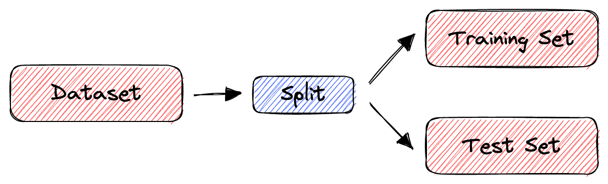
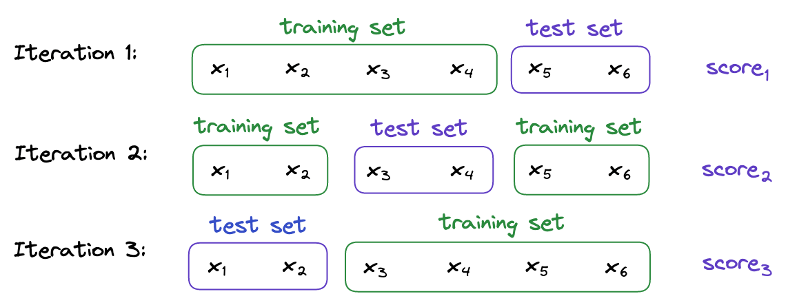
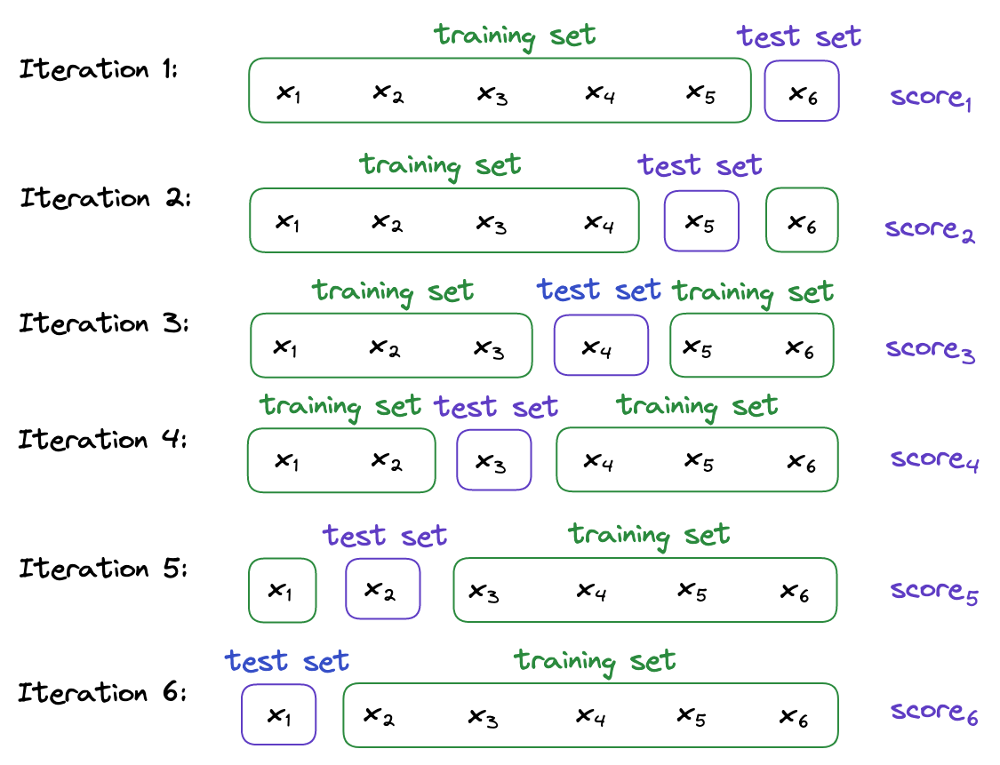

# 交叉验证：K-Fold与Leave-One-Out

[深度学习](https://www.baeldung.com/cs/category/ai/deep-learning) [机器学习](https://www.baeldung.com/cs/category/ai/ml)

[交叉验证](https://www.baeldung.com/cs/tag/cross-validation)

1. 概述

    在本教程中，我们将讨论机器学习中的两种交叉验证技术：k-fold 和 leave-one-out 方法。为此，我们将从训练-测试拆分开始，并解释为什么我们首先需要交叉验证。然后，我们将介绍两种交叉验证技术，并对它们进行比较，以说明其优缺点。

2. 训练-测试分割法

    在开发任何机器学习模型时，一个重要的决定就是如何评估其最终性能。为了对模型的性能进行无偏估计，我们需要在未用于训练的数据上对模型进行评估。

    分割数据的最简单方法是使用[训练-测试分割法](https://www.baeldung.com/cs/train-test-datasets-ratio)。它将数据集随机分割成两个子集（称为训练集和测试集），这样整个数据集的预定百分比就在训练集中。

    然后，我们在训练集上训练机器学习模型，并在测试集上评估其性能。这样，我们就能确保用于训练的样本不会用于[评估]，反之亦然。

    直观地说，这就是训练-测试拆分法的工作原理：

    

3. 交叉验证简介

    不过，训练-测试分割法也有一定的局限性。当数据集较小时，该方法容易产生较大的方差。由于是随机分割，不同测试集的结果可能完全不同。为什么会这样呢？因为在某些分区中，容易分类的[样本](https://www.baeldung.com/cs/ml-stratified-sampling)会进入测试集，而在另一些分区中，测试集会接收"困难"的样本。

    为了解决这个问题，我们使用[交叉验证](https://www.baeldung.com/cs/cross-validation-decision-trees)来评估机器学习模型的性能。在交叉验证中，我们不会只将数据集分为训练集和测试集一次。相反，我们会反复将数据集分成更小的组，然后平均每组的性能。这样，我们就能减少分区随机性对结果的影响。

    许多交叉验证技术都定义了不同的数据集划分方法。我们将重点讨论两种最常用的方法：k-fold 和 leave-one-out 方法。

4. K折交叉验证

    在 K-Fold交叉验证法中，我们首先将数据集分成大小相等的 k 个子集。然后，重复 k 次训练-测试方法，每次将 k 个子集中的一个作为测试集，其余 k-1 个子集作为训练集。最后，我们通过对 k 次试验的得分取平均值，计算出模型的性能估计值。

    例如，假设我们有一个包含 6 个样本的数据集 $S = \{x_1, x_2, x_3, x_4, x_5, x_6\}$，我们要进行 3 倍交叉验证。

    首先，我们将 S 随机分为 3 个子集。例如：

    \[
    S_1 = \{x_1, x_2\}\\
    S_2 = \{x_3, x_4\}\\
    S_3 = \{x_5, x_6\}
    \]

    然后，我们对机器学习模型进行 3 次训练和评估。每次，两个子集构成训练集，剩下的一个子集作为测试集。在我们的例子中：

    

    最后，总体性能就是模型在这三个测试集上的平均性能得分：

    \[\text{overall score} = \frac{score_1 + score_2 + score_3}{3}\]

5. LOO交叉验证

    在一出交叉验证（Leave-One-Out,LOO）中，我们对机器学习模型进行 n 次训练，n 代表数据集的大小。每次只使用一个样本作为测试集，其余样本用于训练模型。

    我们将证明 LOO 是 k-fold 的极端情况，其中 $\mathbf{k=n}$。如果我们把 LOO 应用到前面的例子中，就会有 6 个测试子集：

    \[S_1 = \{x_1\}\\
    S_2 = \{x_2\}\\
    S_3 = \{x_3\}\\
    S_4 = \{x_4\}\\
    S_5 = \{x_5\}\\
    S_6 = \{x_6\}\]

    对它们进行迭代，我们在 $i=1,2,\ldots$, 6 次迭代中使用 $S \setminus S_i$ 作为训练数据，并在 $S_i$ 上对模型进行评估：

    

    最终的性能估计值是六个单个分数的平均值：

    \[\text{overall score} = \frac{score_1 + score_2 + score_3 + score_4 + score_5 + score_6}{6}\]

6. 比较

    在 k-fold 交叉验证法和 LOO 交叉验证法之间进行选择时，一个重要的因素是数据集的大小。

    当数据集较小时，LOO 更为合适，因为它在每次迭代中会使用更多的训练样本。这将使我们的模型学习到更好的表征。

    相反，我们在大型数据集上使用 k 折交叉验证来训练模型，因为 LOO 会训练 n 个模型，每个数据样本一个。当我们的数据集包含大量样本时，训练这么多模型将耗时过长。因此，k-fold 交叉验证更为合适。

    此外，在大型数据集中，使用少于 n 个折叠就足够了，因为测试折叠足够大，估计值也足够精确。

7. 结论

    在本文中，我们介绍了两种交叉验证技术：k-fold 和 leave-one-out (LOO) 方法。后者能更多次地验证我们的机器学习模型，并提供非常精确的指标。然而，在大型数据集的情况下，k-fold 交叉验证法将为我们提供足够精确的估计值，但会花费更少的时间来训练模型。
